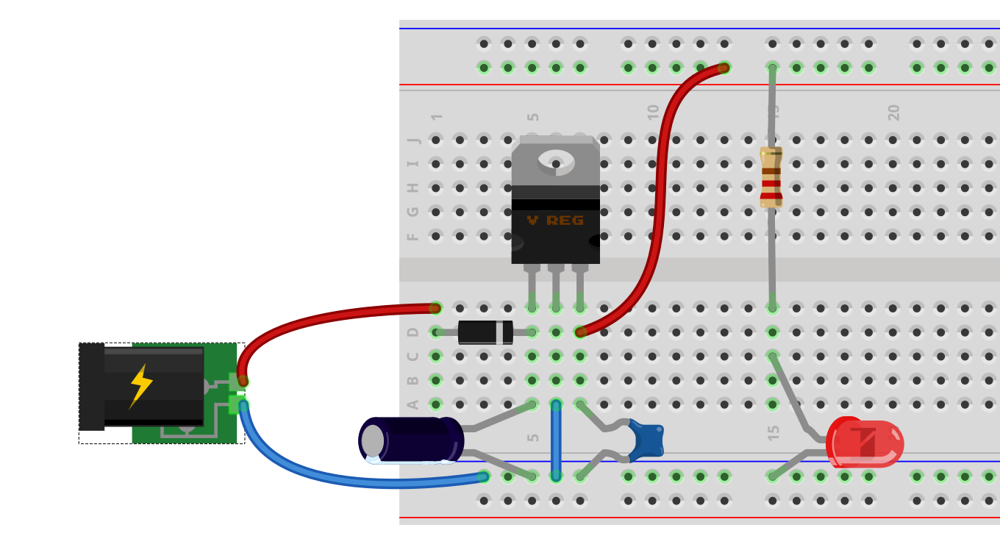

# NAPAJANJE

Vsako električno vezje potrebuje napajanje. Pogosto vezja napajamo z baterijami (prenosne električne naprave) ali pa z uporabo omrežnega napajanja. Za današnje vezje bomo uporabili omrežno napajanje, s katerim bomo zagotovili dva napetostna potenciala (0 V in +5 V).

## ZAGOTAVLJANJE STABILNE NAPAJALNE NAPETOSTI

S pomočjo 9 V napajalnika in 5 mm napajalnega priključka (J1) dobimo napajalno napetost 9 V. Oba napetostna potenciala (+9 V in 0 V) napajalne napetosti priključimo na testno ploščico in od tam zgradimo vezje, ki bo zagotavljalo 5 V napajanje za naše nadaljnja vezja.  

> ### NALOGA: SESTAVITE VEZJE NA PROTOTIPNI PLOŠČICI  
> Sestavite vezje po shemi [@fig:Schematic_Skritpa_10-napajanje_20200218122122.svg].
>
> {#fig:Schematic_Skritpa_10-napajanje_20200218122122.svg}

V pomoč bomo uporabili program **Fritzing**, s katerim lahko učitelj zelo nazorno pokaže kako moramo povezati elemente med seboj. S pomočjo Fritzing programa dobimo naslednjo skico *realnega* vezja.

{#fig:10-napajanje-fritzing.png}

## NAPETOSTNI POTENCIAL

> ### NALOGA: IZMERITE NAPETOSTNE POTENCIALE  
> Izmeri napetostne potenciale, ki so vrisani v naslednji shemi [@fig:Schematic_Skritpa_10-napajanje_20200218113659.svg].
> 
> | Točka v vezju | Nap. potencial [V] |
> |:-------------:|--------------------|
> |       A       |                    |
> |       B       |                    |
> |       C       |                    |
> |       D       |                    |
> |       E       |                    |
> |       F       |                    |
>
> {#fig:Schematic_Skritpa_10-napajanje_20200218113659.svg}

## NAPETOST

V vezju imamo imamo kar nekaj elektronskih elementov. Na shemi [@fig:Schematic_Skritpa_10-napajanje_20200218122122.svg] so različno označeni, npr.:

- polprevodniška dioda - D1,
- elektrolitski kondenzator - C1,
- keramični kondenzator - C2,
- upor - R1,
- svetleča dioda - LED1

> ### NALOGA: IZRAČUNAJTE NAPETOSTI  
> Za vse naštete elemente najprej izračunajte kolikšna napetost je na njih, nato pa izračun preverite z inštumentom.
> 
> | Element | $U_{izr}$[V] | $U_{izm}$[V] |
> |:-------:|--------------|--------------|
> |    D1   |              |              |
> |    C1   |              |              |
> |    C2   |              |              |
> |    R1   |              |              |
> |   LED1  |              |              |

