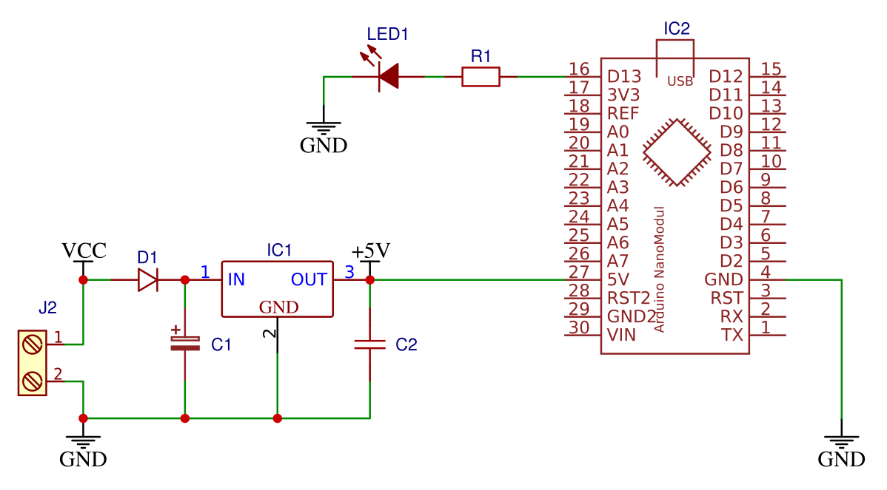
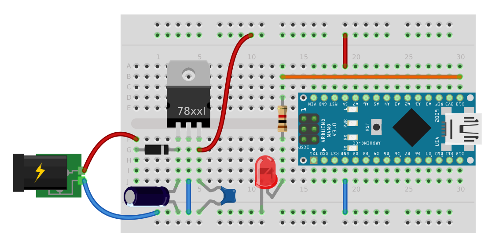
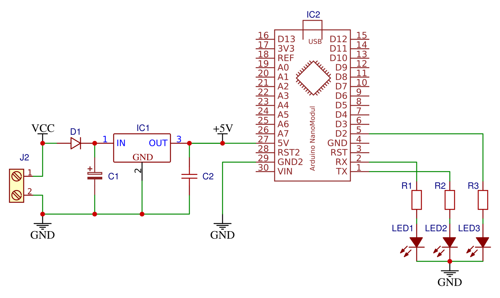
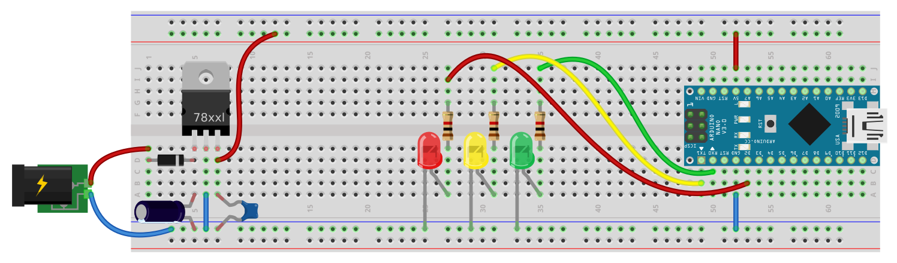

# KRMILNIK ARDUINO NANO

Krmilnik Arduino Nano je relativno cenovno ugoden (cca. 3-5€) in ker je programirljiv, ga lahko uporabimo v najrazličnejših aplikacijah. Razporeditev njegovih priključkov pa pa lahko vidimo na naslednji sliki [@fig:20-Arduino-Nano-pinout.png].

{#fig:20-Arduino-Nano-pinout.png}

## TESTNI PROGRAM "BLINK.INO"

Preden bomo krmilnik uporabili v našem vezju, ga bomo preizkusili. S programskim orodjem "Arduino IDE" bomo na krmilnik naložili program "blink.ino" in s tem preverili, da vse komponente na krmilniku delujejo pravilno. To je priporočljivo narediti pred vsakim projektom.

> ### NALOGA: PREIZKUS KRMILNIKA ARDUINO NANO.  
> 1. Krmilnik Arduino Nano povežite z računalnikom preko USB povezave,  
> 2. zaženite program Arduino IDE in ga pravilno nastavite:  
>   - Tools -> Processor  : Arduino Nano,  
>   - Tools -> Port       : USB2  
> 3. Odprite primer 01-BLINK.ino in  
> 4. prenesite program na krmilnik.

Program je napisan v programskem jeziku C++, ki uporablja nekaj funkcij za lažje rokovanje s krmilnikom.

```cpp
void setup() {
  // initialize digital pin LED_BUILTIN as an output.
  pinMode(LED_BUILTIN, OUTPUT);
}

// the loop function runs over and over again forever
void loop() {
  digitalWrite(LED_BUILTIN, HIGH);   // turn the LED on (HIGH is the voltage level)
  delay(1000);                       // wait for a second
  digitalWrite(LED_BUILTIN, LOW);    // turn the LED off by making the voltage LOW
  delay(1000);                       // wait for a second
}
```

## NAPAJANJE KRMILNIKA ARDUINO NANO

Krmilnik Arduino Nano lahko vstavimo tudi v prototipno ploščico in ga napajamo z zunanjim napajanjem.

> ### NALOGA: VEZAVA KRMILNIKA ARDUINO NANO NA PROTOTIPNI PLOŠČICI.  
> Vstavite krmilnik Arduino Nano v prototipno ploščico in ga povežite kot prikazuje naslednja shema.  
> Priključite  tudi upor in LED na priključek `13`.

{#fig:20-Nano-Blink.png}

{#fig:20-Nano-Blink-PB.png}

## MODEL SEMAFORJA

Vezje bomo preoblikovali tako, da bo delovalo kot semafor na cestnem križišču. Uporabili bomo tri LED svetila različnih barv in preoblikovali program.

{#fig:20-Model-semaforja.png}

{#fig:20-model-semaforja-fritzing.png}

> ### NALOGA: MODEL SEMAFORJA.  
> Preoblikujte vezje po shemi [@fig:20-Model-semaforja.png] in uporabite naslednji program ter ga ustrezno preoblikujte. Program, ki zagotavlja podobno delovanje, kot pri cestnem semaforju dokumentirajte in komentirajte uporabljene programske stavke (t.j. programske ukaze).

> Vsak programski stavek morate zaključiti s podpičjem **;**.

Preskustite naslednji program in ga ustrezno preoblikujte.

```cpp
void setup() {
  pinMode(0, OUTPUT);
  pinMode(1, OUTPUT);
  pinMode(2, OUTPUT);
}

void loop() {
  digitalWrite(0, HIGH);
  digitalWrite(1, HIGH);
  digitalWrite(2, HIGH);
  delay(1000);
  digitalWrite(0, LOW);
  digitalWrite(1, LOW);
  digitalWrite(2, LOW);
  delay(1000);
}
```

> ### NALOGA: BERLJIVA PROGRAMSKA KODA
> Programsko kodo preoblikujte tako, da bo koda enostavno berljiva in razumljiva. Predvsem storite nasledje:  
>
> 1. programske stavke s skupnim namenom združite v funkcije,
> 2. dodajte komentarje, kjer je to potrebno in
> 3. uporabite razlagalne konstante in spremenljivke
>
> V pomoč vam je lahko vsebina iz [Začetne Robotike](https://davidrihtarsic.github.io/Experiental_Learning_of_Robotics/Learning_Activities/5.2_Writing_Clean_Code.html)

## ANALIZA VEZJA

Elektronski elementi so omejeni z njihovo največjo dopustno električno moč. Če to električno moč prekoračimo, jih bomo najverjetneje uničili.

> Naprimer: Največja dopustna moč, ki se še lahko troši na uporih, ki jih uporabljate (premer upora = 2.4 mm) je 0,25 W.

Električno moč lahko izračunamo po enačbi:

$$ P = U I $$

Pri nekaterih drugih elementih (kot na primer pri LED) pa so omejitveni pogoji postavljeni že s samim tokom.

> Na primer za običajne 5mm LED je najpogosteje največji tok, ki lahko teče skoznjo 20 mA.

Tok skozi element lahko izračunamo po Ohmovem zakonu:  

$$ I_R = \frac{U_R}{R} $$

> Če ne vemo kolikšno upornost ima element (tako kot je to v primeru LED), si največkrat pomagamo z izračunom toka skozi drug zaporedno vezan element. Kajti v tem primeru je tok isti.

> ### NALOGA: IZRAČUNAJTE ELEKTRIČNI TOK  
> Izračunajte kolikšen električni tok teče skozi elemente R1, R2, R3, LED1, LED2 in LED3 ter preverite kakšne so električne omejitve tega elementa.
> Izračunajte tudi električno moč, ki se troši na tem elementu.

| Element | U [V] | I [mA]| P[W] |
|:-------:|-------|-------|------|
|    R1   |       |       |      |
|    R2   |       |       |      |
|    R3   |       |       |      |
|   LED1  |       |       |      |
|   LED2  |       |       |      |
|   LED3  |       |       |      |

