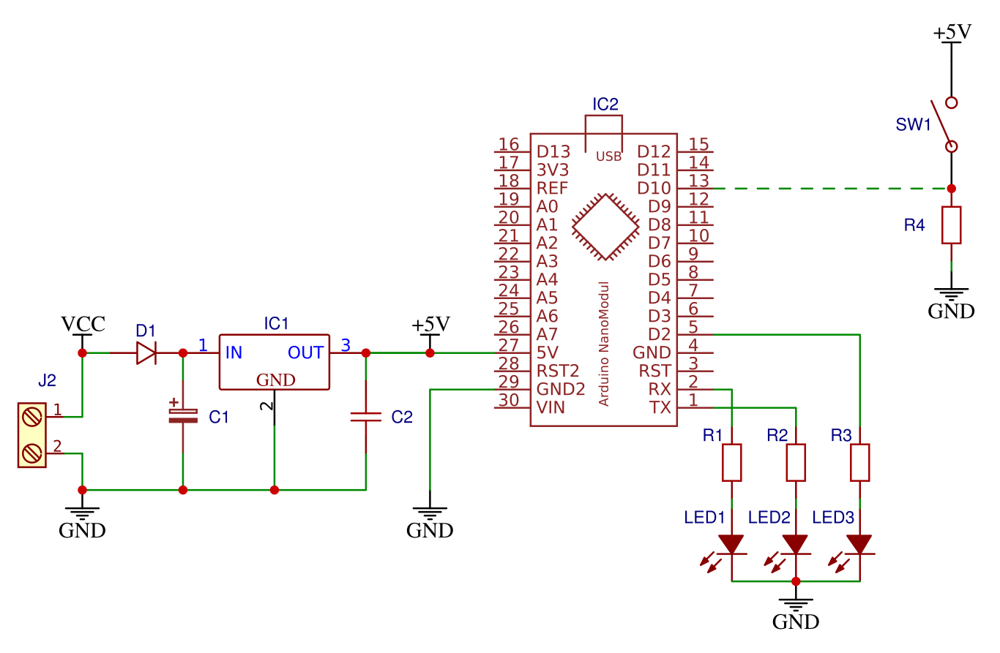
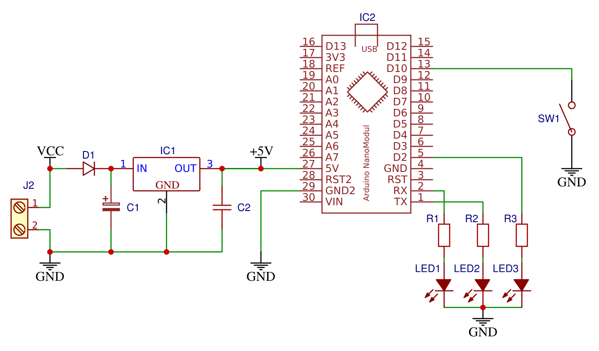

\setcounter{section}{2}
# UPORABA TIPKE

Tipka je element, ki je podoben stikalu. Prav tako kot pri stikalu, ob pritisku povežemo dva priključka med sabo, razlika pa je v tem, da se pri tipki ta povezava razklene ob prenehanju pritiska nanjo.

## VEZAVA TIPKE V DELILNIK NAPETOSTI

Zaznavanje pritiska tipke najbolj pogosto izvedemo tako, da izmerimo napetost na enem od njenih priključkov. Zato moramo tipko vedno vezati v delilnik napetosti.

> ### NALOGA: VEZAVA TIPKE V DELILNIK NAPETOSTI  
> Sestavite vezje s tipko, kot ga prikazuje [@fig:30-Tipka-delilnik.png] (brez črtkane povezave). Tipka naj bo vezana v delilnik napetosti in naj bo priključena proti napajanju.  
> V tabelo vpišite napetosti na vsakemu elementu posebej. Najprej poskušajte predvideti kolikšna je napetost na elementu, nato pa le-to preverite z inštrumentom.

|   Situacija  | Element | $U_{?}$ [V] | $U_{izm}$ [V] |
|:------------:|:-------:|-------------|---------------|
| Razkljenjeno |         |             |               |
|              |  Tipka  |             |               |
|              |   Upor  |             |               |
|   Slenjeno   |         |             |               |
|              |  Tipka  |             |               |
|              |   Upor  |             |               |


{#fig:30-Tipka-delilnik.png}

## PRIKLJUČITEV TIPKE NA DIGITALNI VHOD

Nato srednji priključek delilnika napetosti povežite na digitalni vhod krmilnika Arduino nano na priključek D10, kot prikazuje [@fig:30-Tipka-delilnik.png] črtkana povezava.

> ### NALOGA: PRIKLJUČITEV TIPKE NA DIGITALNI VHOD  
> Priključite tipko po shemi [@fig:30-Tipka-delilnik.png] in preskusite spodnji program.  
> Nato popravite program tako, bo LED svetila, ko boste tipko pritisnili.

```cpp
void setup() {
  pinMode(0, OUTPUT);
  pinMode(1, OUTPUT);
  pinMode(2, OUTPUT);
  pinMode(10, INPUT);
}

void loop() {
  if (digitalRead(10) == LOW){
    digitalWrite(0, HIGH);
  }else{
    digitalWrite(0, LOW);
  }
}
```

> POMNI: DIGITALNI VHOD MIKROKRMILNIKA  
> Priključke mikrokrmilnika lahko uporabimo tudi za odčitavanje napetostnih potencialov v digitalni obliki (ločimo le dva napetostna nivoja). S funkcijo `pinMode(PIN, INPUT);` določimo, da priključek `PIN` lahko opravlja funkcijo digitalnega vhoda s katerim lahko odčitamo vrednost napetostnega potenciala.
> Funkcija `digitalRead(PIN);` vrne vrednost digitalnega vhoda. Če je na priključku `PIN` napetostni potencial večji od 2.0 V bo funkcija vrnila vrednost 1 (ali HIGH ali TRUE). Če pa je na priključku `PIN` napetostni potencial manjši od 0.8 V pa bo funkcija vrnila vrednost 0 (ali LOW ali FALSE).

## PRIKLJUČITEV TIPKE Z UPOROM PROTI NAPAJANJU

Zamenjajte elementa v delilniku napetosti tako, da bo upor vezan proti napajanju in tipka proti napetostnem potencialu 0 V.

> ### NALOGA: UPOR VEZAN PROTI NAPAJANJU  
> Vezje spremenite, kot je opisano v nalogi in narišite shemo vezja.  
> Popravite program tako, da bo LED utripala, ko boste tipko držali.
> Utemeljite zakaj je sedaj napetostni potencial na vhodnem priključku krmilnika D10 enak 5 V, ko tipka ni pritisnjena (Utemeljitev podprite z Ohm-ovim zakonom in Kirchoff-ovima izrekoma).

## UPORABA UPOROV VEZANIH PROTI NAPAJANJU V MIKROKRMILNIKU

Uporaba vezave uporov proti napajanju je zelo pogosta. Zato le to mikrokrmilniki že vsebujejo v samem integriranem vezju na vseh digitalnih vhodih.

> ### NALOGA: UPORABA UPOROV VEZANIH PROTI NAPAJANJU V MIKROKRMILNIKU  
> Odstranite upor iz vezja kakor veleva shema [@fig:30-Tipka-pullup.png] in  
> programsko vključite upor vezan proti napajanju na digitalnem vhodu D10.

{#fig:30-Tipka-pullup.png}
