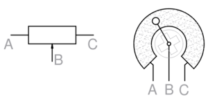
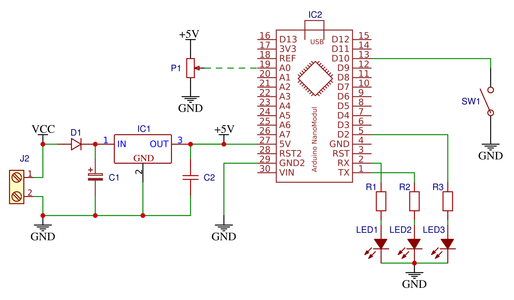

# Uporaba potenciometra

Potenciometri so upori s tremi priključki, ko je prikazano na [@fig:poternciometer.png]. Upornost potenciometra je fiksna in jo merimo med priključkoma A in C. Tretji priključek pa je nastavljiv in drsi po uporovni plati od ene skrajne lege do druge skrajne lege potenciometra.

{#fig:poternciometer.png}

## PORAZDELITEV NAPETOSTNEGA POTENCIALA NA POTENCIOMETRU

Delovanje potenciometra si lahko razložimo na dva načina:

1. Če na priključka A in C priključimo neko napetost, se bo napetostni potencial enakomerno zmanjševal vzdolž uporovne plasti potenciometra. Tako je napetostni potencial na priključku B odvisen od njegove lege.
2. Lahko si zamislimo, da priključek B razdeli potenciometer na dva upora: (1) $R_{AB}$ in (2) $R_{BC}$. Tako se bo tudi napetost, ki jo bomo priključili na potenciometer razdelila v razmerju teh dveh upornosti.

> ### NALOGA: MERJENJE NAPETOSTNEGA POTENCIALA NA POTENCIOMETRU.  
> Priključite potenciometer tako, kot je  prikazano na [@fig:35-potenciometer.png]. Na srednji priključek potenciomtra prikljčite V-meter. Preverite kako se napetostni potencila spreminja v odvisnosti od položaja srednjega priključka potenciomtra.

## UPORABA ANALOGNEGA VHODA NA KRMILNIKU

Na krmilniku imamo možnost odčitavanja napetostnega potenciala v analogni obliki z analognimi vhodi. Vsi analogni vhodi so na krmilniku označeni s črko "A" in zaporedno številko npr.: A0, A1 .. A7.

{#fig:35-potenciometer.png}

> ### NALOGA: ODČITAVANJE NAPETOSTNEGA POTENCIALA S KRMILNIKOM  
> Povežite srednji priključek potenciomtra na analogni vhod krmilnika (naprimer na A0) in preizkusite naslednji program. Program lahko najdete tudi v Arduino IDE programu:  
> File -> Examples -> 01. Basics -> AnalogReadSerial.


```cpp
void setup() {
  Serial.begin(9600);
}

void loop() {
  int sensorValue = analogRead(A0);
  Serial.println(sensorValue);
  delay(10);
}
```

Kot ste verjetno opazili, se vam na ekranu v serijskem oknu izpisujejo številske vrednosti. Te vrednostiso v območju od 0..1023, saj je ADC v mikrokrmilniku 10-bitni in je največja možna binarna številka zapisana z 10-imi biti prav 1023. Lahko pa te vrednosti prikazujete tudi grafično, v ta namen morate uporabiti `Serial Plotter`.

Krmilnik pa bi lahko na ta način (do neke mere) uporabljali tudi kot V-meter.

> ### NALOGA: PRETVORBA ADC VREDNOSTI V NAPETOST  
> Z ustrezno linearno funkcijo pretvorite ADC vrednosti v številske vrednosti napetosti. Enačbo funkcije tudi zapišite in priložite kodo programa.

Prav tako enostavno pa lahko poskrbimo za grafični prikaz napetosti...

> ### NALOGA: VU-METER  
> Program preoblikujte tako, da ko boste s potenciometrom nastavili večjo napetost,naj se vključi vač LED. Podobno kot je to na VU-metru na glasbenih stolpih. Kodo programa tudi priložite.


