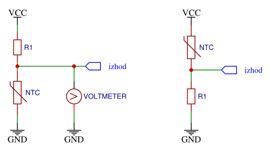

# NELINEARNI UPORI IN SENZORJI
 
Senzor je elektronski element, katerega izhodna električna količina (izhodni signal) je odvisna od neke fizikalne količine (temperature, osvetljenisti ...). V našem primeru bomo sestavili senzor temperature. V delilnik napetosti bomo vezali termistor in upor s konstantno upornostjo, kot prikazuje [@fig:05-senzor-delilnik.png].

## PREPROST SENZOR TEMPERATURE

{#fig:05-senzor-delilnik.png}

> ### NALOGA: SENZOR TEMPERATURE - vezje [vezje].
> Sestavite obe vezji iz [@fig:05-senzor-delilnik.png] in preverite kako se izhodna napetost spreminja glede na temperaturo. Ugotovitev zapišite za oba primera.

Premislimo, kako lahko razumemo delovanje senzorja na [@fig:05-senzor-delilnik.png]:  

1. Če se temperatura poveča, se bo upornost termistorja $R_{NTC}$ zmanjšala.
2. Ker se skupna upornost $R'=R_{NTC}+R_1$ zmanjša, bo tok, ki teče po tem vezju večji $I'=\frac{V_{CC}}{R'}$.
3. Ker je sedaj tok skozi vezje večji in le-ta teče tudi skozi upor $R_1$ bo na njem napetost večja $U_{R_1}=R_1I'$.
4. Napetost na uporu $R_1$ je enaka napetostnemu potencialu na izhodnemu priključku senzorja.
5. Zaključimo lahko, da se napetostni potencial na izhodnem priključku poveča, če se je tudi temperatura povečala.

> ### NALOGA: SENZOR TEMPERATURE - delovanje  
> Sledite točkam razmišljanja od 1 - 5 in zapišite konkretne vrednosti električnih količin iz vašega vezja.  

| fiz. količina | pri nižji temp. | pri višji temperaturi |
|:-------------:|-----------------|-----------------------|
|  temperatura  |                 |                       |
|   $R_{NTC}$   |                 |                       |
|      $I'$     |                 |                       |
|   $U_{R_1}$   |                 |                       |
|  $U_{IZHOD}$  |                 |                       |

## IZBIRA REFERENČNEGA UPORA

Odzivnost senzorja (t.j. sprememba izhodnega napetostnega potenciala ob dani spremembi temperature) je zelo odvisna od prave izbire upora $R_1$ iz [@fig:05-senzor-delilnik.png] - desno. Temu uporu rečemo tudi **referenčni upor**.

> ### NALOGA: DOLOČITEV REFERENČNEGA UPORA  
> Za različne referenčne upore preverite odziv senzorja. Pri izpeljavi meritev bodite pozorni, da boste temperaturo spremenili vedno v istem območju, npr. vedno iz temperature 10°C na 40°C. Referenčni upori naj bodo v dekadnem razmerju.

| $R_{Ref}[\Omega]$ | $T_1[$\°C] | $T_2[$\°C] | $U_{IZH}(T_1)[V]$ | $U_{IZH}(T_2)[V]$ | $\Delta U[V]$ |
|:-----------------:|------------|------------|-------------------|-------------------|---------------|
|        100        |            |            |                   |                   |               |
|         1k        |            |            |                   |                   |               |
|        10k        |            |            |                   |                   |               |
|        100k       |            |            |                   |                   |               |
|         1M        |            |            |                   |                   |               |

Iz prejšnje naloge ste verjetno opazili, da je odziv senzorja zelo odvisen od izbire referenčnega upora. Zato poskusimo nastaviti enačbo za izračun le-tega. Če bi iz meritev iz prejšnje naloge narisali graf $\Delta U(R_{Ref})$ bi lahko ugotovili, da ima ta funkcija en maksimum pri $R_{Ref-MAX}$. Za izračun tega upora (določitev maksimuma funkcije) moramo poiskati ničlo odvoda funkcije $\Delta U(R_{Ref})$.

> ### NALOGA: IZRAČUN REFERENČNEGA UPORA  
> 1. Nastavite enačbo za izračun izhodne napetosti $U_{IZH}$ pri temperaturi $T_1$.[^051]  
> 2. Nastavite enačbo za izračun izhodne napetosti $U_{IZH}$ pri temperaturi $T_2$.  
> 3. Nastavite enačbo za $\Delta U$.  
> 4. Enačbo $\Delta U$ odvajajte po $R_{Ref}$ in jo rešite za $\frac{\partial U_{IZH}}{\partial R_{Ref}}=0$

[^051]: Upornost termistorja pri temperaturi $T_1$ je različna od uporanosti pti $T_2$, zato jih morate ločiti in označiti drugače, npr.: $R_{NTC-T1}$ in $R_{NTC-T2}$.

<!--
U_T1 = u0*r1/(r1+n1)
U_T2 = u0*r1/(r1+n2)

dU = u0*r1/(r1+n1) - u0*r1/(r1+n2)

δU/δr1 = derivate( r1*u0/(r1+n1) - r1*u0/(r1+n2), r1)
       = ((-n1^2 n2 - n2 r1^2 + n1 (n2^2 + r1^2)) u0)/((n1 + r1)^2 (n2 + r1)^2)

solve(((-n1^2 n2 - n2 r1^2 + n1 (n2^2 + r1^2)) u0)/((n1 + r1)^2 (n2 + r1)^2) = 0, r1)
      r1= √(n1*n2)
      ============
-->
