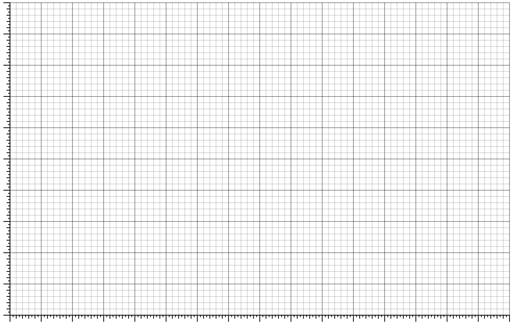

# UMERITEV SENZORJA TEMPERATURE

Kot smo že omenili so senzorji elektronski elementi, katerih izhodna napetost je odvisna od neke fizikalne količine. Na primer v našem primeru (senzor temperature) je izhodna napetost odvisna od temperature $U_{IZH}(T)$. Vendar, da bi poznali to funkcijo, moramo senzor umeriti.

## TEMPERATURNO OBMOČJE

Pred umeritvenim postopkom moramo poznati temperaturno območje, v katerem bomo senzor uporabljali. Zato si zadajmo nalogo, da bomo senzor uporabljali v območje $T=[20^{\circ}C\ ..\ 40^{\circ}C]$.

> ### NALOGA: SESTAVITE VEZJE  
> Sestavite senzor temperature kot sledilnik napetosti, v katerem boste uporabili le referenčni upor $R_{REF}$ in NTC termistor $R_{NTC}$. Vezje tudi narišite.  
> Izhodni napetostni potencial senzorja naj bo večji čim večja je temperatura.  
> Nenazadnje, določite referenčni upor $R_{REF}$ tako, da bo senzor imel največji odziv v zadanem temperaturnem območju. V ta namen morate poznati upornost termistorja pri:  
> - $R_{NTC-20}$ = __________ $k\Omega$  
> - $R_{NTC-40}$ = __________ $k\Omega$  
> $R_{REF}$ = __________ $k\Omega$[^061]

[^061]: Za izračun vzemite izpeljano enačbo iz prejšnje naloge.

> ### NALOGA: UMERITEV SENZORJA  
> Pri postopku umeritve morate meriti temperaturo $T$ termistorja in hkrati izhodni napetostni potencial senzorja $U_{IZH}$. Meritve zabeležite v spodnjo tabelo.  
> Nato podatke vrišite v graf na [@fig:r-ntc.png]

|         meritve         | no. 1 | no. 2 | no. 3 | no. 4 | no. 5 | no.6 | no. 7 | no. 8 | no. 9 | no. 10 |
|:-----------------------:|:-----:|-------|-------|-------|-------|------|-------|-------|-------|--------|
|     $T [^{\circ}C]$     |       |       |       |       |       |      |       |       |       |        |
|      $U_{IZH} [V]$      |       |       |       |       |       |      |       |       |       |        |
| $R_{NTC} [k\Omega]$[^062] |       |       |       |       |       |      |       |       |       |        |

Table: Umeritev senzorja temperature. {#tbl:umeritev-U-T}

[^062]: Upornost termistorja ne prepisujte iz programa za simulacijo, le-to morate izračunati v naslednji nalogi.

{#fig:r-ntc.png}

> ### NALOGA: KARAKTERISTIKA NTC TERMISTORJA  
> Izračunajte tudi upornost termistorja. Le-to lahko izračunate glede na napajalno napetost $U_0$, referenčno uporanost $R_{REF}$ in izhodno napetost $U_{IZH}$. Vsaj en izračun tudi dosledno nakažite.  
> Upornost termistorja $R_{NTC}$ izračunajte pri vsaki umerjeni temperaturi in jo vpišite v [@tbl:umeritev-U-T ].  
> Nato v isti graf na [@fig:r-ntc.png] vrišite še karakteristika termistorja $R_{NTC}(T)$ tako, da skalo za upornost določite na desni strani grafa.

