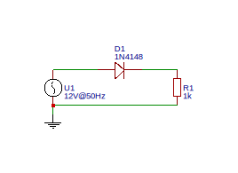

# POLPREVODNIŠKA DIODA

Polprevodnik je monokristalna snov, ki ima brez dovedene energije lastnosti električnega izolatorja, pri dovolj veliki dovedeni energiji pa ima lastnosti slabega električnega prevodnika. Od tod tudi njegovo ime. Uporabljajo se za izdelavo nelinearnih elektronskih elementov (dioda, tranzistor, integrirano vezje, triak,\...). Sodobne elektronike si ne moremo zamišljati brez polprevodnikov. Najbolj znan polprevodnik v
elektroniki je silicij, uporablja pa se tudi germanij  \[vir:
https://sl.wikipedia.org/wiki/Polprevodnik \].

Dioda je elektronski element z dvema priključkoma (anoda in katoda).  Sprva so bile diode elektronke. Danes so jih skoraj povsem izpodrinile polprevodniške diode, ki so bile tudi prvi polprevodniški elementi.  Značilnost diode je nesimetrična in nelinearna tokovno-napetostna karakteristika. V eni smeri dioda prepušča električni tok, v drugi (zaporni) smeri pa ne. Zaradi tega je primerna za usmerjanje izmeničnih signalov.

## POL-VALNI USMERNIK

Diodo večkrat uporabljamo kot usmerniški element, zaradi svoje preklopne prepustnosti. V vezju na [@fig:70-polvalni-usmernik.svg] je na vhod priključen napetostni vir izmenične sinusne napetosti, ki poganja tok skozi diodo in upor.

{#fig:70-polvalni-usmernik.svg}

V času pozitivne napajalne napetosti dioda prevaja električni tok in je na njej je majhna napetost $U_D= 0.7V$, večji del napajalne napetosti pa je na uporu $R_1$, ki omejuje tok skozi tokokrog. Največji tok, ki v našem vezju teče skozi diodo je:

$$ I_D=\frac{U_G-U_D}{R_{R_1}} $${#eq:tok-skozi-polusmernik}

V primeru negativne periode napajalne napetosti dioda ne prevaja. Skozi
tokokrog teče zelo majhen zaporni tok $I_Z= 25 nA$, ki povzroča
zanemarljiv padec napetosti na uporu R. Tako na izhodu dobimo le
enosmerno napetost, čeprav smo na vhod priključili izmenično napetost. V
našem primeru je enosmerna napetost pozitivna polvalna napetost ...

> ### NALOGA: POLVALNI USMERNIK  
> Sestavite vezje na [@fig:70-polvalni-usmernik.svg], ter izmerite potek vhodne napetosti vira - *U_G(t)* in napetost na uporu *U_R1(t)*. Obe krivulji narišite v graf na [@fig:07-Graf-osciloskop.png]

{#fig:07-Graf-osciloskop.png}

## Glajenje izhodne napetosti

Ko uporabljamo nek vir napetosti, je v večini primerov zaželena neka konstantna izhodna napetost (s časom naj se ne spreminja). V prejšnji vaji pa smo lahko opazil,da je sicer napetostni potencial sicer pozitiven, a ni konstanten. Zato moramo ta napetostni potencial še "zgladiti". Za naš primer bomo uporabili najenostavnejšo rešitev in za glajenje uporabili kondenzator tako, da ga vežemo vzporedno k bremenu (= porabniku). Tako izboljšamo stabilnost izhodne napetosti in jo lahko izračunamo kot:

$$ \sigma=\frac{\overline{U_{IZ}}}{\Delta U_{IZ}} $${#eq:stabilnost-napetosti}

Kjer je $\overline{U_{IZ}}$ - povprečna vrednost izhodne napetosti in $\Delta U_{IZ}$ - največja sprememba izhodne napetosti.

Princip delovanja glajenja lahko razložimo tako, da v času pozitivne periode napetostni vir zagotavlja električni tok obena - uporu $R_1$ in kondenzatorju. Kondenzator se ob tem napolni z nabojem in se tako na njem pojavi napetost. S časom se napetost vira začne zmanjševati in ko je napetost vira manjša od napetosti na kondenzatoju, v tem trenutku tok skozi diodo ne teče več. Tako toka skozi upor ne zagotavlja več napetostni vir, pač pa naboj, ki je shranjen na kondenzatorju. Stabilnost izhodne napetosti pa bo boljša, čim večja bo časovna konstanta praznjenja:

$$ \tau=R_1\ C_1 $${#eq:casovna-konstanta-RC}

> ### NALOGA: GLAJENJE IZHODNE NAPETOSTI  
> Izhodno napetost polvalnega usmernika zgladite z dodanim kondenzatorjem s kapacitivnostjo za $C_1=47\mu F$. Nato menjajte različne bremenske upornosti $R_1$ in opazujte kako se spremeni stabilnost izhodne napetosti.  
> V [@tbl:stabilnost] vpišite meritve povprečne vrednosti izhodnega napetostnega potenciala in vrednosti največje spremembe le tega.  
> Natu tudi izračunajte stabilnost napetostnega potenciala.

| $R_B\ [ k\Omega ]$ | $\overline{U_{IZ}}\ [ V ]$ | $\Delta U_{IZ}\ [ V ]$ | $\sigma$ |
|:------------------:|:--------------------------:|------------------------|----------|
|                    |                            |                        |          |
|                    |                            |                        |          |
|    $1.0 k\Omega$   |                            |                        |          |
|                    |                            |                        |          |
|                    |                            |                        |          |

Table: Stabilnost izhodne napetosti pri različnih bremenskih upornostih. {#tbl:stabilnost}

> ### NALOGA: GLAJENA IZHODNA NAPETOST
> Na graf [@fig:07-Graf-osciloskop.png] dorišite še zglajeno izhodno napetost za en primer iz kombinacije:  
> $R_1=$ __________ $k\Omega$ in  
> $C_1=$ __________ $\mu F$.
