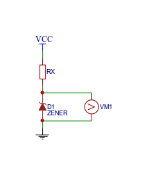
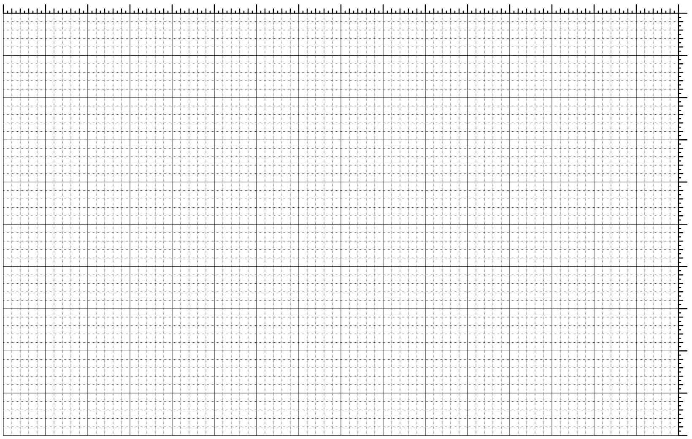

# ZENERJEVA DIODA

Zenerjeva dioda je v prevodni smeri zelo podobna navadni usmerniški diodi. V zaporni smeri pa ima nekoliko drugačne lastnosti. Električni tok začne dobro prevajati šele, ko se na njej pojavi t.i. zenerjeva napetost. 

## UPORABA ZENERJEVE DIODE

V elektronskih vezjih jo uporabljamo predvsem v zaporni smeri. Zato bolje spoznajmo njeno karakteristiko v zaporni smeri. Izmerimo jo lahko z vezjem, ki ga prikazuje [@fig:80-Zener-zaporna.png].

{#fig:80-Zener-zaporna.png}

> ### NALOGA: KARAKTERISTIKA ZENERJEVE DIODE  
> 1. Sestavite vezje, ki je prikazano na [@fig:80-Zener-zaporna.png] in izmerite karakteri stiko I(U) zenerjeve diode v zaporni smeri. Menjajte upor $R_X$ tako, da boste na zenerjevi diodo ustvarili različne napetosti.
> 2. Nakažite vsaj en izračun električnega toka, ki teče skozi zenerjevo diodo, če merimo le napetost na zenerjevi diodi.
> 3. Zabeležite si ključne pdatke (napajalno napetost in nazivno zenerjevo napetost):  
>
> $U_{CC}$=_____________ V  
> $U_{Z0}$= _____________V

| N     | $R_X[k\Omega]$ | $U_Z$ [V] | $I_Z[mA]$ | N      | $R_X[k\Omega]$ | $U_Z[V]$ | $I_Z[mA]$ |
| :---: | :-----:        | -------   | -------   | :----: | :-----:        | -------  | -------   |
| 1     |                |           |           | 6      |                |          |           |
| 2     |                |           |           | 7      |                |          |           |
| 3     |                |           |           | 8      |                |          |           |
| 4     |                |           |           | 9      |                |          |           |
| 5     |                |           |           | 10     |                |          |           |

Table: Meritve karakteristike zenerjeve diode. {#tbl:zener-karakteristika}

{#fig:zener-karakteristika}

> ### NALOGA: DELOVNA TOČKA ZENERJEVE DIODE  
> 1. Iz grafa na [@fig:zener-karakteristika] odčitajte delovno točko zenerjeve diode. To je točka na I(U) karakteristiki zenerjeve diode, pri kateri teče skozi zenerjevo diodo delovni tok $I_{Z0}$ in je na njej ravno njena nazivna napetost $U_{Z0}$.
>
> $I_{Z0}$=_____________ mA  
> $U_{Z0}$= _____________V
