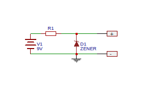

# REFERENČNI VIR Z ZENERJEVO DIODO

Referenčni napetostni vir, naj bi bil vir napetosti, ki bi zagotavljal neko določeno napetost (oz. kar se da konstantno). Ker pa je lahko njegovo delovanje odvisno od več spremenljivk (napajanje vira, različni porabniki) je lahko stabilnost te napetosti vprašljiva. Kako bi si skonstruirali tak vir, si poglejmo na naslednjem primeru. 

## NAČRTOVANJE REFERENČNEGA NAPETOSTNEGA VIRA

Referenčni vir bomo napajali z 9 V. Zenerjeva dioda je vezana v delilnik napetosti z uporom $R_1$, s katerim nastavimo ustrezne pogoje delovanja zenerjeve diode (glej: delovna točka zenerjeve diode iz prejšnje naloge).

{#fig:90-ref_zener.svg}

> ### NALOGA: REFERENČNI VIR Z ZENERJEVO DIODO  
> Sestavite referenčni vir z zenerjevo diodo, kot prikazuje slika. Upor $R1$ izberite tako, da bo zen. dioda delovala pri njeni delovni točki.  
> Izračun tudi nakažite.

Sedaj lahko preverite kako je s stabilnostjo vašega referenčnega vira. Na primer, da se po nekaj urah naš akumulator izprazni in namesto 9 V voltov zagotavlja le še 5 V. Če kljub temu na izhodu ne zaznamo znatne spremembe napetosti je vir dober oz. ima velik faktor stabilnosti.  Faktor stabilnosti napetostnega vira je definirana kot kvocient med relativnima spremembama vhodne in izhoden napetosti:

$$ S=\frac{\frac{\Delta U_G}{\overline{U_G}}}{\frac{\Delta U_{IZ}}{\overline{U_{IZ}}}}=\frac{\Delta{U_G}\ \overline{U_{IZ}}}{\overline{U_G}\ \Delta{U_{IZ}}} $${#eq:stabilnost}

> ### NALOGA: STABILNOST REFERENČNEGA VIRA.
> Ustvarite take pogoje, da boste lahko faktor stabilnosti tudi izračunali.  
> Na primer, da spremenite vhodno napetost za cca 1-2 V. Tako lahko izmerite vse podatke za izračun stabilnosti.

## OBREMENILNI PRESKUS REFERENČNEGA VIRA

> ### NALOGA: OBREMENILNI PRESKUS REFERENČNEGA VIRA  
> Nato naredite obremenilni preskus referenčnega vira v širokem spektru bremenskih upornosti [10 Ohmov .. 1 Mohm]. Napajalna napetost referenčnega vira naj bo zopet 9 V. Rezultate obremenilnega preskusa grafično predstavite v grafu $U_{IZ}(R_B)$. Graf naj ima vodoravno os v logaritemskem merilu.

| N | $R_B [k\Omega]$ | $U_{IZ} [V]$ | N  | $R_B [k\Omega]$ | $U_{IZ} [V]$ |
|:-:|:---------------:|--------------|----|-----------------|--------------|
| 1 |                 |              | 6  |                 |              |
| 2 |                 |              | 7  |                 |              |
| 3 |                 |              | 8  |                 |              |
| 4 |                 |              | 9  |                 |              |
| 5 |                 |              | 10 |                 |              |
Table: Obremenilni preskus referenčnega vira. {#tbl:u-ref-r}

{#fig:graf-obremenilni}
