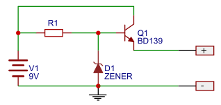

# TRANZISTOR

V prejšnji vaji smo lahko izmerili, da referenčni vir z zenerjevo diodo zagotavlja stabilno napetost le večjim bremenskim upornostim. Ob manjših bremenskih upornostih pa se napetost precej zmanjša, saj je izhodna upornost referenčnega vira z zenerjevo diodo precej velika in tako ne more zagotavljati potrebnega toka.

## TRANZISTOR KOT OKJAČEVALNIK MOČI

To pomanjkljivost lahko izboljšamo, če izhodu referenčnega vira z zenerjevo diodo dodamo NPN tranzistor v funkciji sledilnika napetosti, kot to prikazuje [@fig:ref_npn].

{#fig:ref_npn}

> ### NALOGA: REFERENČNI NAPETOSTNI VIR Z OJAČEVALNIKOM MOČI  
> Sestavite vezje na sliki 9.1 in izmerite obremenilni preskus referenčnega vira v širokem spektru bremenskih upornosti [10 Ohmov .. 1 Mohm]. Napajalna napetost referenčnega vira naj bo zopet 9 V. Rezultate obremenilnega preskusa grafično predstavite v grafu $U_{IZ}(R_B)$ na isti graf iz prejšnje vaje na [@fig:graf-obremenilni-zener].
