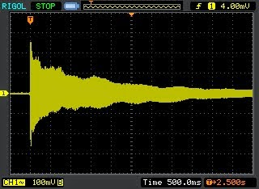
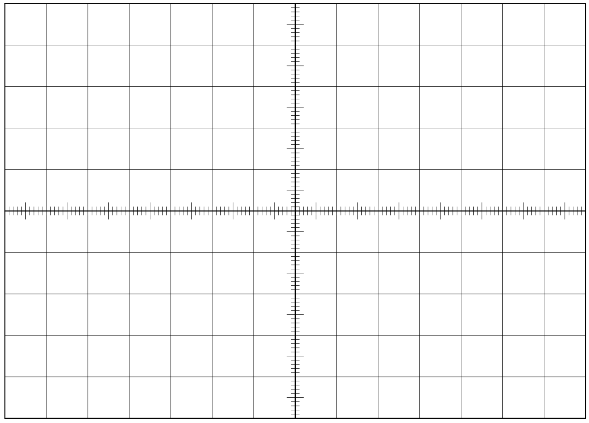

## INVERTIRAJOČI OJAČEVALNI SISTEM

Napetostne signale pogosto ojačamo zato, da jih ustrezno prilagodimo našim potrebam. Ena taka situacija je naprimer, ko želimo ojačati napetostni signal, ki ga dobimo iz izhoda električne kitare. Primer tega signala je prikazan na [@fig:u_signal_a_open].

{#fig:u_signal_a_open}

Iz [@fig:u_signal_a_open] lahko vidimo, da je amplituda tega signala v velikostnem redu 100 mV in ga moramo ojačati do nekaj voltov, da bi ga lahko slišali preko zvočnikov. Za to nalogo bi nam lahko prišel prav invertirajoči ojačevalni sistem.

> ### NALOGA: PRIPRAVA VHODNEGA SIGNALA  
> Sestavite vezje s katerim boste lahko poljubno nastavljali napetostni signal v območju napetostni, ki ga orisuje [@fig:u_signal_a_open] ($U_{IZ}=\pm 250\ mV$). Vezje je lahko preprost delilnik napetostni s potenciometrom in napajano z bipolarnim napajanjem +9V in -9V.
> Shemo vezja tudi narišite.

> ### NALOGA: INVERTIRAJOČI OJAČEVALNI SISTEM  
> Sestavite invertirajoči ojačevalni sistem z ojačanjem $|A'|\approx 50$.  
> Nato ojačajte napetostni signal prejšnjega vezja in izmerite celotno prenosno funkcijo ($U_2(U_1)$) ojačevalnega sistemai, ki podaja odvisnost izhodne napetosti $U_2$ od vhodne napetosti $U_1$. Ne pozabite izmeriti tudi področje v že nasičenem območju (vsaj 2 meritvi).  
> Meritve s pozitivnimi vhodnimi napetostmi $U_1$ vpisujte v [@tbl:ui_poz] in meritve z negativnimi vhodnimi napetostmi v [@tbl:ui_neg]...  
> ...ter rezultate meritev predstavite v grafični obliki $U_2(U_1)$ v grafu na [@fig:prenosna_fun_inv_oj_sis]

|     N     | #1 | #2 | #3 | #4 | #5 | #6 | #7 | #8 | #9 | #10 |
|:---------:|:--:|----|----|----|----|----|----|----|----|-----|
| $U_1[mV]$ |    |    |    |    |    |    |    |    |    |     |
|  $U_2[V]$ |    |    |    |    |    |    |    |    |    |     |
Table: Meritve pozitivnih vhodnih napetosti. {#tbl:ui_poz}

|       N      | #1 | #2 | #3 | #4 | #5 | #6 | #7 | #8 | #9 | #10 |
|:------------:|:--:|----|----|----|----|----|----|----|----|-----|
| $U_1[mV]$ |    |    |    |    |    |    |    |    |    |     |
|  $U_2[V]$ |    |    |    |    |    |    |    |    |    |     |
Table: Meritve negativnih vhodnih napetosti. {#tbl:ui_neg}

{#fig:prenosna_fun_inv_oj_sis}

> ### NALOGA: NAPETOSTNI PREMIK OPERACIJSKEGA OJAČEVALNIKA  
> Iz grafa odčitajte in označite napako tega sistema - preostalo napetost $U_{2OFF}$ in izračunajte napako operacijskega ojačevalnika, ki jo imenujemo **napetostni premik** in označimo z $U_{OFF}$.  
> Izračun tudi predstavite.

> ### NALOGA: UTEMELJITE  
> Zakaj se izhodna napetost delilnika napetosti zmanjša v trenutku, ko priključek povežemo na vhod invertirajočega ojačevalnega sistema.
