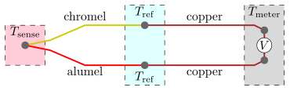

## ELEKTROMETRSKI OJAČEVALNI SISTEM

Pogosto lahko naletimo na boljše termometre, ki za merjenje temperature uporabljajo termočlen. Termočlen sestavljata dve različni kovini, ki sta spojeni med seboj. Vsak spoj med neenakimi kovinami proizvede električni potencial, ki je odvisen od temperature. Če imamo dva taka spoja, lahko med njima zaznamo napetost, le-ta pa je premo-sorazmerna s temperaturno razliko obeh spojev[wiki_thermocouple].

Na [@fig:termo_system] vidimo tak primer merilnega sistema, kjer merimo izhodno napetost $U_s$, ki se pojavi, ob temperaturni razliki $\Delta T = T_{sense} - T_{ref}$.

{#fig:termo_system}

Sorazmernostni koeficient med napetostjo in $\Delta T$ imenujemo koeficient termoelektrične napetosti. Poznamo več vrst termočlenov, ki se razlikujejo le v tem, kateri dve kovini sta spojeni med seboj. Naš primer termočlena je sestavljen iz bakra in konstantana (zlitina bakra 57%, niklja 41%, železa 1% in mangana 1%), znan tudi kot termočlen tipa T, njegov koeficient termoelektrične napetosti pa je $k_T=43\cdot 10^{-6}\  V/^{\circ} C$.

Ker so te napetosti zelo majhne, jih moramo ojačati z velikim $A'$. A ker bi imeli težavo z znatno vhodno notranjo upornostjo invertirajočega ojačevalnega sistema, bomo raje izbrali elektrometrski ojačevalni sistem.

> ### NALOGA: UMERITEV TEMPERTURNEGA SENZORJA Z ELEKTROMETRSKIM OJAČEVALNIM SISTEMOM  
> Skonstruirajte (narišite shemo) elektrometrskega ojačevalnega sistema z ojačenjem okoli 2326. Pri tem ojačanju, boste dobili izhodno napetost enako 1/10 $\Delta T$ (npr.: $25^{\circ} C$ - 2.5 V). Kot vhodno napetost uporabite napetost termočlena, katero dobite, če oba konca termočlena postavite na različni temperaturi. Umerite cel sistem tako, da boste izmerili temperature obeh spojev in izhodno napetost ter te meritve vpisali v [@tbl:umeritev_termoclena ].  
> Nato narišite graf na [@fig:u_delta_t] $U_{IZU}(\Delta T)$, kjer je $\Delta T= T_+ - T_{GND}$ temperaturna razlika med obema spojema termočlena.  
> Iz grafa odčitajte smerni koeficient umeritvene krivulje s katerim lahko izračunate koeficient termoelektrične napetosti za termočlen tipa T. Izračune tudi nakažite.

|                   N -> | no. #1 | no. #2 | no. #3 | no. #4 | no. #5 | no. #6 | no. #7 | no. #8 | no. #9 | no. #10 |
|-----------------------:|:------:|--------|--------|--------|--------|--------|--------|--------|--------|---------|
|      $T_+[C^{\circ} ]$ |        |        |        |        |        |        |        |        |        |         |
|  $T_{GND}[C^{\circ} ]$ |        |        |        |        |        |        |        |        |        |         |
| $\Delta^{\circ}  T[C]$ |        |        |        |        |        |        |        |        |        |         |
|            $U_{IZ}[V]$ |        |        |        |        |        |        |        |        |        |         |
Table: Meritve umeritvenega postopka. {#tbl:umeritev_termoclena}

{#fig:u_delta_t}

<!-- 
- skonstruirajte vezje
+ ojačanje cca 2326
+ tabela meritev

= upori naj bodo v k Ohm...
-->

