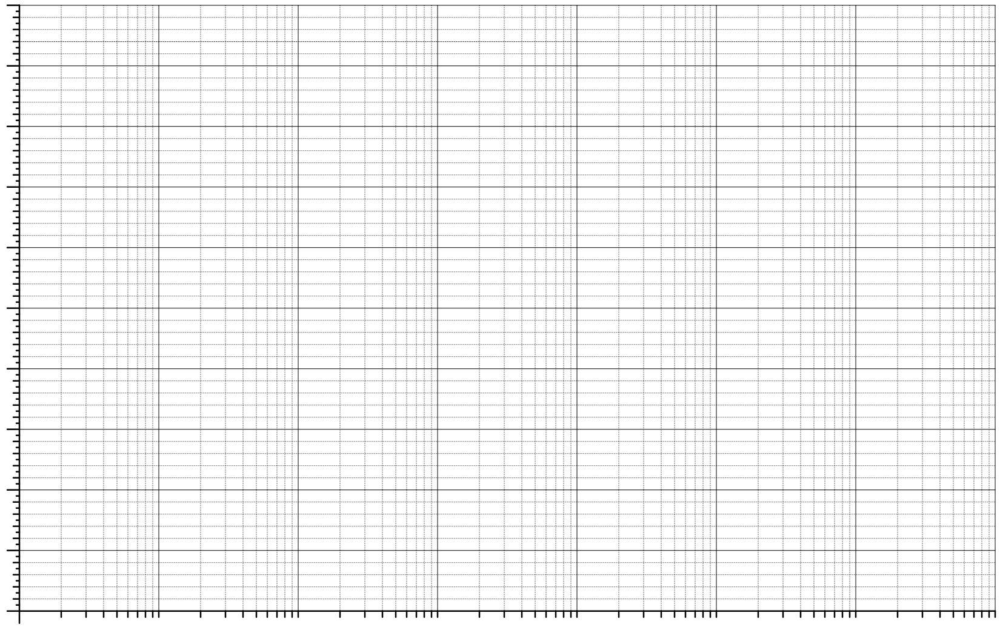

# ELEKTRIČNA SITA

Električna sita so električna vezja, ki bolje oz. slabše prevajajo napetostne signale glede na njihovo frekvenco. Lahko so skonstruirani kot preprosti RC delilniki napetosti, katerih izhodna napetost je odvisna od frekvence (v enačbi le-to pogosto predstavimo s krožilno frekvenco). Uporabljamo pa jih, ko želimo iz sestavljenega napetostnega signala (informacija, šum, motnje, inducirane napetosti...), ustvariti napetostni signal z le eno komponento.

## NIZKO PREPUSTNO RC SITO

Nizko prepustno sito je zelo pogosto uporabljeno v električnih vezjih, kjer imamo opravka z relativno počasnimi spremembami, kot je to na primer pri napetostnih signalih temperaturnih senzorjev. Izhodna napetost preprostega RC nizko prepustnega sita je podana z [@eq:u2_omega]

$$ \hat U_{2}= \hat U_{1} \frac{1}{\sqrt{R^2 \omega^2 C^2 + 1}},$${#eq:u2_omega}

pri čemer je $R$ uporsnot upora v delilniku, $C$ kapaciteta kondenzatorja, $\omega$ krožilna frekvenca signala ali komponente le-tega, za katerega računamo amplitudo izhodne napetosti.

Tako sito vedno skonstruiramo glede na t.i. mejno frekvenco, ki jo lahko izračunamo po [@eq:omega_nic]

$$ \omega_0 = \frac{1}{RC} .$${#eq:omega_nic}

## KARAKTERISTIKA NIZKO PREPUSTNEGA SITA

Karakteristiko sita pogosto podajamo v razmerju $\frac{U_{2}}{U_{1}}(\omega)$, ali celo v decibelih, ki je definirano kot 10× logaritemskega razmerja (izhodne in vhodne) moči. Ker je električna moč sorazmerna kvadratu napetosti ($P \propto U^2$) lahko zapišemo [@eq:g_decibel]

$$ g[dB] = 10\ log\left(\frac{\hat U_2^2}{\hat U_1^2}\right) =  20\ log\left(\frac{\hat U_2}{\hat U_1}\right).$${#eq:g_decibel}

> ### NALOGA: KARAKTERISTIKA NIZKO PREPUSTNEGA SITA
> Skonstruirajte in narišite vezje nizko prepustnega sita, katerega mejna frekvenca naj bo $100 Hz$.  
> Nato naredite preskus, s katerim boste lahko izmerili podatke za izračun dveh karakteristik sita $g(\nu)$ in $\Delta \phi(\nu)$. Meritve vpišite v [@tbl:meritve_LPF ] in  
> nato narišite grafa $g(\nu)$ in $\Delta \phi (\nu)$ na [@fig:karakteristika_LPF]. X-os naj bo v logaritemski skali z osnovo 10.  
> Na karakteristiki $f(\nu)$ označite tudi premico v padajočem delu karakteristike in izračunajte njen smerni koeficient ter nakažite, da je $\nu_0$ ničla te funkcije.

| $\nu_0$ [Hz] | $\hat U_1$ [V] | $\hat U_2$ [V] | g[dB] | $t_0$ [ms] | $\Delta t$ [ms] | $\Delta\phi$ |
|:------------:|:--------------:|:--------------:|:-----:|:----------:|:---------------:|:------------:|
|              |                |                |       |            |                 |              |
|              |                |                |       |            |                 |              |
|              |                |                |       |            |                 |              |
|              |                |                |       |            |                 |              |
|              |                |                |       |            |                 |              |
|              |                |                |       |            |                 |              |
|              |                |                |       |            |                 |              |
|              |                |                |       |            |                 |              |
|              |                |                |       |            |                 |              |
|              |                |                |       |            |                 |              |
Table: Tabela meritev karakteristike nizko prepustnega sita. {#tbl:meritve_LPF}

{#fig:karakteristika_LPF}
