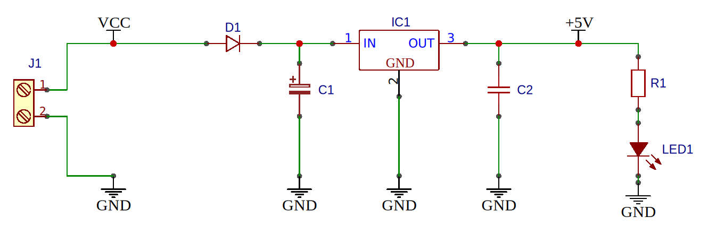
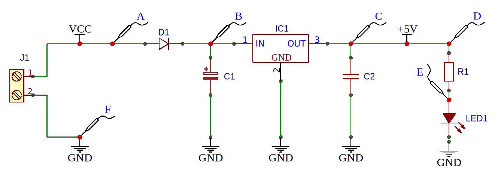

# NAPAJANJE

## ZAGOTAVLJANJE STABILNE NAPAJALNE NAPETOSTI

> ### NALOGA: SESTAVITE VEZJE NA PROTOTIPNI PLOŠČICI  
> Sestavite vezje po shemi [@fig:Schematic_Skritpa_10-napajanje_20200218122122.svg].
>
> {#fig:Schematic_Skritpa_10-napajanje_20200218122122.svg}

## NAPETOSTNI POTENCIAL

> ### NALOGA: IZMERITE NAPETOSTNE POTENCIALE  
> Izmeri napetostne potenciale, ki so vrisani v naslednji shemi [@fig:Schematic_Skritpa_10-napajanje_20200218113659.svg].
> 
> | Točka v vezju | Nap. potencial [V] |
> |:-------------:|--------------------|
> |       A       |                    |
> |       B       |                    |
> |       C       |                    |
> |       D       |                    |
> |       E       |                    |
> |       F       |                    |
>
> {#fig:Schematic_Skritpa_10-napajanje_20200218113659.svg}

## NAPETOST

> ### NALOGA: IZRAČUNAJTE NAPETOSTI  
> Za vse naštete elemente najprej izračunajte kolikšna napetost je na njih, nato pa izračun preverite z inštumentom.
> 
> | Element | $U_{izr}$[V] | $U_{izm}$[V] |
> |:-------:|--------------|--------------|
> |    D1   |              |              |
> |    C1   |              |              |
> |    C2   |              |              |
> |    R1   |              |              |
> |   LED1  |              |              |

# KRMILNIK ARDUINO NANO

## TESTNI PROGRAM "BLINK.INO"

> ### NALOGA: PREIZKUS KRMILNIKA ARDUINO NANO.  
> 1. Krmilnik Arduino Nano povežite z računalnikom preko USB povezave,  
> 2. zaženite program Arduino IDE in ga pravilno nastavite:  
>   - Tools -> Processor  : Arduino Nano,  
>   - Tools -> Port       : USB2  
> 3. Odprite primer 01-BLINK.ino in  
> 4. prenesite program na krmilnik.

## NAPAJANJE KRMILNIKA ARDUINO NANO

> ### NALOGA: VEZAVA KRMILNIKA ARDUINO NANO NA PROTOTIPNI PLOŠČICI.  
> Vstavite krmilnik Arduino Nano v prototipno ploščico in ga povežite kot prikazuje naslednja shema.  
> Priključite  tudi upor in LED na priključek `13`.

## MODEL SEMAFORJA

> ### NALOGA: MODEL SEMAFORJA.  
> Preoblikujte vezje po shemi [@fig:20-Model-semaforja.png] in uporabite naslednji program ter ga ustrezno preoblikujte. Program, ki zagotavlja podobno delovanje, kot pri cestnem semaforju dokumentirajte in komentirajte uporabljene programske stavke (t.j. programske ukaze).
> Vsak programski stavek morate zaključiti s podpičjem **;**.

> ### NALOGA: BERLJIVA PROGRAMSKA KODA
> Programsko kodo preoblikujte tako, da bo koda enostavno berljiva in razumljiva. Predvsem storite nasledje:  
> 1. programske stavke s skupnim namenom združite v funkcije,
> 2. dodajte komentarje, kjer je to potrebno in
> 3. uporabite razlagalne konstante in spremenljivke
>
> V pomoč vam je lahko vsebina iz [Začetne Robotike](https://davidrihtarsic.github.io/Experiental_Learning_of_Robotics/Learning_Activities/5.2_Writing_Clean_Code.html)

## ANALIZA VEZJA
> Naprimer: Največja dopustna moč, ki se še lahko troši na uporih, ki jih uporabljate (premer upora = 2.4 mm) je 0,25 W.
> Na primer za običajne 5mm LED je najpogosteje največji tok, ki lahko teče skoznjo 20 mA.
> Če ne vemo kolikšno upornost ima element (tako kot je to v primeru LED), si največkrat pomagamo z izračunom toka skozi drug zaporedno vezan element. Kajti v tem primeru je tok isti.

> ### NALOGA: IZRAČUNAJTE ELEKTRIČNI TOK  
> Izračunajte kolikšen električni tok teče skozi elemente R1, R2, R3, LED1, LED2 in LED3 ter preverite kakšne so električne omejitve tega elementa.
> Izračunajte tudi električno moč, ki se troši na tem elementu.

# UPORABA TIPKE

## VEZAVA TIPKE V DELILNIK NAPETOSTI

> ### NALOGA: VEZAVA TIPKE V DELILNIK NAPETOSTI  
> Sestavite vezje s tipko, kot ga prikazuje [@fig:30-Tipka-delilnik.png] (brez črtkane povezave). Tipka naj bo vezana v delilnik napetosti in naj bo priključena proti napajanju.  
> V tabelo vpišite napetosti na vsakemu elementu posebej. Najprej poskušajte predvideti kolikšna je napetost na elementu, nato pa le-to preverite z inštrumentom.

## PRIKLJUČITEV TIPKE NA DIGITALNI VHOD

> ### NALOGA: PRIKLJUČITEV TIPKE NA DIGITALNI VHOD  
> Priključite tipko po shemi [@fig:30-Tipka-delilnik.png] in preskusite spodnji program.  
> Nato popravite program tako, bo LED svetila, ko boste tipko pritisnili.
> POMNI: DIGITALNI VHOD MIKROKRMILNIKA  
> Priključke mikrokrmilnika lahko uporabimo tudi za odčitavanje napetostnih potencialov v digitalni obliki (ločimo le dva napetostna nivoja). S funkcijo `pinMode(PIN, INPUT);` določimo, da priključek `PIN` lahko opravlja funkcijo digitalnega vhoda s katerim lahko odčitamo vrednost napetostnega potenciala.
> Funkcija `digitalRead(PIN);` vrne vrednost digitalnega vhoda. Če je na priključku `PIN` napetostni potencial večji od 2.0 V bo funkcija vrnila vrednost 1 (ali HIGH ali TRUE). Če pa je na priključku `PIN` napetostni potencial manjši od 0.8 V pa bo funkcija vrnila vrednost 0 (ali LOW ali FALSE).

## PRIKLJUČITEV TIPKE Z UPOROM PROTI NAPAJANJU

> ### NALOGA: UPOR VEZAN PROTI NAPAJANJU  
> Vezje spremenite, kot je opisano v nalogi in narišite shemo vezja.  
> Popravite program tako, da bo LED utripala, ko boste tipko držali.
> Utemeljite zakaj je sedaj napetostni potencial na vhodnem priključku krmilnika D10 enak 5 V, ko tipka ni pritisnjena (Utemeljitev podprite z Ohm-ovim zakonom in Kirchoff-ovima izrekoma).

## UPORABA UPOROV VEZANIH PROTI NAPAJANJU V MIKROKRMILNIKU

> ### NALOGA: UPORABA UPOROV VEZANIH PROTI NAPAJANJU V MIKROKRMILNIKU  
> Odstranite upor iz vezja kakor veleva shema [@fig:30-Tipka-pullup.png] in  
> programsko vključite upor vezan proti napajanju na digitalnem vhodu D10.

# Uporaba potenciometra

## PORAZDELITEV NAPETOSTNEGA POTENCIALA NA POTENCIOMETRU

> ### NALOGA: MERJENJE NAPETOSTNEGA POTENCIALA NA POTENCIOMETRU.  
> Priključite potenciometer tako, kot je  prikazano na [@fig:35-potenciometer.png]. Na srednji priključek potenciomtra prikljčite V-meter. Preverite kako se napetostni potencila spreminja v odvisnosti od položaja srednjega priključka potenciomtra.

## UPORABA ANALOGNEGA VHODA NA KRMILNIKU

> ### NALOGA: ODČITAVANJE NAPETOSTNEGA POTENCIALA S KRMILNIKOM  
> Povežite srednji priključek potenciomtra na analogni vhod krmilnika (naprimer na A0) in preizkusite naslednji program. Program lahko najdete tudi v Arduino IDE programu:  
> File -> Examples -> 01. Basics -> AnalogReadSerial.

> ### NALOGA: PRETVORBA ADC VREDNOSTI V NAPETOST  
> Z ustrezno linearno funkcijo pretvorite ADC vrednosti v številske vrednosti napetosti. Enačbo funkcije tudi zapišite in priložite kodo programa.

> ### NALOGA: VU-METER  
> Program preoblikujte tako, da ko boste s potenciometrom nastavili večjo napetost,naj se vključi vač LED. Podobno kot je to na VU-metru na glasbenih stolpih. Kodo programa tudi priložite.

# NELINEARNI UPORI IN SENZORJI

## PREPROST SENZOR TEMPERATURE

> ### NALOGA: SENZOR TEMPERATURE - vezje [vezje].
> Sestavite obe vezji iz [@fig:05-senzor-delilnik.png] in preverite kako se izhodna napetost spreminja glede na temperaturo. Ugotovitev zapišite za oba primera.

> ### NALOGA: SENZOR TEMPERATURE - delovanje  
> Sledite točkam razmišljanja od 1 - 5 in zapišite konkretne vrednosti električnih količin iz vašega vezja.  

## IZBIRA REFERENČNEGA UPORA

> ### NALOGA: DOLOČITEV REFERENČNEGA UPORA  
> Za različne referenčne upore preverite odziv senzorja. Pri izpeljavi meritev bodite pozorni, da boste temperaturo spremenili vedno v istem območju, npr. vedno iz temperature 10°C na 40°C. Referenčni upori naj bodo v dekadnem razmerju.

> ### NALOGA: IZRAČUN REFERENČNEGA UPORA  
> 1. Nastavite enačbo za izračun izhodne napetosti $U_{IZH}$ pri temperaturi $T_1$.[^051]  
> 2. Nastavite enačbo za izračun izhodne napetosti $U_{IZH}$ pri temperaturi $T_2$.  
> 3. Nastavite enačbo za $\Delta U$.  
> 4. Enačbo $\Delta U$ odvajajte po $R_{Ref}$ in jo rešite za $\frac{\partial U_{IZH}}{\partial R_{Ref}}=0$

# UMERITEV SENZORJA TEMPERATURE

## TEMPERATURNO OBMOČJE

> ### NALOGA: SESTAVITE VEZJE  
> Sestavite senzor temperature kot sledilnik napetosti, v katerem boste uporabili le referenčni upor $R_{REF}$ in NTC termistor $R_{NTC}$. Vezje tudi narišite.  
> Izhodni napetostni potencial senzorja naj bo večji čim večja je temperatura.  
> Nenazadnje, določite referenčni upor $R_{REF}$ tako, da bo senzor imel največji odziv v zadanem temperaturnem območju. V ta namen morate poznati upornost termistorja pri:  
> - $R_{NTC-20}$ = __________ $k\Omega$  
> - $R_{NTC-40}$ = __________ $k\Omega$  
> $R_{REF}$ = __________ $k\Omega$[^061]

> ### NALOGA: UMERITEV SENZORJA  
> Pri postopku umeritve morate meriti temperaturo $T$ termistorja in hkrati izhodni napetostni potencial senzorja $U_{IZH}$. Meritve zabeležite v spodnjo tabelo.  
> Nato podatke vrišite v graf na [@fig:r-ntc.png]

> ### NALOGA: KARAKTERISTIKA NTC TERMISTORJA  
> Izračunajte tudi upornost termistorja. Le-to lahko izračunate glede na napajalno napetost $U_0$, referenčno uporanost $R_{REF}$ in izhodno napetost $U_{IZH}$. Vsaj en izračun tudi dosledno nakažite.  
> Upornost termistorja $R_{NTC}$ izračunajte pri vsaki umerjeni temperaturi in jo vpišite v [@tbl:umeritev-U-T ].  
> Nato v isti graf na [@fig:r-ntc.png] vrišite še karakteristika termistorja $R_{NTC}(T)$ tako, da skalo za upornost določite na desni strani grafa.

# POLPREVODNIŠKA DIODA

## POL-VALNI USMERNIK

> ### NALOGA: POLVALNI USMERNIK  
> Sestavite vezje na [@fig:70-polvalni-usmernik.svg], ter izmerite potek vhodne napetosti vira - *U_G(t)* in napetost na uporu *U_R1(t)*. Obe krivulji narišite v graf na [@fig:07-Graf-osciloskop.png]

## Glajenje izhodne napetosti

> ### NALOGA: GLAJENJE IZHODNE NAPETOSTI  
> Izhodno napetost polvalnega usmernika zgladite z dodanim kondenzatorjem s kapacitivnostjo za $C_1=47\mu F$. Nato menjajte različne bremenske upornosti $R_1$ in opazujte kako se spremeni stabilnost izhodne napetosti.  
> V [@tbl:stabilnost] vpišite meritve povprečne vrednosti izhodnega napetostnega potenciala in vrednosti največje spremembe le tega.  
> Natu tudi izračunajte stabilnost napetostnega potenciala.

> ### NALOGA: GLAJENA IZHODNA NAPETOST
> Na graf [@fig:07-Graf-osciloskop.png] dorišite še zglajeno izhodno napetost za en primer iz kombinacije:  
> $R_1=$ __________ $k\Omega$ in  
> $C_1=$ __________ $\mu F$.

# ZENERJEVA DIODA

## UPORABA ZENERJEVE DIODE

> ### NALOGA: KARAKTERISTIKA ZENERJEVE DIODE  
> 1. Sestavite vezje, ki je prikazano na [@fig:80-Zener-zaporna.png] in izmerite karakteri stiko I(U) zenerjeve diode v zaporni smeri. Menjajte upor $R_X$ tako, da boste na zenerjevi diodo ustvarili različne napetosti.
> 2. Nakažite vsaj en izračun električnega toka, ki teče skozi zenerjevo diodo, če merimo le napetost na zenerjevi diodi.
> 3. Zabeležite si ključne pdatke (napajalno napetost in nazivno zenerjevo napetost):  
>
> $U_{CC}$=_____________ V  
> $U_{Z0}$= _____________V

> ### NALOGA: DELOVNA TOČKA ZENERJEVE DIODE  
> 1. Iz grafa na [@fig:zener-karakteristika] odčitajte delovno točko zenerjeve diode. To je točka na I(U) karakteristiki zenerjeve diode, pri kateri teče skozi zenerjevo diodo delovni tok $I_{Z0}$ in je na njej ravno njena nazivna napetost $U_{Z0}$.
>
> $I_{Z0}$=_____________ mA  
> $U_{Z0}$= _____________V

# REFERENČNI VIR Z ZENERJEVO DIODO

## NAČRTOVANJE REFERENČNEGA NAPETOSTNEGA VIRA

> ### NALOGA: REFERENČNI VIR Z ZENERJEVO DIODO  
> Sestavite referenčni vir z zenerjevo diodo, kot prikazuje slika. Upor $R1$ izberite tako, da bo zen. dioda delovala pri njeni delovni točki.  
> Izračun tudi nakažite.

> ### NALOGA: STABILNOST REFERENČNEGA VIRA.
> Ustvarite take pogoje, da boste lahko faktor stabilnosti tudi izračunali.  
> Na primer, da spremenite vhodno napetost za cca 1-2 V. Tako lahko izmerite vse podatke za izračun stabilnosti.

## OBREMENILNI PRESKUS REFERENČNEGA VIRA

> ### NALOGA: OBREMENILNI PRESKUS REFERENČNEGA VIRA  
> Nato naredite obremenilni preskus referenčnega vira v širokem spektru bremenskih upornosti [10 Ohmov .. 1 Mohm]. Napajalna napetost referenčnega vira naj bo zopet 9 V. Rezultate obremenilnega preskusa grafično predstavite v grafu $U_{IZ}(R_B)$. Graf naj ima vodoravno os v logaritemskem merilu.

# TRANZISTOR

## TRANZISTOR KOT OKJAČEVALNIK MOČI

> ### NALOGA: REFERENČNI NAPETOSTNI VIR Z OJAČEVALNIKOM MOČI  
> Sestavite vezje na sliki 9.1 in izmerite obremenilni preskus referenčnega vira v širokem spektru bremenskih upornosti [10 Ohmov .. 1 Mohm]. Napajalna napetost referenčnega vira naj bo zopet 9 V. Rezultate obremenilnega preskusa grafično predstavite v grafu $U_{IZ}(R_B)$ na isti graf iz prejšnje vaje na [@fig:graf-obremenilni-zener].

## TRANZISTOR KOT STIKALO

# OPERACIJSKI OJAČEVALNIK

## KOMPARATOR NAPETOSTI

> ### NALOGA: VKLOP ŽARNICE  
> Sestavite elektronsko vezje, ki bo vključilo žarnico, ko bomo na to vezje posvetili z drugim svetlobnim telesom. Tako vezje bo delovalo kot navadna sveča, ki jo moramo prižgati z vžigalico. To vezje lahko razdelimo na štiri osnovne sestavne dele, ki jih najdete v regulacijskih vezjih:  
> 1. Senzorski del: v katerem imamo senzor osvetljenosti za detekcijo tujega svetlobnega telesa.  
> 2. Nastavitveni člen: s katerim nastavimo referenčno napetost na katero se ozira primerjalna logična enota.  
> 3. Komparator napetosti: ki bo primerjal napetost senzorja z napetostjo nastavitvenega člena.  
> 4. Močnostna elektronika: ki bo na podlagi izhodnega napetostnega potenciala komparatorja poskrbela za vklop žarnice.  
>  
> Vsak sestavni del najprej načrtujte in ga nato realizirajte v fizični obliki. Narišite sheme vsakega sestavnega dela posebej, ga preizkusite in povežite v celoto.

## INVERTIRAJOČI OJAČEVALNI SISTEM

> ### NALOGA: PRIPRAVA VHODNEGA SIGNALA  
> Sestavite vezje s katerim boste lahko poljubno nastavljali napetostni signal v območju napetostni, ki ga orisuje [@fig:u_signal_a_open] ($U_{IZ}=\pm 250\ mV$). Vezje je lahko preprost delilnik napetostni s potenciometrom in napajano z bipolarnim napajanjem +9V in -9V.
> Shemo vezja tudi narišite.

> ### NALOGA: INVERTIRAJOČI OJAČEVALNI SISTEM  
> Sestavite invertirajoči ojačevalni sistem z ojačanjem $|A'|\approx 50$.  
> Nato ojačajte napetostni signal prejšnjega vezja in izmerite celotno prenosno funkcijo ($U_2(U_1)$) ojačevalnega sistemai, ki podaja odvisnost izhodne napetosti $U_2$ od vhodne napetosti $U_1$. Ne pozabite izmeriti tudi področje v že nasičenem območju (vsaj 2 meritvi).  
> Meritve s pozitivnimi vhodnimi napetostmi $U_1$ vpisujte v [@tbl:ui_poz] in meritve z negativnimi vhodnimi napetostmi v [@tbl:ui_neg]...  
> ...ter rezultate meritev predstavite v grafični obliki $U_2(U_1)$ v grafu na [@fig:prenosna_fun_inv_oj_sis]

> ### NALOGA: NAPETOSTNI PREMIK OPERACIJSKEGA OJAČEVALNIKA  
> Iz grafa odčitajte in označite napako tega sistema - preostalo napetost $U_{2OFF}$ in izračunajte napako operacijskega ojačevalnika, ki jo imenujemo **napetostni premik** in označimo z $U_{OFF}$.  
> Izračun tudi predstavite.

> ### NALOGA: UTEMELJITE  
> Zakaj se izhodna napetost delilnika napetosti zmanjša v trenutku, ko priključek povežemo na vhod invertirajočega ojačevalnega sistema.

## ELEKTROMETRSKI OJAČEVALNI SISTEM

> ### NALOGA: UMERITEV TEMPERTURNEGA SENZORJA Z ELEKTROMETRSKIM OJAČEVALNIM SISTEMOM  
> Skonstruirajte (narišite shemo) elektrometrskega ojačevalnega sistema z ojačenjem okoli 2326. Pri tem ojačanju, boste dobili izhodno napetost enako 1/10 $\Delta T$ (npr.: $25^{\circ} C$ - 2.5 V). Kot vhodno napetost uporabite napetost termočlena, katero dobite, če oba konca termočlena postavite na različni temperaturi. Umerite cel sistem tako, da boste izmerili temperature obeh spojev in izhodno napetost ter te meritve vpisali v [@tbl:umeritev_termoclena ].  
> Nato narišite graf na [@fig:u_delta_t] $U_{IZU}(\Delta T)$, kjer je $\Delta T= T_+ - T_{GND}$ temperaturna razlika med obema spojema termočlena.  
> Iz grafa odčitajte smerni koeficient umeritvene krivulje s katerim lahko izračunate koeficient termoelektrične napetosti za termočlen tipa T. Izračune tudi nakažite.

## SEŠTEVALNI IN ODŠTEVALNI SISTEMI Z OPERACIJSKIM OJAČEVALNIKOM

> ### NALOGA: SEŠTEVALNI SISTEM
> Skonstruirajte vezje, ki bo izračunalo povprečno vrednost 3-h senzorjev temperature (npr.: v avtomobilski kabini). Prenosna funkcija tega vezja mora ustrezati [@eq:povprecje_T]  
> $$ U_2 = \frac{1}{3} (U_{T_1}+U_{T_2}+U_{T_3}). $${#eq:povprecje_T}
> Izmerite nekaj vzorčnih primerov meritev, s katerimi lahko pokažete zanesljivo delovanje predlagane rešitve.Meritve vpišite v [@tbl:meritve_sestevalnega_sistema ].

> ### NALOGA: ODŠTEVALNI SISTEM
> Skonstruirajte vezje, ki bo merilo napetosti posamezne akumulatorske celice v katerem so zaporedno vezane tri celice - 3S. Vezje naj ima 4 vhodne priključke $U_{S_x}$ (GND, S1, S2 in S3) in 3 izhodne priključke $U_{S_y}$ na katerih lahko izmerimo napetostni potencial, ki ustreza napetosti posamezne celice. Torej napetosti na celici S1, napetost na S2 in S3.
> Izmerite nekaj vzorčnih primerov meritev, s katerimi lahko pokažete zanesljivo delovanje predlagane rešitve.Meritve vpišite v [@tbl:meritve_sestevalnega_sistema ].

# ELEKTRIČNA SITA

## NIZKO PREPUSTNO RC SITO

## KARAKTERISTIKA NIZKO PREPUSTNEGA SITA

> ### NALOGA: KARAKTERISTIKA NIZKO PREPUSTNEGA SITA
> Skonstruirajte in narišite vezje nizko prepustnega sita, katerega mejna frekvenca naj bo $100 Hz$.  
> Nato naredite preskus, s katerim boste lahko izmerili podatke za izračun dveh karakteristik sita $g(\nu)$ in $\Delta \phi(\nu)$. Meritve vpišite v [@tbl:meritve_LPF ] in  
> nato narišite grafa $g(\nu)$ in $\Delta \phi (\nu)$ na [@fig:karakteristika_LPF]. X-os naj bo v logaritemski skali z osnovo 10.  
> Na karakteristiki $f(\nu)$ označite tudi premico v padajočem delu karakteristike in izračunajte njen smerni koeficient ter nakažite, da je $\nu_0$ ničla te funkcije.

# DODATKI IN POGOSTA VPRAŠANJA

## BARVNO KODIRANJE UPORNOSTI

## Pogoste zmotne predstave v elektroniki

### Baterija zagotavlja vedno enak tok.

### Ohmov zakon je U R I.

### Ohmov zakon velja le lokalno.

### U2off odčitamo na x osi.
