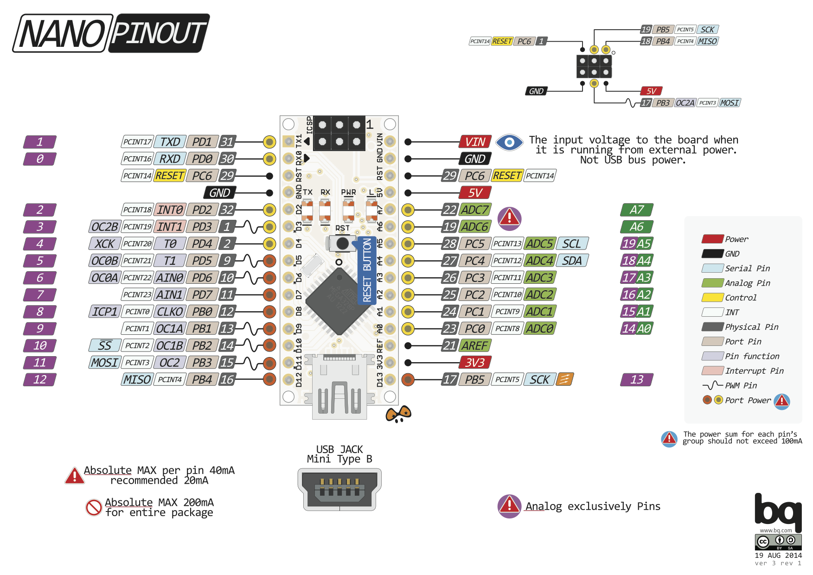
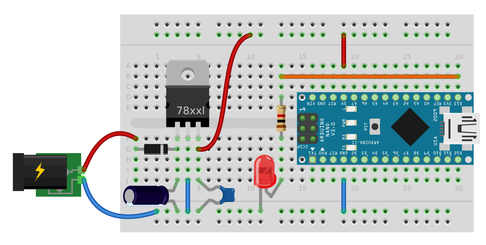
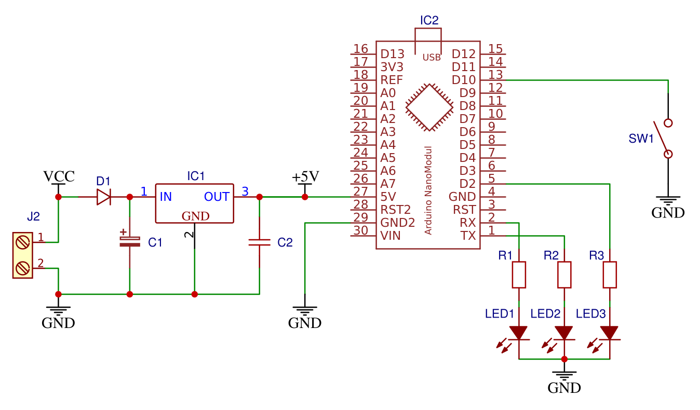
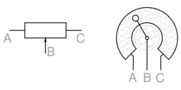
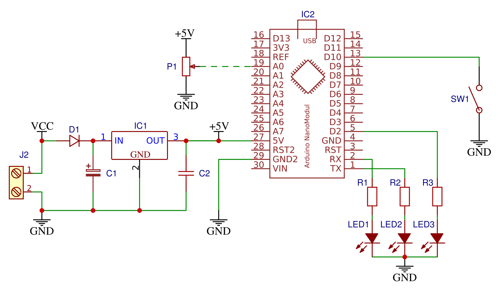

# NAPAJANJE

Vsako električno vezje potrebuje napajanje. Pogosto vezja napajamo z baterijami (prenosne električne naprave) ali pa z uporabo omrežnega napajanja. Za današnje vezje bomo uporabili omrežno napajanje.

## ZAGOTAVLJANJE STABILNE NAPAJALNE NAPETOSTI

S pomočjo 9 V napajalnika in 5 mm napajalnega priključka (J1) dobimo napajalno napetost 9 V. Oba napetostna potenciala (+9 V in 0 V) napajalne napetosti priključimo na testno ploščico in od tam zgradimo vezje, ki bo zagotavljalo 5 V napajanje za naše nadaljnja vezja.  

> ### NALOGA: SESTAVITE VEZJE NA PROTOTIPNI PLOŠČICI  
> Sestavite vezje po shemi [@fig:Schematic_Skritpa_10-napajanje_20200218122122.svg].

{#fig:Schematic_Skritpa_10-napajanje_20200218122122.svg}

V pomoč bomo uporabili program **Fritzing**, s katerim lahko učitelj zelo nazorno pokaže kako moramo povezati elemente med seboj. S pomočjo Fritzing programa dobimo naslednjo skico *realnega* vezja.

{#fig:10-napajanje-fritzing.png}
./01_Napetostni_potencial.pdf
./slike/05-senzor-delilnik-1.png
./09_Referencni_vir_z_zener_diodo.md

## NAPETOSTNI POTENCIAL

> ### NALOGA: IZMERITE NAPETOSTNE POTENCIALE  
> Izmeri napetostne potenciale, ki so vrisani v naslednji shemi [@fig:Schematic_Skritpa_10-napajanje_20200218113659.svg].

| Točka v vezju | Nap. potencial [V] |
|:-------------:|--------------------|
|       A       |                    |
|       B       |                    |
|       C       |                    |
|       D       |                    |
|       E       |                    |
|       F       |                    |

{#fig:Schematic_Skritpa_10-napajanje_20200218113659.svg}

## NAPETOST

V vezju imamo imamo kar nekaj elektronskih elementov. Na shemi [@fig:Schematic_Skritpa_10-napajanje_20200218122122.svg] so različno označeni, npr.:

- polprevodniška dioda - D1,
- elektrolitski kondenzator - C1,
- keramični kondenzator - C2,
- upor - R1,
- svetleča dioda - LED1

> ### NALOGA: IZRAČUNAJTE NAPETOSTI  
> Za vse naštete elemente najprej izračunajte kolikšna napetost je na njih, nato pa izračun preverite z inštumentom.

| Element | $U_{izr}$[V] | $U_{izm}$[V] |
|:-------:|--------------|--------------|
|    D1   |              |              |
|    C1   |              |              |
|    C2   |              |              |
|    R1   |              |              |
|   LED1  |              |              |

# KRMILNIK ARDUINO NANO

Krmilnik Arduino Nano je relativno cenovno ugoden (cca. 3-5€) in ker je programirljiv, ga lahko uporabimo v najrazličnejših aplikacijah. Razporeditev njegovih priključkov pa pa lahko vidimo na naslednji sliki [@fig:20-Arduino-Nano-pinout.png].

{#fig:20-Arduino-Nano-pinout.png}

## TESTNI PROGRAM "BLINK.INO"

Preden bomo krmilnik uporabili v našem vezju, ga bomo preizkusili. S programskim orodjem "Arduino IDE" bomo na krmilnik naložili program "blink.ino" in s tem preverili, da vse komponente na krmilniku delujejo pravilno. To je priporočljivo narediti pred vsakim projektom.

> ### NALOGA: PREIZKUS KRMILNIKA ARDUINO NANO.  
> 1. Krmilnik Arduino Nano povežite z računalnikom preko USB povezave,  
> 2. zaženite program Arduino IDE in ga pravilno nastavite:  
>   - Tools -> Processor  : Arduino Nano,  
>   - Tools -> Port       : USB2  
> 3. Odprite primer 01-BLINK.ino in  
> 4. prenesite program na krmilnik.

Program je napisan v programskem jeziku C++, ki uporablja nekaj funkcij za lažje rokovanje s krmilnikom.

```cpp
void setup() {
  // initialize digital pin LED_BUILTIN as an output.
  pinMode(LED_BUILTIN, OUTPUT);
}

// the loop function runs over and over again forever
void loop() {
  digitalWrite(LED_BUILTIN, HIGH);   // turn the LED on (HIGH is the voltage level)
  delay(1000);                       // wait for a second
  digitalWrite(LED_BUILTIN, LOW);    // turn the LED off by making the voltage LOW
  delay(1000);                       // wait for a second
}
```

## NAPAJANJE KRMILNIKA ARDUINO NANO

Krmilnik Arduino Nano lahko vstavimo tudi v prototipno ploščico in ga napajamo z zunanjim napajanjem.

> ### NALOGA: VEZAVA KRMILNIKA ARDUINO NANO NA PROTOTIPNI PLOŠČICI.  
> Vstavite krmilnik Arduino Nano v prototipno ploščico in ga povežite kot prikazuje naslednja shema.  
> Priključite  tudi upor in LED na priključek `13`.

{#fig:20-Nano-Blink.png}

{#fig:20-Nano-Blink-PB.png}

## MODEL SEMAFORJA

Vezje bomo preoblikovali tako, da bo delovalo kot semafor na cestnem križišču. Uporabili bomo tri LED svetila različnih barv in preoblikovali program.

{#fig:20-Model-semaforja.png}

{#fig:20-model-semaforja-fritzing.png}

> ### NALOGA: MODEL SEMAFORJA.  
> Preoblikujte vezje po shemi [@fig:20-Model-semaforja.png] in uporabite naslednji program ter ga ustrezno preoblikujte. Program, ki zagotavlja podobno delovanje, kot pri cestnem semaforju dokumentirajte in komentirajte uporabljene programske stavke (t.j. programske ukaze).

> Vsak programski stavek morate zaključiti s podpičjem **;**.

Preskustite naslednji program in ga ustrezno preoblikujte.

```cpp
void setup() {
  pinMode(0, OUTPUT);
  pinMode(1, OUTPUT);
  pinMode(2, OUTPUT);
}

void loop() {
  digitalWrite(0, HIGH);
  digitalWrite(1, HIGH);
  digitalWrite(2, HIGH);
  delay(1000);
  digitalWrite(0, LOW);
  digitalWrite(1, LOW);
  digitalWrite(2, LOW);
  delay(1000);
}
```

## ANALIZA VEZJA

Elektronski elementi so omejeni z njihovo največjo dopustno električno moč. Če to električno moč prekoračimo, jih bomo najverjetneje uničili.

> Naprimer: Največja dopustna moč, ki se še lahko troši na uporih, ki jih uporabljate (premer upora = 2.4 mm) je 0,25 W.

Električno moč lahko izračunamo po enačbi:

$$ P = U I $$

Pri nekaterih drugih elementih (kot na primer pri LED) pa so omejitveni pogoji postavljeni že s samim tokom.

> Na primer za običajne 5mm LED je najpogosteje največji tok, ki lahko teče skoznjo 20 mA.

Tok skozi element lahko izračunamo po Ohmovem zakonu:  

$$ I_R = \frac{U_R}{R} $$

> Če ne vemo kolikšno upornost ima element (tako kot je to v primeru LED), si največkrat pomagamo z izračunom toka skozi drug zaporedno vezan element. Kajti v tem primeru je tok isti.

> ### NALOGA: IZRAČUNAJTE ELEKTRIČNI TOK  
> Izračunajte kolikšen električni tok teče skozi elemente R1, R2, R3, LED1, LED2 in LED3 ter preverite kakšne so električne omejitve tega elementa.
> Izračunajte tudi električno moč, ki se troši na tem elementu.

| Element | U [V] | I [mA]| P[W] |
|:-------:|-------|-------|------|
|    R1   |       |       |      |
|    R2   |       |       |      |
|    R3   |       |       |      |
|   LED1  |       |       |      |
|   LED2  |       |       |      |
|   LED3  |       |       |      |

# UPORABA TIPKE

Tipka je element, ki je podoben stikalu. Prav tako kot pri stikalu, ob pritisku povežemo dva priključka med sabo, razlika pa je v tem, da se pri tipki ta povezava razklene ob prenehanju pritiska nanjo.

> ### NALOGA: VEZAVA TIPKE V DELILNIK NAPETOSTI  
> Sestavite vezje s tipko, kot ga prikazuje [@fig:30-Tipka-delilnik.png] (brez črtkane povezave). Tipka naj bo vezana v delilnik napetosti in naj bo priključena proti napajanju.  
> V tabelo vpišite napetosti na vsakemu elementu posebej. Najprej poskušajte predvideti kolikšna je napetost na elementu, nato pa le-to preverite z inštrumentom.

|   Situacija  | Element | $U_{?}$ [V] | $U_{izm}$ [V] |
|:------------:|:-------:|-------------|---------------|
| Razkljenjeno |         |             |               |
|              |  Tipka  |             |               |
|              |   Upor  |             |               |
|   Slenjeno   |         |             |               |
|              |  Tipka  |             |               |
|              |   Upor  |             |               |


{#fig:30-Tipka-delilnik.png}

## PRIKLJUČITEV TIPKE NA DIGITALNI VHOD

Nato srednji priključek delilnika napetosti povežite na digitalni vhod krmilnika Arduino nano na priključek D10, kot prikazuje [@fig:30-Tipka-delilnik.png] črtkana povezava.

> ### NALOGA: PRIKLJUČITEV TIPKE NA DIGITALNI VHOD  
> Priključite tipko po shemi [@fig:30-Tipka-delilnik.png] in preskusite spodnji program.  
> Nato popravite program tako, bo LED svetila, ko boste tipko pritisnili.

```cpp
void setup() {
  pinMode(0, OUTPUT);
  pinMode(1, OUTPUT);
  pinMode(2, OUTPUT);
  pinMode(10, INPUT);
}

void loop() {
  if (digitalRead(10) == LOW){
    digitalWrite(0, HIGH);
  }else{
    digitalWrite(0, LOW);
  }
}
```

> POMNI: DIGITALNI VHOD MIKROKRMILNIKA  
> Priključke mikrokrmilnika lahko uporabimo tudi za odčitavanje napetostnih potencialov v digitalni obliki (ločimo le dva napetostna nivoja). S funkcijo `pinMode(PIN, INPUT);` določimo, da priključek `PIN` lahko opravlja funkcijo digitalnega vhoda s katerim lahko odčitamo vrednost napetostnega potenciala.
> Funkcija `digitalRead(PIN);` vrne vrednost digitalnega vhoda. Če je na priključku `PIN` napetostni potencial večji od 2.0 V bo funkcija vrnila vrednost 1 (ali HIGH ali TRUE). Če pa je na priključku `PIN` napetostni potencial manjši od 0.8 V pa bo funkcija vrnila vrednost 0 (ali LOW ali FALSE).

## PRIKLJUČITEV TIPKE Z UPOROM PROTI NAPAJANJU

Zamenjajte elementa v delilniku napetosti tako, da bo upor vezan proti napajanju in tipka proti napetostnem potencialu 0 V.

> ### NALOGA: UPOR VEZAN PROTI NAPAJANJU  
> Vezje spremenite, kot je opisano v nalogi in narišite shemo vezja.  
> Popravite program tako, da bo LED utripala, ko boste tipko držali.
> Utemeljite zakaj je sedaj napetostni potencial na vhodnem priključku krmilnika D10 enak 5 V, ko tipka ni pritisnjena (Utemeljitev podprite z Ohm-ovim zakonom in Kirchoff-ovima izrekoma).

## UPORABA UPOROV VEZANIH PROTI NAPAJANJU V MIKROKRMILNIKU

Uporaba vezave uporov proti napajanju je zelo pogosta. Zato le to mikrokrmilniki že vsebujejo v samem integriranem vezju na vseh digitalnih vhodih.

> ### NALOGA: UPORABA UPOROV VEZANIH PROTI NAPAJANJU V MIKROKRMILNIKU  
> Odstranite upor iz vezja kakor veleva shema [@fig:30-Tipka-pullup.png] in  
> programsko vključite upor vezan proti napajanju na digitalnem vhodu D10.

{#fig:30-Tipka-pullup.png}
# Uporaba potenciometra

Potenciometri so upori s tremi priključki, ko je prikazano na [@fig:poternciometer.png]. Upornost potenciometra je fiksna in jo merimo med priključkoma A in C. Tretji priključek pa je nastavljiv in drsi po uporovni plati od ene skrajne lege do druge skrajne lege potenciometra.

{#fig:poternciometer.png}

Delovanje potenciometra si lahko razložimo na dva načina:

1. Če na priključka A in C priključimo neko napetost, se bo napetostni potencial enakomerno zmanjševal vzdolž uporovne plasti potenciometra. Tako je napetostni potencial na priključku B odvisen od njegove lege.
2. Lahko si zamislimo, da priključek B razdeli potenciometer na dva upora: (1) $R_{AB}$ in (2) $R_{BC}$. Tako se bo tudi napetost, ki jo bomo priključili na potenciometer razdelila v razmerju teh dveh upornosti.

> ### NALOGA: MERJENJE NAPETOSTNEGA POTENCIALA NA POTENCIOMETRU.  
> Priključite potenciometer tako, kot je  prikazano na [@fig:35-potenciometer.png]. Na srednji priključek potenciomtra prikljčite V-meter. Preverite kako se napetostni potencila spreminja v pdvisnosti od položaja srednjega priključka potenciomtra.

## Uporaba analognega vhoda na krmilniku

Na krmilniku imamo možnost odčitavanja napetostnega potenciala v analogni obliki z analognimi vhodi. Vsi analogni vhodi so na krmilniku označeni s črko "A" in zaporedno številko npr.: A0, A1 .. A7.

{#fig:35-potenciometer.png}

> ### NALOGA: ODČITAVANJE NAPETOSTNEGA POTENCIALA S KRMILNIKOM  
> Povežite srednji priključek potenciomtra na analogni vhod krmilnika (naprimer na A0) in preizkusite naslednji program. Program lahko najdete tudi v Arduino IDE programu:  
> File -> Examples -> 01. Basics -> AnalogReadSerial.


```cpp
void setup() {
  Serial.begin(9600);
}

void loop() {
  int sensorValue = analogRead(A0);
  Serial.println(sensorValue);
  delay(10);
}
```

Kot ste verjetno opazili, se vam na ekranu v serijskem oknu izpisujejo številske vrednosti. Te vrednostiso v območju od 0..1023, saj je ADC v mikrokrmilniku 10-bitni in je največja možna binarna številka zapisana z 10-imi biti prav 1023. Lahko pa te vrednosti prikazujete tudi grafično, v ta namen morate uporabiti `Serial Plotter`.

Krmilnik pa bi lahko na ta način (do neke mere) uporabljali tudi kot V-meter.

> ### NALOGA: PRETVORBA ADC VREDNOSTI V NAPETOST  
> Z ustrezno linearno funkcijo pretvorite ADC vrednosti v številske vrednosti napetosti. Enačbo funkcije tudi zapišite in priložite kodo programa.

Prav tako enostavno pa lahko poskrbimo za grafični prikaz napetosti...

> ### NALOGA: VU-METER  
> Program preoblikujte tako, da ko boste s potenciometrom nastavili večjo napetost,naj se vključi vač LED. Podobno kot je to na VU-metru na glasbenih stolpih. Kodo programa tudi priložite.


# NELINEARNI UPORI IN SENZORJI
 
Senzor je elektronski element, katerega izhodna električna količina (izhodni signal) je odvisna od neke fizikalne količine (temperature, osvetljenisti ...). V našem primeru bomo sestavili senzor temperature. V delilnik napetosti bomo vezali termistor in upor s konstantno upornostjo, kot prikazuje [@fig:05-senzor-delilnik.png].

{#fig:05-senzor-delilnik.png}

> ### NALOGA: SENZOR TEMPERATURE - vezje [vezje].
> Sestavite obe vezji iz [@fig:05-senzor-delilnik.png] in preverite kako se izhodna napetost spreminja glede na temperaturo. Ugotovitev zapišite za oba primera.

Premislimo, kako lahko razumemo delovanje senzorja na [@fig:05-senzor-delilnik.png]:  

1. Če se temperatura poveča, se bo upornost termistorja $R_{NTC}$ zmanjšala.
2. Ker se skupna upornost $R'=R_{NTC}+R_1$ zmanjša, bo tok, ki teče po tem vezju večji $I'=\frac{V_{CC}}{R'}$.
3. Ker je sedaj tok skozi vezje večji in le-ta teče tudi skozi upor $R_1$ bo na njem napetost večja $U_{R_1}=R_1I'$.
4. Napetost na uporu $R_1$ je enaka napetostnemu potencialu na izhodnemu priključku senzorja.
5. Zaključimo lahko, da se napetostni potencial na izhodnem priključku poveča, če se je tudi temperatura povečala.

> ### NALOGA: SENZOR TEMPERATURE - delovanje  
> Sledite točkam razmišljanja od 1 - 5 in zapišite konkretne vrednosti električnih količin iz vašega vezja.  

| fiz. količina | pri nižji temp. | pri višji temperaturi |
|:-------------:|-----------------|-----------------------|
|  temperatura  |                 |                       |
|   $R_{NTC}$   |                 |                       |
|      $I'$     |                 |                       |
|   $U_{R_1}$   |                 |                       |
|  $U_{IZHOD}$  |                 |                       |

## IZBIRA REFERENČNEGA UPORA

Odzivnost senzorja (t.j. sprememba izhodnega napetostnega potenciala ob dani spremembi temperature) je zelo odvisna od prave izbire upora $R_1$ iz [@fig:05-senzor-delilnik.png] - desno. Temu uporu rečemo tudi **referenčni upor**.

> ### NALOGA: DOLOČITEV REFERENČNEGA UPORA  
> Za različne referenčne upore preverite odziv senzorja. Pri izpeljavi meritev bodite pozorni, da boste temperaturo spremenili vedno v istem območju, npr. vedno iz temperature 10°C na 40°C. Referenčni upori naj bodo v dekadnem razmerju.

| $R_{Ref}[\Omega]$ | $T_1 [^\circ C]$ | $T_2[C]$ | $U_{IZH}(T_1)[V]$ | $U_{IZH}(T_2)[V]$ | $\Delta U[V]$ |
|:-----------------:|----------------|----------|-------------------|-------------------|---------------|
|        100        |                |          |                   |                   |               |
|         1k        |                |          |                   |                   |               |
|        10k        |                |          |                   |                   |               |
|        100k       |                |          |                   |                   |               |
|         1M        |                |          |                   |                   |               |

