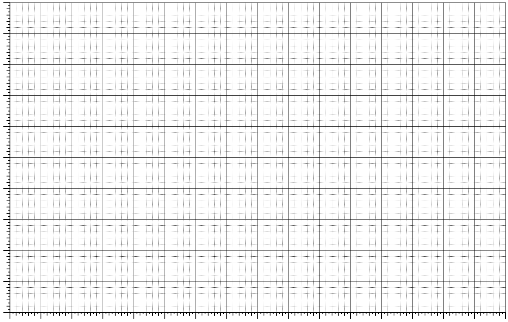

# Ohmov zakon

Osnovni princip premikanja elektronov v električnih vezjih je opredeljen z Ohmovim zakonom, ki ga zelo enostavno zapišemo z [@eq:ohms_law]:

$$ I = \frac{U}{R} $${#eq:ohms_law}

> ### NALOGA: OHMOV ZAKON - MERITVE
> Kljub enostavnosti enačbe [@eq:ohms_law] imajo učenci/dijaki/študentje precej težav s samo uporabo enačbe. Saj se količine kot so tok, napetost in upornost v elektrotehniki znajdejo prav povsod po vezju in je potrebno dobro razumevanje področja, za uporabo dotičnih vrednosti.

> Sestavite poljubno vezje, v katerega boste vključili:
>
> - napetostni vir, ki mu lahko nastavljamo izhodno napetost,
> - 3 ali več uporov različnih upornosti ( $R_{1..4}= 100 \Omega .. 10 k\Omega$),
> 
> Na to za vse te upore izmerite: napetost na uporu in tok, ki teče skozi upor pri vsaj petih različnih napajalnih napetostih. Izpolnite tudi [@tbl:Tohms_law].

| upor |          | $R_1$     |       |          | $R_2$     |       |          | $R_3$     |       |
|:----:|---------:|-----------|:------|---------:|-----------|:------|---------:|-----------|-------|
|      | $U_R[V]$ | $I_R[mA]$ | $R_R$ | $U_R[V]$ | $I_R[mA]$ | $R_R$ | $U_R[V]$ | $I_R[mA]$ | $R_R$ |
|      |          |           |       |          |           |       |          |           |       |
|      |          |           |       |          |           |       |          |           |       |
|      |          |           |       |          |           |       |          |           |       |
|      |          |           |       |          |           |       |          |           |       |
|      |          |           |       |          |           |       |          |           |       |

Table: Relacija električnega toka in napetosti na uporu. {#tbl:Tohms_law}

> ### NALOGA: I(U) KARAKTERISTIKA LINEARNEGA UPORA  
> Na isti grafi narišite vse tri I(U) karakteristike uporov.

{#fig:u-i-R}
