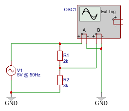

# NAPETOSTNI VIRI

Inštrumenti pa niso edine naprave, pri katerih moramo biti pozorni na njihove notranje upornosti.
Medtem, ko pri merilnih inštrumentih izpostavljamo njihovo vhodna notranja upornost, tako nas pri
baterijah ali drugih napetostnih virih zanima njihova izhodna notranja upornost.

Zaradi izhodne notranje upornosti (ki bi morala biti nič, pa ni) nek vir napetosti ne more zagotavljati
neskončnega velikega toka prav zaradi svoje lastne notranje upornosti. Na primer notranja upornost avtomobilskih akumulatorjev je le nekaj $m\Omega$, medtem ko je notranja upornost baterijskih vložkov okoli $R_B=0.5 \Omega$. Tako je kratkostični tok pri akumulatorjih lahko tudi do $I_{MAX} = 500 A$ ali več, medtem ko s polnilnimi vložki dosegamo tokove okoli 20A.

Naj na tem mestu omenimo še eno zanimivost, ki se je pripetila podjetju Sony, ki je leta 2006 poslal na
trg prenosne računalnike z Li-ionskimi baterijami, na katerih je bilo nekaj kovinskih ostružkov. Ti so
povzročili kratek stik in baterija se je začela prazniti z velikim tokom. Ker se na vsakem uporu skozi
katerega teče tok sprošča toplota (in z notranjem uporom ni nič drugače), se je baterija začela tako
segrevati, da je celo eksplodirala.

## Notranja upornost vira napetosti

S poskusi lahko opazimo, da realni napetostni viri ne zagotavljajo konstantne napetostni na njihovih priključkih. Na primer, če na baterijo prikličimo porabnik z manjšo upornostjo, lahko ugotovimo, da se napetost na priključkih baterije nekoliko zmanjša. Raziščimo zakaj.

> ### NALOGA: Notranja upornost baterije  
> Ker je notranja uporanos predvsem posledica same konstrukcije baterije, samega notranjega upora ne moremo neposredno izmeriti. 
>
> {#fig:r_not_bat}
>
> Lahko pa ga izmerimo posredno tako, da opazujemo spremembo napetosti na priključkih napetostnega vira ob različnih tokovih:
>
> 1. Izmeri napetost neobremenjene baterije $U_{B_0}$.  
> 2. Nato baterijo obremenite z manjšim uporom ( npr.: $R_1=10\Omega$ )in ponovno izmerite napetost $U_B = U_{R_1}$.
> 3. Narišite simbolno električno shemo poskusa in izračunajte notranjo upornost baterije $R_B$.

## Izmenični napetostni viri

Kadar se izhodna napetost vira spreminja tako, da se smer toka v vezju spremeni, govorimo o izmeničnem napetostnem viru. Večinoma bomo govorili o taki izmenični napetosti, katere amplituda se s časom spreminja po enačbi: $U(t) = \hat U \sin(\omega t)$.

> ### NALOGA: Časovni potek izmenične napetosti  
> 1. Sestavite poljubno vezje s:
>
> - poljubnim izmeničnim virom in
> - dvema zaporedno vezanima uporoma.
>
> 2. Na vir priključite osciloskop in izmerite časovni potek napetosti. Graf $U(t)$ tudi ustrezno narišite in odčitajte naslednje parametre :
>  
> - Amplitudno napetost $\hat U_G =$
> - čas periode $t_0 =$
> - frekvenco izhodne napetosti $f_G =$
> - krožilno frekvenco nap. $\omega_G =$
>
> 3. Iz izmerjenih podatkov in grafa U(t) narišite kazalčni diagram, ki prikazuje pogoje pri $t = 0,15s$.

> ### NALOGA: AMPLITUDNA IN EFEKTIVNA NAPETOST  
> 1. Na vir priključite V-meter in izmerite efektivno napetost vira. Utemeljite zakaj se efektivna in amplitudna napetost izmeničnega vira razlikujeta.
>
> 2. Z V-metrom preverite veljavnost 2. Kirchhoffovega izreka.

Izdredno pazljivi pa moramo biti pri meritvah napetostnih potencialov z osciloskopom.

{#fig:osc_meritve}

> ### NALOGA: Merjenje napetostnih potencialov in napetosti z osciloskopom.
> Z osciloskopom izmerite:
>
> - Amplitudo vira napetost (=napetostni potencial) $U_G =$
> - Amplitudo napetosti (=napetostni potencial) na $R_2$ in
> - Amplitudo napetosti (= napetost) na $R_1$.
