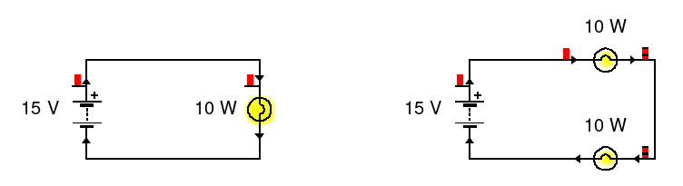
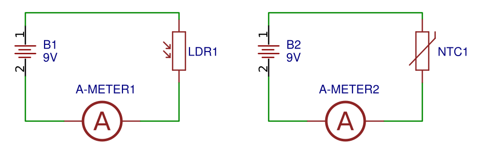
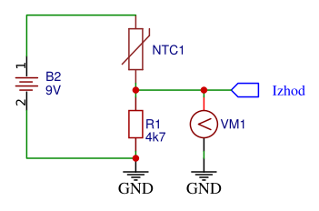

# NELINEARNI UPORI IN SENZORJI

Med nelinearne upore sodijo upori, katerih $I(U)$ karakteristika ni linearna. Tipičen tak primer lahko opazimo pri žarnici. Ker se žarilna nitka zelo segreje in atomi kovinske rešetke bistveno bolj vibrirajo, s tem tudi bolj onemogočajo prehajanje elektronov skozi to žarilno nitko. Tako ne moremo potrditi linearne odvisnosti električnega toka pri vezavi na [@fig:el_tok_zarnica_zaporedno].

{#fig:el_tok_zarnica_zaporedno}

> ### NALOGA: ELEKTRIČNI TOK SKOZI ŽARNICO PRI ZAP. VEZAVI
> Sestavi vezje po [@fig:el_tok_zarnica_zaporedno] in izmerite:  
>
> 1. napetosti na žarnicah ter,
> 2. tokove skozi žarnice.
>
> Kako se rezultati razlikujejo od pričakovanj, če bi bila žarnica linearen upor. Utemeljite z zakoni in izreki, ter se navežite na (ne-)linearnost upornosti.

Pri teh uporih moramo izredno pazljivo uporabljati Ohmov zakon. Le-ta še vedno velja, vendar se moramo zavedati, da se upornost nelinearnih elementov lahko ob nekih pogojih spremeni in tako vpliva tudi na nelinearno I(U) karakteristiko.

> ### NALOGA: I(U) KARAKTERISTIKA ŽARNICE  
>
> 1. Izmerite I(U) karakteristiko žarnice in podatke uredite v tabeli.
> 2. Graf I(U) karakteristike tudi narišite.

## FOTOUPO in RTERMISTOR

Med nelinearne upore sodijo tudi upori, katerih upornost se spreminja v odvisnosti od neke fizikalne količine. Tako poznamo tudi upore, katerih upornost se spreminja v odvisnosti od:  

- osvetljenosti (npr.: fotoupor),
- temperature (termistorji).

> ### NALOGA: FOTOUPOR  
> Sestavite vezje, ki ga prikazuje [@fig:05-LDR-NTC.png] - levo. Nato spreminjajte osvetljenost elementa in opazujte kako se spreminja električni tok skozi element. Ugotovitev tudi napišite.
>
> Nato na podlagi teh ugotovitev utemeljite kako se spreminja upornost elementa glede na njegovo osvetljenost (osvetljenost -> el. tok -> upornost).

{#fig:05-LDR-NTC.png}

> ### NALOGA: TERMISTOR  
> Sestavite vezje, ki ga prikazuje [@fig:05-LDR-NTC.png] - desno. Nato spreminjajte temperaturo elementa in opazujte kako se spreminja električni tok skozi element. Ugotovitev tudi napišite.
>
> Nato na podlagi teh ugotovitev utemeljite kako se spreminja upornost elementa glede na njegovo temperaturo (temperatura -> el. tok -> upornost).

## Umeritev senzorja

Senzor je elektronski element, katerega izhodna električna količina je odvisna od neke fizikalne količine. V našem primeru bomo sestavili senzor temperature. V delilnik napetosti bomo vezali termistor in upor s konstantno upornostjo, kot prikazuje [@fig:05-Temp-sen.png].

{#fig:05-Temp-sen.png}

Premislimo, kako lahko razumemo delovanje senzorja:  

1. Če se temperatura poveča, se bo upornost termistorja $R_{NTC}$ zmanjšala.
2. Ker se skupna upornost $R'=R_{NTC}+R_1$ zmanjša, bo tok, ki teče po tem vezju večji $I'=\frac{U_B}{R'}$.
3. Ker je sedaj tok skozi vezje večji in le-ta teče tudi skozi upor $R_1$ bo na njem napetost večja $U_{R_1}=R_1I'$.
4. Prav to napetost pa tudi merimo z volt-metrom $V_{M1}$.
5. Zaključimo lahko, da se napetostni potencial na izhodnem priključku poveča, če se je tudi temperatura povečala.

> ### NALOGA: UMERITEV SENZORJA TEMPERATURE  
> Sestavite senzor temperature, kot je predstavljen na [@fig:05-Temp-sen.png]. Spreminjajte temperaturo termistorja in beležite izhodno napetost. Meritve uredite tudi v tabeli. Nato iz dobljenih meritev lahko narišete graf $U_{izh}(T)$.
>
> Za tem iz dobljenih meritev izračunajte še upornost $R_{NTC}$ za vsako izmerjeno situacijo in narišite graf $R_{NTC}(T)$.
