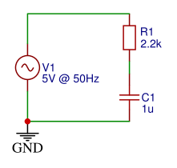
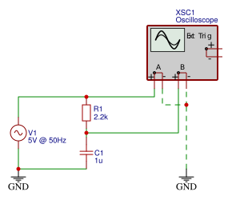
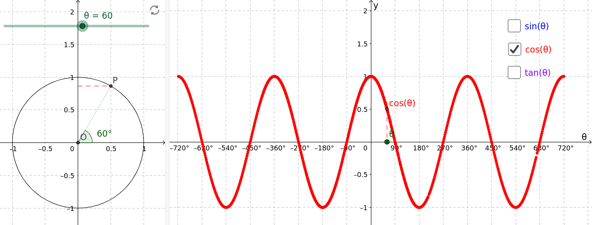

# KONDENZATOR V IZMENIČNIH TOKOKROGIH

Sestavite vezje, ki je predstavljeno na [@fig:06-AC-R-C.png]. Na levi strni imamo vir napetosti amplitude $\hat{U} = 5 V$ in nanj smo zaporedno priključili upor $R = 2,2 k\Omega$ in kondenzator $C_1 = 1 \mu F$. Preverite napetosti na posameznih elementih.

{#fig:06-AC-R-C.png}

> ### NALOGA: NAPETOSTI V IZMENIČNIH TOKOKROGIH  
> Sestavite vezje na [@fig:06-AC-R-C.png] in z V-metrom izmerite napetosti na elementih in jih vpišite v tabelo. V shemo vključite tudi priključitev vseh treh V-metrov.

| element | $\Tilde{U} [V]$ |
|:-------:|-----------------|
|    V1   |                 |
|    R1   |                 |
|    C1   |                 |
Table: Izmerjene efektivne vrednosti napetosti na elementih v izmeničnem tokokrogu. {#tbl:u-efektivna}

> ### NALOGA: PREVERITE 2. KIRCHHOFFOV IZREK  
> Kaj lahko ugotovite glede 2. Kirchhoffovega izreka. Ugotovitve zapišite.

Če želimo prikazati časovno odvisnost napetostnega potenciala ($U(t)$) lahko uporabimo merilni inštrument, ki ga imenujemo osciloskop. Priključiti ga moramo tako, kot to prikazuje [@fig:06-OSC.png].

{#fig:06-OSC.png}

> ### NALOGA: ČASOVNI POTEK NAPETOSTI (osciloskop)  
> V vezje priključite osciloskop, kot kaže [@fig:06-OSC.png].  
> Nato pravilno nastavite osciloskop (na ekranu naj bo vidna le ena perioda) in odčitajte ter prerišite vse tri poteke napetosti:  
> 1. Časovni potek napetostnega potenciala, ki ga generira vir napetosti (A).  
> 2. Časovni potek napetosti na kondenzatorju (B).  
> 3. Napetost na uporu, ki jo lahko prikažemo z matematično funkcijo A-B.  

> ### NALOGA: ČASOVNI POTEK NAPETOSTI (simulacija)  
> Na isti graf U(t) prikazujte:  
> 1. Časovni potek napetosti vira,  
> 2. časovni potek napetosti na kondenzatorju in  
> 3. časovni potek napetosti na uporu.  
> Na graf lahko dodate več krivulj tako, da:  
> označite graf -> desni klik -> Properties... -> Traces -> []Show trace X  
> Graf naj bo velik, pregleden in na njem naj bo le ena perioda.

{#fig:chart-oscilloscope.png}

> ### NALOGA: KARAKTERISTIČNE VREDNOSTI IZMENIČNE NAPATOSTI  
> Iz predhodno izmerjenega grafa odčitajte naslednje količine in jih vpišite v tabelo. Kjer je:  
> - $\hat{U}$ - amplitudna napetost - največji odmik krivulje od srednje vrednosti in  
> - $t_{\hat{U}}$ - čas, pri katerem se pojavi amplitudna napetost.  
> - $\varphi$ - fazni premik med napetostmi, pri čemer smo za orientacijo vzeli napetost na uporu.[^1]  
> - $U_{t=konst.}$ - napetost na elementu ob istem trenutku za vse tri krivulje. Na primer napetost na elementu pri času $t=15ms$.

[^1]: Glej naslednji naslov - FAZNI PREMIK. Fazni premik izračunamo tako, da najprej odčitamo časovno razliko med dvema začetnima točkama dveh krivulj. Tako dobimo $\Delta t$. Nato moramo odčitati še čas dolžine periode ($t_0$), ki je v našem primeru $t_0=20ms$. To je čas, po katerem se fizikalni pojav ponavlja. Če ta čas predstavlja $360^{\circ}$, potem je $\Delta t$ iskani fazni premik $\varphi$.

| element | $\hat{U} [V]$ | $t_{\hat{U}} [ms]$ | $\varphi[^{\circ}]$ | $U_{t=konst.}[V]$ |
|:-------:|---------------|--------------------|:-------------------:|-------------------|
|    V1   |               |                    |                     |                   |
|    R1   |               |                    |         0.0         |                   |
|    C1   |               |                    |                     |                   |
Table: Izmerjene karakteristične vrednosti časovnega poteka napetosti. {#tbl:u-t-AC}

## Fazni zamik količin v izmeničnih tokokrogih

Za boljšo predstavitev kako lahko razložimo uporabo kazalčnega diagrama (ali faznega diagrama) si odprite primer razlage kosinusne krivulje na enotski krožnici ([povezava]( https://www.geogebra.org/m/cNEtsbvC ) https://www.geogebra.org/m/cNEtsbvC), ki je prikazan na [@fig:kazalcni-cosinus.png]...

{#fig:kazalcni-cosinus.png}

... in sledite naslednjim razmislekom:

1. Zamislite si, da graf na desni strani predstavlja časovni potek napetosti $U(t)$. Enote na $x\ osi$ bi morali zamenjati s časovnimi enotami tako, da bi na mesto $360^{\circ}$ postavili čas ene periode $t_0=20ms$. Enote na $y\ osi$ pa z napetostjo, kjer bi 1 predstavljala največjo napetost = amplitudno napetost $\hat{U}$.
2. Ta graf na desni strani [@fig:kazalcni-cosinus.png] prikazuje "realne" izmerjene podatke, bodisi z osciloskopom ali pa kot ste jih dobili v grafu v simulaciji.
3. Graf na levi strani [@fig:kazalcni-cosinus.png] pa prikazuje namišljen matematični prostor, ki nam služi za izračunavanje napetosti in tokov v izmeničnih tokokrogih. Ta prostor je sestavljen iz $Re$ - realne x osi in $Im$ - imaginarne y osi. Le vrednosti na $Re$ osi (rdeča črtkana črta) se odrazijo v realnem svetu in jih je mogoče izmeriti.
4. V ta prostor vstavimo vektor (kazalec) amplitude napetosti $\vec{\hat{U}}$ in predstavljajte si, da se le-ta vrti v matematični smeri po tem prostoru (kot v animaciji). Ta vektor opravi celoten obhod v času ene periode, kar je v našem primeru $t_0=20ms$, nato se pojav ponavlja.
5. Torej, na nek način celotnih $\varphi_0=360^{\circ}$ v tem namišljenem prostoru - predstavlja $t_0=20ms$ v realnem svetu.
6. In prav tako vsakršna poljubna realna časovna razlika $\Delta t$ ustreza faznemu zamiku $\Delta \varphi$ v kazalčnem diagramu.

> ### NALOGA: KAZALČNI DIAGRAM  
> Najprej preverite 2. Kirchhoffov izrek, vendar vzemite meritve vseh treh napetosti ob istem času iz [@tbl:u-t-AC ]. Kaj ugotovite? Ugotovitev utemeljite v navezavi z meritvami iz [@tbl:u-efektivna ].  
> V kazalčni diagram vrišite vse tri vektorje amplitudnih napetosti ($\vec{U_{V_1}}, \vec{U_{R_1}} in\ \vec{U_{C_1}}$) in preverite veljavnost 2. Kirchhoffovega izreka še v tej vektorski obliki. Ugotovitev zapišite.

