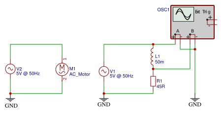
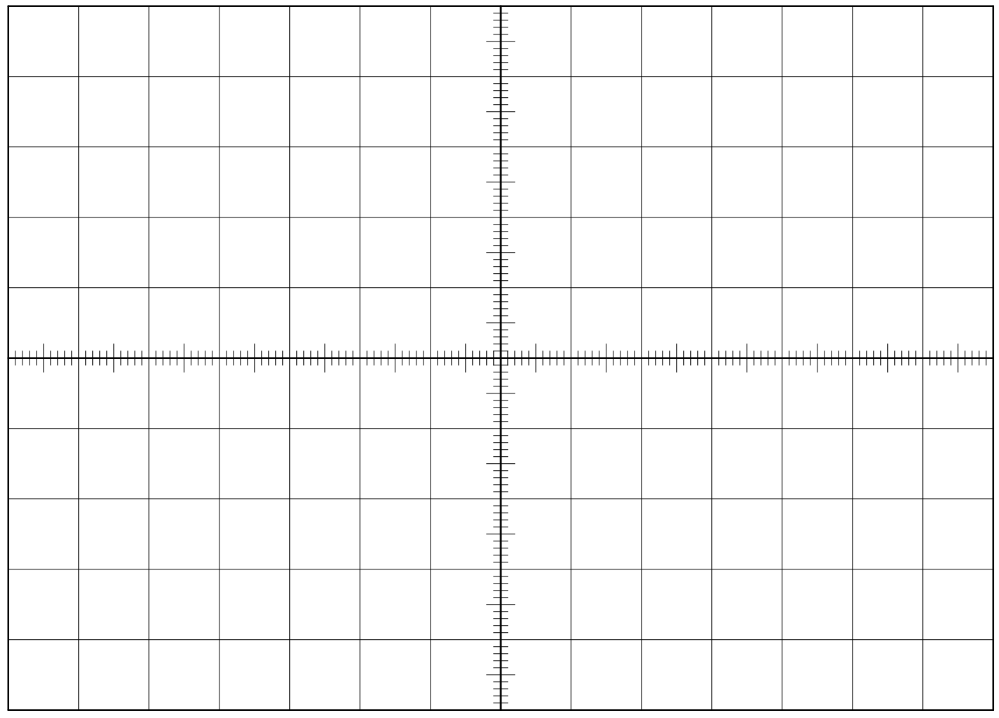

# TOK IN NAPETOST V IZMENIČNIH TOKOKROGIH Z INDUKTIVNIM BREMENOM

Večina porabnikov električne energije, priključenih na električno omrežje, ima ohmski ali ohmsko induktivni značaj, zato ima električno omrežje kot celota, ki je priključena na elektrarno, ohmsko induktivni značaj.

Poglejmo si primer, če bi na izmenično napetost priključili neko induktivno breme, lahko si predstavljamo, da je to motor, kot ga prikazuje [@fig:08-I-U-AC-tuljava.png]-levo. Le-tega lahko prikažemo z nadomestno shemo zaporedne vezave induktivnega in omskega bremena – tuljava predstalje navitje motorja, upor pa omsko upornost žic tega navitja [@fig:08-I-U-AC-tuljava.png].

{#fig:08-I-U-AC-tuljava.png}

> ### NALOGA: NAPETOST V IZMENIČNEM TOKOKROGU Z INDUKTIVNIM BREMENOM  
> Sestavite vezje na [@fig:08-I-U-AC-tuljava.png]-desno in v graf na [@fig:Ut_Ur_Uv_time] vrišite potek napetosti gonilnega vira ($U_G(t) \rightarrow CH_A$), napetost ($U_{R_1}(t) \rightarrow CH_B$) in razliko teh dveh napetosti, ki nam poda napetost na tuljavi ($U_T(t) \rightarrow CH_A - CH_B$ ) na tuljavi. 

{#fig:Ut_Ur_Uv_time}

> ### NALOGA: TOK V IZMENIČNEM TOKOKROGU Z INDUKTIVNIM BREMENOM  
> Na grafu [@fig:Ut_Ur_Uv_time] označite katera od krivulj lahko predstavlja tudi tok, ki teče skozi to vezje ($I(t)$) in na desno stran grafa dorišite novo skalo za tok, ki jo prilagodite tej krivulji.

## NAVIDEZNA, DELOVNA IN JALOVA MOČ

Če na elementu izmerimo efektivne vrednosti toka in napetosti, lahko izračunamo navidezno električno moč tega elementa po [@eq:navidezna_moc]:  

$$ P_n=\widetilde{U_{ef}} \widetilde{I_{ef}} $${#eq:navidezna_moc}

> ### NALOGA: NAVIDEZNA MOČ  
> Za tokokrog na [@fig:08-I-U-AC-tuljava.png] izmerite efektivne vrednosti toka in napetosti za vsak element v vezju. Vrednosti izmerite z Volt- in Ampere-metrom z nastavitvijo za izmenične vrednosti (RMS). Izpolnite [@tbl:U_I_efektivni] za $\widetilde{U_{ef}}$, $\widetilde{I_{ef}}$ in $P_n[mW]$.

| element | $\widetilde{U_{ef}}[V]$ | $\widetilde{I_{ef}}[mA]$ | $P_n[mW]$ | $\Delta t$ | $\Delta \varphi$ | $P_d$ | $P_j$ |
|:-------:|:-----------------------:|:------------------------:|:---------:|:----------:|:----------------:|:-----:|-------|
|  $U_1$  |                         |                          |           |            |                  |       |       |
|  $L_1$  |                         |                          |           |            |                  |       |       |
|  $R_1$  |                         |                          |           |            |                  |       |       |
Table: Efektivne vrednosti in navidezna moč elementov. {#tbl:U_I_efektivni}

Vendar, ker tok in napetost nista fazno usklajena v izmeničnih tokokrogih z induktivnim značajem, je povprečna moč na nekaterih elementih manjša (moč vira in moč na tuljavi). Tej moči pravimo delovna moč in jo lahko ozračunamo po [@eq:delovna_moc], kjer upoštevamo fazni zamik med napetostjo in tokom $\varphi$:

$$ P_d=P_n \cos(\Delta \varphi) $${#eq:delovna_moc}

> ### NALOGA: DELOVNA MOČ  
> Iz [@fig:Ut_Ur_Uv_time] odčitajte tudi časovne razlike med zamiki napetosti in tokom za vsak element in meritev vpišite v [@tbl:U_I_efektivni]. Glede na ta podatek, izračunajte tudi fazni zamik $\Delta \varphi$ in po [@eq:delovna_moc] izračunajte tudi $P_d$.

## JALOVA MOČ

Kot lahko opazite, se delovna in navidezna moč na tuljavi (in tudi na viru) razlikujeta. Razliko imenujemo jalova moč in jo lahko izračunamo kot vektorsko razliko $\Vec{P_n}-\Vec{P_d}$. Kot med tema dvema vektorjema pa je enak faznemu premiku med napetostjo in tokom $\Delta \varphi$ ali z enačbo [@eq:jalova_moc].

$$ P_j=P_n \sin(\Delta \varphi) $${#eq:jalova_moc}

> ### NALOGA: JALOVA MOČ
> Izračunajte kolikšno jalovo moč lahko pričakujemo na posameznih elementih iz [@fig:08-I-U-AC-tuljava.png] in jo vpišite v [@tbl:U_I_efektivni].

Čeprav vir napetosti v povprečju deluje le z delovno močjo $P_d$ se po vodnikih pretaka tudi jalova energija  in jo vir napetosti v nekem trenutku zagotavlja v drugem pa prejema. Ker v praksi tako "pretakanje" jalove energije povzroča precej izgub na distribucijskem omrežju, je zaželeno, da jalovo moč kompenziramo.

Ker v praksi povzročajo jalovo moč predvsem motorji, ki jih uporabljamo v gospodinjstvu in industriji, imamo opravka predvsem z jalovo močjo, ki jo povzročajo induktivna bremena. Tako kompenzacijo izvedemo tako, da vzporedno k induktivnemu bremenu vežemo kondenzator, ki bo kompenziral to jalovo moč.

Jalovo moč, ki jo lahko s kondenzatorjem kompenziramo, lahko izračunamo po [@eq:jalova_moc_kondenzator]:  
$$ Q_C = \frac{\widetilde{U_C}^2}{X_C} = \widetilde{U_C}^2\ \omega C $${#eq:jalova_moc_kondenzator}

<!--
^U1 = 5V @ 50 Hz
~U1 = 3.54 V
L = 50 mH
R = 10 Ohmov

I_v = 264 mA
Ief = 178 mA

fi = 59.4°

Pn = U*I = 5V * 264 mA /2 = 0.66 W
Pd = Pn * cos fi = 0.34 W
Pj = Pn * sin fi = 0.57 W => Qc

Qc = ~U² 2 Pi fr C 
C = 145 uF

QL = ~I² * wL = 0.54 W -> OK :)
-->

> ### NALOGA: KOMPENZACIJA JALOVE MOČI
> Izračunajte primeren kondenzator $C_K$ za kompenzacijo jalove moči v vašem vezju.  
> Še naprej z osciloskopom opazujte električne napetosti v tokokrogu na [@fig:08-I-U-AC-tuljava.png] in hkrati merite tok skozi vir napetosti.  
> Nato vzporedno k viru vežite kondenzator za kompenzacijo jalove moči $C_K$ in opazujte:  
> - Ali se je tok skozi vir spremenil, ča da, kako?  
> - Ali so se razmere v tokokrogu $U_G - L_1 - R_1$ kaj spremenile, če da, kako?
