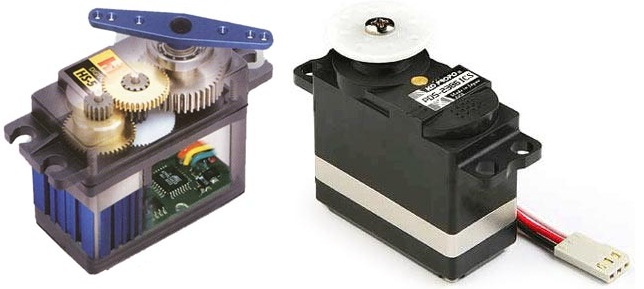
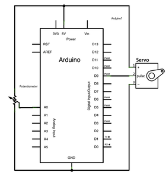

# KRMILJENJE SERVO-MOTORJEV

Servo-motorji se večinoma uporabljajo v modelarstvu, predvsem pri radijsko vodenih modelih, kjer se uporabljajo za zagotavljanje lege različnih mehanskih komponent, kot so krmilo avtomobila, lopute na letalu, ali krmilo čolna.



Servomotor, ki ga vidimo na sliki \ref{servo} je sestavljen iz enosmernega motorja, katerega gred je povezana z zobniškim prenosom (reduktorjem) na končno gred servomotorja. Zobniki so vzporedno povezani še s potenciometrom, ki služi kot povratna informacija o orientaciji gredi. Za pravilo delovaje pa skrbi preprosta elektronika, ki je tudi sestavni del servomotorja.

Servomotor priključimo s tremi žicami. Dve sta potrebni za napajanje, ena pa je namenjena krmilnemu signalu. Le-ta je pulzno-širinsko moduliran, kar pomeni, da je informacija o kotu, predstavljena s dolžino pulza logične enice tega signala. Naprimer veljalo naj bi, da če je pulz logične enice dolg $1.5 ms$, naj bi se gred servomotorja nahajala v *nevtralni* poziciji $0°$; pri dolžini pulza $1.25 ms$ bi se gred obrnila na $-90°$, ko pa je dolžina enice $1.75 ms$ pa na $+90°$. Tak pulz logične enice pa mora motor dobiti na vsaj vsakih $20 ms$, lahko pa tudi nekoliko bolj pogosto. Napajalne napetosti se gibljejo nekje med $4$ in $7.5 V$, seveda je tudi ta podatek različen od motorja do motorja.

## Preskušanje delovanja servo-motorja

Servomotor bomo krmilili z Arduino [@ArduinoH64:online] krmilnikom. Program zanj bomo napisali v programskem okolju ArduinoIDE [@ArduinoS90:online]. Še prej pa ga moramo pravilno povezati na krmilnik. To storimo tako, kot prikazuje slika \ref{shemaServo} [@ArduinoK48:online].



Na sliki vidimo \ref{shemaServo}, da je priključen tudi potenciometer, ki nam bo zagotavljal napetostni signal, na podlagi katerega bo krmilnik zagotavljal primeren signal za servo-motor.

> ### NALOGA: PROGRAMSKO KRMILJENJE SERVO-MOTORJA  
> V programskem okolju ArduinoIDE naložite naslednji program in ga preskusite:

```cpp
#include <Servo.h>
Servo myservo
int potpin = 0
int val

void setup() {
  myservo.attach(9)
}

void loop() {
  val = analogRead(potpin)
  val = map(val, 0, 1023, 0, 180)
  myservo.write(val)
  delay(15)
}
```
> ### NALOGA - KRMILENJE SERVOMOTORJA  
> Preskusite program tako, da premikate srednji priključek potenciometra in spremljajte odziv servo-motorja. Nato z osciloskopom posnemite oba signala (na potenciometru in signal za krmiljenje servo-motorja) in napetostna signala narišite za vsaj __3 različne situacije__.

{#fig:osc_servo_pulses.png}

