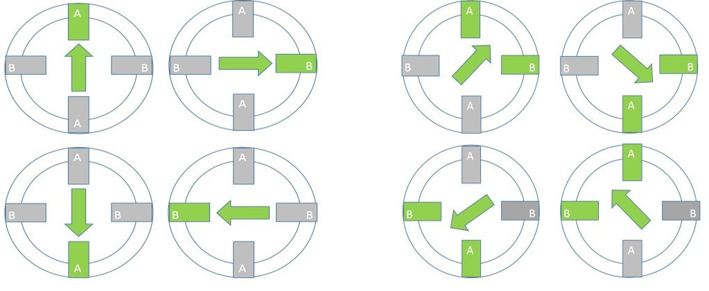
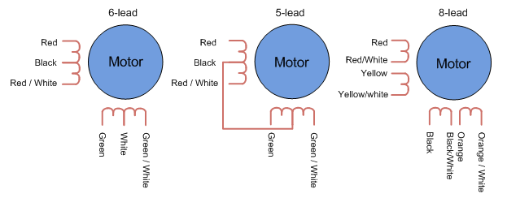
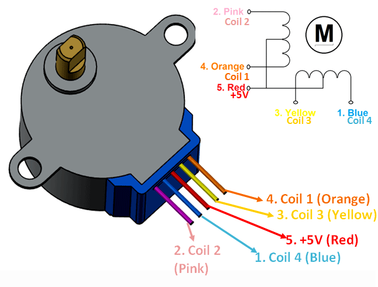

# KRMILJENJE KORAČNIH MOTORJEV 

Koračni motorji so brezkrtačni sinhronski elektromotorji, katerih en vrtljaj gredi sestavlja več (cca 180) korakov. Rotacijo gredi lahko krmilimo tako, da ustvarjamo magnetna polja na različnih navitjih statorja v pravilnem zaporedju. Slika \ref{koraki} [@Stepperm85:online] prikazuje eno od možnosti takega krmiljenja .



## Uni-/Bi- polarni koračni motorji

Čeprav je princip delovanja koračnih motorjev preprost in podoben v vseh različicah, je potrebno omeniti, da poznamo unipolarne in bipolarne koračne motorje. Ralzlikujejo se po vezavi statorja.

__Unipolarni koračni motorji__ 

Unipolarni koračni motorji imajo na enem mestu dve navitji, ki sta si po smereh različni tako, da lažje ustvarjamo magnetno polje v eni in drugi smeri. S tem pridobimo na enostavnosti elektronike, ki je potrebna za krmiljenje tega motorja. Pogosto v tem primeru uporabimo le nek mikrokrmilnik in en tranzistor (kot stikalo) za vsako navitje. Shemo tega koračnega motorja predstavlja spodnja slika \ref{koracni} [@Unipolar52:online] .
Pogosto so povezave, ki so skupne tuljavam na posameznih mestih združene v eno samo. Tako bi imel ta motor iz prejšnje slike na ohišju le 5 priključkov.

__Bipolarni koračni motor__

Bipolarni koračni motorji imajo na enem mestu le eno navitje (tuljavo). Torej moramo tok krmiliti v obe strani, da lahko menjamo smer magnetnega polja. Kar pomeni, da mora krmilna elektronika to omogočati. Navadi to rešimo z integriranimi vezji - t.i. H-krmilji, en predstavnik teh je L293. Na ta način imamo v vseh korakih uporabljena vsa navitja in tako imajo ti motorji večje navore pri isti velikosti od unipolarnih koračnih motorjev.



## Načini krmiljenja koračnega motorja

Najbolj idealno bi bilo, da bi koračni motor krmilili s sinusno napetostjo. Vendar je digitalno krmiljenje mnogo enostavnejše realizirati, zato se ta motor skoraj praviloma krmili z digitalnimi pulzi. Da bi se približali najboljšemu delovanju, pa obstaja nekaj različnih načinov krmiljenja.

__Valovni način krmiljenja__ 

Valovni način krmiljenja koračnega motorja je najenostavnejši. V pravilnih zaporedjih ustvarjamo magnetno polje v posameznih tuljavah tako, da je magnetno polje prisotno samo v eni tuljavi naenkrat. Rotor koračnega motorja pa sledi le-tem. Tako delovanje prikazuje slika \ref{koraki} - levo.

__Polno-koračni način__

Tak način krmiljenja je najbolj pogost način in tudi najbolj podoben valovnemu. Razlika je ta, da sedaj magnetno polje določata dve tuljavi naenkrat. Tudi število korakov ostaja enako. Pridobimo pa na tem, da je magnetno polje skoraj še enkrat večje in s tem tudi večji navor na rotor motorja. Tako delovanje prikazuje slika \ref{koraki} - desno.

__Pol-koračni način__

Dosežemo z izmenično kombinacijo obeh prej naštetih načinov. Torej da med smeri magnetnega polja, ki jih povzroči ena sama tuljava dodamo še magnetno polje, ki ga ustvarita dve sosednji tuljavi. Tudi ta način ne zagotavlja polnega navora, vendar s tem pridobimo še enkrat več korakov kar pomeni, da motor lahko krmilimo bolj točno.

> ### NALOGA: DOLOČITEV VEZAVE STATORJA KORAČNEGA MOTORJA  
> Z uporabo Ohm-metra (merilnika upornosti) ugotovite, kateri konci žic navitja statorja motorja pripadajo istim tuljavam. Skicirajte shemo in jo primerno označite. 

> ### NALOGA: KRMILJENJA KORAČNEGA MOTORJA  
> Povežite koračni motor na krmilnik in preskusite spodnji program. Po potrebi popravite vezavo motorja, saj ne morete vedeti za smer vezave tuljave v motorju.

```c++
int t = 10;
void setup() {
  pinMode(7, OUTPUT);
  pinMode(6, OUTPUT);
  pinMode(5, OUTPUT);
  pinMode(4, OUTPUT);
}
void loop() {
//step 1
  PORTD=0b00010000;
  delay(t);
//step 2
  PORTD=0b00100000;
  delay(t);
//step 3
  PORTD=0b01000000;
  delay(t);
//step 4
  PORTD=0b10000000;
  delay(t);
}
```

> ### NALOGA: KRMILJENJE V POLNO- IN POL- KORAČNEM NAČINU  
> Nato program dopolnite tako, da boste lahko motor krmilili v:  
> - __polno-koračnen__ načinu in nato še v  
> - __pol-koračnen__ načinu.
>
> Priložite obe programski kodi.

## Priloge

Vezava zelo popularnega koračnega motorja, ki ga najdete v kitajskih zbirkah je vidna na [@fig:stepper_24BYJ]

{#fig:stepper_24BYJ}


