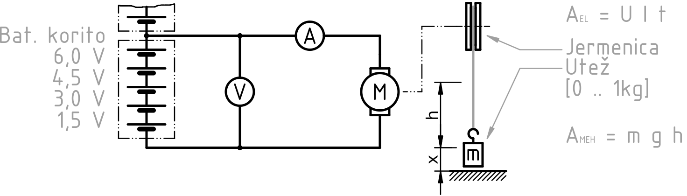

# IZKORISTEK ENOSMERNEGA MOTORJA
Vaja je namenjena meritvam izkoristka enosmernega motorja, ki jo je možno izpeljati z učenci v osnovni šoli. Že s preprostim sklepom lahko ugotovimo, da moramo motor obremeniti ravno prav, da motor deluje z največjim izkoristkom ($\eta$). Če motor ne obremenimo, ne opravlja mehanskega dela in je tako $\eta=0$; če ga obremenimo preveč in se ne more premakniti je prav tako $\eta = 0$... nekje vmes pa je pravšnja delovna obremenitev motorja. To bomo preskusili s postavitvijo, ki jo prikazuje [@fig:izk_mot].

{#fig:izk_mot}

## Merjenje izkoristka enosmernega motorja z reduktorjem

Izkoristek motorja nam pove, kolikšen del električnega dela smo uspeli pretvoriti v mehansko delo, ki ga je motor opravil. Na primer pri dvigovanju uteži iz ene na drugo višino opravi delo:

$$A_{meh}=mgh$$ {#eq:mah-delo} 

kjer je m – masa dvigovanega telesa, g - gravitacijski pospešek in h višinska razlika.

Pri meritvah bodite pozorni, da odčitujete vrednosti takrat, ko se utež dviga enakomerno. Kajti v začetku utež pospešuje, zato pričnite z odčitevanjem, ko je utež že kakih 10 cm od tal. Električno delo, ki smo ga dovedli motorju, pa lahko izračunamo:

$$A_{el}=UIt$$ {#eq:el-delo}

kjer je U - napetost, I - tok skozi motor in t - čas, ki smo ga potrebovali za dvigvanje uteži. Torej izkoristek ni težko izračunati:

$$\eta=\frac{A_{meh}}{A_{el}}$$ {#eq:izkoristek}

### Naloga: Izmerite izkoristek enosmernega motorja
> Izmerite izkoristek enosmernega motorja. Pri različnih delovnih napetostih (3V, 4.5V, 6V in 7.5V) motor različno obremenite (tako da dvigujete različne uteži) in izmerite izkoristek. Za vsako od naštetih napetosti ... pri osmih različnih obremenitvah (obremenitev naj bo enakomerno razdeljena med najlažjo utež in utež, ki jo motor še komaj dvigne.).
Pametno je izračunati prvi izkoristek za orientacijo,če je poskus pravilno nastavljen. Pričakovan izkoristek naj bi bil nekje okoli 20%.

| n | $$U[V]$$           | $$I[mA]$$          | $$t[s]$$           | $$A_{el}[J]$$      | $$m[kg]$$          | $$h[m]$$           | $$A_{meh}[J]$$     | $$\eta[\%]$$       |
|---|--------------------|--------------------|--------------------|--------------------|--------------------|--------------------|--------------------|--------------------|
| 1 |                    |                    |                    |                    |                    |                    |                    |                    |
| 2 |                    |                    |                    |                    |                    |                    |                    |                    |
| 3 |                    |                    |                    |                    |                    |                    |                    |                    |
| 4 |                    |                    |                    |                    |                    |                    |                    |                    |
| 5 |                    |                    |                    |                    |                    |                    |                    |                    |
| 6 |                    |                    |                    |                    |                    |                    |                    |                    |
| 7 |                    |                    |                    |                    |                    |                    |                    |                    |
| 8 | \phantom{12345678} | \phantom{12345678} | \phantom{12345678} | \phantom{12345678} | \phantom{12345678} | \phantom{12345678} | \phantom{12345678} | \phantom{12345678} |

| n |      $$U[V]$$      |     $$I[mA]$$      |      $$t[s]$$      |   $$A_{el}[J]$$    |     $$m[kg]$$      |      $$h[m]$$      |   $$A_{meh}[J]$$   |    $$\eta[\%]$$    |
|---|--------------------|--------------------|--------------------|--------------------|--------------------|--------------------|--------------------|--------------------|
| 1 |                    |                    |                    |                    |                    |                    |                    |                    |
| 2 |                    |                    |                    |                    |                    |                    |                    |                    |
| 3 |                    |                    |                    |                    |                    |                    |                    |                    |
| 4 |                    |                    |                    |                    |                    |                    |                    |                    |
| 5 |                    |                    |                    |                    |                    |                    |                    |                    |
| 6 |                    |                    |                    |                    |                    |                    |                    |                    |
| 7 |                    |                    |                    |                    |                    |                    |                    |                    |
| 8 | \phantom{12345678} | \phantom{12345678} | \phantom{12345678} | \phantom{12345678} | \phantom{12345678} | \phantom{12345678} | \phantom{12345678} | \phantom{12345678} |

\newpage
| n |      $$U[V]$$      |     $$I[mA]$$      |      $$t[s]$$      |   $$A_{el}[J]$$    |     $$m[kg]$$      |      $$h[m]$$      |   $$A_{meh}[J]$$   |    $$\eta[\%]$$    |
|---|--------------------|--------------------|--------------------|--------------------|--------------------|--------------------|--------------------|--------------------|
| 1 |                    |                    |                    |                    |                    |                    |                    |                    |
| 2 |                    |                    |                    |                    |                    |                    |                    |                    |
| 3 |                    |                    |                    |                    |                    |                    |                    |                    |
| 4 |                    |                    |                    |                    |                    |                    |                    |                    |
| 5 |                    |                    |                    |                    |                    |                    |                    |                    |
| 6 |                    |                    |                    |                    |                    |                    |                    |                    |
| 7 |                    |                    |                    |                    |                    |                    |                    |                    |
| 8 | \phantom{12345678} | \phantom{12345678} | \phantom{12345678} | \phantom{12345678} | \phantom{12345678} | \phantom{12345678} | \phantom{12345678} | \phantom{12345678} |

| n |      $$U[V]$$      |     $$I[mA]$$      |      $$t[s]$$      |   $$A_{el}[J]$$    |     $$m[kg]$$      |      $$h[m]$$      |   $$A_{meh}[J]$$   |    $$\eta[\%]$$    |
|---|--------------------|--------------------|--------------------|--------------------|--------------------|--------------------|--------------------|--------------------|
| 1 |                    |                    |                    |                    |                    |                    |                    |                    |
| 2 |                    |                    |                    |                    |                    |                    |                    |                    |
| 3 |                    |                    |                    |                    |                    |                    |                    |                    |
| 4 |                    |                    |                    |                    |                    |                    |                    |                    |
| 5 |                    |                    |                    |                    |                    |                    |                    |                    |
| 6 |                    |                    |                    |                    |                    |                    |                    |                    |
| 7 |                    |                    |                    |                    |                    |                    |                    |                    |
| 8 | \phantom{12345678} | \phantom{12345678} | \phantom{12345678} | \phantom{12345678} | \phantom{12345678} | \phantom{12345678} | \phantom{12345678} | \phantom{12345678} |

\newpage
### Naloga: Grafični prikaz
> Vse 4 krivulje narišite v isti graf, ki prikazuje kako je izkoristek odvisen od obremenitve. Graf naj prikazuje izkoristek motorja v odvisnosti od navora.

 
