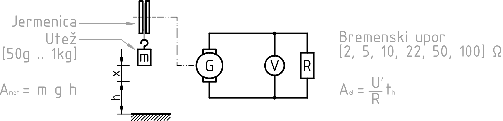

# MERJENJE IZKORISTKA ENOSMERNEGA GENERATORJA

Če proces izvajamo v obratni smeri tako, da mi poganjmo enosmerni motor, ga izrabljamo kot generator električne energije in poganjamo tkok skozi nek porabnik. Izkoristek generatorja nam pove, kolikšen del mehanskega dela smo pretvorili v električno delo, ki se bo trošila na uporu (na nekem porabniku). Slika [@fig:izk_gen] prikazuje vezavno shemo, ki jo potrebujemo za ta poskus.

{#fig:izk_gen}

Generator pretvori mehansko delo v električno tako, da inducira napetost. Ta pa poganja tok skozi upor. Na ta način se električno delo na uporu troši v obliki toplote, zato se upor tudi malenkostno segreje. Električno delo lahko izračunamo enostavno preko napetosti:

$$A{el}=\frac{U^2}{R}t$${#eq:elektricno-delo}

kjer je U - napetost, R - upornost upora in t - čas, ko je utež opravljala delo. Mehansko delo na generatorju bo opravljala utež in poganjala generator. Mehansko delo tako lahko izračunam:

$$A_{meh}=mgh$$ {#eq:mehansko-delo}

kjer je m - masa telesa, g - gravitacijski pospešek in h višinska razlika. Pri meritvah bodite pozorni, da odčitujete vrednosti takrat, ko se utež giblje enakomerno. Kajti v začetku utež pospešuje, zato pričnite z odčitevanjem, ko je utež že prepotovala kakih 10 cm.

Tako izkoristek ni težko izračunati, saj je to razmerje med vloženim delom in delom, ki se je potrošil na uporu:

$$\eta=\frac{A_{el}}{A_{meh}}$$ {#eq:izkoristek-generatorja}

\newpage

>### Naloga: Merjenje izkoristka enosmernega generatorja
> Izmerite izkoristek enosmernega generatorja. Pri različnih bremenskih upornostih (2$\Omega$, 5$\Omega$, 10$\Omega$, 22$\Omega$, 50$\Omega$ in 100$\Omega$) in pri različne navorih generatorja.

| R=2$$\Omega$$ | $$U[V]$$            | $$t[s]$$            | $$A_{el}[J]$$       | $$m[kg]$$           | $$h[m]$$            | $$A_{meh}[J]$$      | $$\eta[\%]$$        |
|---------------|---------------------|---------------------|---------------------|---------------------|---------------------|---------------------|---------------------|
| 1             |                     |                     |                     |                     |                     |                     |                     |
| 2             |                     |                     |                     |                     |                     |                     |                     |
| 3             |                     |                     |                     |                     |                     |                     |                     |
| 4             |                     |                     |                     |                     |                     |                     |                     |
| 5             |                     |                     |                     |                     |                     |                     |                     |
| 6             | \phantom{123456789} | \phantom{123456789} | \phantom{123456789} | \phantom{123456789} | \phantom{123456789} | \phantom{123456789} | \phantom{123456789} |

| R=5$$\Omega$$ | $$U[V]$$            | $$t[s]$$            | $$A_{el}[J]$$       | $$m[kg]$$           | $$h[m]$$            | $$A_{meh}[J]$$      | $$\eta[\%]$$        |
|---------------|---------------------|---------------------|---------------------|---------------------|---------------------|---------------------|---------------------|
| 1             |                     |                     |                     |                     |                     |                     |                     |
| 2             |                     |                     |                     |                     |                     |                     |                     |
| 3             |                     |                     |                     |                     |                     |                     |                     |
| 4             |                     |                     |                     |                     |                     |                     |                     |
| 5             |                     |                     |                     |                     |                     |                     |                     |
| 6             | \phantom{123456789} | \phantom{123456789} | \phantom{123456789} | \phantom{123456789} | \phantom{123456789} | \phantom{123456789} | \phantom{123456789} |

| R=10$$\Omega$$ |       $$U[V]$$      |       $$t[s]$$      |    $$A_{el}[J]$$    |      $$m[kg]$$      |       $$h[m]$$      |    $$A_{meh}[J]$$   |     $$\eta[\%]$$    |
|----------------|---------------------|---------------------|---------------------|---------------------|---------------------|---------------------|---------------------|
|              1 |                     |                     |                     |                     |                     |                     |                     |
|              2 |                     |                     |                     |                     |                     |                     |                     |
|              3 |                     |                     |                     |                     |                     |                     |                     |
|              4 |                     |                     |                     |                     |                     |                     |                     |
|              5 |                     |                     |                     |                     |                     |                     |                     |
|              6 | \phantom{123456789} | \phantom{123456789} | \phantom{123456789} | \phantom{123456789} | \phantom{123456789} | \phantom{123456789} | \phantom{123456789} |
\newpage
| R=22$$\Omega$$ |       $$U[V]$$      |       $$t[s]$$      |    $$A_{el}[J]$$    |      $$m[kg]$$      |       $$h[m]$$      |    $$A_{meh}[J]$$   |     $$\eta[\%]$$    |
|----------------|---------------------|---------------------|---------------------|---------------------|---------------------|---------------------|---------------------|
|              1 |                     |                     |                     |                     |                     |                     |                     |
|              2 |                     |                     |                     |                     |                     |                     |                     |
|              3 |                     |                     |                     |                     |                     |                     |                     |
|              4 |                     |                     |                     |                     |                     |                     |                     |
|              5 |                     |                     |                     |                     |                     |                     |                     |
|              6 | \phantom{123456789} | \phantom{123456789} | \phantom{123456789} | \phantom{123456789} | \phantom{123456789} | \phantom{123456789} | \phantom{123456789} |

| R=50$$\Omega$$ |       $$U[V]$$      |       $$t[s]$$      |    $$A_{el}[J]$$    |      $$m[kg]$$      |       $$h[m]$$      |    $$A_{meh}[J]$$   |     $$\eta[\%]$$    |
|----------------|---------------------|---------------------|---------------------|---------------------|---------------------|---------------------|---------------------|
|              1 |                     |                     |                     |                     |                     |                     |                     |
|              2 |                     |                     |                     |                     |                     |                     |                     |
|              3 |                     |                     |                     |                     |                     |                     |                     |
|              4 |                     |                     |                     |                     |                     |                     |                     |
|              5 |                     |                     |                     |                     |                     |                     |                     |
|              6 | \phantom{123456789} | \phantom{123456789} | \phantom{123456789} | \phantom{123456789} | \phantom{123456789} | \phantom{123456789} | \phantom{123456789} |

| R=100$$\Omega$$ |       $$U[V]$$      |       $$t[s]$$      |    $$A_{el}[J]$$    |      $$m[kg]$$      |       $$h[m]$$      |    $$A_{meh}[J]$$   |     $$\eta[\%]$$    |
|-----------------|---------------------|---------------------|---------------------|---------------------|---------------------|---------------------|---------------------|
|               1 |                     |                     |                     |                     |                     |                     |                     |
|               2 |                     |                     |                     |                     |                     |                     |                     |
|               3 |                     |                     |                     |                     |                     |                     |                     |
|               4 |                     |                     |                     |                     |                     |                     |                     |
|               5 |                     |                     |                     |                     |                     |                     |                     |
|               6 | \phantom{123456789} | \phantom{123456789} | \phantom{123456789} | \phantom{123456789} | \phantom{123456789} | \phantom{123456789} | \phantom{123456789} |

\newpage
> V isti graf $\eta$(M) narišite 6 krivulj za vsako bremensko upornost svojo krivuljo.

_
