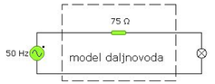
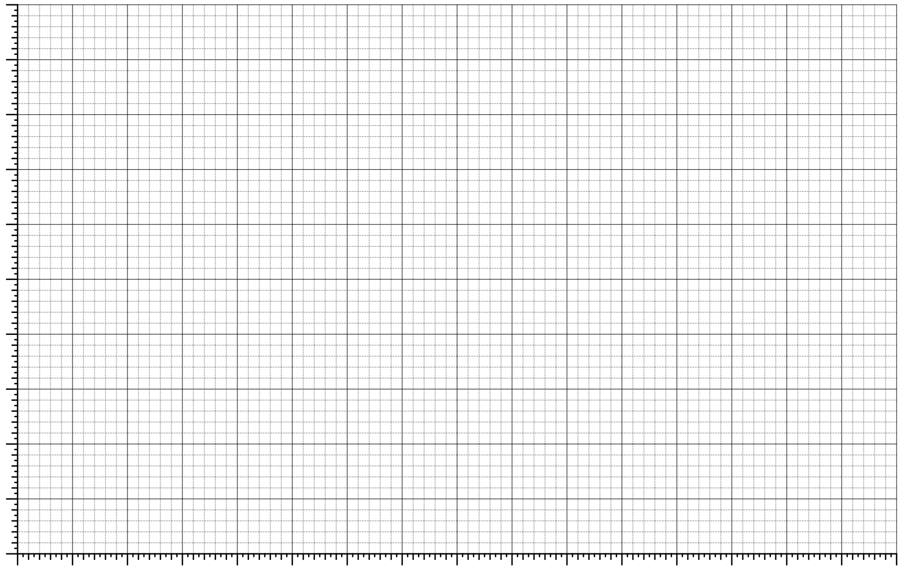
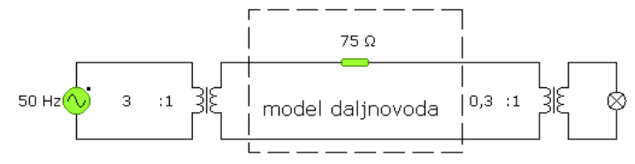

# ELEKTRIČNI DALJNOVODI 

Električno energijo najpogosteje prenašamo po električnih daljnovodih, saj je ta način razmeroma gospodarna rešitev. Električni tok teče od elektrarne do porabnika (in nazaj) po jeklenih žicah, ki so oblečene v aluminijast plašč (jeklo omogoča dobro nosilno obremenitev, aluminij pa poskrbi za manjši
upor vodnika), premera okoli 2½ cm in z upornostjo manjšo od 2 $\Omega$ za vsak kilometer[@Strnad2002]. Nedvomno tudi tako majhna upornost vodnikov distributerju električne energije predstavlja neke izgube, ki jih že vrsto let zmanjšujejo. Ena najučinkovitejših izboljšav je uporaba transformatorja, s katerim lahko povečamo napetost in zmanjšamo tok v daljnovodih pri prenosu enake električne moči in s tem zagotovimo manjše izgube na vodnikih.

## DALJNOVOD brez uporabe transformatorja

Sestavimo model daljnovoda v katerem bomo kilometre dolge žice ponazorili z uporom. Uporabili bomo izmenično napetost, ki jo dobite na ŠMI vmesnikih v konzoli. Nastavili jo bomo na 6 V. Nato pa priključili naš model daljnovoda in ga povezali z žarnico na drugi strani tako, kot prikazuje [@fig:daljnovod_no_tr].

{#fig:daljnovod_no_tr}

> ### NALOGA: IZKORISTEK DALJNOVODA.  
> Izračunajte izkoristek daljnovoda po enačbi [@eq:izk_dal_no_tr]. Izkoristke izračunajte za primere različno dolgih daljnovodov tako, da dolžino daljnovoda simulirate z različnimi upori daljnovodih žic $R_D$. Rezultate vpišite v [@tbl:tbl_no_tr ] in izkoristek daljnovoda v odvisnosti od te upornosti (razdalje) vrišite v [@fig:gr_izkor].

$$ \mu = \frac{P_{BR}}{P_{{BR}}+P_{R_D}} $${#eq:izk_dal_no_tr}

Kjer je $P_{BR}$ - moč, ki se troši na bremenu (na žarnici), $P_{R_D}$ - moč, ki se troši na samih žicah daljnovoda.

| $R_D[\Omega]$ | $U_{R_D}[V]$ | $I_{R_D}[mA]$ | $P_{R_D}[W]$ | $U_{R_{BR}}[V]$ | $I_{R_{BR}}[mA]$ | $P_{R_{BR}}[W]$ | $\mu [\%]$ |
|:-------------:|:------------:|---------------|--------------|-----------------|------------------|-----------------|------------|
|       2       |              |               |              |                 |                  |                 |            |
|       5       |              |               |              |                 |                  |                 |            |
|       10      |              |               |              |                 |                  |                 |            |
|       22      |              |               |              |                 |                  |                 |            |
|       50      |              |               |              |                 |                  |                 |            |
|      100      |              |               |              |                 |                  |                 |            |
Table: Izkoristek daljnovoda brez uporabe transformatorja. {#tbl:tbl_no_tr}

{#fig:gr_izkor}

## DALJNOVOD S TRANSFORMATORSKO POSTAJO

Sestavite podobno vezje le, da dodate dve transformatorski postaji. Eno dodajte pred "daljnovod" in eno za njega. Nato na enak način izmerite moč, ki se troši na "žicah daljnovoda" in moč, ki jo uspemo dovesti do žarnice ali bremena. Bodite pozorni, da boste pravilno obrnili transformatorja (kot prikazuje [@fig:daljnovod_with_tr]). V daljnovodu mora biti napetost višja, da dobimo pri istih močeh manjše tokove, kar izkoriščamo za manjše izgube v daljnovodih. Nato moramo zopet napetost zmanjšati nazaj na prejšnjo vrednost.

{#fig:daljnovod_with_tr}

> ### NALOGA: IZKORISTEK DALJNOVODA S TRANSFORMATORSKO POSTAJO.  
> Izračunajte izkoristek daljnovoda po enačbi [@eq:izk_dal_no_tr] (kot v prejšnji nalogi). Izkoristke izračunajte za primere različno dolgih daljnovodov tako, da dolžino daljnovoda simulirate z različnimi upori daljnovodih žic $R_D$. Rezultate vpišite v [@tbl:tbl_with_tr ] in izkoristek daljnovoda v odvisnosti od te upornosti (razdalje) vrišite v istigraf na [@fig:gr_izkor], ter jih primerjajte.

| $R_D[\Omega]$ | $U_{R_D}[V]$ | $I_{R_D}[mA]$ | $P_{R_D}[W]$ | $U_{R_{BR}}[V]$ | $I_{R_{BR}}[mA]$ | $P_{R_{BR}}[W]$ | $\mu [\%]$ |
|:-------------:|:------------:|---------------|--------------|-----------------|------------------|-----------------|------------|
|       2       |              |               |              |                 |                  |                 |            |
|       5       |              |               |              |                 |                  |                 |            |
|       10      |              |               |              |                 |                  |                 |            |
|       22      |              |               |              |                 |                  |                 |            |
|       50      |              |               |              |                 |                  |                 |            |
|      100      |              |               |              |                 |                  |                 |            |
Table: Izkoristek daljnovoda z uporabo transformatorja. {#tbl:tbl_with_tr}
