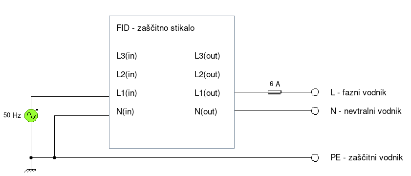
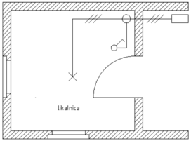
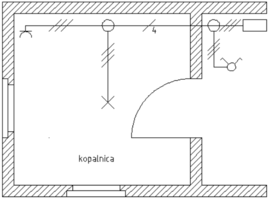
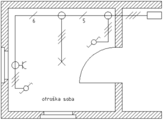
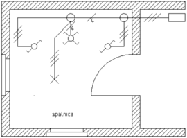

# ELEKTRIČNA INŠTALACIJA

Na modelu za hišno napeljavo bomo izvedli nekaj primerov hišne napeljave. Predno se lotimo povezovanja različnih vezav si moramo pripraviti električno napajanje s katerim bomo simulirali fazni, ničelni in zaščitni vodnik. Napajalno napetost nam bo zagotavljal ŠMI od katerega bomo koristili 12 V izmenični vir napetosti. En priključek tega vira izberite za fazni (L) vodnik, drugega pa za nevtralnega (N). Na nevtralni vodnik priključite tudi zaščitni (PE) vodnik in šele nato povežite napetostne potenciale na FID varovalo in 6 A varovalko, kot kaže [@fig:L_N_PE].

{#fig:L_N_PE}

## VKLOP LUČI

> ### NALOGA: VKLOP LUČI IZ ENEGA MESTA
> Zvežite navadno stikalo za vklop luči iz enega mesta po naslednji enopolni shemi na [@fig:bulb_sw] in dorišite elektrotehniško shemo.

{#fig:bulb_sw}

## VEZAVA SERIJSKEGA STIKALA

> ### NALOGA: SERIJSKO STIKALO
> Povežite serijsko stikalo za vklop luči in vključitev fazne napetosti v vtičnici kopalnice, kor prikazuje [@fig:kopalnica].

{#fig:kopalnica}

## VKLOP LUČI IZ DVEH MEST

> ### NALOGA: VKLOP LUČI IZ DVEH MEST
> Povežite električno inštalacijo v otroški sobi, kot jo prikazuje enopolna shema na [@fig:otroska]. V tej sobi je mogoče vključiti luč iz dveh mest z dvema menjalnima stikaloma.

{#fig:otroska}

## VKLOP LUČI IZ TREH ALI VEČ MEST

> ### NALOGA: VKLOP LUČI IZ TREH ALI VEČ MEST
> Povežite električno inštalacijo za primer spalnice, kjer je luč možno vključiti in izključiti iz treh mest kot prikazuje shema na [@fig:spalnica].

{#fig:spalnica}
