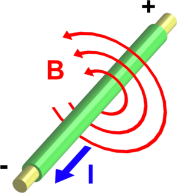
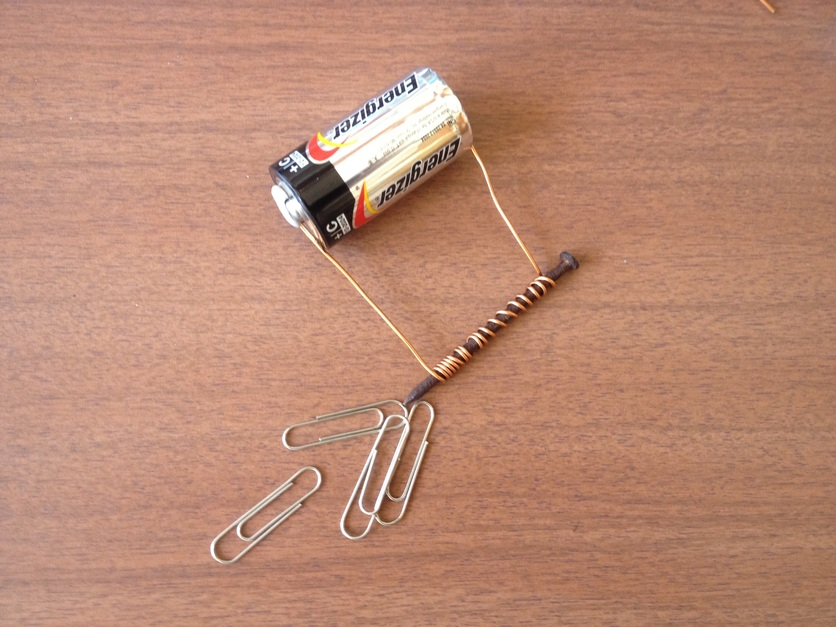
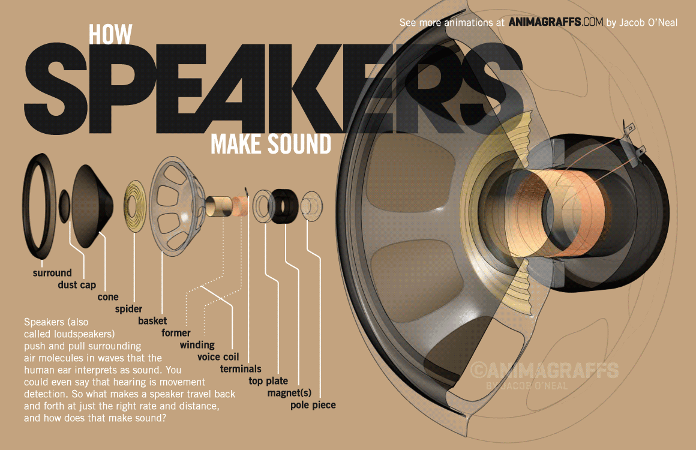

# MAGNETNI UČINEK ELEKTRIČNEGA TOKA

Najosnovnejša vrsta elektromagneta je navit kos žice. Tuljava (navitje) v obliki spirale, kjer se konca srečata, imenujemo toroid. Veliko močnejše magnetno polje nastane, če jedro iz paramagnetnega ali feromagnetnega materiala (navadno železa) vstavimo v tuljavo. Polje, ki ga ustvarja navitje, povzroči, da se jedro namagneti in ustvari lastno polje. To polje je lahko več sto ali tisočkrat močnejše od tistega, ki ga ustvarja navitje samo ([Wikipedija](https://sl.wikipedia.org/wiki/Elektromagnet)).

{#fig:magnetno_polje  width="6cm"}

Zelo pogosto ta pojav predstavimo učencem tako, da na kak žebelj ovijemo kos žice in ga priključimo na baterijo, kot prikazuje [@fig:el_magnet]

{#fig:el_magnet  width="6cm"}

... vendar pojdimo korak dlje.

## ZVOČNIK

Sestava pravih zvočnikov je lahko nekoliko bolj zapletena in je prikazana na [@fig:zvocnik_sestava].

{#fig:zvocnik_sestava}

Vendar je zvočnik v osnovi sestavljen zelo podobno kot elektromagnet, le da se navitje lahko giblje. Na to navitje je pritrjena opna, ki to gibanje pretvarja v zvok in je tako tak "elektromagnet" bistveno bolj zanimiv za učence. Zato izdelajmo zvočnik.

Zvočnik lahko razdelimo na dva dela:

1. tuljava elektromagneta z magnetom in
2.  opno zvočnika.

Tuljava se nahaja v magnetnem polju, ki ga ustvarja trajni magnet. Ko skozi tuljavo steče električni tok, se v tuljavi ustvari magnetno polje in se tako ustvari magnetna sila, ki tuljavo privlači v magnetno polje trajnega magneta. Ko pa skozi tuljavo steče električni tok v obratni smeri, pa se tuljava odmakne stran od magnetnega polja trajnega magneta. 

Na tulec tuljave je pritrjena opna zvočnika, ki s premikanjem ustvarja tlačne razlike v zraku ter tako proizvaja zvok. Delovanje zvočnika je zelo nazorno prikazano na [How speakers make sound   ](https://animagraffs.com/loudspeaker/).

> ### NALOGA: Izdelava zvočnika
> Po navodilih in načrtu izdelajte zvočnik, ter ga preskusite. V poročilo dodajte opis delovanja vašega zvočnika in vaše komentarje ter prilepite vašo fotografijo izdelanega zvočnika.
>
> 1. Najprej si naredite opno zvočnika tako, da naredite zelo top stožec iz pisarniškega papirja.Premer opne naj bo $\Phi = 92 mm$.
> 2. Nato izdelajte tuljavo zvočnika. Na AA baterijo (ali drug valj) nalepite papirni trak širine $A = 45 mm$. Tako boste dobili valj, na katerega boste navili tuljavo.
> 3. Med valj in baterijo vstavite papirni distančnik (manjši trak širine 0,5 cm) zato, da boste na koncu lažje odstranili papirnati valj s tuljavo iz baterije.
> 4. Nato na papirni valj navijte 3 - 4 m tanke bakrene žice. Žico navijte v spodnji 1 cm valja in mesto navitja na papirnem valju predhodno namažite z lepilom v stiku. Žico nepremično prilepite (dodatno z lepilnim trakom), odstranite distančnike in snemite tulec iz baterije.
> 5. Tuljavo zvočnika prilepite na opno tako, da na zgornji strani tulec razrežete na trakove široke $D = 5 mm$ in dolge $L = 20 mm$. Te lističe namažete z lepilom in jih prilepite na opno zvočnika.
> 6. Žice tuljave povežite na glasbeni ojačevalnik in tuljavo postavite v magnetno polje.

{#fig:zvocnik_koncna width="10cm"}

\newpage

{#fig:zvocnik_sestavna}

{#fig:zvocnik_kosovnica}
