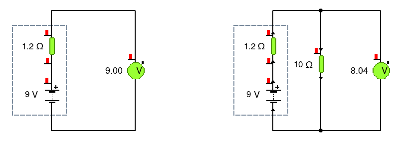

# OHMOV ZAKON

## Odvisnost električnih količin

> ### NALOGA: OHMOV ZAKON - MERITVE
> Sestavite poljubno vezje, v katerega boste vključili:
>
> - napetostni vir, ki mu lahko nastavljamo izhodno napetost (sestavite po  [@fig:01_vir_napetosti_R]),
>
> {#fig:01_vir_napetosti_R}
>
> - 3 ali več uporov različnih upornosti ( $R_{1..4}= 100 \Omega .. 10 k\Omega$),
> 
> Na to za vse te upore izmerite: napetost na uporu in tok, ki teče skozi upor pri vsaj petih različnih napajalnih napetostih. Izpolnite tudi [@tbl:Tohms_law].

> ### NALOGA: I(U) KARAKTERISTIKA LINEARNEGA UPORA  
> Na isti grafi narišite vse tri I(U) karakteristike uporov.

# KIRCHHOFFOVA IZREKA

## 1. Kirchhoffov izrek

> ### NALOGA: SUMACIJSKA TOČKA EL. TOKOV  
> Sestavite električno vezje s poljubno napajalno napetostjo. V to vezje vključi 3 upore različnih upornosti (npr.: $R_{1..3}= 100\Omega .. 10 k\Omega$) - izberete lahko isto električno vezje iz 1. vaje o Ohmovem zakonu. Vezava naj bo neka kombinacija vzporednih in zaporednih vezav.
> Za vsaj dva različna primera napajalnih napetosti predstavite, da velja 1. Kirchhoffov izrek. Odgovor naj vsebuje:
>
>   1. električno shemo vezja s ključnimi el. veličinami,
>   2. označite (kompleksnejšo) poljubno sumacijsko točko v vezju,
>   3. izmerite vse pritekajoče in odtekajoče tokove sumacijske točke in
>   4. pravilno zapišite [@eq:kirck1] z vstavljenimi podatki.

## 2. Kirchhoffov izrek

> ### NALOGA: NAPETOSTNI POTENCIAL V TOKOKROGU  
> Na primeru vezja iz prejšnje naloge nastavi poljubno znano napajalno napetost (novo, ki je še nisi preskusil) :
>
> 1. sestavi zapise enačb 2. Kirchhoffovega izreka za vse tokokroge v vezju,
> 2. sestavite zapise enačb za vse sumacijske točke v vezju,
> 3. za vse upore sestavite enačbo Omovega
> 4. rešite sistem enačb ter izračunajte napetosti in tokove skozi vse elemente ter
> 5. jih primerjajte z izmerjenimi vrednostmi.

# NADOMESTNA IN NOTRANJA UPORNOST

## Zaporedna vezava uporov

> ### NALOGA: Nadomestna upornost zaporedne vezave  
> Sestavite preprosto vezje s:
>
> 1. poljubnim napetostnim virom,
> 2. na katerega priključite dva zaporedno vezana upora.
>
> Z 2. Kirchhoff-ovim izrekom utemeljite izračun za nadomestno upornost obeh zaporedno vezanih uporov.
>
> Rezultat preverite v simulaciji z zamenjavo obeh uporov z nadomestnim in preverite, če so vrednosti električnih veličin enake.

## Vzporedna vezava uporov

> ### NALOGA: Nadomestna upornost vzporedne vezave  
> Sestavite preprosto vezje s:
>
> 1. poljubnim napetostnim virom,
> 2. na katerega priključite dva vzporedno vezana upora.
>
> S 1. Kirchhoff-ovim izrekom utemeljite izračun za nadomestno upornost obeh vzporedno vezanih uporov.
>
> Rezultat preverite v simulaciji z zamenjavo obeh uporov z nadomestnim in preverite, če so vrednosti električnih veličin enake.

## Notranja upornost V-metra

> ### NALOGA: Delilnik napetosti  
> Seatavite vezje s:
>
> 1. poljubnim napetostnim virom in
> 2. dvema zaporedno vezanima uporoma manjših upornosti $R=[100\Omega .. 1k\Omega]$.
>
> Izračunajte napetosti na uporih $R_1$ in $R_2$ ter izračune preverite z realnim V-metrom (simulirajte tako, da vzporedno vežete $R_{V-meter}=1M\Omega$).
>
> Nato spremenite vrednost uporov $R_1 in R_2 = [100k\Omega .. 1M\Omega]$.
>
> Ponovno izračunajte napetosti na uporih $R_1$ in $R_2$ ter izračune preverite z realnim V-metrom (simulirajte tako, da vzporedno vežete $R_{V-meter}=1M\Omega$).
>
> Z zakoni in izreki utemeljite razliko v meritvah med obema delilnikoma napetosti.

# NAPETOSTNI VIRI

## Notranja upornost vira napetosti

> ### NALOGA: Notranja upornost baterije  
> Ker je notranja uporanos predvsem posledica same konstrukcije baterije, samega notranjega upora ne moremo neposredno izmeriti. 
>
> {#fig:r_not_bat}
>
> Lahko pa ga izmerimo posredno tako, da opazujemo spremembo napetosti na priključkih napetostnega vira ob različnih tokovih:
>
> 1. Izmeri napetost neobremenjene baterije $U_{B_0}$.  
> 2. Nato baterijo obremenite z manjšim uporom ( npr.: $R_1=10\Omega$ )in ponovno izmerite napetost $U_B = U_{R_1}$.
> 3. Narišite simbolno električno shemo poskusa in izračunajte notranjo upornost baterije $R_B$.

## Izmenični napetostni viri

> ### NALOGA: Časovni potek izmenične napetosti  
> 1. Sestavite poljubno vezje s:
>
> - poljubnim izmeničnim virom in
> - dvema zaporedno vezanima uporoma.
>
> 2. Na vir priključite osciloskop in izmerite časovni potek napetosti. Graf $U(t)$ tudi ustrezno narišite in odčitajte naslednje parametre :
>  
> - Amplitudno napetost $\hat U_G =$
> - čas periode $t_0 =$
> - frekvenco izhodne napetosti $f_G =$
> - krožilno frekvenco nap. $\omega_G =$
>
> 3. Iz izmerjenih podatkov in grafa U(t) narišite kazalčni diagram, ki prikazuje pogoje pri $t = 0,15s$.

> ### NALOGA: AMPLITUDNA IN EFEKTIVNA NAPETOST  
> 1. Na vir priključite V-meter in izmerite efektivno napetost vira. Utemeljite zakaj se efektivna in amplitudna napetost izmeničnega vira razlikujeta.
>
> 2. Z V-metrom preverite veljavnost 2. Kirchhoffovega izreka.

> ### NALOGA: Merjenje napetostnih potencialov in napetosti z osciloskopom.
> Z osciloskopom izmerite:
>
> - Amplitudo vira napetost (=napetostni potencial) $U_G =$
> - Amplitudo napetosti (=napetostni potencial) na $R_2$ in
> - Amplitudo napetosti (= napetost) na $R_1$.

# NELINEARNI UPORI IN SENZORJI

> ### NALOGA: ELEKTRIČNI TOK SKOZI ŽARNICO PRI ZAP. VEZAVI
> Sestavi vezje po [@fig:el_tok_zarnica_zaporedno] in izmerite:  
>
> 1. napetosti na žarnicah ter,
> 2. tokove skozi žarnice.
>
> Kako se rezultati razlikujejo od pričakovanj, če bi bila žarnica linearen upor. Utemeljite z zakoni in izreki, ter se navežite na (ne-)linearnost upornosti.

> ### NALOGA: I(U) KARAKTERISTIKA ŽARNICE  
>
> 1. Izmerite I(U) karakteristiko žarnice in podatke uredite v tabeli.
> 2. Graf I(U) karakteristike tudi narišite.

## FOTOUPO in RTERMISTOR

> ### NALOGA: FOTOUPOR  
> Sestavite vezje, ki ga prikazuje [@fig:05-LDR-NTC.png] - levo. Nato spreminjajte osvetljenost elementa in opazujte kako se spreminja električni tok skozi element. Ugotovitev tudi napišite.
>
> Nato na podlagi teh ugotovitev utemeljite kako se spreminja upornost elementa glede na njegovo osvetljenost (osvetljenost -> el. tok -> upornost).

> ### NALOGA: TERMISTOR  
> Sestavite vezje, ki ga prikazuje [@fig:05-LDR-NTC.png] - desno. Nato spreminjajte temperaturo elementa in opazujte kako se spreminja električni tok skozi element. Ugotovitev tudi napišite.
>
> Nato na podlagi teh ugotovitev utemeljite kako se spreminja upornost elementa glede na njegovo temperaturo (temperatura -> el. tok -> upornost).

## Umeritev senzorja

> ### NALOGA: UMERITEV SENZORJA TEMPERATURE  
> Sestavite senzor temperature, kot je predstavljen na [@fig:05-Temp-sen.png]. Spreminjajte temperaturo termistorja in beležite izhodno napetost. Meritve uredite tudi v tabeli. Nato iz dobljenih meritev lahko narišete graf $U_{izh}(T)$.
>
> Za tem iz dobljenih meritev izračunajte še upornost $R_{NTC}$ za vsako izmerjeno situacijo in narišite graf $R_{NTC}(T)$.

# KONDENZATOR V IZMENIČNIH TOKOKROGIH

> ### NALOGA: NAPETOSTI V IZMENIČNIH TOKOKROGIH  
> Sestavite vezje na [@fig:06-AC-R-C.png] in z V-metrom izmerite napetosti na elementih in jih vpišite v tabelo. V shemo vključite tudi priključitev vseh treh V-metrov.

> ### NALOGA: PREVERITE 2. KIRCHHOFFOV IZREK  
> Kaj lahko ugotovite glede 2. Kirchhoffovega izreka. Ugotovitve zapišite.

> ### NALOGA: ČASOVNI POTEK NAPETOSTI (osciloskop)  
> V vezje priključite osciloskop, kot kaže [@fig:06-OSC.png].  
> Nato pravilno nastavite osciloskop (na ekranu naj bo vidna le ena perioda) in odčitajte ter prerišite vse tri poteke napetosti:  
> 1. Časovni potek napetostnega potenciala, ki ga generira vir napetosti (A).  
> 2. Časovni potek napetosti na kondenzatorju (B).  
> 3. Napetost na uporu, ki jo lahko prikažemo z matematično funkcijo A-B.  

> ### NALOGA: ČASOVNI POTEK NAPETOSTI (simulacija)  
> Na isti graf U(t) prikazujte:  
> 1. Časovni potek napetosti vira,  
> 2. časovni potek napetosti na kondenzatorju in  
> 3. časovni potek napetosti na uporu.  
> Na graf lahko dodate več krivulj tako, da:  
> označite graf -> desni klik -> Properties... -> Traces -> []Show trace X  
> Graf naj bo velik, pregleden in na njem naj bo le ena perioda.

> ### NALOGA: KARAKTERISTIČNE VREDNOSTI IZMENIČNE NAPATOSTI  
> Iz predhodno izmerjenega grafa odčitajte naslednje količine in jih vpišite v tabelo. Kjer je:  
> - $\hat{U}$ - amplitudna napetost - največji odmik krivulje od srednje vrednosti in  
> - $t_{\hat{U}}$ - čas, pri katerem se pojavi amplitudna napetost.  
> - $\varphi$ - fazni premik med napetostmi, pri čemer smo za orientacijo vzeli napetost na uporu.[^1]  
> - $U_{t=konst.}$ - napetost na elementu ob istem trenutku za vse tri krivulje. Na primer napetost na elementu pri času $t=15ms$.

## Fazni zamik količin v izmeničnih tokokrogih

> ### NALOGA: KAZALČNI DIAGRAM  
> Najprej preverite 2. Kirchhoffov izrek, vendar vzemite meritve vseh treh napetosti ob istem času iz [@tbl:u-t-AC ]. Kaj ugotovite? Ugotovitev utemeljite v navezavi z meritvami iz [@tbl:u-efektivna ].  
> V kazalčni diagram vrišite vse tri vektorje amplitudnih napetosti ($\vec{U_{V_1}}, \vec{U_{R_1}} in\ \vec{U_{C_1}}$) in preverite veljavnost 2. Kirchhoffovega izreka še v tej vektorski obliki. Ugotovitev zapišite.

## Tok v izmeničnih tokokrogih s kapacitivnim bremenom

> ### NALOGA: TOK V IZMENIČNEM KROGU S KAPACITIVNIM BREMENOM  
> Iz časovne odvisnosti U_R(t) iz prejšnje naloge izračunajte tok skozi vezje (vsako točko napetosti delite z upornostjo upora) in tok vrišite v graf na [@fig:07chart-oscilloscope.png].  
> V graf na [@fig:07chart-oscilloscope.png] vrišite (prerišite) tudi napetost na kondenzatorju.

> ### NALOGA: IMPEDANCA KONDENZATORJA  
> Izračunajte impedanco kondenzatorju in nato še njegovo kapacitivnost. Izračune dosledno nakažite.

> ### NALOGA: FAZNI ZAMIK MED TOKOM IN NAPETOSTJO  
> Iz grafa na [@fig:07chart-oscilloscope.png] odčitajte časovno razliko $\Delta t$ med amplitudo toka in amplitudo napetosti na kondenzatorju in izračunajte fazni zamik $\varphi$.  
> Narišite kazalčni diagram z vektorjema amplitude toka in napetosti.

# TOK IN NAPETOST V IZMENIČNIH TOKOKROGIH Z INDUKTIVNIM BREMENOM

> ### NALOGA: NAPETOST V IZMENIČNEM TOKOKROGU Z INDUKTIVNIM BREMENOM  
> Sestavite vezje na [@fig:08-I-U-AC-tuljava.png]-desno in v graf na [@fig:Ut_Ur_Uv_time] vrišite potek napetosti gonilnega vira ($U_G(t) \rightarrow CH_A$), napetost ($U_{R_1}(t) \rightarrow CH_B$) in razliko teh dveh napetosti, ki nam poda napetost na tuljavi ($U_T(t) \rightarrow CH_A - CH_B$ ) na tuljavi. 

> ### NALOGA: TOK V IZMENIČNEM TOKOKROGU Z INDUKTIVNIM BREMENOM  
> Na grafu [@fig:Ut_Ur_Uv_time] označite katera od krivulj lahko predstavlja tudi tok, ki teče skozi to vezje ($I(t)$) in na desno stran grafa dorišite novo skalo za tok, ki jo prilagodite tej krivulji.

## NAVIDEZNA, DELOVNA IN JALOVA MOČ

> ### NALOGA: NAVIDEZNA MOČ  
> Za tokokrog na [@fig:08-I-U-AC-tuljava.png] izmerite efektivne vrednosti toka in napetosti za vsak element v vezju. Vrednosti izmerite z Volt- in Ampere-metrom z nastavitvijo za izmenične vrednosti (RMS). Izpolnite [@tbl:U_I_efektivni] za $\widetilde{U_{ef}}$, $\widetilde{I_{ef}}$ in $P_n[mW]$.

> ### NALOGA: DELOVNA MOČ  
> Iz [@fig:Ut_Ur_Uv_time] odčitajte tudi časovne razlike med zamiki napetosti in tokom za vsak element in meritev vpišite v [@tbl:U_I_efektivni]. Glede na ta podatek, izračunajte tudi fazni zamik $\Delta \varphi$ in po [@eq:delovna_moc] izračunajte tudi $P_d$.

## JALOVA MOČ

> ### NALOGA: JALOVA MOČ
> Izračunajte kolikšno jalovo moč lahko pričakujemo na posameznih elementih iz [@fig:08-I-U-AC-tuljava.png] in jo vpišite v [@tbl:U_I_efektivni].

> ### NALOGA: KOMPENZACIJA JALOVE MOČI
> Izračunajte primeren kondenzator $C_K$ za kompenzacijo jalove moči v vašem vezju.  
> Še naprej z osciloskopom opazujte električne napetosti v tokokrogu na [@fig:08-I-U-AC-tuljava.png] in hkrati merite tok skozi vir napetosti.  
> Nato vzporedno k viru vežite kondenzator za kompenzacijo jalove moči $C_K$ in opazujte:  
> - Ali se je tok skozi vir spremenil, ča da, kako?  
> - Ali so se razmere v tokokrogu $U_G - L_1 - R_1$ kaj spremenile, če da, kako?

# KRMILJENJE SERVO-MOTORJEV

## Preskušanje delovanja servo-motorja

> ### NALOGA: PROGRAMSKO KRMILJENJE SERVO-MOTORJA  
> V programskem okolju ArduinoIDE naložite naslednji program in ga preskusite:

#include <Servo.h>

> ### NALOGA - KRMILENJE SERVOMOTORJA  
> Preskusite program tako, da premikate srednji priključek potenciometra in spremljajte odziv servo-motorja. Nato z osciloskopom posnemite oba signala (na potenciometru in signal za krmiljenje servo-motorja) in napetostna signala narišite za vsaj __3 različne situacije__.

# KRMILJENJE KORAČNIH MOTORJEV 

## Uni-/Bi- polarni koračni motorji

## Načini krmiljenja koračnega motorja

> ### NALOGA: DOLOČITEV VEZAVE STATORJA KORAČNEGA MOTORJA  
> Z uporabo Ohm-metra (merilnika upornosti) ugotovite, kateri konci žic navitja statorja motorja pripadajo istim tuljavam. Skicirajte shemo in jo primerno označite. 

> ### NALOGA: KRMILJENJA KORAČNEGA MOTORJA  
> Povežite koračni motor na krmilnik in preskusite spodnji program. Po potrebi popravite vezavo motorja, saj ne morete vedeti za smer vezave tuljave v motorju.

> ### NALOGA: KRMILJENJE V POLNO- IN POL- KORAČNEM NAČINU  
> Nato program dopolnite tako, da boste lahko motor krmilili v:  
> - __polno-koračnen__ načinu in nato še v  
> - __pol-koračnen__ načinu.
>
> Priložite obe programski kodi.

## Priloge

# ENOSMERNI MOTOR

## KONSTANTA MOTORJA

> ### NALOGA: KONSTANTA MOTORJA  
> Za več različnih DC motorjev izmerite potrebne meritve, da boste lahko določili konstanto motorja $k_M$. Potrebne meritve vpišite v [@tbl:k_motorja ] in jih označite z \* tako, da se bodo izmerjene vrednosti ločile od izračunanih. Račune tudi nakažite vsaj za en primer motorja.

# IZKORISTEK ENOSMERNEGA MOTORJA

## Merjenje izkoristka enosmernega motorja z reduktorjem

### Naloga: Izmerite izkoristek enosmernega motorja
> Izmerite izkoristek enosmernega motorja. Pri različnih delovnih napetostih (3V, 4.5V, 6V in 7.5V) motor različno obremenite (tako da dvigujete različne uteži) in izmerite izkoristek. Za vsako od naštetih napetosti ... pri osmih različnih obremenitvah (obremenitev naj bo enakomerno razdeljena med najlažjo utež in utež, ki jo motor še komaj dvigne.).

### Naloga: Grafični prikaz
> Vse 4 krivulje narišite v isti graf, ki prikazuje kako je izkoristek odvisen od obremenitve. Graf naj prikazuje izkoristek motorja v odvisnosti od navora.

# MERJENJE IZKORISTKA ENOSMERNEGA GENERATORJA
>### Naloga: Merjenje izkoristka enosmernega generatorja
> Izmerite izkoristek enosmernega generatorja. Pri različnih bremenskih upornostih (2$\Omega$, 5$\Omega$, 10$\Omega$, 22$\Omega$, 50$\Omega$ in 100$\Omega$) in pri različne navorih generatorja.
> V isti graf $\eta$(M) narišite 6 krivulj za vsako bremensko upornost svojo krivuljo.

# ELEKTRIČNI DALJNOVODI 

## DALJNOVOD brez uporabe transformatorja

> ### NALOGA: IZKORISTEK DALJNOVODA.  
> Izračunajte izkoristek daljnovoda po enačbi [@eq:izk_dal_no_tr]. Izkoristke izračunajte za primere različno dolgih daljnovodov tako, da dolžino daljnovoda simulirate z različnimi upori daljnovodih žic $R_D$. Rezultate vpišite v [@tbl:tbl_no_tr ] in izkoristek daljnovoda v odvisnosti od te upornosti (razdalje) vrišite v [@fig:gr_izkor].

## DALJNOVOD S TRANSFORMATORSKO POSTAJO

> ### NALOGA: IZKORISTEK DALJNOVODA S TRANSFORMATORSKO POSTAJO.  
> Izračunajte izkoristek daljnovoda po enačbi [@eq:izk_dal_no_tr] (kot v prejšnji nalogi). Izkoristke izračunajte za primere različno dolgih daljnovodov tako, da dolžino daljnovoda simulirate z različnimi upori daljnovodih žic $R_D$. Rezultate vpišite v [@tbl:tbl_with_tr ] in izkoristek daljnovoda v odvisnosti od te upornosti (razdalje) vrišite v istigraf na [@fig:gr_izkor], ter jih primerjajte.

# ELEKTRIČNA INŠTALACIJA

## VKLOP LUČI

> ### NALOGA: VKLOP LUČI IZ ENEGA MESTA
> Zvežite navadno stikalo za vklop luči iz enega mesta po naslednji enopolni shemi na [@fig:bulb_sw] in dorišite elektrotehniško shemo.

## VEZAVA SERIJSKEGA STIKALA

> ### NALOGA: SERIJSKO STIKALO
> Povežite serijsko stikalo za vklop luči in vključitev fazne napetosti v vtičnici kopalnice, kor prikazuje [@fig:kopalnica].

## VKLOP LUČI IZ DVEH MEST

> ### NALOGA: VKLOP LUČI IZ DVEH MEST
> Povežite električno inštalacijo v otroški sobi, kot jo prikazuje enopolna shema na [@fig:otroska]. V tej sobi je mogoče vključiti luč iz dveh mest z dvema menjalnima stikaloma.

## VKLOP LUČI IZ TREH ALI VEČ MEST

> ### NALOGA: VKLOP LUČI IZ TREH ALI VEČ MEST
> Povežite električno inštalacijo za primer spalnice, kjer je luč možno vključiti in izključiti iz treh mest kot prikazuje shema na [@fig:spalnica].

# MAGNETNI UČINEK ELEKTRIČNEGA TOKA

## ZVOČNIK

> ### NALOGA: Izdelava zvočnika
> Po navodilih in načrtu izdelajte zvočnik, ter ga preskusite. V poročilo dodajte opis delovanja vašega zvočnika in vaše komentarje ter prilepite vašo fotografijo izdelanega zvočnika.
>
> 1. Najprej si naredite opno zvočnika tako, da naredite zelo top stožec iz pisarniškega papirja.Premer opne naj bo $\Phi = 92 mm$.
> 2. Nato izdelajte tuljavo zvočnika. Na AA baterijo (ali drug valj) nalepite papirni trak širine $A = 45 mm$. Tako boste dobili valj, na katerega boste navili tuljavo.
> 3. Med valj in baterijo vstavite papirni distančnik (manjši trak širine 0,5 cm) zato, da boste na koncu lažje odstranili papirnati valj s tuljavo iz baterije.
> 4. Nato na papirni valj navijte 3 - 4 m tanke bakrene žice. Žico navijte v spodnji 1 cm valja in mesto navitja na papirnem valju predhodno namažite z lepilom v stiku. Žico nepremično prilepite (dodatno z lepilnim trakom), odstranite distančnike in snemite tulec iz baterije.
> 5. Tuljavo zvočnika prilepite na opno tako, da na zgornji strani tulec razrežete na trakove široke $D = 5 mm$ in dolge $L = 20 mm$. Te lističe namažete z lepilom in jih prilepite na opno zvočnika.
> 6. Žice tuljave povežite na glasbeni ojačevalnik in tuljavo postavite v magnetno polje.
