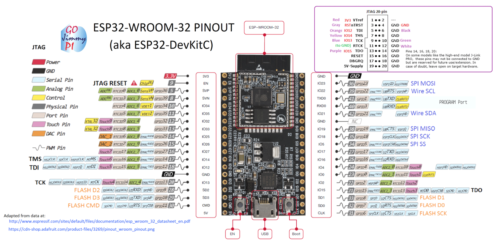

# KRMILNIK ESP32-WROOM-32D

ESP32_DevKitC_V4 krmilnik je majhna razvojna plošča na osnovi družine krmilnikov ESP32, ki jih proizvaja Espressif. Večina vhodno/izhodnih zatičev je razdeljena dve vrsti obeh straneh za lažje povezovanje modula z periferno elektroniko. Razvijalci lahko periferne naprave povežejo z žicami ali pa ESP32_DevKitC_V4 namestijo na razvojno ploščo. Ena od različic ESP32-DevKitC krmilnikov je na [@fig:dev_kit].

{#fig:dev_kit}

Več o tem krmilniku si lahko preberete na njihovi [spletni strani](https://docs.espressif.com/projects/esp-idf/en/latest/esp32/hw-reference/esp32/get-started-devkitc.html#)

## OSNOVNE LASTNOSTI

Pred samo uporabo se najprej seznanimo z glavnimi lastnostmi modula ESP32_DevKitC_V4. Tako bomo spoznali njegove možnosti uporabe in tudi omejitve. Glavni sestavni krmilnika je modul [ESP32_WROOM_32D](https://www.espressif.com/sites/default/files/documentation/esp32-wroom-32d_esp32-wroom-32u_datasheet_en.pdf), ki ga prikazuje [@fig:Esp32WroomModule].

{#fig:Esp32WroomModule}

Na krmilniku ESP32_DevKitC_V4 so priključki razporejeni podobno, kot jih vidimo na [@fig:Esp32WroomModule]. Njihovo zaporedje je ohranjeno, le razporeditev je razvrščena v dve vrsti. Bolj natančna vezava pa je predstavljena v sami [el.-teh. shemi](https://dl.espressif.com/dl/schematics/esp32_devkitc_v4-sch.pdf) krmilnika.

> ### NALOGA: OSNOVE LASTNOSTI KRMILNIKA  
> Preglejte [dokumentacijo](https://www.espressif.com/sites/default/files/documentation/esp32-wroom-32d_esp32-wroom-32u_datasheet_en.pdf) modula ESP32_WROOM_32D in izpišite njegove osnovne lastnosti. Če katerih lastnosti ne najdete si lahko pomagate z dodatno literaturo mikrokrmilnika [ESP32_D0WD](https://www.espressif.com/sites/default/files/documentation/esp32_datasheet_en.pdf), ki je osrednja komponenta modula. Na spoletu lahko najdete tudi druge [spletne strani](https://lastminuteengineers.com/esp32-arduino-ide-tutorial/) drugih uporabnikov, saj je krmilnik zaradi svojih lastnosti izredno popularen.  
> **OSNOVNE SPLOŠNE LASTNOSTI MODULA ESP32_WROOM_32D**:  
> Delovni takt:  
> Tipi brezžične komunikacije:  
> Protokoli ožičene komunikacije:  
> Vključujoči senzorji:  
> Vključujoče krmilne enote:  
> Št. digitalnih GPIO priključkov:  
> Št. ADC enot:  
> Št. ADC priključkov:  
> ADC resolucija:  
> Št. DAC priključkov:  
> **OSNOVNE ELEKTRIČNE LASTNOSTI MODULA ESP32_WROOM_32D**:  
> Napajalna napetost (max):  
> Delovni tok:  
> Vhodni nap. pot. na GPIO prik. (max):  
> Izhodni nap. pot. na GPIO prik. (min):  
> Izhodni tok GPIO prik. (izvor/ponor):  
> Upornost upora proti nap.:  
> Upornost upora proti GND:  

## UPORABA KRMILNIKA ESP32

Enostaven in nazoren pregled priključkov nudi [@fig:esp32_devkitc_v4_pinout], katero boste morali dosledno upoštevat pri vaši vezavi. Ker so največji dopustni napetostni potenciali omejeni na 3.3V, je verjetnost uničenja modula pri vezavi na 5V zelo verjetna.D Upoštevajte, da je uporaba priključkov GPIO6 .. GPIO11, saj so ti priključki povezani

{#fig:esp32_devkitc_v4_pinout}

> ### NALOGA: PRIPRAVA IDE ZA DELO Z ESP32  
> Krmilnik povežite z računalnikom in programsko okolje Arduino IDE (ali podobno) nastavite za delo s tem krmilnikom. Pri nastavitvah si pomagajte s spletnimi napotki, kot je naprimer [tale](https://randomnerdtutorials.com/installing-the-esp32-board-in-arduino-ide-windows-instructions/). Pomembnejše nastavitve strnite v nekaj točkah.

> ### NALOGA: UPORABA KRMILNIKA ESP32  
> Za krmilnik ESP32-WROOM napišite enostaven program s katerim boste predstavili uporabo osnovnih I/O funkcij kot so:
>
> 1. Krmiljenje LED z digitalnim izhodom.
> 2. Odčitavanje digitalnega vhoda na katerega smo vezali tipko.
> 3. Odčitavanje analognega vhoda na katerega smo vezali potenciometer.
> 4. Pošiljanje podatkov z uporabo serijske komunikacije UART.
> 5. Krmiljenje pravega analognega napetostnega potenciala.
>
> Vseh 5 prej naštetih funkcionalnosti lahko strnite v eno nalogo in jo ustrezno dokumentirajte (el.-teh. shema vezja in program.)
