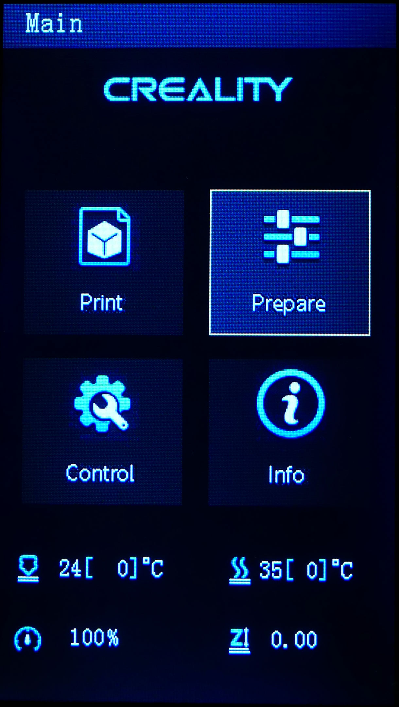
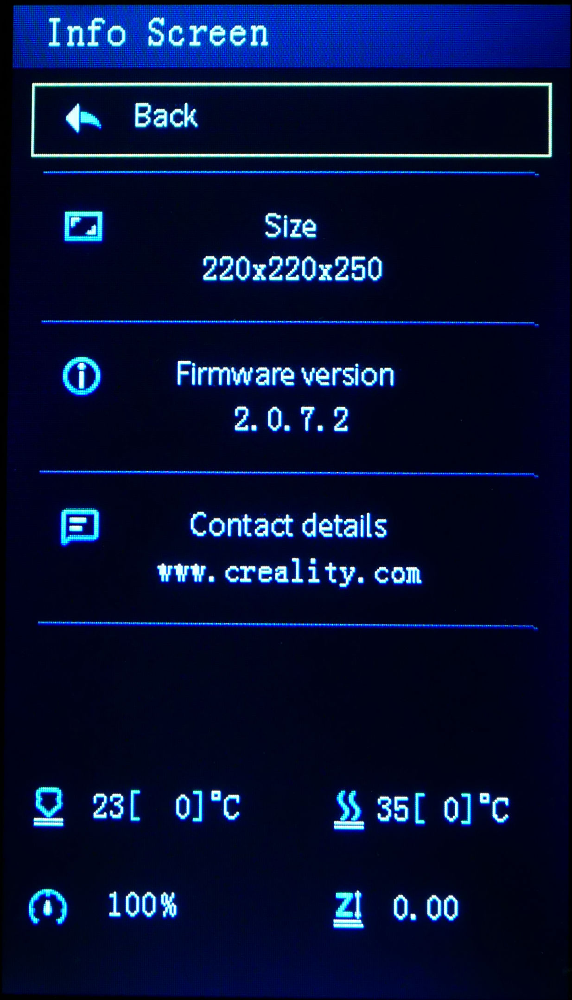
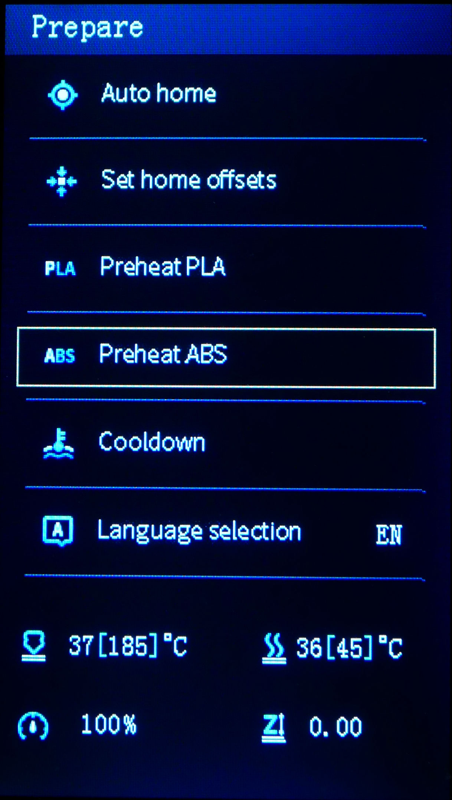

# Ender3_v2

je opensource printer cenovnega razreda 200€.

## Nastavitve:

Printanje PET-G:

- Nozzle temp: 230°C
- Bed temp: 70°C
- Max fan speed: 100%

### Start G-code

    ; Ender 3 Custom Start G-code
    G92 E0 			;Reset Extruder
    G28 			;Home all axes
    G1 Z2.0 F3000 		;Move Z Axis up not to scratch the Bed
    G1 X10.0 Y5.0 Z0.3 F5000.0 	;Move to start position
    G1 X200  Y5.0 Z0.3 F1500.0 E15 	;Draw the first line
    G1 X200  Y5.4 Z0.3 F5000.0 	;Move to side a little
    G1 X10.0 Y5.4 Z0.3 F1500.0 E30 	;Draw the second line
    G92 E0 			;Reset Extruder
    G1 Z2.0 F3000 		;Move Z Axis up not to scratch the Bed
    G1 X10.0 Y10 Z0.3 F5000.0 	;Move over to prevent blob squish

## Marlin

V originalu je bil firmware 1.0.2 , ki je imel nekaj bug-ov...

OpenSource firmware lahko dobimo na tej strani:
- [Marlin firmware](https://marlinfw.org/meta/download/)
- [nastavitve za 3D printerje](https://github.com/MarlinFirmware/Configurations/tree/release-2.0.7.2)

## Moji patchi firmwarea:

- marilin verzija 2.0.7
- oranžen okvirček pri ikonah
- oranžen okvirček kurzorja v sub-meniju
- ~~razvrstitev file-ov po datumu (novejši zgoraj)~~
- [patched_firmware](./bin/firmware-20201213-184304.bin)

### Galery

{width=30%} {width=30.4%} {width=30%}

