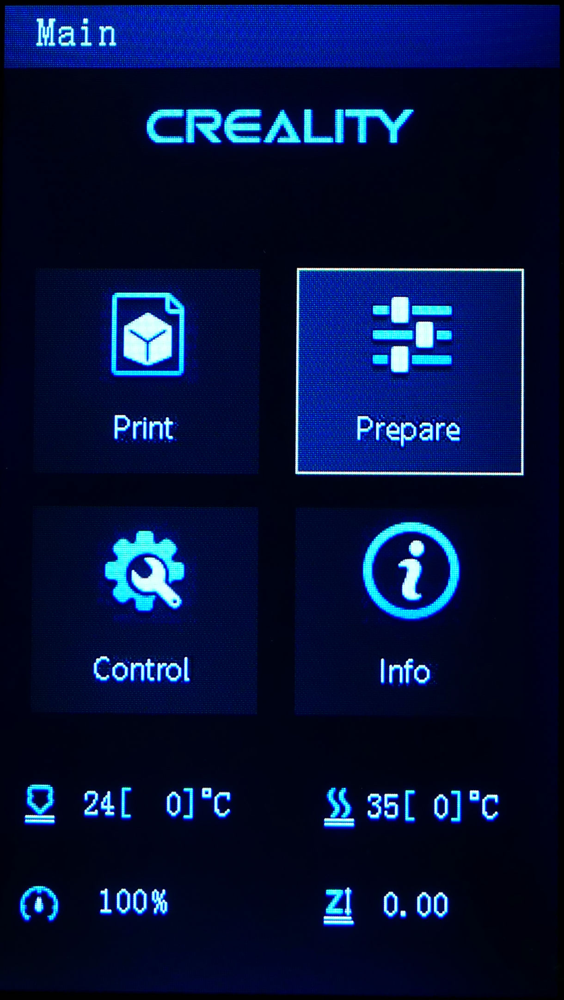
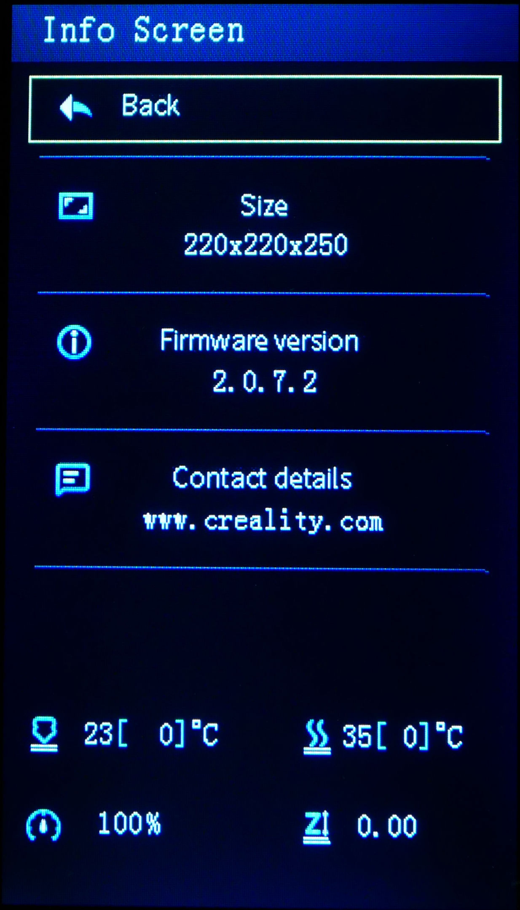
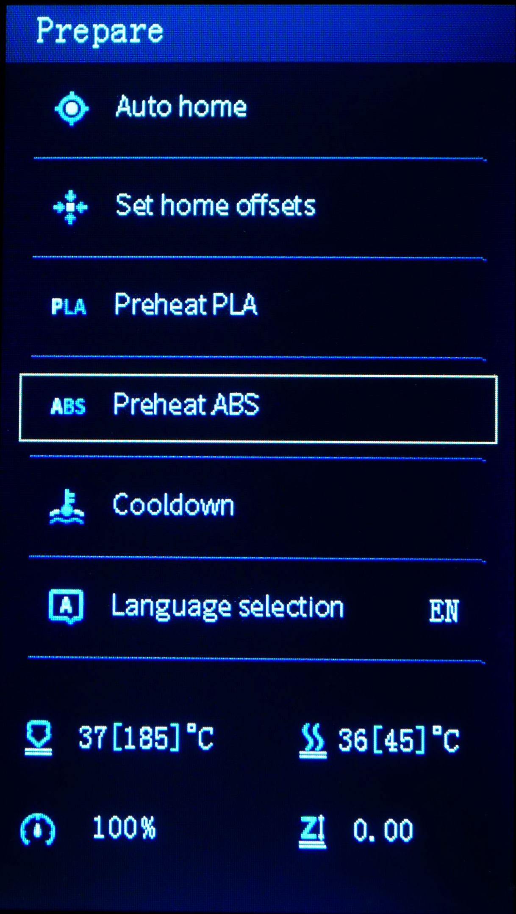

# Ender3_v2

je opensource printer cenovnega razreda 200€.

## Nastavitve:

- Nozzle temp: 230°C
- Bed temp: 75°C
- Max fan speed: 50%

## Marlin

V originalu je bil firmware 1.0.2 , ki je imel nekaj bug-ov...

OpenSource firmware lahko dobimo na tej strani:
- [Marlin firmware](https://marlinfw.org/meta/download/)
- [nastavitve za 3D printerje](https://github.com/MarlinFirmware/Configurations/tree/release-2.0.7.2)

## Moji patchi firmwarea:

- marilin verzija 2.0.7
- oranžen okvirček pri ikonah
- oranžen okvirček kurzorja v sub-meniju
- ~~razvrstitev file-ov po datumu (novejši zgoraj)~~
- [patched_firmware](./bin/firmware-20201213-184304.bin)

### Galery

{width=30%} {width=30.4%} {width=30%}
