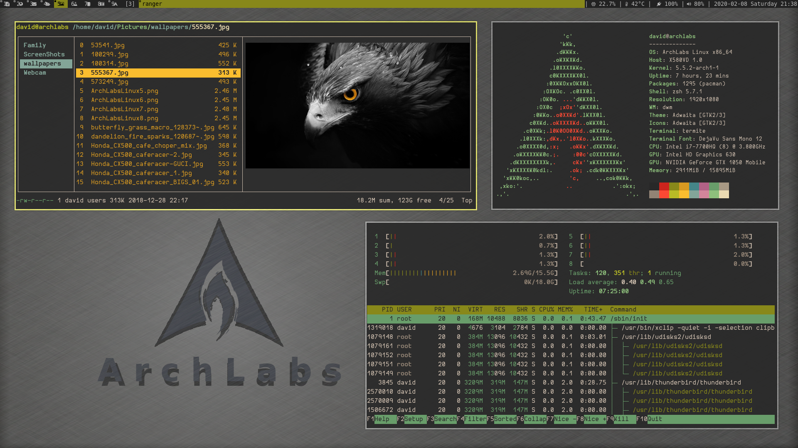

# LINUX

Na tej strani lahko najdete nekaj napotkov za Linux-e...

- TOC
{:toc}

## LINUX DISTROS

Nekaj predlogov različnih distribucij Linux operacijskih sistemov lahko najdete na strani [DistroWatch](https://distrowatch.com/):

### GENERAL
#### [LinuxMINT](https://linuxmint.com/)
Linux Mint is an Ubuntu-based distribution whose goal is to provide a classic desktop experience with many convenient, custom tools and optional out-of-the-box multimedia support. It also adds a custom desktop and menus, several unique configuration tools, and a web-based package installation interface. Linux Mint is compatible with Ubuntu software repositories.

#### [Pop!OS](https://pop.system76.com/)
Pop!_OS is an Ubuntu-based Linux distribution featuring a custom GNOME desktop. Pop!_OS is designed to have a minimal amount of clutter on the desktop without distractions in order to allow the user to focus on work. The distribution is developed by Linux computer retailer System76.

#### [Manjaro](https://manjaro.org/)
Manjaro Linux is a fast, user-friendly, desktop-oriented operating system based on Arch Linux. Key features include intuitive installation process, automatic hardware detection, stable rolling-release model, ability to install multiple kernels, special Bash scripts for managing graphics drivers and extensive desktop configurability. Manjaro Linux offers Xfce as the core desktop options, as well as KDE, GNOME and a minimalist Net edition for more advanced users. Community-supported desktop flavours are also available.

### MINIMAL

#### [BunsenLabs](https://www.bunsenlabs.org/)

BunsenLabs Linux is a distribution offering a light-weight and easily customizable Openbox desktop. The BunsenLabs distribution is based on Debian's Stable branch and is a community continuation of the CrunchBang Linux distribution.

#### [ArchLabs](https://archlabslinux.com/)

ArchLabs is a distribution based on Arch Linux and featuring the Openbox window manager as the primary desktop interface. ArchLabs is a 64-bit, rolling release distribution which provides a live DVD. The distribution can be installed using the AL-Installer system installer.

### FANCY

#### [Garuda](https://garudalinux.org/)

Garuda Linux is a rolling distribution based on the Arch Linux operating system. Unlike Arch Linux, Garuda Linux comes with a graphical installer (Calamares) for easy installation, and other advanced graphical tools for managing your system. Garuda is a performance-oriented distro with many performance enhancing tweaks. Some of the many tweaks include using zram, a performance CPU governor, along with custom memory management software. Garuda Linux has striven to provide system stability by including the Timeshift backup utility.

# INSTALLATION

- [notes](Vanilla_Arch_Install.md) - zapiski o namestitvi popolnoma novega Arch sistema
- [arch-chroot](arch_chroot.md) - sprememba root directoryja tako, da lahko ponovno popraviš sistem
- [linux image](installation_image.md)
- [disk partitioning](disk_partitioning.md) - disk partitioning and USB stick partitioning
- [mounting]()-to-do
- [RPM packages](prm_install.md)
- [pacman](pacman.md)
- [AppImage](appimage.md)
- [swap](swap.md)
- [boot process](boot.md)
- [general troubleshooting](general_troubleshooting.md)
- [X11](X11.md) Xorg je display server in zažene nek display manager

## AUR HELPRES

- [trizen](trizen.md)
- [yay](yay.md)

# SHELL (TERMINALs & UTILITYs & APPLICATIONs)

- [shell processing](shell_processing.md)
- [regular_expressions](regular_expressions.md)
- [Dokumentacija za SHELL]( http://tldp.org/LDP/Bash-Beginners-Guide/html/index.html )
- [basic shell](basic_shell.md)
- [shell_processing](shell_processing.md)
- [zsh](zsh.md)

## DEBUGGING AND LOG-files

- [Log files](log_files.md) - todo...
- [journal](journal.md) - Read Linux log file...
- [/usr/lib](libraries.md) - fixing libraries
- [dmesg](dmesg.md) - view and control the kernel ring buffer

## TERMINAL EMULATOR

- [st](st.md)
- [termite](termite.md)
- [termiantor](termiantor.md)
- [fonts](fonts.md)

## UTILITY PROGRAMS

-  AWK
- [auto-cpufreq](auto_cpufreq.md) - power management ... ta ni ok... uporabi TLP
- [convert](convert.md) - glavne funkcije na sliki (resize, flip, flop ...)
- [cpp](cpp.md) - programiranje v c-ju ali bolje v c++
- [cp ln mkdir](file_management.md) - koristne operacije za urejanje datotek in direktorijev
- [ffmpeg](ffmpeg.md) - manipulacija multimedijskih vsebin (video zvok convert snemanje)
- [general_expressions](general_expressions.md)
- [GIT](git.md)
- [grep](grep.md)
- [HomeAssistant](HomeAssistant.md ) - server za HomeAssistant, pametna hiša
- [inxi](inxi.md) - program za pregled hardware opreme (kater CPU, GPU, WiFi ...)
- [pandoc](pandoc.md)
- [SED](sed.md)
- [network check](network.md)
- [mdv](mdv.md) - markdown viwer
- [markdown](markdown.md) - markdown is markup language (efficient and easy to read as source)
- [power management](power_management.md) - power management
- [ssh](ssh.md)
- [xev](xev.md) - katero tipko smo pritisnili, key press
- [import](import.md) - terminal screen capture
- [scrot](scrot) - terminal screen-shot
- [socat](socat.md) - Multipurpose relay, preusmeri data flov kamorkoli, tudi na terminal bash...
- [tlp](tlp.md) - zelo dober program za nadzor powermanagementa

## APPLICATION PROGRAMS

- [beets](beets.md) - music taggig program
- [calcurse](calcurse.md)
- [cmus](cmus.md) - music player
- [minicom](minicom.md) - program za interakcijo s serijsko komunikacijo
- [ranger](ranger.md)
- [NeoVim](NeoVim.md)
- [NCDU](ncdu.md) - disk usages
- [qalc](qalc.md) - scientific calculator

# DESKTOP ENVIRONMENT

- [applications.desktop](applications_desktop.md)
- [get GUI windov info](xprop.md) - get window class
- [emojis](emojis.md)

## UTILITY PROGRAMS

- [dmenu](dmenu.md)
- [DigSigHost](DigSigHost.md)

## APPLICATION PROGRAMS

- [LibreOffice](LibreOffice.md) - Office programska orodja
- [OnlyOffice](OnlyOffice.md) - Office programska orodja
- [blender](blender.md) - 3D modeliranje
- [FlightGear](flightgrear.md) - Simuliranje letenja letal
- [Yenka](Yenka.md) - Simuliranje elektronskih vezij
- [EAGLE](EAGLE.md) - Načrtovanje elektronskih vezij in simulacija
- [ngspice](ngspice.md) - open source spice simulator
- [Fritzing](Fritzing.md) - Sestavljanje elektronskih vezij
- [FreeCAD](FreeCAD.md) - Program za parametrično modeliranje
- [HomeAssistant](HomeAssistant.md) - Program za nadzor doma - smart home
- [KiCAD](KiCAD.md) - Načrtovanje elektronskih vezij in simulacija
- [Meld](meld.md) - Program za primerjavo dveh datotek, direktorijev...
- [QCAD](QCAD.md) - 2D risanje tehnične dokumentacije
- [CURA](IRA3d.md) - 3D slicer za 3D print
- [Thunderbird](Thunderbird.md) - Elektronska pošta
- [PulseView](PulseView.md) - Osciloskop z digitalnim analizatorjem
- [sigrok](PulseView.md) - Knjižnice za PulseView
- [SimulIDE](SimulIDE.md) - Simuliranje elektronskih vezij, tudi krmilnikov Arduino
- [Siril](Siril.md) - Progam za obdelavo slik v astronomiji (stacking photos)
- [Statistics with pandas](gandas.md)
- [wine](wine.md) - Program for executing win programs

# HARDWARE

- [3D Printer](3dPrinting.md)
- [Bluetooth](Bluetooth.md)
- [Ender3_v2](Ender3_v2.md)
- [Hantek DSO4084B](HantekDSO4083.md) - Osciloskop Voltcraft DSO-1084F je Hantek DSO4084 na katerem teče Linux in ga lahko shekaš
- [IRA3D](IRA3d.md)
- [Arduino](Arduino.md)
- [HP-Printers](HP_Printers.md)
- [Intel Graphic card](Intel_graphic_card.md)
- [Keyboard](Keyboard.md)
- [Logitech mouse](LogitechMouse.md)
- [NVIDIA](nvidia.md)
- [Panasonic LX100II](Panasonic_LX100.md)
- [Screen Resolution](Xrandr.md)
- [Serial Communication](Serial.md)
- [Sleep](Sleep.md)
- [Tektronix Oscilloscope](TDS1002B.md)

