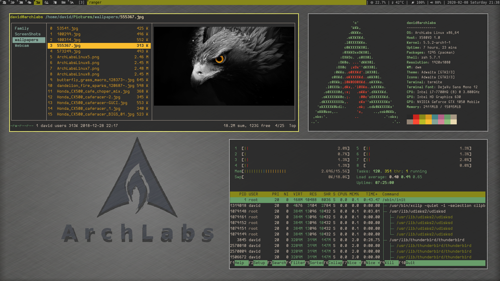

# LINUX
Na tej strani lahko najdete nekaj napotkov za Linux-e...

- TOC
{:toc}

# INSTALLATION

- [disk partirioning](disk_partitioning.md)
- [mounting]()-to-do
- [RPM packages](prm_install.md)
- [pacman](pacman.md)
- [swap](swap.md)
- [boot process](boot.md)
- [general troubleshooting](general_troubleshooting.md)

## AUR HELPRES

- [trizen](trizen.md)
- [yay](yay.md)

# SHELL (TERMINALs & UTILITYs & APPLICATIONs)

- [shell processing](shell_processing.md)
- [regular_expressions](general_expressions.md)

## SHELL

[Dokumentacija za SHELL]( http://tldp.org/LDP/Bash-Beginners-Guide/html/index.html )
- [basic shell](basic_shell.md)
- [shell_processing](shell_processing.md)
- [zsh](zsh.md)

## TERMINAL EMULATOR

- [st](st.md)
- [termite](termite.md)
- [termiantor](termiantor.md)
- [fonts](fonts.md)

## UTILITY PROGRAMS

-  AWK
- [convert](convert.md) - glavne funkcije na sliki (resize, flip, flop ...)
- [ffmpeg](ffmpeg.md) - manipulacija multimedijskih vsebin (video zvok convert snemanje)
- [general_expressions](general_expressions.md)
- [grep](grep.md)
- [pandoc](pandoc.md)
- [SED](todo...) 
- [network check](network.md)

## APPLICATION PROGRAMS

- [ranger](ranger.md)
- [NeoVim](NeoVim.md)

# DESKTOP ENVIRONMENT

- [applications.desktop](applications_desktop.md)
- [get GUI windov info](xprop.md)

## UTILITY PROGRAMS

- [dmenu](dmenu.md)
- [DigSigHost](DigSigHost.md)

## APPLICATION PROGRAMS

- [LibreOffice](LibreOffice.md)
- [blender](blender.md)
- [FlightGear](flightgrear.md)
- [Yenka](Yenka.md)
- [FreeCAD](FreeCAD.md)
- [PulseView](PulseView.md)
- [sigrok](PulseView.md)

# HARDWARE

- [Arduino](Arduino.md)
- [HP-Printers](HP_Printers.md)
- [Intel Graphic card](Intel_graphic_card.md)
- [Keyboard](Keyboard.md)
- [Screen Resolution](Xrandr.md)
- [Sleep](Sleep.md)
- [3D Printer](IRA3d.md)
- [CURA](IRA3d.md)
- [Tektronix Oscilloscope](TDS1002B.md)

