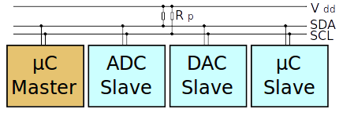
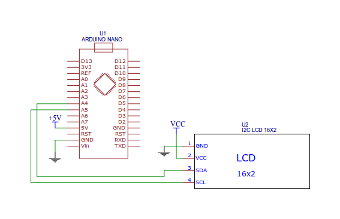

# Serijska komunikacija

## USART (RS232)

Pogosto potrebujemo neko povratno informacijo o delovanju ali stanju
nekaterih spremenljivk. To lahko naredimo preko serijske komunikacije
preko katere je mikrokrmilnik povezan z računalnikom.


> ### NALOGA: UART komunikacija  
> Preizkusite naslednji program in vzpostavite serijsko komunikacijo med krmilnikom in računalnikom.

```cpp
int potValue = 0;
void setup() {
  Serial.begin(9600);
}

void loop() {
  potValue = analogRead(0);
  Serial.print("potenciometer = ");
  Serial.println(potValue);
  delay(200);
}
```

## I2C komunikacija

{#fig:i2c_info}

Komunikacija lahko poteka tudi na drugačne načine,
na primer med več napravami. Ena takih komunikacij je t.i. I2C
komunikacija. Več o tej komunikaciji si lahko preberemo na wikipediji o
[I2C podatkovnem vodilu](https://en.wikipedia.org/wiki/I2C).

V primeru, ki ga prikazuje slika je glavna naprava označena kot
»master«, ki bo v našem primeru Arduino NANO. Ostale naprave pa so
»podložniki«. Vsak od njih mora imeti svoj naslov in mora zanj glavna
naprava vedeti, saj le tako lahko vzpostavi komunikacijo z njim (podobno
kot IP številke v TCP/IP omrežju). Naslove podložnikov včasih lahko
nastavimo ročno na podložniku ali pa so zapisani že v sami napravi
podložnika. Slednjo situacijo si lahko ogledamo na primeru LCD z I2C
vodilom.

{#fig:i2c_lcd}

> ### NALOGA: Priključitev LCDja  
> Priključite LCD z I2C vodilom na Arduino NANO tako, kot prikazuje
> slika in s programom, ki ga najdete na [Arduino strani](http://playground.arduino.cc/Main/I2cScanner), ugotovite
> njegov naslov, ter ga zapišite : 

## Izpis podatkov na LCD z I2C vodilom

V prejšnji vaji smo si ogledali kako pridobimo naslov LCDja, ki ga
potrebujemo v I2C komunikaciji. Ker je sam protokol komunikacije bolj
zapleten, bomo v ta namen uporabljali knjižnico LiquidCrystal\_I2C.h.
Takih knjižnic je veliko, mi smo se odločili za uporabo te, ki jo lahko
snamete iz Bitbucket portala avtorja [Francisco Malpartida](https://bitbucket.org/fmalpartida/new-liquidcrystal/downloads/)
([download](https://bitbucket.org/fmalpartida/new-liquidcrystal/downloads/NewliquidCrystal_1.3.4.zip)),
v kateri so uporabljene enake funkcije, kot če bi lcd upravljali po
4-bitnem ali 8-bitnem vodilu. Stisnjeno vsebino izvlečite v »domači
Arduino direktorij«, ter ponovno zaženite Arduino IDE.

> ### NALOGA: I2C komunikacija  
> Preskusite naslednji program in ga komentirajte:

```cpp
#include <Wire.h>
#include <LiquidCrystal_I2C.h>
LiquidCrystal_I2C lcd(0x27, 2, 1, 0, 4, 5, 6, 7, 3,POSITIVE);
int potValue = 0;
void setup() {
  pinMode(14,INPUT);
  lcd.begin(16,2);
}

void loop() {
  potValue = analogRead(0);
  lcd.clear();
  lcd.print("potenciometer:");
  lcd.setCursor(0,1);
  lcd.print(potValue);
  delay(200);
}
```

> ### NALOGA:  
> Program popravite tako, da bo na LCD izpisoval izmerjeno napetost v voltih.
