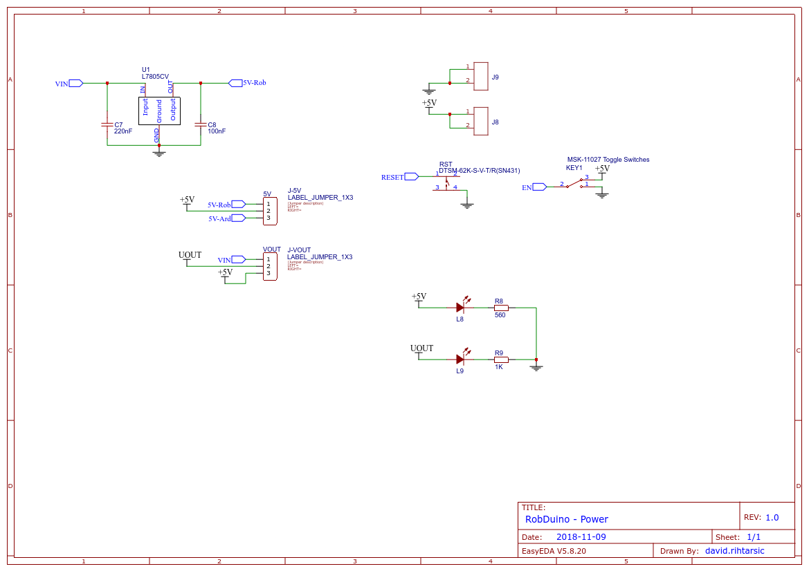
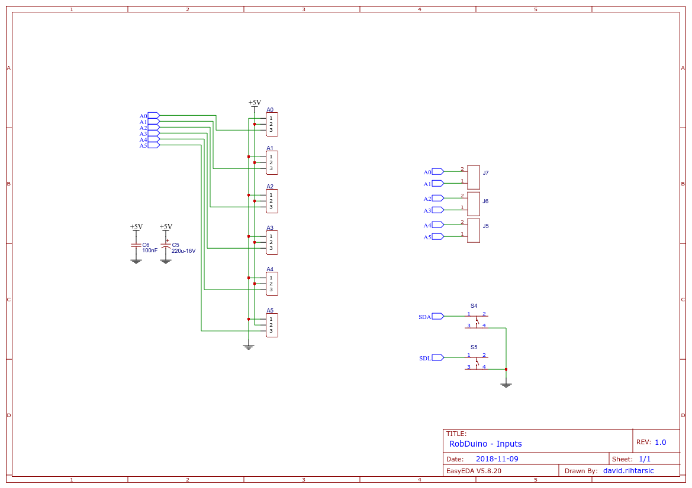
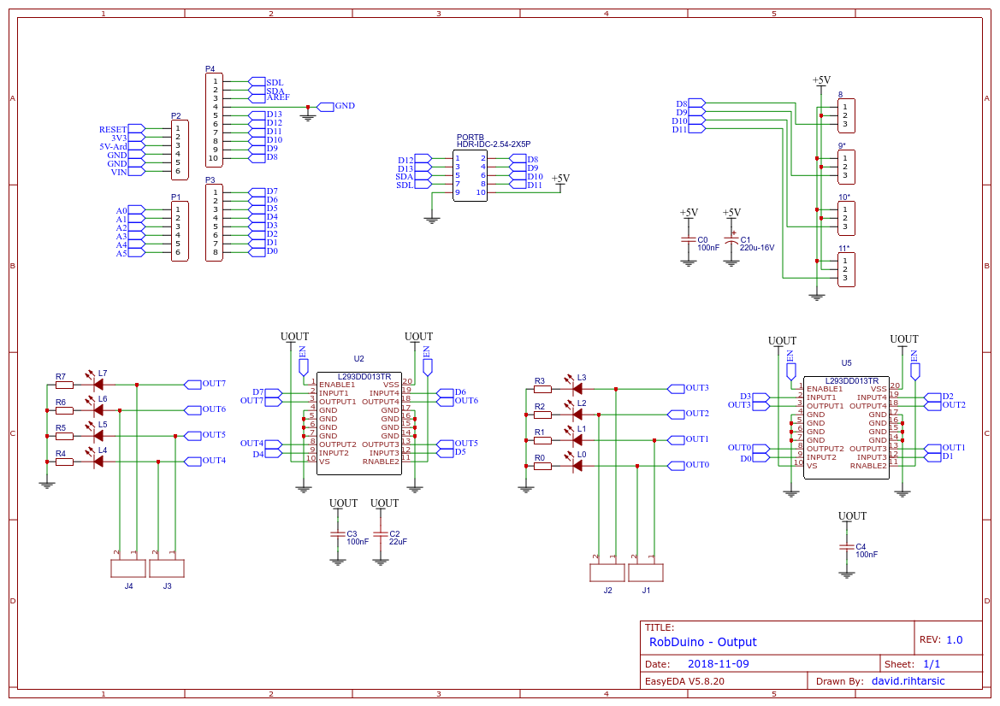

# NAČRTOVANJEM ELEKTRONSKIH VEZIJ
Tudi pri pedagoškem procesu je pomembno, da so vezja narisana nazorno (tako sheme,
kot tudi sestavljanje vezja na prototipni ploščici). V ta namen lahko uporabljate različna
orodja. Omenili bomo vsaj dva, ki sta prosto-dostopna in bi priporočali njihovo uporabo.

## Stikalne sheme
EasyEDA je spletno orodje, ki je namenjeno risanju elektronskih vezij, načrtovanju TIV in
izdelavi potrebnih datotek za njihovo izdelavo. Primer stikalne sheme krmilnika RobDuino lahko vidite
na [@fig:RobDuino_Power],[@fig:RobDuino_Inputs] in [@fig:RobDuino_Output].

{#fig:RobDuino_Power}

{#fig:RobDuino_Inputs}

{#fig:RobDuino_Output}

> ### NALOGA: Stikalne sheme
> V programskem orodju EasyEDA narišite shemo astabilnegamultivibratorja, izvozite sliko sheme in j vključite v poročilo.

## Tiskana vezja

> ### NALOGA: Risanje TIV
> Za to vezje izrišite TIV in izpišite seznam elektronskih komponent. Izgled TIV izvozite in vstavite v poročilo. Prav tako vstavite seznam komponent.

## Virtualna vezja

Sestavljanje vezij pa na prototipni plošči pa je drugačen proces in za začetnike precej zahteven,
zato je priporočljivo, da uporabljate orodja kot so TinkerCAD-Circuits.

> ### NALOGA: Sestavljanje virtualnih vezij
> V programskem orodju TinkerCAD-Circuits sestavite vezje na prototipni ploščici in sliko vstavite v poročilo.
>

