**DIGITALNI KLAVIR**

**IN METRONOM**

Ime in priimek avtorja: Ajda Grilc

Vpisna številka: 01180866

Smer študija: Ma-Te

Datum: 3.1.2021

# **POVZETEK**

Pri predmetu Projekti iz elektronike, sem si za projekt izbrala
digitalni klavir, dodatno pa sem izdelala še metronom, ki nam je lahko
pri igranju v veliko pomoč. Pri izdelavi digitalnega klavirja sem na
krmilnik Arduino UNO vezala 8 tipk, ki predstavljajo lestvico C-dur,
torej tone C, D, E, F, G, A, H in C2. Ob pritisku na posamezno tipko,
buzzer odda ton, s točno določeno frekvenco in nam omogoči, da lahko
zaigramo poljubno melodijo. Metronom pa sem izdelala tako, da s
spreminjanjem vrednosti potenciometra, svetleča dioda utripa z določeno
hitrostjo in daje ritem.

## Ključne besede

digitalni klavir, krmilnik, potenciometer, buzzer, metronom, nota,
lestvica, tipka, frekvenca

## Abstract -- Digital piano and metronome

For this project I\'ve made a digital piano and a metronome to go along
with it. When making the digital piano, I connected 8 buttons to the
Arduino UNO controler, which represent the C major scale, the tones C,
D, E, F, G, A, H and C2. When a single button is pressed, the buzzer
emits a tone, with a specific frequency and allows us to play any
melody. I made the metronome so that by changing the value of the
potentiometer, the LED flashes at a certain speed and gives a rhythm.

## Key words

digital piano, controler, potentiometer, buzzer, metronome, note, scale,
button, frequency

# **UVOD**

Za ta projekt sem se odločila že na samem začetku, ko nam je profesor
predstavil nekaj primerov projektov in sicer zaradi svoje ljubezni do
glasbe. Že nekaj let namreč igram klavir, zato se mi je zdelo zelo
zanimivo, da bi izdelala svoj digitalni klavir. Na internetu lahko
najdemo veliko podobnih projektov, zato sem se odločila, da poleg
klavirja izdelam še metronom, ki bo služil za dajanje ritma med samim
igranjem. Projekt se mi zdi zelo zanimiv, zabaven in poučen, zato menim,
da bi ga učenci lahko izdelali v osnovni šoli pri izbirnih predmetih, ki
se navezujejo na tehniko in računalništvo. Ideje za projekt sem večinoma
črpala iz interneta ter iz pridobljenega znanja iz elektronike.

# **DELOVANJE VEZJA**

Za izdelavo digitalnega klavirja sem uporabila krmilnik Arduino UNO. Na
prototipno ploščico sem vezala 8 tipk, ki predstavljajo C-dur lestvico,
ki je sestavljena iz tonov C, D, E, F, G, A, H in C2. S programsko kodo
krmilnik preveri ali so tipke pritisnjene ali ne. V primeru, da je tipka
pritisnjena, ima točno določeno frekvenco (C = 261 Hz, D = 294 Hz, E =
329 Hz, F = 349 Hz, G = 392 Hz, A = 440 Hz, H = 493 Hz in C2 = 523 Hz),
ki jo buzzer odda. V primeru, da tipka ni pritisnjena, buzzer ne oddaja
zvoka. Za izdelavo metronoma pa sem uporabila krmilnik Arduino NANO ter
komponente: svetlečo diodo, 1kΩ-ski upor in potenciometer. S programsko
kodo krmilnik bere in shranjuje analogno vrednost potenciometra.
Svetleča dioda se prižge in je prižgana tako dolgo, kot je prebrana
vrednost in ugasnjena tako dolgo kot je prebrana vrednost, ki se
pretvori v milisekunde (če je vrednost 1000, to pomeni da bo svetleča
dioda prižgana 1 sekundo in ugasnjena 1 sekundo). Svetleča dioda utripa
in daje ritem. Manjša kot je vrednost potenciometra, hitreje bo svetleča
dioda utripala.

Na izdelan digitalen klavir je možno zaigrati veliko različnih melodij.
Enostavne pesmice, ki sem jih zaigrala na videoposnetku so: Kuža pazi,
Čuk se je oženil Marko skače in Na planincah.

Povezava, do videoposnetka delovanja mojega vezja:

{:targer="_blank"}

**Elektrotehniški shemi vezja**, narejeni v programu EasyEDA:

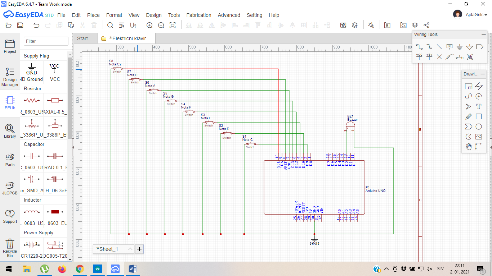{width="6.416666666666667in"
height="3.950089676290464in"}

Slika 1: Elektrotehniška shema vezja - digitalni klavir

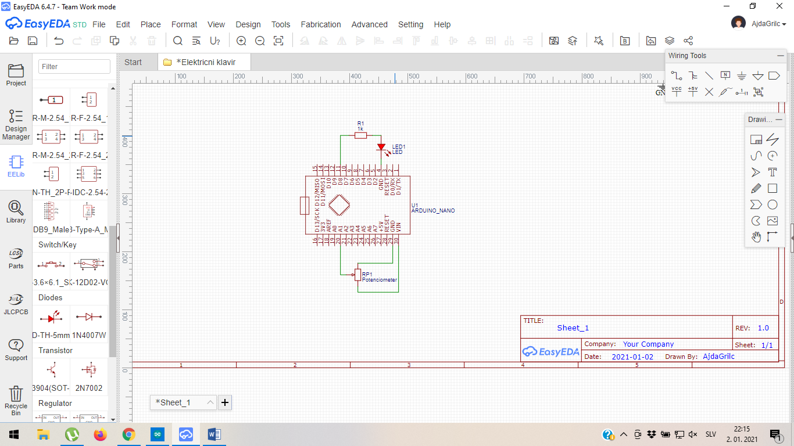{width="2.4462029746281715in"
height="2.6506944444444445in"}

Slika 2: Elektrotehniška shema vezja - metronom

**Shemi vezja**, narejeni v programu Tinkercad:

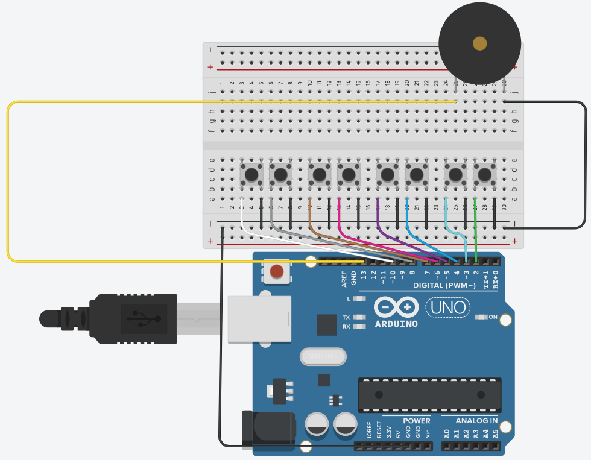{width="3.8541666666666665in"
height="3.000658355205599in"}

Slika 3: Shema vezja - digitalni klavir

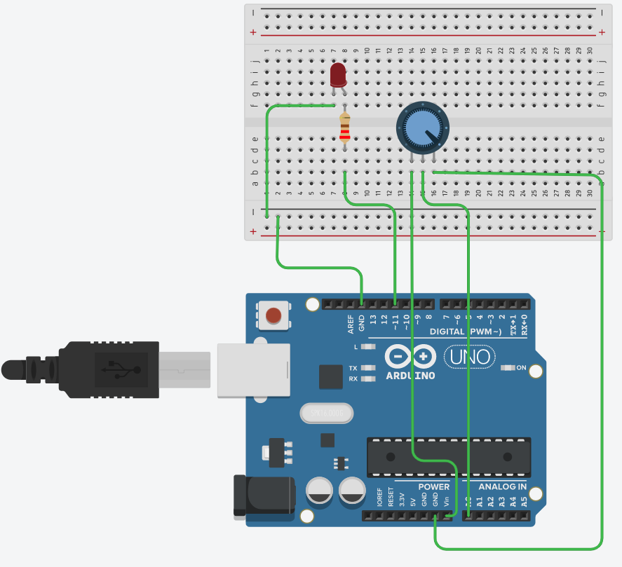{width="3.0833333333333335in"
height="2.8121139545056866in"}

Slika 4: Shema vezja - metronom

# **IZDELAVA VEZJA**

Glede na elektrotehniški shemi vezja (slika 1, slika 2), narejeni s
pomočjo programa EasyEDA in glede na simulaciji vezij (slika 3, slika
4), narejeni v programu Tinkercad, sem izdelala digitalni klavir in
metronom. Pri izdelavi digitalnega klavirja sem najprej na prototipno
ploščico dala 8 tipk, ki ponazarjajo C-dur lestvico in buzzer. Tipke sem
po vrsti priključila na pine D2, D3, D4, D5, D6, D7, D8 in D10 krmilnika
Arduino UNO in na ozemljitev (GND). Pozitivni priključek buzzerja sem
neposredno priključila na pin D13 krmilnika Arduino UNO, negativni
priključek buzzerja pa na GND. Pri izdelavi metronoma, sem najprej na
prototipno ploščico dala krmilnik Arduino NANO, nato sem nanj vezala
potenciometer in svetlečo diodo. Prvo nožico potenciometra sem
priključila na napajanje (VIN), sredinsko nožico na vhod A1 in tretjo
nožico na ozemljitev (GND) krmilnika Arduino NANO. Svetlečo diodo (LED)
sem vezala v prevodni smeri. Anodo (poz.) svetleče diode sem preko upora
(1kΩ) priključila na pin D11, katodo (neg.) pa na ozemljitev. Oba
krmilnika sem z USB-kabloma priključila na osebni računalnik in na njiju
naložila ustrezni programski kodi.

**Material**

⦁ krmilnik Arduino NANO

⦁ krmilnik Arduino UNO

⦁ 2 USB-kabla, za povezavo krmilnikov z računalnikom

⦁ prototipna ploščica

⦁ buzzer

⦁ 8 tipk

⦁ 1 kΩ-ski upor

⦁ rdeča svetleča dioda (LED)

⦁ potenciometer

⦁ vezne žičke (8 modrih, 2 rumeni, 2 zeleni, 7 oranžnih, 6 sivih, 3
črne)

**Orodja in pripomočki**

⦁ osebni računalnik z nameščenim operacijskim sistemom Windows

⦁ Arduino IDE, integrirano programsko razvojno okolje

⦁ Tinkercad, aplikacija za 3D oblikovanje, elektroniko in kodiranje

⦁ EasyEDA

**Izvorna koda programa**

1\. Digitalni klavir

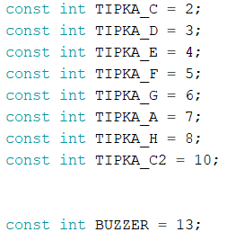{width="2.7395833333333335in"
height="2.7916666666666665in"}

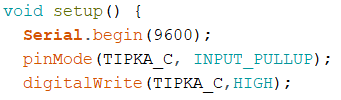{width="3.5520833333333335in"
height="1.0416666666666667in"}

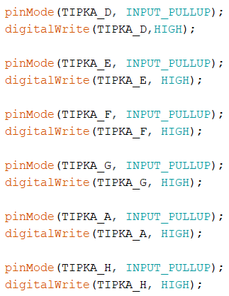{width="3.3645833333333335in"
height="4.34375in"}

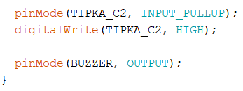{width="3.6145833333333335in"
height="1.3645833333333333in"}

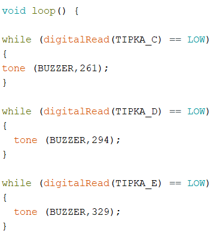{width="3.8125in"
height="2.8541666666666665in"}

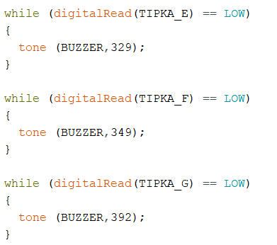{width="4.072916666666667in"
height="3.6041666666666665in"}

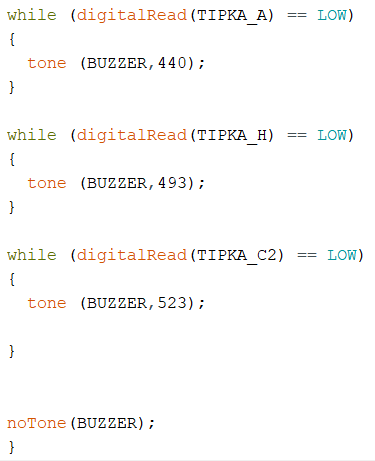{width="3.90625in"
height="4.802083333333333in"}

2\. Metronom

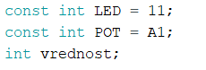{width="2.3958333333333335in"
height="0.8125in"}

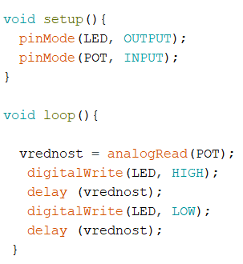{width="3.15625in" height="3.4375in"}

{width="4.546335301837271in"
height="3.688888888888889in"}

Slika 5: Sestava vezja - digitalni klavir

{width="4.677863079615048in"
height="3.1770833333333335in"}

Slika 6: Sestava vezja - metronom

# **ZAKLJUČEK IN UGOTOVITVE**

Z mojim projektom sem zadovoljna, saj sem z veliko truda prišla do
rezultatov, ki sem si jih želela. Kar nekaj težav sem imela pri pisanju
programske kode in nato pri sestavljanju vezja za digitalen klavir. Ko
mi je programska koda in narejeno vezje v programu Tinkercad že
delovalo, sestavljeno vezje na prototipni ploščici še vedno ni delalo.
Razlog so bili predvsem nedelujoči elektronski gradniki, saj je vezje
delovalo, ko sem jih zamenjala. Sprva sem si zamislila, da bi poleg tipk
vezala še svetleče diode, vendar je bilo prostih premalo pinov, da bi to
idejo uresničila, zato sem na koncu namesto tega naredila metronom.
Vezje se mi zdi zelo uporabno, saj lahko na izdelan digitalen klavir
zaigram veliko različnih pesmic.

# **VIRI IN LITERATURA**

\[1\] Kocijančič S. (2019). *Elektronika 1*. Ljubljana; Pedagoška
fakulteta, Univerza v Ljubljani.

\[2\] Kocijančič S. (2020). *Projekti iz elektronike*. Ljubljana;
Pedagoška fakulteta, Univerza v Ljubljani,

\[3\] Rihtaršič D. (2020). *Projekti iz elektronike -- vaje*. Ljubljana;
Pedagoška fakulteta, Univerza v Ljubljani.

\[4\] How to make Arduino Piano keyboard (b.d.)
\[<https://create.arduino.cc/projecthub/ashshaks/how-to-make-arduino-piano-keyboard-ccaa6a?fbclid=IwAR3wtJ0tNcGFVhVUYhlgvyAUrUQ-G1_Ei55rw5GvNWbhvd1xFfaGHwtkScc>\].

\[5\] Tone (b.d.)

\[<https://www.arduino.cc/reference/en/language/functions/advanced-io/tone/?fbclid=IwAR2UhojefVrVX7AdNJ3fItpdy-nnkajmTI3sGcduK3JUz_xETdAuNU3VrTo>\].

\[6\] Melody (b.d.)
\[<https://www.arduino.cc/en/tutorial/melody?fbclid=IwAR0Fkm5LxrjAOwcIzp0CYm-fw7-Bz42QHPNHSXYClKedYh-MDTRkfYYUODE>\].

\[7\] How to use potentiometer (b.d)

\[<https://www.instructables.com/How-to-use-Potentiometer-Arduino-Tutorial/?fbclid=IwAR0VimsN0rrUjbGfJgBSz2fgMQPt01Ic-p_SFRc0PJMeXBYVcSj_dQP-S_8>\].
