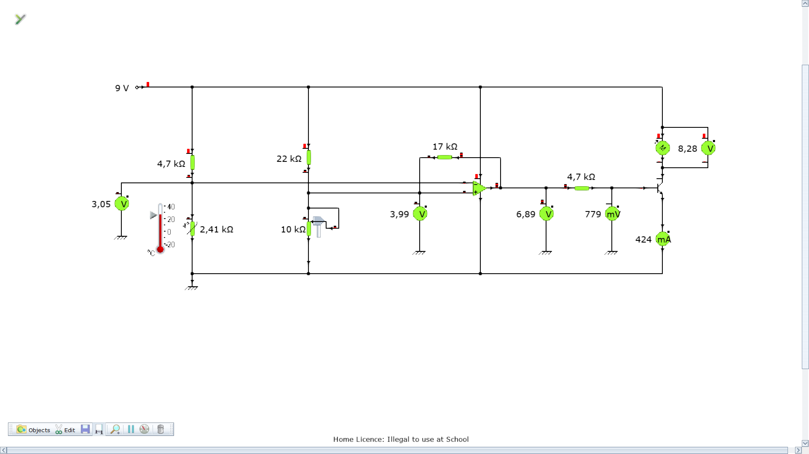

Študijski program Fizika -- Tehnika

Mini projekt pri Projektih iz elektronike

# VENTILATOR NA TEMPERATURO

Amadej Kobal

01180190

Ljubljana, 2021

# Povzetek

V članku bomo reševali težavo o tem, kako se lahko ventilator vklopi
brez naše prisotnosti, s pomočjo spreminjanje napetosti na NTC
termistorju, in vzdržuje željeno temperaturo, ki jo lahko nastavimo s
spreminjanjem vrednosti elementov našega vezja. V uvodu bomo na kratko
opisali, kje bi lahko tako vezje uporabili v življenju oz. kje ga lahko
zasledimo, nato bomo opisali delovanje posameznih sklopov vezja, nakar
pa bom še pokazal postopek sestavljanja s fotografijami. Pokazal bom
tudui posnetek in prikaz delovanja.

# Ključne besede

Schmitt trigger, temperaturno krmiljenje ventilatorja, NTC termistor,
tranzistor kot stikalo.

# Uvod

To vezje lahko uporabimo za različne namene. V moji izvedbi bi bilo to
vezje najbojle uporabljeno za kakšen ojačevalnik, ker bi s tem lažje
odvajali odvečno toploto, ki se zadržuje v ohišju. Na eno stran ohišja
bi pritrdili ventilator, na drugo stran ohišja po diagonali, pa bi
naredili reže skozi katere bi lahko topel zrak izhajal.vezje bi
sestavili tako, da bi ventilaltor in NTC termistor bila ločeno
prispajkana na vezje z žičkami. To nam bi odprlo več različnih možnosti
za umestitev v ohišje. Ventilator bi lahko tako postavili kjer bi želeli
in bi dolžino žičk enostavno prilagodili naši postavitvi, enako pa velja
tudi za NTC termistor. Le-tega bi lahko prosto premikali po vezju
ojačevalnika. Najprej bi lahko preverili kateri element na našem vezju
se najbolj segreva, nato pa bi NTC postavili nekje v bližino tistega
element, ta pa bi nato nadzoroval, kdaj se bo ventilator prižgal.

Obstajajo pa še drugi nameni uporabe takšnega vezja, vendar bi bilo
potrebno dodati še kakšen element v naše že obstoječe vezje.

Primer bi lahko bil, da bi dodali grelni element pred ventilator in ko
bi se vrtel, bi odvajal topel zrak v okolico. Tu bi morali le vezje
preurediti v tem smislu, da bi se ventilator in grelni element
izklopila, ko doseže določeno najvišjo temperaturo, ki jo želimo, ko pa
ta temeratura pade pod našo najnižjo določeno pa se ventilator in grelni
element spet vklopita in spet grejeta prostor (termostat).

Vezje, ki pa bi delovalo za odvajanje toplote, bi ga lahko umestili v
računalnik, če bi dodali del, ki bi nadziral vrtljaje ventilatorja s
pulzno širinsko modulacijo. Tako izvedbo bi lahko uporabili v
računalniku, tako da ko bi opravljali zahtevne procese in bi se naš
procesor segreval, bi se tudi ventilator hitreje vrtel in bi hitreje
odvajal toploto. Ko pa na računalniku ne bi delali nič posebnega pa bi
bili vrtljaji ventilatorja minimalni.

# Delovanje vezja

Za delovanje ni bilo potrebnih veliko elementov, je pa bilo potrebno
neko razumevanje glede posameznih sklopov, da je delovanje vezja
smiselno.

## Delilnik napetosti z NTC termistorjem

{width="1.9608694225721786in"
height="2.712839020122485in"}

Del vezja je sestavljen iz dveh elementov, upor in NTC termsitor. Naloga
tega vezja je da nam spreminja potencial napetosti s tem ko se
temperatura okolice viša oz. niža.

NTC deluje tako, da se mu njegova upornost spreminja s temperaturo. Čim
večja je temperatura, tem manjša je upornost NTC-ja. Čim manjša je
temperatura, tem večja je upornost NTC-ja. Upornost NTC se ne spreminja
linearno temveč f(x) = 1/x. S tem, ko se temperatura termistorju
zmanjša, se mu upornost poveča, kar privede do tega da bo na njem takrat
tudi večji napetostni potencial. Ko pa temperatura termistorja narašča
pa bo začela upornost termistorja padati, kar pa bo privedlo do znižanja
potenciala napetosti na termistorju. Primer ko bo termistor dovol
ohlajen bo lahko njegova upornost teoretično enaka referenčnemu uporu.
Takrat bo na njem enak napetostni potencial kot je na referenčnem uporu
U = 4,5 V. Ko pa temperatur naršča pa lahko teoretična upornost doseže
vrednost 1,25 kΩ, takrat pa bo potencial na NTC termistorju le U = 1 V.

## Schmitt trigger (Šmitov sprožilnik)

{width="3.6636964129483816in"
height="2.634782370953631in"}

Namen schmittovega sprožilnika je, da prepreči nepotrbne preklope
visokega in nizkega stanja na izhodu, kar bi v našem primeru pomenilo
nenehen vklop in izklop ventilatorja. Z uporoma in potenciometrom
nastavljamo širino histereze tako, da ta določa kdaj se bo ventilator
vklopil in kdaj se bo izklopil. Potenciometer je uporabljen, da lahko to
mejo nekoliko spreminjamo in nastavljamo brez da bi vsakič potrebovali
zamenjati vse tri upore.

Delovanje poteka tako da če je napetostni potencial višji na
neinvertirajočem vhodu (označeno +) kot na invertirajočem vhodu
(označeno -) se bo ventilator vklopil.

To lahko povežemo to s NTC termistorjem. V primeru, ko je na NTC-ju
majhen napetostni potencial in prezeže najnižjo vrednost napetosti na
neinvertirajočem vhodou (low threshold), takrat je NTC segret in
potrebujemo hlajenje z ventilatorjem. To je priskrbljeno s tem, da je na
neinvertirajočem vhodu večja napetost kot na invertirajočem, kar pa
pomeni, da bo naš izhod v zgornjem nasičenju.

V primeru, da je NTC dovolj ohlajen pa bo naptost na neivertirajočem
vhodu manjša kot na invertirajočem vhodu. Napetost na invertirajočem
vhodu bo presegla najvišjo določeno vrednost na neinvertirajočem vhodu
(high threshold) in na izhodu ne bo napetosti (bo v spodnjem nasičenju).
To pomeni, da se tudi ventilator posledično ne bo vrtel \[2\].

## Tranzistor kot stikalo

{width="3.1260870516185477in"
height="2.8618055555555557in"}

Tranzistor v našem vezju ima nalogo, da na ventilator enkrat pripelje
vseh 9 V napajalne napetosti in enkrat pa 0 V. Brez njega bi bilo na
ventilatorju največ 7 V, kar je zgornje nasičenje izhoda schmittovega
sprožilnika in takrat ventilator ne bi ne bi bil popolnoma izkoriščen.

Na izdelanem vezju sem izmeril napetost zgornjega in spodnjega nasičenja
ki znašata:

U~ZN~ = 7,26V

U~SN~ = 0,56V

Ko pripeljemo iz izhoda schmittovega sprožilnika napetost U~SN~ na bazo
tranzistorja, je ta napetost prenizka, da bi odprla tranzistor in bi ta
prevajal. Zato ker je U~SN~ tako nizka in ne presega 0,7 V, ki je
kolenska napetost diode tranzistor ne prevaja. Takrat tok I~B~ ne teče
in zato tudi I~C~ ne bo tekel. To pomeni, da bo napetost na U~CE~ na
enakem potencialu kot U~CC~ in se zato ventilator ne bo vrtel.

Ko pa na vhod tranzistorja dobimo napetost U~ZG~, ki znaša 7,26 V, je
pomembno, da postavimo upor pred bazo tako, da bomo omejili tok, ki bi
tekel čez diodo. S tem dobimo padec napetosti na diodi med približno 0,7
V in 0,8 V , ki so potrebni, da bo tranzistor pričel prevajati. Tok I~B~
teče in zato bo tudi I~C~ tekel. To pomeni, da bo napetost na U~CE~ =
U~CC~ - U~VENT.~ Ker je med U~CC~ in U~CE~ razlika v potencialih tok
I~C~ teče in ventilator se vrti \[1\].

# Sestava vezja

{width="3.34375in"
height="2.2343755468066493in"}

Najprej sm sestavil delilnik napetosti z NTC termistorjem.

{width="2.72799978127734in"
height="3.061073928258968in"}
{width="3.095651793525809in"
height="2.285481189851269in"}

Nato sem sestavil drugo delilnik napetosti, ki je hkrati del
schmittovega sprožilnika.

{width="3.7810115923009624in"
height="1.721376859142607in"}

Potem sem izdelal še drugi del schmittovega sprožilnika z integriranim
vezjem LM358P.

{width="2.765686789151356in"
height="3.483642825896763in"}

Nato sem vezal upora zaporedno med priključka 1 in 3, dodal žički na
invertirajoči in neivertirajoči vhod, iz izhoda LM358P sem povlekel
povezavo z belo žičko v novo vrstico luknjic.

{width="3.209913604549431in"
height="3.4914851268591427in"}

Iz bele žičke sem nadaljeval sestavljanje z dodajanjem upora med le-to
in bazo tranzistorja. Emitor tranzistorja sem neposredno povezal z
GND-jem in med kolektor in napajalno linijo sem povezal še ventilator.

{width="6.363999343832021in"
height="4.3979101049868765in"}

Končna slika sestavljenega vezja.

Uporabljeni elementi:

-   Upori 22kΩ; 17kΩ; 4,7kΩ; 4,7kΩ;

-   Potenciometer 10kΩ;

-   NTC termistor 4K7;

-   LM358;

-   BD139 (NPN);

-   Ventilator 12 V;

-   Napajanje 9 V;

-   Žarnica 12 V, 5W (za segrevanje NTC-ja);

-   Testna ploščica (protoboard).

Povezava do posnetka:

<https://youtu.be/-YLOqWEuLlY>

6.  # Dokumentacija vezja (Elektrotehniška shema)

7.  # Viri

\[1\] Kocijančič, S., Elektronika. Ljubljana; Pedagoška fakulteta,
Univerza v Ljubljani (2019/2020).

\[2\] Kocijančič, S., Projekti iz elektronike. Ljubljana; Pedagoška
fakulteta, Univerza v Ljubljani (2011,2020).

Slike so lasten vir.
