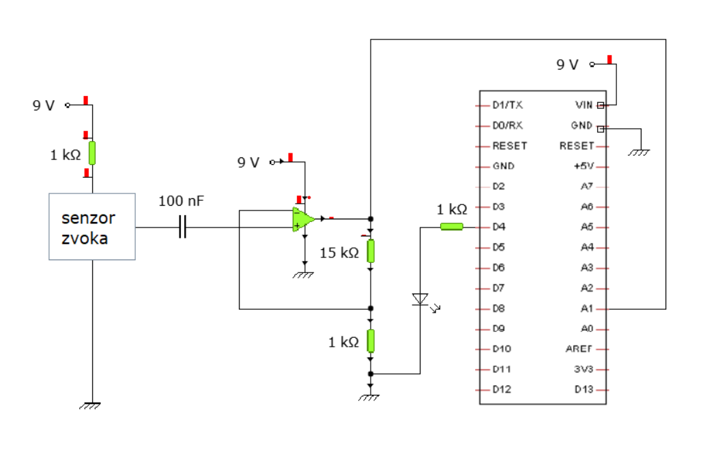
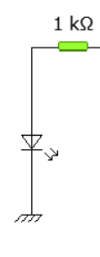
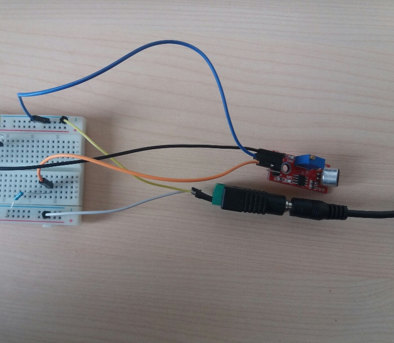
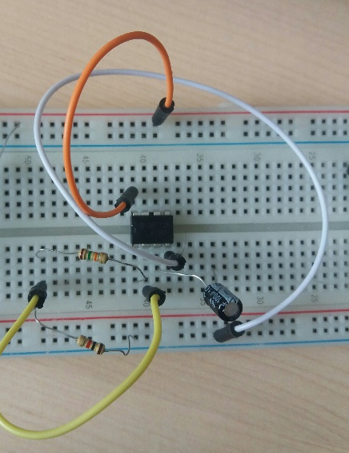
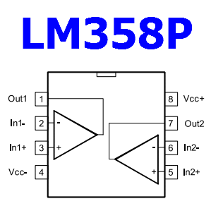
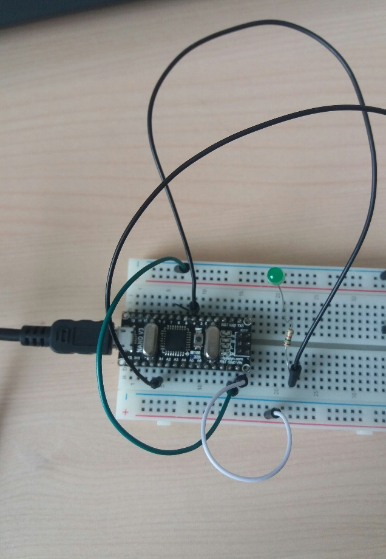
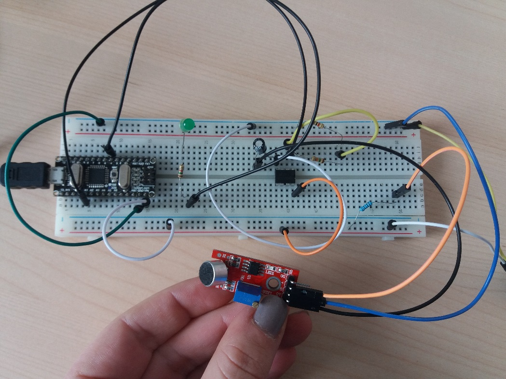
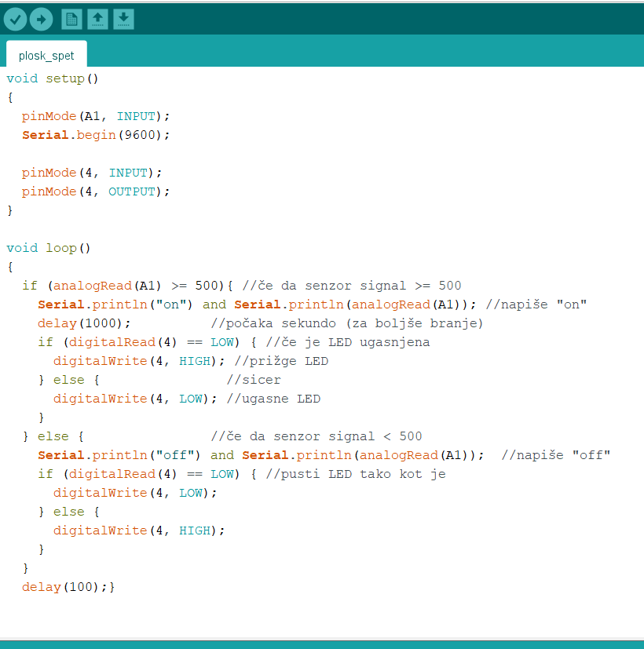
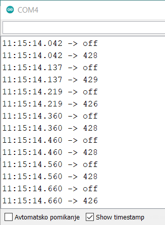

# STIKALO NA PLOSK

Avtorica: Mira Lavtar, Ma-Te

01180196

Ljubljana, 2021

**POVZETEK**

V poročilu projekta Stikalo na plosk je opisano delovanje vezja in
njegova izdelava. V prvem poglavju je predstavljen njegov namen in način
delovanja, kratko pa so tudi opisane glavne komponente, ki vezje
sestavljajo. Poglavje Izdelava vezja predstavlja postopek izdelave in
pojasnila za uporabo določenih delov vezja, v njem pa je tudi razlaga
postopka programiranja. V zaključku je podan še nasvet za učitelje v OŠ,
ki bi želeli izdelati ta projekt z učenci in opisane morebitne težave,
na katere lahko naletimo ob izdelavi projekta.

KLJUČNE BESEDE

plosk, stikalo, zvok, Arduino, elektrimetrski ojačevalnik, LED

### UVOD (PREDSTAVITEV)

Projekt Stikalo na plosk je atraktiven projekt predvsem v šolskem
prostoru. Učenci bi se s tem projektom pri izbirnem predmetu Elektronika
z robotiko in tudi pri Tehniki in tehnologiji, v sklopu elektronike v 8.
razredu, naučili osnov izdelave vezja in programiranja.

Znanje in ideje za ta projekt sem črpala iz različnih virov. Prvi tak so
bila predavanja iz Elektronike in Projektov iz elektronike, veliko
praktičnih primerov in idej pa prikazuje spletna stran Arduino Create.
Arduino na svoji strani predstavi kar nekaj podobnih projektov, ki imajo
enak namen, torej prižig oz. ugasnitev luči ali LED s ploskom. Vendar pa
jih je kar nekaj med njimi zasnovanih prezahtevno, sploh kar se tiče
osnovnošolskega prostora, ali pa imajo pomanjkljivost, da, na primer, le
utripnejo ob plosku. Vseeno pa so dali ti projekti dobre začetne ideje
tako za izdelavo vezja kot tudi za pisanje programa.

### DELOVANJE VEZJA

Namen stikala na plosk je, da se luč prižge in ugasne, ko plosknemo.
Sestavljen je iz senzorja zvoka, elektrometrskega ojačevalnika, Arduina
in vezja LED in upora. Ko plosknemo, senzor zvoka zazna spremembo zvoka
in napetost preko kondenzatorja pošlje do elektrometrskega ojačevalnika,
ki jo ojača. Signal prejme Arduino, ki je sprogramiran tako, da ugotovi,
ali je bil dobljeni zvok glasnejši od referenčne vrednosti in na podlagi
tega spremeni oziroma ohrani stanje na izhodu, torej LED luč ugasne,
prižge ali pa pusti v enakem stanju.

{width="5.559722222222222in"
height="3.604861111111111in"}Shemo vezja predstavlja slika 1. Posnetek
delovanja:
[C:\\Users\\Lenovo\\Downloads\\projekt1.mp4](file:///C:/Users/Lenovo/Downloads/projekt1.mp4)

## Senzor zvoka -- mikrofon

{width="1.275in"
height="2.1145833333333335in"}Senzor zvoka je integrirano vezje,
sestavljeno iz mikrofona, operacijskega ojačevalnika LM393,
potenciometra, dveh LED in uporov. Senzor preko mikrofona zazna jakost
zvoka in na izhodu odda napetost odvisno od glasnosti zaznanega zvoka.
To pa lahko reguliramo s potenciometrom. Poleg napajanja in ozemljitve
ima senzor še dva izhoda -- digitalnega in analognega. Ker je zvok
analogni signal sem senzor v elektronsko vezje vezala s tem vhodom.

Shemo vezave senzorja zvoka predstavlja slika 2.

## Elektrometrski ojačevalnik s kondenzatorjem

Senzor zvoka lahko ob veliki glasnosti odda še vedno slab signal, zato
ga je treba primerno ojačati. Elektrometrski ojačevalnik v nasprotju z
invertirajočim ojača pozitivno napetost tako, da na izhodu dobimo prav
tako pozitivno napetost. Glede na velikost in spreminjanje vhodne
napetosti v ojačevalnik ob spreminjanju zvoka, je bilo najbolj optimalno
ojačanje A\'=16.

Senzor prav tako zazna kar nekaj šumov, vloga kondenzatorja pred
ojačevalnim sistemom pa je prav ta, da šume omili.

{width="2.1666666666666665in"
height="2.964583333333333in"}Shemo kondenzatorja in elektrometrskega
ojačevalnika predstavlja slika 3.

## Arduino Nano

{width="1.445138888888889in"
height="2.7916666666666665in"}Arduino Nano je majhna programerljiva
ploščica, s katero lahko programiramo v okolju Arduino IDE. Preko
zunanjega napajanja na pinih VIN in GND ali z USB kablom se ga lahko
napaja s 5 -- 20 V. Vsako od 14 digitalnih nožic, ki jih prikazuje slika
4, označenih z D0 -- D13 se lahko uporabi kot digitalni vhod ali izhod,
podobno pa lahko vsako od 8 analognih nožic, A0 -- A7, uporabimo kot
analogni vhod (Arduino Store, 2021). V primeru stikala na plosk je
povezan na 9V napajanje, analogni vhod je pin A1 in digitalni izhod pin
D4.

V vezju stikala na plosk sem uporabila, kot je omenjeno že zgoraj, da
ugotovi, ali je bil dobljeni zvok glasnejši od referenčne vrednosti in
na podlagi tega spremeni oziroma ohrani stanje na izhodu.

## LED in upor

{width="0.7798611111111111in"
height="1.9916666666666667in"}Zadnji del električnega vezja je LED z
uporom, ki jo prikazuje slika 5. Ta, ko plosnem spremeni stanje --
zasveti, če je ugasnjena in ugasne, če je prižgana -- in ga ohrani, ko
ne plosknem.

### IZDELAVA

Za izdelavo projekta Stikalo na plosk je bilo uporabljeno:

-   Arduino Nano,
-   senzor zvoka
-   žice
-   kondenzator 100ⴄF
-   ojačevalnik LM358p
-   LED
-   upori (3x 1kΩ, 15kΩ)
-   izvijač

# Vezje

Pred sestavljanjem vezja, sem preverila delovanje senzorja. Vezala sem
ga na napajanje, izhod pa priključila na vhod Arduina ter z ukazom
Serial.println preverila višino napetosti, ki jo je prejel Arduino v
tišini in ob plosku.

{width="3.533333333333333in"
height="1.8694444444444445in"}Nato sem začela s sestavljanjem vezja.
Senzor sem vezala na napajanje 9V preko 1kΩ upora in GND, analogni izhod
pa najprej neposredno do Arduina. Vendar pa sem kasneje naletela na
težavo, da senzor zazna veliko šumov, hkrati pa je za želen učinek treba
močno ploskniti, zato je bilo potrebno med senzor, slika 6, in Arduino
vezati elektrometrski ojačevalnik in kondenzator, kot je prikazano na
sliki 9.

{width="1.9805555555555556in"
height="2.566666666666667in"}{width="3.1166666666666667in"
height="2.25in"}

a\)

b\)

{width="2.8916666666666666in"
height="3.084722222222222in"}Uporabila sem kondenzator s kapacitivnostjo
100ⴄF in operacijski ojačevalnik z oznako LM358P. Vhodi in izhodi
ojačevalnika so prikazani na sliki 7.a), vezava pa na sliki 7. b).
Ojačan signal nato potuje do vhoda Arduina na pinA1. Na izhodu, pin4,
sta na koncu vezana še 1kΩ upor in LED do GND, kot prikazuje slika 8.

{width="4.766666666666667in"
height="3.575in"}Slika 9 prikazuje vezavo celotnega vezja.

# Arduino program

Naloga Arduina je, da zazna analogni signal na vhodu in, če je ta višji
od nastavljene vrednosti, preveri stanje na izhodu ter ga spremeni. V
nasprotnem primeru, ko je signal na vhodu nižji od nastavljene
vrednosti, stanje ohrani.

{width="6.268055555555556in"
height="2.2333333333333334in"}Najprej je pomembno, da Arduino prepozna
vhode in izhode ter bere vhodne signale skozi čas, zato sem v »setup«
najprej določila vhodne in izhodne pine ter nastavila hitrost prenosa
podatkov na 9600 ms, s funkcijo Serial.begin, kot kaže slika 10. Vhodni
pin vemo, da je zagotovo pinA1, izhodni pa pin4. Vendar pa, ker mora
Arduino tudi ugotoviti stanje na izhodu, da lahko ob plosku spremeni
njegovo stanje, je v tem primeru vhodni pin tudi pin4.

{width="2.725236220472441in"
height="3.7169892825896764in"}Sledi, da prebere signal na vhodu in
preveri, ali je ta večji od nastavljene vrednosti. S funkcijo analogRead
bere napetost na vhodu, da lahko prebrani vrednosti sledim tudi sama in
določim referenčno vrednost, pa sem podala še ukaz, da izpisuje prebrane
vrednosti s funkcijo Serial.println. Kako izpisuje signal je
predstavljeno na sliki 11.

Glede na signal, ki ga je Arduino izpisal, sem določila referenčno
vrednost 500, za lažje sledenje pa še določila, da napiše »on«, ko je
prejel signal višji ali enak 500 in »off«, če je ta nižji.

Temu sledi le še ukaz na izhodu. S programskim stavkom »if« sem dosegla,
da Arduino spremeni stanje na izhodu, kadar zazna signal višji od 500 in
ga ohrani, ko je signal nižji, tako kot je prikazano na sliki 12. Ukaz
»delay« sem dodala za boljše delovanje vezja, ker tako namesto, da bi
bral šume, počaka sekundo oz. na koncu še 100ms.

{width="6.268055555555556in"
height="6.321527777777778in"}

Slika 12: Program za stikalo na plosk

### ZAKLJUČEK IN UGOTOVITVE

Projekt Stikalo na plosk bi bil atraktiven izdelek za učence tretje
triade v osnovni šoli, vendar pa ob njegovem sestavljanju in preverjanju
delovanja naletimo na nekaj težav. Vezje kljub ojačanju še vedno zahteva
močan plosk, prav tako se lahko zgodi, da zaradi slabih spojev med
»breadboardom« in žicami, Arduino zazna preveliko oz. premajhno
napetost.

Če bi se lotili izdelave projekta v šoli, bi bilo najbolj primerno
izdelovati postopoma, kot je opisan postopek izdelave, ki sem ga sama
izvedla. Programiranje v Arduinu bi bilo po mojem mnenju sploh za
začetnike v osnovni šoli zelo zahtevno, zato bi namesto tega predlagala
programiranje z blokci v TinkerCadu, ki sproti izpisuje tudi kodo, ki pa
se jo da preprosto kopirati v Arduino.

Če bi želeli projekt izdelati kot uporaben pripomoček v vsakdanjiku bi
bilo potrebno odpraviti težave s slabim stikom in se bolj poglobiti v
glasnost zvoka ploska.

**VIRI IN LITERATURA**

*Arduino Nano.* (2021). Arduino Store.
\[<https://store.arduino.cc/arduino-nano>, januar 2021\]

Clap-Controlled Lights That You Can Actually Use. (2020). Arduino Create
\[<https://create.arduino.cc/projecthub/GadhaGod/clap-controlled-lights-that-you-can-actually-use-96a85c#toc-let-s-get-started-1>,
januar 2021\]

*Clap Switch with Relay*. (2018). Arduino Create
\[<https://create.arduino.cc/projecthub/Arnov_Sharma_makes/clap-switch-with-relay-cd8232>,
januar 2021\]

Kocijančič, S. (2019). *Elektronika.* Pedagoška fakulteta v Ljubljani.
*\[<http://www.pef.uni-lj.si/slavkok/studgrad/Elektronika_2020.pdf>,
januar 2021\]*

Kocijančič, S. (2020). *Projekti iz elektronike.* Pedagoška fakulteta v
Ljubljani.

*LM358P Datasheet -- Dual Operational Amplifier*. (2018). Datasheetcafe
\[<http://www.datasheetcafe.com/lm358p-datasheet-dual-operational-amplifier/>,
januar 2021\]
