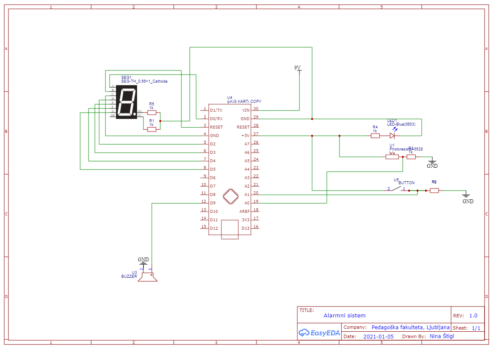
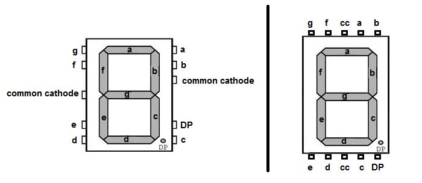
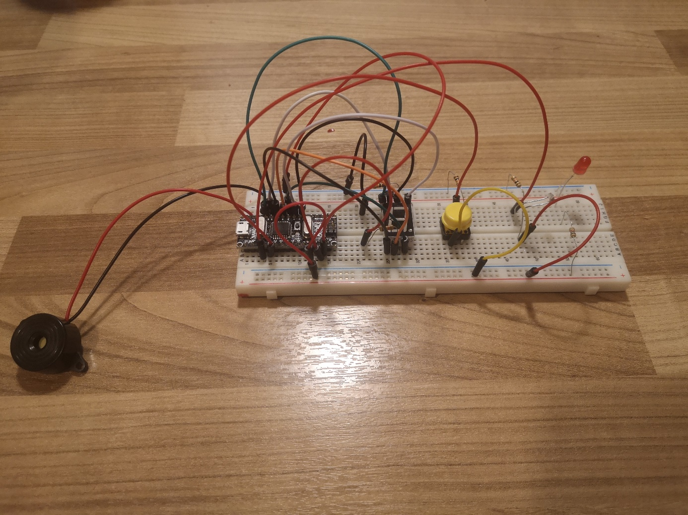

**ALARMNI SISTEM**

Projekti iz elektronike -- individualni projekt

Ime in priimek študenta: Nina Štigl

Vpisna številka: 01180863

Smer: FI -TE

Datum: 6.1.2021

# 1 POVZETEK

V članku je predstavljen poenostavljeni alarmni projekt, ki bi nas
ščitil pred vlomilci. Če je prekinjen svetlobni tok med LED diodo in
fotouporom, se prične odštevanje na sedem segmentnem indikatorju. Če v
času odštevanja ne pritisnemo gumba za izklop alarma se bo po koncu
odštevanja vključil alarm. V uvodu je na kratko opisano, kje vezje lahko
uporabimo v vsakdanjem življenju, v nadaljevanju podrobneje opišem samo
delovanje vezja in kako je izdelava le tega potekala. Na koncu so
predstavljene težave, ki so se mi med samo izdelavo pojavile ter kaj bi
lahko v nadaljnje še izboljšala.

# 2 KLJUČNE BESEDE

Alarm, sistem proti vlomilcu, arduino Nano, fotoupor, zvočni signal,
sedem segmentni indikator

# 3 UVOD

Za projekt sem že od samega začetka vedela, da si želim narediti
projekt, ki bo vseboval sedem segmentni indikator. Na začetku sem želela
naredi zgolj štoparico ali pa odštevalnik časa. Po posvetu s asistentom
pa sem se odločila, da naredim preprost alarmni sistem, kateri bo
vseboval tudi odštevalnik časa. To vezje lahko uporabimo kot varnostni
sistem. Izdelala sem preprost pomanjšanj model v objektu, ki bi vseboval
alarmni sistem pa bi bilo vezje veče in imelo več senzorjev svetlobe v
mojem primeru fotoupor. Na internetu najdemo projekte, ki so delno
podobni. V večini primerov so zgolj alarmni sistem, ki se vključijo
nemudoma, ko se na fotouporu zmanjša osvetljenost. Projekt bi učenci
lahko izdelovali v kakšnem poletnem taboru ali pa izbirnem predmetu, ki
bi se navezoval na elektroniko in programiranje.

# 4 DELOVANJE VEZJA

Vezje vsebuje preproste komponente, to so LED -- dioda, fotoupor, tipka,
Arduino NANO, USB kabel za povezovanje krmilnika z računalnikom,
oddajnik zvočnega signala, žice, upori in prototipna ploščica. Delovanje
fotoupora sem obnovila s pomočjo skripte iz predavanj, pri delovanju in
povezovanju sedem segmentnega indikatorja pa sem si ogledala različne
posnetke, kako napisati program za odštevanje ter kako samo komponento
povezati s krmilnikom Arduino NANO. Sedem segmentni indikator je
sestavljen iz sedmih LED pravokotnih oblik. Vsaka LED segment ima svoj
zatič, ki ga povežemo s krmilnikom. Fotoupor deluje kot delilnik
napetosti. Vseskozi ga osvetljuje svetloba, ki jo oddaja LED -- dioda.
Ko je snop svetlobe prekinjen oz. se osvetljenost fotoupora zmanjša se
zmanjša tudi njegova upornost, to zazna krmilnik Arduino NANO na katerem
je zapisan programska koda, ki je podana na koncu poglavja. Ko program
zazna, da je osvetljenost fotoupora manjša od 450 se sproži sedem
segmentni indikator, na katerem se začne odštevati čas (5sekund). Ko se
čas 5 sekund izteče, zvočnik začne oddajati piskajoč glas. Odštevanje pa
lahko tudi prekinemo s pomočjo tipke. Če krmilnik med odštevanjem zazna,
da je nekdo pritisnil na tipko se bo odštevanje prekinilo in alarm se ne
bo vklopil.

**Shema vezja**

{width="6.3in" height="4.460416666666666in"}

**Programska koda:**

```cpp
int ldrpin = A0;
int buzzpin = 12;
void setup ()
{
Serial.begin(9600);
pinMode (ldrpin, INPUT);
pinMode (A1,INPUT);
pinMode (3, OUTPUT);
pinMode (4, OUTPUT);
pinMode (5, OUTPUT);
pinMode (6, OUTPUT);
pinMode (7, OUTPUT);
pinMode (8, OUTPUT);
pinMode (9, OUTPUT);
pinMode (buzzpin, OUTPUT);
digitalWrite (12,LOW);
}

void loop ()
{
zacetek:
int ldrval = analogRead(ldrpin);
Serial.println(ldrval);
if (ldrval \<= 450)
{
//5
digitalWrite (3, HIGH);
digitalWrite (4, LOW);
digitalWrite (5, HIGH);
digitalWrite (6, HIGH);
digitalWrite (7, LOW);
digitalWrite (8, HIGH);
digitalWrite (9, HIGH);
for (int i = 0; i \< 1000; i++)
{
delay(1);
if (digitalRead (A1)== HIGH) goto zacetek;
}
//4
digitalWrite (3, LOW);
digitalWrite (4, HIGH);
digitalWrite (5, HIGH);
digitalWrite (6, LOW);
digitalWrite (7, LOW);
digitalWrite (8, HIGH);
digitalWrite (9, HIGH);
for (int i = 0; i \< 1000; i++)
{
delay(1);
if (digitalRead (A1)== HIGH) goto zacetek;
}
//3
digitalWrite (3, HIGH);
digitalWrite (4, HIGH);
digitalWrite (5, HIGH);
digitalWrite (6, HIGH);
digitalWrite (7, LOW);
digitalWrite (8, LOW);
digitalWrite (9, HIGH);
for (int i = 0; i \< 1000; i++)
{
delay(1);
if (digitalRead (A1)== HIGH) goto zacetek;
}
//2
digitalWrite (3, HIGH);
digitalWrite (4, HIGH);
digitalWrite (5, LOW);
digitalWrite (6, HIGH);
digitalWrite (7, HIGH);
digitalWrite (8, LOW);
digitalWrite (9, HIGH);
for (int i = 0; i \< 1000; i++)
{
delay(1);
if (digitalRead (A1)== HIGH) goto zacetek;
}
//1
digitalWrite (3, LOW);
digitalWrite (4, HIGH);
digitalWrite (5, HIGH);
digitalWrite (6, LOW);
digitalWrite (7, LOW);
digitalWrite (8, LOW);
digitalWrite (9, LOW);
for (int i = 0; i \< 1000; i++)
{
delay(1);
if (digitalRead (A1)== HIGH) goto zacetek;
}
//0
digitalWrite (3, HIGH);
digitalWrite (4, HIGH);
digitalWrite (5, HIGH);
digitalWrite (6, HIGH);
digitalWrite (7, HIGH);
digitalWrite (8, HIGH);
digitalWrite (9, LOW);
delay (1000);
buzz (500);
}
}

void buzz(unsigned char time)
{
digitalWrite(buzzpin, 170);
}
```

Povezava za ogled delovanja vezja:
<https://www.youtube.com/watch?v=EEEDUC_Eohw>

# 5 IZDELAVA

{width="1.7951388888888888in"
height="2.2465277777777777in"}Izdelave vezja sem se lotila tako, da sem
si najprej skicirala kako bo vezje izgledalo. Pomagal sem sem si z
literaturo \[1\], \[2\], \[3\]. Najprej sem priključila krmilnik Arduino
Nano. Z žico sem povezala Arduino izhod 5V in spodnjo vrstico na
prototipni ploščici, ki je označena za pozitivno, tako sem imela po
celotni vrstico možnost napajanja 5V, GND pa sem povezala z spodnjo
vrstico na nasprotni strani prototipne ploščice, ki je označena z
negativno oznako, tako sem imela po celotni vrstici GND. Led diodo sem
vezala v prevodni smeri. Nato sem vezala fotoupor, katerega sem
priključila na napajanje in na vhod A0 krmilnika Arduino NANO. Lotila
sem se vezave tipke, ki sem jo priključila na napajanje diagonalno
nožico pa sem povezala z vhodom A1 na krmilniku. Nato je sledila vezava
sedem segmentnega indikatorja. Ta ima 10 nožic (5 na zgornjem in 5 na
spodnjem delu), 8 jih je označenih po abecedi, 2 pa z oznako cc.

Na vsako nožico cc sem priključila upor po 10kOhm in jih nato skupaj
priključila na GND. A nožico sem priključila na izhod številka 3 na
krmilniku, b na 4, c na 5, d na 6, e na 7, f na 8 in g na 9. Nato sem
priključila se element, ki bo oddajal zvočni signal. Pozitivni
priključek sem priključila na izhod številka 12 na krmilniku, negativni
priključek pa na GND.

{width="6.299127296587926in"
height="3.351767279090114in"}

Slika Sestavljeno vezje - alarmni sistem

# 6 UGOTOVITVE IN ZAKLJUČEK

S projektom sem v celoti gledano zadovoljna, saj deluje kot sem si
zamislila. Edina težava se mi je pojavila pri pisanju programske kode,
kjer nisem točno vedela, kako napisati kodo za tipko. S pomočjo
asistenta sem to težavo odpravila. Če bi imela na voljo dve prototipni
ploščici, bi lahko vezala več sedem segmentnih indikatorjev in bi tako
izdelala odštevalnik, ki bi odšteval dvomestno ali pa tudi večmestno
število sekund. Pri izhodu iz krmilnika, bi dodala še LED -- diodo, ki
bi utripala, ko bi se sprožil alarm.

# 7 VIRI IN LITERATURA

\[1\] Pattabiraman K. (b.d.). *How to set up seven segment displays on
the arduino*, Circuit Basics.
\[https://www.circuitbasics.com/arduino-7-segment-display-tutorial/\]

\[2\] Kocijančič, S. (2020). *Elektronika*. Ljubljana; Pedagoška
fakulteta, Univerza v Ljubljani.

\[3\] Kocijančič, S. (2020). *Projekti iz elektronike*. Ljubljana;
Pedagoška fakulteta, Univerza v Ljubljani.
