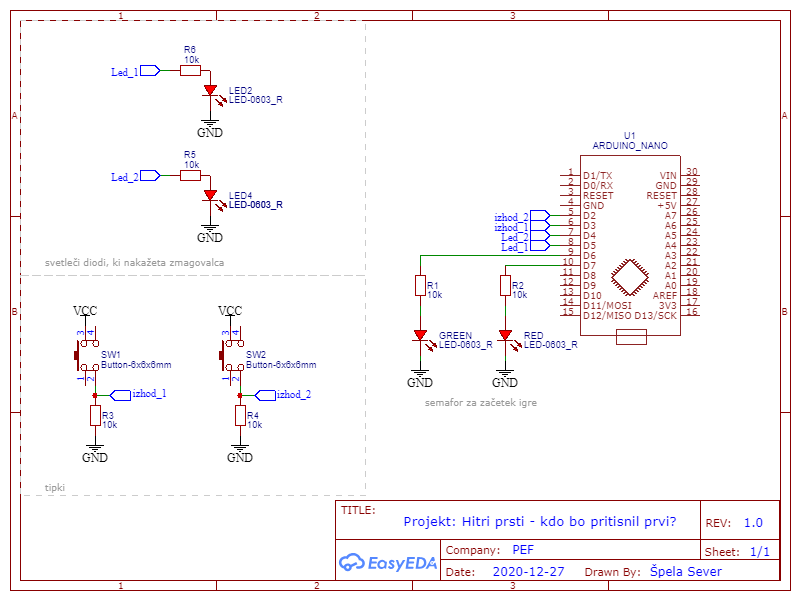
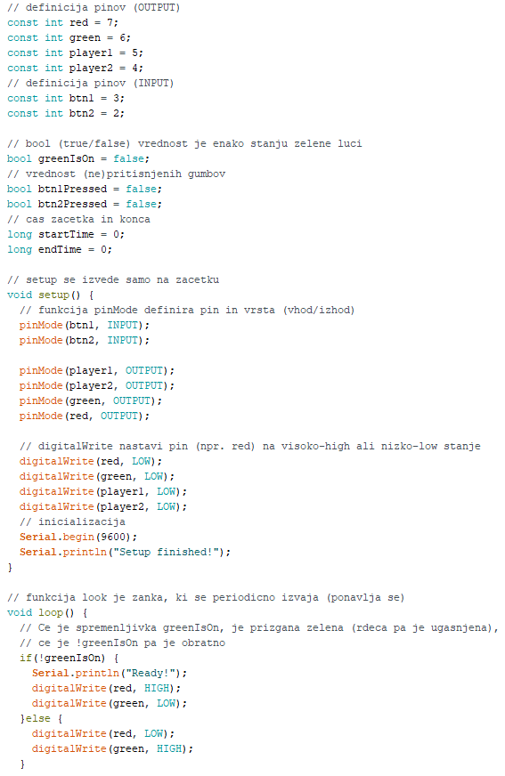
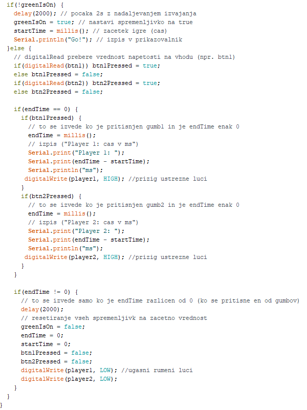
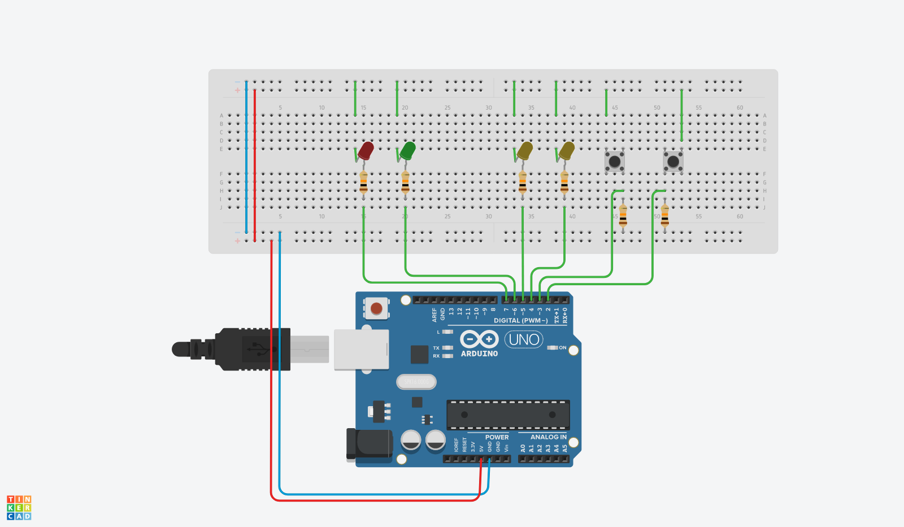

**Igra hitrih prstov:\
Kdo bo prvi pritisnil na gumb?**

Špela Sever

Mentor: dr. David Rihtaršič

Vezava: Ma-Te

Vpisna številka: 01180198

Ljubljana, 2020

# 1 POVZETEK

V prispevku je predstavljen projekt z naslovom »Igra hitrih prstov: Kdo
bo prvi pritisnil na gumb?«, narejen pri predmetu Projekti iz
elektronike. Opisano je vezje, kjer dva igralca hkrati pritiskata vsak
na svojo tipko. Svetleča dioda zasveti pri tistemu, ki je pritisnil
prvi. V prikazovalniku se izpiše tudi njegov odzivni čas.

# 2 KLJUČNE BESEDE

tipka, svetleča dioda, igralec

# 3 UVOD

Ideja za izdelavo vezja se je pojavila med gledanjem kviza Vem! na RTV
Slovenija. Tukaj se namreč pri tekmovalcu, ki prvi pritisne na gumb,
obarva njegovo ime. Kljub pritiskom soigralca na svojo tipko, se njegovo
ime ne obarva. Igra se ponovi pri ponovnem vprašanju. Igralca na tipko
ne moreta pritisniti, dokler voditelj vprašanja ne pove do konca. Moja
projektna naloga se od tega razlikuje v začetku tekmovanja. Ko se rdeča
luč spremeni v zeleno, igralca lahko pričneta s pritiskanjem vsak na
svoj gumb. Projekt se mi zdi zanimiv in uporaben za v osnovno šolo.
Primeren je za izvajanje v okviru dodatnega pouka (delavnic, poletnih
šol), krožkov ali za obravnavo pri izbirnem predmetu. Nekoliko
zahtevnejše bi bilo učencem določiti program, a s pomočjo učiteljevega
vodenja in namigov, bi jim tudi to uspelo.

# 4 DELOVANJE VEZJA

Vezje je sestavljeno iz treh delov, vsi pa so vezani na krmilnik Arduino
NANO. Elektrotehniško shemo vezja prikazuje slika 1.

Prvi del predstavlja semafor, ki da znak za začetek igre. Najprej
zasveti rdeča svetleča dioda in v prikazovalniku se izpiše »Ready!«. Ko
rdeča svetleča dioda ugasne (po dveh sekundah), se vklopi zelena (nikoli
ne svetita obe hkrati). Takrat igralca lahko pričneta s pritiski vsak na
svojo tipko. Hkrati s prižigom zelene led diode se v prikazovalniku
izpiše »Go!« in začne se meriti čas odziva tekmovalca, ki bo prvi
pritisnil na tipko.

Tipki predstavljata drugi del vezja. Ko najhitrejši igralec pritisne na
tipko, zasveti ustrezna rumena svetleča dioda. Namreč tretji del vezja
vsebuje 2 rumeni svetleči diodi, ki nakazujeta, kateri tekmovalec je
pritisnil na tipko prvi. V prikazovalniku se prikaže ime zmagovalca in
izpiše njegov reakcijski čas (npr. Player 1: 600 ms).

Vsako LED diodo sem zaporedno z uporom vezala na določen izhod
mikrokrmilnika. Krajše nožice sem postavila v GND, daljše pa prek upora
na izhode D(4,5,6,7). Na vhoda D2 in D3 pa sem preko upora zvezala
tipko.

Posnetek delovanja vezja si lahko ogledate na povezavi:

<https://youtu.be/4bNKULlpWNA>

Povezava do simulacije vezja v spletnem orodju TinkerCad:

<https://www.tinkercad.com/things/3Wd85uCUubN-kdo-bo-pritisnil-prvi/editel?sharecode=u7XQcpjkfInCv1W5F2gsbzPkVzoIyuCjNH0GYndiqP8>

{width="7.930503062117236in"
height="5.957930883639545in"}

Slika 1: Elektrotehniška shema vezja.

Za pravilno delovanje mikrokrmilnika skrbi programska koda:

{width="5.9070745844269466in"
height="9.084600831146107in"}(1)

{width="6.047129265091863in"
height="8.072916666666666in"}(2)

# 5 IZDELAVA VEZJA

Najprej sem si pripravila ustrezne komponente, in sicer prototipno
ploščo, Arduino NANO, rdečo, zeleno in dve rumeni svetleči diodi, 2
tipki in 6 uporov (R = 10 kΩ). Vidne so na sliki 2. Elemente sem
ustrezno zvezala \[1, 2\]. Nato sem zapisala programsko kodo. Pri tem
sem si pomagala s \[1, 2\] in spletno stranjo \[3\].

{width="6.114583333333333in"
height="4.397003499562555in"}

Slika 2: Vezje na prototipni ploščici, narejeno v spletnem orodju
TinkerCad.

# 4 ZAKLJUČEK IN UGOTOVITVE

S projektom sem zadovoljna, saj mi je uspelo izdelati delujoče vezje, ki
ga lahko uporabimo v razredu pri izvajanju kvizov v dvojicah. Prav tako
ga lahko umestimo v šolski prostor, saj je primerno zahteven za izdelavo
pri izbirnih predmetih iz področja elektronike. Kot izboljšavo bi v
vezje vključili LCD prikazovalnik, ki bi prikazal ime zmagovalca. Tako
nam tega ne bi bilo potrebno pogledati na zaslon računalnika. Dodali bi
lahko tudi več tipk in s tem vključili več igralcev.

# 5 LITERATURA

\[1\] S. Kocijančič, *Projekti iz elektronike* (Ljubljana: Pedagoška
fakulteta, 2020).

\[2\] D. Rihtaršič, *Projekti iz elektronike* (Ljubljana: Pedagoška
fakulteta, 2017).

\[3\] Spletna stran Arduino \[<https://www.arduino.cc/>\].
