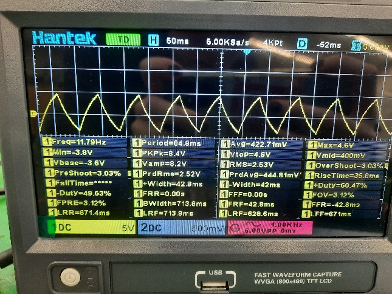
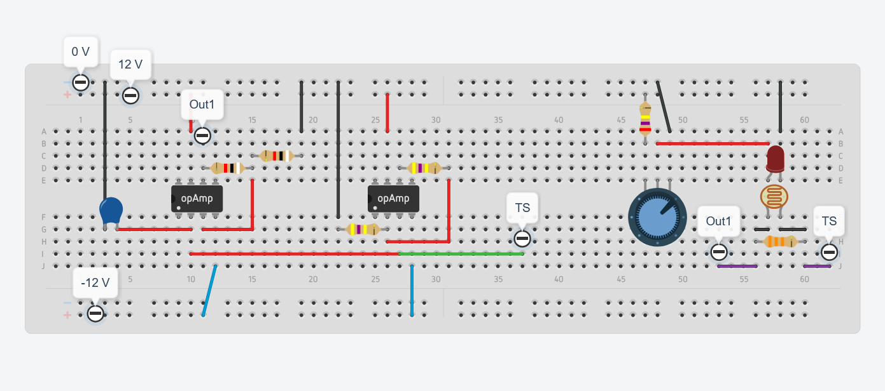

> Avtor: Brnot Eva  
> Univerza v Ljubljani, Pedagoška fakulteta  
> Datum: 2025-02-06  

# NAPETOSTNO KRMILJENI OSCILATOR

**Povzetek**

Pri premetu projekti iz elektronike sem izdelala napetstno krmiljeni
oscilator (VCO). Vezje generira trikotni in pravokotni sinal, katerega
frekvenca je odvisna od vhodne napetosti. Za krmiljenej napetosti, sta
uporabljena optični izolator in potenciometer.

Ključne besede: napetostno krmiljeni oscilator, operacijski ojačevalnik,
Schmittov sprožilnik, optični izolator, modularni sintetizator

## Uvod

Pri predmetu Projekti iz elektronike sem si za projekt izbrala izdelavo
napetostno krmiljenega oscilatorja (VCO), ki je glavna komponenta v
analogni in modularni sintetizatorski tehniki. Ideja za projekt se mi je
porodila, ko sva s sošolcem poslušala radio pri delu v delavnici. Cilj
projekta je bil zasnovati in izdelati delujoč oscilator, ki proizvaja
zvok z različnimi frekvencami glede na vhodno napetost.

## Delovanje vezja

Vezje oscilatorja je zasnovano na osnovi Schmittovega sprožilnika, ki mu
je na invertirajočem vhodu dodan kondenzator C1. Ta se preko upora na
povratni zanki med izhodom in invertirajočim vhodom komparatorja
napetosti polni. Izhodni signal je torej graf napetosti na tem
kondenzatorju v odvisnosti od časa. Frekvenca polnenja kondenzatorja --
frekvenca izhodnega signala -- je odvisna od kapacitivnosti
kondenzatorja in upornosti tega upora. Najlažje spreminjamo upornost,
zato je upor na povratni zanki med izhodom in invertirajočim vhodom
spremenljiv. Kot prikazuje slika 2, je vzporedno uporu vezan optični
izolator. Ta nam omogoča, da s spreminjanjem osvetljenosti LED diode,
spreminjamo upornost na povratni zanki in s tem frekvenco signala. Na ta
način vezje na izhodu TS1 genrira stabilen žagast signal, ki mu lahko, s
spreminjanjem vrednosti potenciometra RV1 , spreminjamo frekvenco. Z
vrednostimi elementov, ki so zapisane v tabeli, nam oscilator generira
signal s frekvencami od 0 Hz -- 16 kHz, kar pokrije večino razpona
frekvenc, ki jih slišimo ljudje.

Da lahko izhodni signal vežemo na zvočnik in ga tudi slišimo, moramo
uporabiti še sledilnik napetosti, saj drugače upornost zvočnika vpliva
na izhodni signal.

Posentek delovanja vezja: <https://youtu.be/HwI14WiwIY4>

{width="4.313106955380578in"
height="3.405184820647419in"}

{width="4.3756047681539805in"
height="4.752275809273841in"}

{width="3.408438320209974in"
height="4.148254593175853in"}

{width="2.9131102362204726in"
height="2.185317147856518in"}

## Izdelava vezja

Najprej je sem zvezala osnovno vezje oscilatorja, prikazano na sliki 1.
Pri preizkusu z zvočnikom se je izkazalo, da bo potreben sledilnik
napetosti, katerega vezava je narisana na sliki 3. Na koncu sem izdelala
še optični izolator, tako da sem LED diodo in fotoupor skupaj zaprla v
svetlobno nepropustno gumico. Z vezavo vezja na sliki 2 je bilo
omogočeno krmiljenje frekvence signala. V tabeli 1 so navedeni vsi
uporabljeni elementi, poleg tega pa sem uporabila še osciloskop,
multimeter in zvočnik, da sem ves čas spremljala delovanje vezja.

| Element           | Vrednost          | Število    |
| :-------:         | :---------:       | :--------: |
| LM741             | /                 | 2          |
| Prototipna plošča | /                 | 1          |
| Vir napetosti     | +12 V, -12 V, GND | 1          |
| Upori             | 9,1 kΩ            | 2          |
|                   | 470 kΩ            | 2          |
|                   | 33 kΩ             | 1          |
|                   | 270 Ω             | 1          |
| Kondenzator       | 0,47uF            | 1          |
| Fotoupor          |                   | 1          |
| Potenciometer     | 10kΩ              | 1          |
| LED dioda         | /                 | 1          |
| Gumica            |                   |            |
| Žice              |                   |            |

  : Slika 1 Vezje oscilatorja

{width="6.379617235345582in"
height="2.8250962379702536in"}

{width="3.3087904636920387in"
height="2.4821423884514435in"}

{width="3.8245505249343834in"
height="2.869048556430446in"}

## Zaključek in ugotovitve

S projektom sem zadovoljna, saj sem se med izdelavo veliko naučila --
proces izdelave potekal precej raziskovalno. Med procesom sem poskusila
frekvenco oscilacij spreminjati z uporabo tranzistorja, kar se sicer ni
izšlo po pričakovanjih, vendar sem se pri tem podrobneje seznanila s
karakteristikami in delovanjem bipolarnih tranzistorjev.

Vezje je sicer prezahtevno za uporabo v osnovni šoli, vendar bi bilo
lahko primerno za dijeke srednjih šol, zlasti v programih, povezanih z
elektrotehniko ali elektroniko. Njegova uporabna vrednost se kaže tudi v
tem, da je izdelek zelo atraktiven -- delo z zvokom in generiranje
različnih tonov je zanimivo in lahko pri dijakih vzbudi večje zanimanje
za elektroniko.

## Viri in literatura

\[1\] Kocijančič S. (2019). *Elektronika 1*. Ljubljana; Pedagoška
fakulteta, Univerza v Ljubljani.

\[2\] Kocijančič S. (2020). *Projekti iz elektronike*. Ljubljana;
Pedagoška fakulteta, Univerza v Ljubljani,

\[3\] Rihtaršič D. (2020). *Projekti iz elektronike -- vaje*. Ljubljana;
Pedagoška fakulteta, Univerza v Ljubljani.

\[4\] Podatkovni list LM741 <https://www.ti.com/lit/gpn/lm741>
