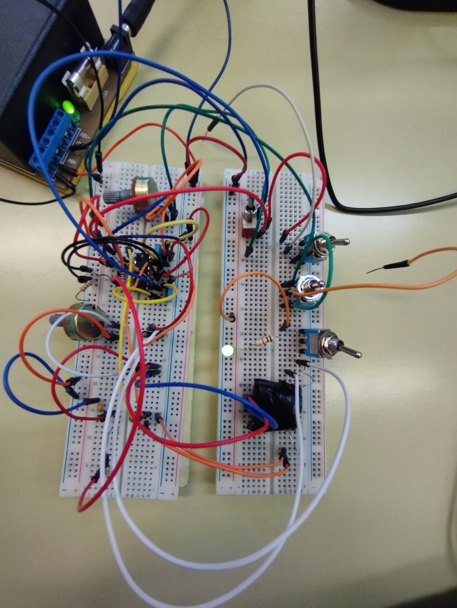
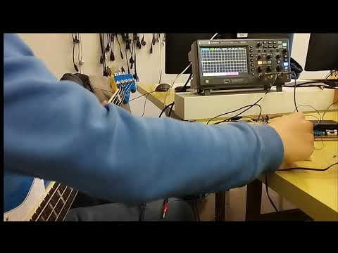

> Avtor: Istenič Jakob  
> Univerza v Ljubljani, Pedagoška fakulteta  
> Datum: 2025-02-06  

# AUTO WAH -- KITARSKI EFEKT -- DINAMIČNO SITO

## Povzetek

V članku je opisan project izdelave Auto wah kitarskega efekta. Projekt
združuje znanje elektronike in glasbe z izdelavo vezja, ki spreminja
frekvenčni spekter signala, preko sita glede na amplitude signala.
Opisuje teoretično ozadje, delovanje, izdelavo posameznih delov vezja
ter končnega izdelka, vključno s prilagoditvami in praktičnimi
rešitvami, kot je domač optokopler.

## KLJUČNE BESEDE

Kitarski efekt, nizko prepustno sito, visoko prepustno sito, pasovno
prepustno sito, dinamično sito, sito s spremenljivim stanjem

## UVOD (PREDSTAVITEV)

Za projekt sem želel povezati znanje, ki sem ga pridobil iz področja
elektronike z osebnimi hobiji in interesi, da izdelam vezje, ki bi na
tem področju rešilo specifično težavo ali pa omogočil nekaj, česar brez
tega projekta ne bi bilo možno. Odločil sem se področje elektronike
združiti z glasbo, saj za spreminjanje tona kitare in bas kitare obstaja
zelo raznolik izbor kitarskih efektov, ki spremenijo elektronski signal
kitare tako, da dodajo razne efekte (npr. distorzija, fuzz, zamik, ...).
Odločil sem se za izdelavo ovojnega filtra, ki spreminja frekvenčni
spekter signala glede na njegovo glasnost (amplituda signala).
Ustvarjeni efekt doda "wah-wah" učinek, ki je značilen enako
poimenovanemu "wah" kitarskemu efektu, vendar za razliko od "wah"
efekta, ki se odziva na pozicijo potenciometra, katero igralec spreminja
z nogo preko pedala, pri ovojnem filtru pa se efekt odziva na "ovojnico"
signala (kjer dobi svoje ime) oziroma amplitude. Ker se efekt na
dinamiko igranja odziva samostojno je efekt dobil tudi ime "auto wah".

## DELOVANJE VEZJA

"Wah" efekt dosežemo s spreminjanjem frekvenčne karakteristike sita
(bodisi nizko, visoko ali pasovno prepustnega), preko katerega dobimo
drugačen zvok, saj je glasbeni ton sestavljen iz osnovne frekvenco, ki
določi višino tona, ter višje harmonskih frekvenc, ki tonu določijo
bravo. S spreminjanjem frekvenčne karakteristike sita spreminjamo tudi
prisotnost višjeharmonskih frekvenc, ki tonu spremenijo bravo in s tem
dosežemo "wah" efekt.

Delovanje kitarskega efekta lahko razdelimo na posamezne dele, kot je
prikazani v blokovni shemi na sliki 4.1.

{width="6.3in"
height="3.542361111111111in"}

**Slika 4.1 :** Blokovna shema delovanja ovojnega filtra

Proces izdelave vezja lahko torej razdelimo na manjše dele in sicer:

-   Efekt,
-   Detektor amplitude,
-   Povezava med detektorjem in efektom/ krmiljenje efekta.

### Efekt

"wah" kitarski efekt je v osnovi samo RC sito, kateremu upor zamenjamo s
potenciometrom, kateremu spreminjamo upornost in s tem spreminjamo tudi
karakteristiko sita.

Poznamo tri vrste prepustnih sit:

-   Nizko prepustno sito,
-   Visoko prepustno sito, in
-   Pasovno prepustno sito.

Ker pa želimo iz enega efekta pridobiti čim več različnih zvokov, želimo
vkomponirati vsa tri sita v enem. Za vezje RC sita s spremenljivim
stanjem sem izbral Kerwin-Huelsman-Newcomb (KHN) sito, katerega
delovanje najlažje prikažem z blokovno shemo na sliki 4.2

{width="6.3in"
height="2.9631944444444445in"}

**Slika 4.2:** Blokovna shema RC sita s spremenljivim stanjem

Razlago vezja bom začel z delovanjem nizko prepustnega sita, ki je
najbolj enostavno, saj sta le zaporedno vezana dva nizko prepustna sita,
ki skupaj tvorita nizko prepustno sito drugega reda. V blokovni shemi je
izhod nizko prepustnega sita v točki 3. Da iz nizko prepustnega sita
dobimo visoko prepustno sito odštejemo signal nizko prepustnega sita od
vhodnega signala, saj ta prepušča samo nizke frekvence in če od vhodnega
signala odštejemo nizke frekvence nam preostanejo samo še visoke
frekvence, čemur v blokovni shemi za izhod služi točka 1. Preostane samo
še pasovno prepustno sito, ki prepušča srednje frekvence. V točki 1
imamo torej signal brez nizkih frekvenc, saj je v tej točki visoko
prepustno sito, kateremu sledi nizko prepustno sito, ki izloči visoke
frekvence. Rezultati je signal, kateremu smo izločili visoke in nizke
frekvence -- ostanejo torej osrednje frekvence. Iz točke dve je povezana
tudi povratna zanka, ki vhodnemu signalu prišteje signal pasovno
prepustnega sita, s katero vsem trem sitom ojačamo osrednje frekvence.

{width="6.3in"
height="3.1277777777777778in"}

**Slika 4.3:** Shema RC sita s spremenljivim stanjem

Na sliki 4.3 so upori in kondenzatorji brez vrednosti, saj je izbira
odvisna od želene frekvenčne karakteristike sita. Vrednosti, ki sem jih
uporabil v tem projektu bodo dodane kasneje. Prav tako bo upor R5
nadomestil potenciometer, ki nam omogoča spreminjanje ojačenja srednjih
frekvenc.

### Povezava med detektorjem in efektom/ krmiljenje efekta

Krmiljenjem efekta se pravzaprav nanaša na spreminjanje karakteristik
sita. Karakteristika sita je odvisna od vrednosti upornosti uporov in
kapacitativnost kondenzatorjev, torej potrebujemo način, da eno izmed
teh vrednosti spreminjamo. Smiselna je izbira spreminjanja upornosti
upora, saj je na voljo več različnih nelinearnih uporov. Za ta projekt
sem za nelinearni upor izbral fotoupor, katerega upornost spreminjamo s
svetlečo diodo in nadomesti upora R2 in R3.

### Detektor amplitude

Za krmiljenje efekta sem izbral optokopler z fotouporom in svetlečo
diodo, ki pa ne bo delovala želeno z nespremenjenim signalom
inštrumenta, zato potrebujemo detector amplitude, ki bo krmilil svetlečo
diodo. Ker inštrumenti proizvedejo precej majhne napetosti (do 1V), sem
napetost signala najprej povečal z elektrometrskim ojačevalnim sistemom.
Uporabil sem upora vrednosti 5,6kΩ in 560Ω, da je bilo ojačenje
elektrometrskega ojačevalnega Sistema A = 11.

Ojačevalnem sistemu sledi polvalni usmerjevalnik z RC zvezo, ki napetost
zgladi, da svetleča dioda sveti enakomerno, diodi pa sledi potenciometer
s katerim lahko spreminjamo kako močno sveti dioda in posledično
spreminjamo karakteristiko sita.

{width="6.3in" height="3.25in"}

**Slika 4.4:** Shema detektorja amplitude

### Celotna shema

{width="6.3in"
height="4.454861111111111in"}

**Slika 4.5:** Shema " Auto wah" kitarskega efekta

Končnemu projetku sem dodal dve stikali. Stikalo SW1 preklaplja med
visoko, nizko in pasovno prepustnim sitom, stikala SW2A, SW3A in SW4A pa
so del 3PDT stikala, ki preklapljajo ali signal potuje skozi efekt ali
skozi obvod, ter prižiga in ugaša svetlečo diodo D3, ki nakazuje ali je
efekt prižgan ali ne.

## IZDELAVA

V tem delu opišite postopke kako ste vezje naredili. Če je to potrebno,
dodajte zaporedje fotografija

ali povezavo do prezentacije, video gradiva, \... kjer je prikazan
postopek sestavljanja. Naštejte tudi

orodja in material, ki ste ga potrebovali med izdelavo.

Izdelave vezja sem začel z izdelavo RC sita s spremenljivim stanjem
prikazanega na sliki 4.3, ter z generatorjem funkcij osciloskopa
preveril, če deluje pravilno. Prvotno sem v vezju uporabil kondenzatorja
s preveliko kapacitativnostjo, zato sem ju zamenjal za kondenzatorja s
končno vrednostjo 10 nF. Naslednje sem sestavil detector amplitude
(slika 4.4), vendar prvotno brez elektrometrskega ojačevalnega Sistema.
Brez ojačevalnega Sistema svetleča dioda ni svetila, saj je bila
napetost prenizka, zato sem dodal ojačevalni system z ojačanjem A = 11.
Sledila je le še izdelava optokoplerja iz svetleče diode, ter dveh
fotoresistorjev. Ker pa na fotoupor vpada poleg svetlobe svetleče diode
tudi svetloba iz okolice sem sestavil doma narejeni optokopler (prikazan
na sliki 5.1) svetleče diode in dveh fotouporov.

{width="4.510416666666667in"
height="3.3977471566054245in"}

**Slika 5.1:** Izdelani optokopler

{width="4.9551760717410325in"
height="6.604166666666667in"}

**Slika 5.2:** Sestavljeno vezje -- Auto wah kitarski efekt

Videoposnetek demonstracije izdelka :

{width="5.0in"
height="3.75in"}

Uporabljeni elementi:

-   Operacijski ojačevalnik Tl084CN
-   Kondenzatorji: 2x 10nF, 0.1 µF
-   Dioda,
-   Svetleča dioda 2x,
-   Upori: 2x 22kΩ, 5,6 kΩ, 2,2 kΩ, 1 kΩ, 560Ω,
-   Fotoupor 2x.
-   Potenciometer 10k 2x,
-   Stikali SP3T, 3PDT.

## ZAKLJUČEK IN UGOTOVITVE

S projektom sem zadovoljen, saj združuje dve področji, ki me zanimata,
hkrati pa je skupno področje ravno dovolj neznano, da predstavlja izziv.
Nekoliko zaskrbljujoče je dejstvo, da s preprostim sinusnim signalom iz
generatorja funkcij ne prikaže, če efekt deluje, saj je glasbeni ton
skupek nihanja različnih frekvenc. V šoli se lahko izvede project, kjer
posameztni učenci ali skupine izdelajo različne efekte in generatorje
funkcij, ter skupaj sestavijo modularni sintetizator, ali pa preprosto z
uporabi različnih uporov in kondenzatorjev pridobijo različne
karakteristike sita in primerjajo rezultate. Povezave v vezju se lahko
spajka, ter postavi celotno vezje v ohišje, ki ga lahko učenci izdelajo
v povezavi z drugimi učnimi vsebinami iz lesa, kovine alii z plastike s
3d tiskalnikom.

## VIRI IN LITERATURA

Kocijančič, S. (2019). *Elektronika.* Pedagoška fakulteta v Ljubljani. 

Kocijančič, S. (2020). *Projekti iz elektronike.* Pedagoška fakulteta v
Ljubljani.

Lancaster, D. (1975). *Active-filter cookbook..* Howard W. Sams and Co.,
Inc., Indianapolis, Indiana
