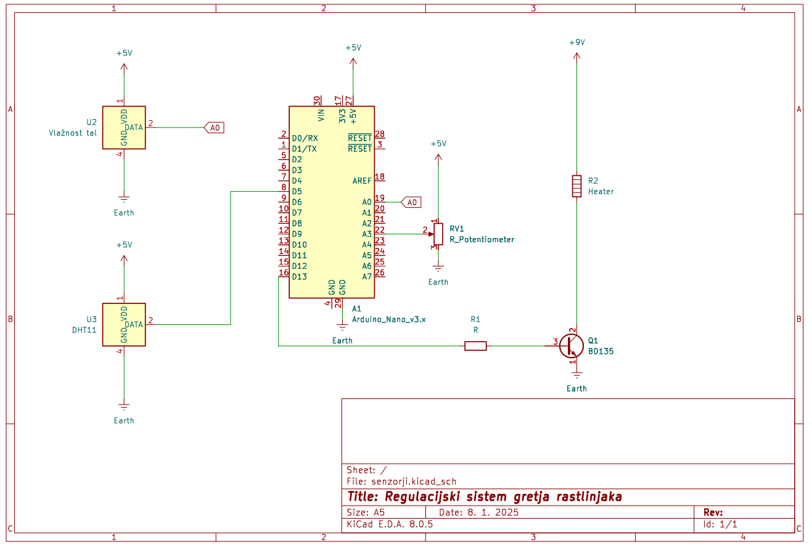

> Avtor: Štrukelj Andreja  
> Univerza v Ljubljani, Pedagoška fakulteta  
> Datum: 2025-02-06  

# REGULACIJSKI SISTEM GRETJA RASTLINJAKA

**POVZETEK**

V poročilu projekta je opisano delovanje sistema in njegova izdelava. V
prvem poglavju je predstavljen namen projekta, ki je avtomatska
regulacija temperature in vlažnosti zraka ter spremljanje nivoja vlage v
zemlji. Kratko so opisane glavne komponente sistema, kot so **Arduino
Nano**, **DHT11 senzor za temperaturo in vlažnost**, **senzor nivoja
vode** in **BD135 tranzistor** za nadzor grelca.

Poglavje *Delovanje vezja* predstavi postopek izdelave in pojasnila za
uporabo posameznih komponent vezja, vključno z načinom povezovanja
senzorjev in tranzistorja z Arduino Nano. V tem poglavju je vključena
tudi razlaga postopka programiranja, ki omogoča merjenje temperature,
vlažnosti in vlago zemlje ter avtomatsko vklapljanje in izklapljanje
grelca.

V zaključku so podani nasveti za učitelje v osnovnih šolah, ki bi želeli
ta projekt izvesti z učenci. Opisane so tudi morebitne težave, na katere
lahko naletimo pri izdelavi projekta, kot so težave pri branju podatkov
s senzorjev, napačna nastavitev pragov za temperaturo ter izzivi pri
povezovanju komponent. Poročilo ponuja tudi rešitve za te izzive, s
ciljem, da bi omogočili enostavno izdelavo in uporabo sistema v
različnih okoljih.

Ključne besede:

Senzor temperature in vlage, senzor za merjenje nivoja vode, krmilnik
Arduino Nano, potenciometer, grelec

## **UVOD**

Projekt Regulacijski sistem gretja rastlinjaka je atraktiven projekt,
primeren predvsem za šolski prostor, saj ponuja priložnost za
spoznavanje osnov elektronike, programiranja in avtomatizacije. Učenci
bi se s tem projektom pri izbirnem predmetu Elektronika z robotiko
naučili osnov izdelave elektronskih vezij, uporabe senzorjev ter
programiranja v okolju Arduino. Poleg tega projekt omogoča pridobivanje
znanja o tem, kako avtomatsko uravnavati okoljske pogoje in spremljati
nivoje vode, kar ima praktično uporabno vrednost.

Znanje in ideje za ta projekt sem črpala iz različnih virov. Ena glavnih
virov so bile spletne strani, kot je <https://projecthub.arduino.cc>,
kjer je na voljo veliko primerov in vodičev, ki prikazujejo podobne
projekte za nadzor temperature in vlažnosti, ter spremljanje vlage
zemlje. Na teh straneh so bili vključeni različni primeri z uporabo
senzorjev in preklopnih mehanizmov, vendar so nekateri od teh projektov
zasnovani prezahtevno za osnovnošolske učence. Prav tako so nekateri
projekti ponujali zgolj enostavne funkcionalnosti, kot je vklop/izklop
brez dodatnih možnosti nastavitve praga. Kljub tem pomanjkljivostim pa
so mi ti projekti dali uporabne začetne ideje za izdelavo vezja, izbiro
komponent in za pisanje programa, ki vključuje spremljanje temperature,
vlažnosti in vlažnosti zemlje ter njihovo avtomatsko obvladovanje.

## **DELOVANJE VEZJA**

Vezje temelji na uporabi več senzorjev, tranzistorja za nadzor grelca in
mikrokrmilnika Arduino Nano. Spodaj je postopna razlaga delovanja vezja:

**1. Arduino Nano**

Arduino Nano je osrednji mikrokrmilnik v tem vezju, ki skrbi za obdelavo
podatkov in nadzor vseh komponent. Vse komponente so povezane z Arduino
Nano, ki zbira podatke z različnih senzorjev in na podlagi teh podatkov
sproži določene akcije (vklop/izklop grelca, spremljanje vlage zemlje).

**2. DHT11 senzor za temperaturo in vlažnost**

DHT11 senzor je odgovoren za merjenje temperature in vlažnosti v
prostoru. Senzor pošilja podatke na analogni vhod na Arduinu (v tem
primeru digitalni vhod D5). Arduino bo s pomočjo knjižnice za DHT11
prebral vrednosti temperature in vlažnosti. Te vrednosti se nato
uporabijo za odločanje o tem, ali se grelec vklopi ali izklopi.

**Postopek:**

-   Ko Arduino prebere temperaturo, jo primerja z nastavljeno zgornjo in
    spodnjo mejo (pragovi temperature).
-   Če temperatura pade pod spodnji prag, se grelec vklopi, da poveča
    temperaturo.
-   Če temperatura preseže zgornji prag, se grelec izklopi, da prepreči
    pregrevanje rastlin.

**3. Senzor vlažnosti zemlje**

Senzor vlažnosti zemlje meri količino vode v zemlji. Na voljo je več
različic senzorjev nivoja vode, v tem primeru pa se uporablja analogni
senzor, ki pošilja signal Arduinu, ki na podlagi prebranih vrednosti
izračuna nivo vode.

**Postopek:**

-   Senzor nivoja vode meri vlažnost zemlje.
-   Arduino prebere vrednost iz senzorja (na analognem vhodu) in jo
    prikaže, v primeru drugega programa kot povprečje desetih meritev.
-   Senzor vlage zemlje je povezan z napajanjem.

**4. BD135 tranzistor**

BD135 je NPN tranzistor, ki služi za nadzorovanje vklopa in izklopa
grelca. Arduino upravlja tranzistor z uporabo digitalnega izhoda (v tem
primeru D13), ki omogoča, da tranzistor omogoči ali onemogoči napajanje
grelca.

**Postopek:**

-   Ko Arduino zazna, da je temperatura prenizka (spodnji prag), pošlje
    signal na BD135 tranzistor.
-   Tranzistor bo omogočil pretok toka do grelca, kar povzroči vklop
    grelca.
-   Ko temperatura preseže zgornji prag, Arduino pošlje signal, ki
    izklopi tranzistor, s tem pa tudi grelec.

**5. Napajanje**

Za napajanje vezja je potreben ustrezen vir napajanja (npr. USB kabel,
napajalnik). Vse komponente (Arduino, DHT11, senzor nivoja vode, grelec)
so povezane z napajanjem. Arduino Nano deluje z napetostjo 5V, kar
omogoča, da vsi senzorji in tranzistor delujejo z ustrezno napetostjo.


{width="9.34375in" height="6.291666666666667in"}

Programska koda

```cpp
#define SIGNAL_PIN A0   // Pin na Arduino Nano, povezan s signalnim pinom senzorja za merjenje nivoja vode.
#include \<dht11.h\>
#define DHT11PIN 5   // Pin na Arduino Nano, povezan s signalnim pinom DHT11 senzorja
#define DHTTYPE DHT11  
#define HEATER 13  // Pin na Arduino Nano, povezan z grelcem (preko tranzistorja BD135)
dht11 DHT11;

//nastavitve temperaturnih pragov
const int TEMP_THRESHOLD_UPPER = 24; // Zgornji temperaturni prag, spremenite na želeno vrednost
const int TEMP_THRESHOLD_LOWER = 23; // Spodnji temperaturni prag, spremenite na želeno vrednost

int waterLevel; // Spremenljivka za shranjevanje nivoja vode
float temperature;    // trenutna temperatura v stopinjah Celsius
float humidity;    //trenutna vlažnost

void setup() {
  Serial.begin(9600); // Inicializacija serijske komunikacije      
  pinMode(HEATER, OUTPUT); // Nastavitev pina grelca kot izhodni pin
  digitalWrite(HEATER, LOW); // Grelni element na začetku izklopljen  
}

void loop() {
  // Branje podatkov iz DHT11 senzorja
  delay(2000);                 // Interval med meritvami
  int chk = DHT11.read(DHT11PIN);   // Branje podatkov iz DHT11 senzorja

  // Preverjanje veljavnosti podatkov iz DHT11 senzorja  
  if (isnan(temperature)) {
    Serial.println(\"Napaka pri branju DHT senzorja!\");
    return;  // Izhod iz funkcije, če branje temperature ni bilo uspešno
  }

  temperature = DHT11.temperature;  // Preberemo temperaturo
  humidity = DHT11.humidity;  // Preberemo vlažnost  

   // Izpis podatkov o temperaturi in vlažnosti
  Serial.print(\"Temperatura  (C): \");  // Temperatura v stopinjah Celzija
  Serial.println((float)DHT11.temperature);
  Serial.print(\"Vlažnost  (%): \");          // Vlažnost v odstotkih  
  Serial.println((float)DHT11.humidity);    

  // Branje vrednosti senzorja temperature (analogni vhod A3)
  int sensorValue = analogRead(A3);  // Preberemo analogno vrednost senzorja
  int tempValue = 0.0762 \* sensorValue - 30; // Pretvorba v temperaturni približek
  Serial.print(\"Nastavitev temperature: \");
  Serial.println(tempValue);

  // Regulacija grelca glede na temperaturo
  if(temperature \<= TEMP_THRESHOLD_LOWER){
    Serial.println(\"Grelni element je VKLOPLJEN.\");
    digitalWrite(HEATER, HIGH); // Vklop grelca
  } else if(temperature \>= TEMP_THRESHOLD_UPPER){
      Serial.println(\"Grelni element je IZKLOPLJEN.\");
      digitalWrite(HEATER, LOW); // Izklop grelca
  }

  // Izpis meritev vlažnosti zemlje
   int waterLevel = analogRead(A0);
  Serial.print(\"Napetost: \");
  Serial.println(waterLevel);
  delay(9000);  // Počakamo 9 sekund pred naslednjim branjem

}
```

**Izboljšava s potenciometrom in povprečjem desetih meritev vlage zemlje:**

```cpp
#define SIGNAL_PIN A0   // Pin na Arduino Nano, povezan s signalnim pinom senzorja za merjenje nivoja vode.
#include \<dht11.h\>
#define DHT11PIN 5   // Pin na Arduino Nano, povezan s signalnim pinom DHT11 senzorja
#define DHTTYPE DHT11  
#define HEATER 13  // Pin na Arduino Nano, povezan z grelcem (preko tranzistorja BD135)

dht11 DHT11;

//nastavitve temperaturnih pragov
const int TEMP_THRESHOLD_UPPER = 24; // Zgornji temperaturni prag, spremenite na želeno vrednost
const int TEMP_THRESHOLD_LOWER = 23; // Spodnji temperaturni prag, spremenite na želeno vrednost
const int HISTEREZA = 1; // 1 stopinja celzij
int waterLevel;   // Spremenljivka za shranjevanje vlage zemlje
float temperature;    // trenutna temperatura v stopinjah Celsius
float humidity;    // trenutna vlažnost

void setup()

{
  Serial.begin(9600); // Inicializacija serijske komunikacije
  //DHT11.begin();        
  pinMode(HEATER, OUTPUT); // Nastavitev pina grelca kot izhodni pin
  digitalWrite(HEATER, LOW); // Grelni element na začetku izklopljen
}

void loop() {
  // Branje podatkov iz DHT11 senzorja
  delay(2000);                 // Interval med meritvami
  int chk = DHT11.read(DHT11PIN);   // Branje podatkov iz DHT11 senzorja
  // Preverjanje veljavnosti podatkov iz DHT11 senzorja  
  if (isnan(temperature)) {
    Serial.println(\"Napaka pri branju DHT senzorja!\");
    return;  // Izhod iz funkcije, če branje temperature ni bilo uspešno
  }

  temperature = DHT11.temperature;  // Preberemo temperaturo
  humidity = DHT11.humidity;  // Preberemo vlažnost  

   // Izpis podatkov o temperaturi in vlažnosti
  Serial.print(\"Temperatura  (C): \");  // Temperatura v stopinjah Celzija
  Serial.println((float)DHT11.temperature);
  Serial.print(\"Vlažnost  (%): \");          // Vlažnost v odstotkih  
  Serial.println((float)DHT11.humidity);    

  // Branje vrednosti senzorja vode (analogni vhod A3)
  int sensorValue = analogRead(A3);  // Preberemo analogno vrednost senzorja
  int tempValue = 0.0762 \* sensorValue - 30; // Pretvorba v temperaturni približek
  Serial.print(\"Vrednost senzorja vode (približna temperatura): \");
  Serial.println(tempValue);

  // Regulacija grelca glede na temperaturo
  if(temperature \<= tempValue - HISTEREZA){
    Serial.println(\"Grelni element je VKLOPLJEN.\");
    digitalWrite(HEATER, HIGH); // Vklop grelca
  } else if(temperature \>= tempValue + HISTEREZA){
      Serial.println(\"Grelni element je IZKLOPLJEN.\");
      digitalWrite(HEATER, LOW); // Izklop grelca
  }
  waterLevel = 0;

  // Izpis povprečja 10 meritev nivoja vode
  for(int i = 0; i \< 9; i++) {
    waterLevel += analogRead(A0);  
  }
  waterLevel = waterLevel/10;
  Serial.print(\"Povprečje desetih meritev: \");
  Serial.println(waterLevel);
  delay(9000);  // Počakamo 9 sekund pred naslednjim branjem
}
```

## **IZDELAVA VEZJA**

**Material**

-   krmilnik Arduino NANO
-   1 USB-kabel, za povezavo krmilnikov z računalnikom
-   1 napajalnik za 9V
-   senzor DHT11
-   senzor za merjenje nivoja vode
-   tranzistor BD135
-   prototipna ploščica
-   potenciometer
-   upor
-   žarnica (grelec)
-   vezne žičke (1 modra, 2 rdeči, 2 rumeni, 2 zeleni, 2 oranžni, 6
    belih, 1 črna)

**Orodja in pripomočki**

-   osebni računalnik z nameščenim operacijskim sistemom Windows
-   Arduino IDE, integrirano programsko razvojno okolje
-   KiCad 8.0

**Koraki pri izdelavi vezja:**

Projekt sem začela z načrtovanjem in izbiro komponent, potrebnih za
izdelavo sistema za nadzor temperature, vlažnosti in nivoja vode.
Najprej sem se odločila za uporabo Arduino Nano kot osrednjega
krmilnika, saj omogoča enostavno povezovanje senzorjev in preklopnih
komponent. Za merjenje temperature in vlažnosti sem izbrala DHT11
senzor, za spremljanje nivoja vode pa sem uporabila senzor nivoja vode,
ki pošilja analogne podatke o količini vode v zbiralniku.

Nato sem vključila BD135 tranzistor, ki je omogočil vklop in izklop
grelca na podlagi prebranih temperaturnih vrednosti. Povezala sem vse
komponente na prototipno ploščico, pri čemer sem senzorje priključila na
ustrezne pine Arduina, tranzistor pa sem uporabila za nadzor napajanja
grelca.

Ko sem končala z izdelavo vezja, sem vse sestavila in po potrebi
prilagodila povezave. Za boljše razumevanje in preverjanje delovanja sem
vse vezje narisala v simulacijskem programu KiCAD.

Programsko kodo sem postopoma razvijala in prilagajala, pri čemer sem
postopoma dodajala nove funkcionalnosti, da sem lahko preverila pravilno
delovanje vsake posamezne komponente sistema.

1.  **Povezovanje DHT11 senzorja za temperaturo in vlažnost:**

> Na prototipno ploščico sem najprej namestila DHT11 senzor, ki meri
> temperaturo in vlažnost zraka. Senzor sem povezala z Arduino Nano, pri
> čemer sem pin senzorja priključila na digitalni vhod D5, napajanje
> (VCC) pa na 5V napajanje Arduina, medtem ko sem ozemljitev (GND)
> povezala z GND na Arduinu. Za pravilno delovanje sem v programu
> uporabila ustrezno knjižnico za DHT11 senzor, s čimer sem omogočila
> branje podatkov o temperaturi in vlažnosti. Nato sem te podatke
> obdelala in uporabila za nadaljnjo obvladovanje sistema.
>
> Za preverjanje delovanja senzorja sem uporabila svetlečo diodo, ki mi
> je omogočila vizualno spremljanje, ali senzor pravilno zaznava
> spremembe temperature. Ko je senzor zaznal spremembo, se je dioda
> prižgala ali ugasnila, kar mi je dalo jasen in enostaven prikaz stanja
> sistema. S tem sem zagotovila, da senzor deluje pravilno, preden sem
> nadaljevala z obdelavo podatkov in integracijo v celoten sistem.

2.  **Povezovanje senzorja vlažnosti zemlje:**

> Na prototipno ploščico sem dodala senzor vlažnosti, ki meri količino
> vode v zbiralniku. Senzor sem priključila na analognem vhodu A0 na
> Arduino Nano, poleg tega pa sem poskrbela tudi za povezavo napajanja
> in ozemljitve, saj senzor potrebuje ustrezno napajanje za delovanje.
> Podatke o vlažnosti zemlje sem obdelovala v programu.

{width="6.3in"
height="3.546786964129484in"}

3.  **Povezovanje BD135 tranzistorja za nadzor grelca:**

> Za nadzor grelca sem uporabila NPN tranzistor BD135, ki omogoča vklop
> in izklop napajanja grelca glede na temperaturne podatke. Bazo
> tranzistorja sem povezala z digitalnim izhodom (pin D13) na Arduino
> Nano, kolektor pa sem priključila na negativni priključek grelca.
> Pozitivni priključek grelca sem neposredno povezana na 9V napajanje.
> Tako Arduino preko tranzistorja omogoča avtomatsko vklapljanje grelca,
> ko temperatura pade pod vnaprej določen prag, s čimer zagotovi, da
> okolje ohranja želeno temperaturo.

{width="6.55in"
height="4.324974846894138in"}

4.  **Napajanje in povezave:**

> Celotno vezje je napajano preko napajalnika, ki zagotavlja 5V napetost
> za Arduino Nano in vse komponente, medtem ko je grelec povezan na 9V
> napajanje, saj zahteva višjo napetost za delovanje. Povezave
> senzorjev, tranzistorja in drugih komponent so bile izvedene z
> ustreznimi žicami, ki sem jih priključila na prototipno ploščico, s
> čimer sem zagotovila stabilne električne povezave med vsemi deli
> vezja.

{width="6.3in"
height="3.547222222222222in"}

{width="6.233333333333333in"
height="5.212813867016623in"}

**Postopek nalaganja programa:**

Najprej sem pripravila programsko kodo, ki je obravnavala delovanje
vsake komponente posebej. Nato sem kodo posamično naložila na Arduino,
da sem lahko preizkusila in preverila pravilno delovanje vsakega dela
sistema. Ko sem se prepričala, da vse komponente delujejo brez napak,
sem vse posamezne kode združila v en celovit program. Po uspešnem
nalaganju končne kode na Arduino je vezje pričelo delovati, spremljalo
temperaturo in nivo vode ter samodejno uravnavalo delovanje grelca.

**Izboljšave:**

Pred zaključkom projekta sem izvedla še izboljšavo, tako da sem dodala
potenciometer, ki omogoča regulacijo temperature, podobno kot pri
sistemu centralnega ogrevanja. S pomočjo potenciometra uporabnik
enostavno nastavi želeno temperaturo, ki se nato samodejno uravnava v
rastlinjaku. Seveda sem prilagodila tudi programsko kodo, da je
potenciometer omogočil natančno spremljanje in obvladovanje temperature
v skladu z izbrano vrednostjo.

To različico sem vključila tudi v načrt v programu KiCAD.

{width="8.391666666666667in"
height="5.475in"}

## **ZAKLJUČEK IN UGOTOVITVE**

Projekt je uspešno združil več komponent, ki omogočajo avtomatski nadzor
temperature, vlažnosti zraka in vlažnosti zemlje v rastlinjaku. S
pomočjo Arduino Nano sem usklajevala delovanje DHT11 senzorja, senzorja
vlažnosti zemlje ter BD135 tranzistorja za nadzor grelca, kar omogoča
učinkovito obvladovanje okoljskih pogojev. Ko sem uspešno povezala vse
komponente in naložila ustrezno programsko kodo, je sistem začel
delovati in samodejno uravnavati delovanje grelca ter spremljati podatke
o temperaturi in vlažnosti zemlje.

Ena od možnih izboljšav bi bila vključitev prikazovanja podatkov na
serijskem monitorju. Podatke o temperaturi, vlažnosti in vlažnosti
zemlje bi lahko poslala na serijski monitor preko USB povezave, kar bi
omogočilo spremljanje delovanja sistema v realnem času. S tem bi lahko v
vsakem trenutku preverili, ali vezje pravilno bere podatke in sproži
ustrezne akcije za vklop ali izklop grelca, ter ugotovili morebitne
napake ali nepravilnosti v delovanju sistema. Ta izboljšava bi bila
uporabna za natančnejše spremljanje in diagnosticiranje sistema ter
povečanje njegove zanesljivosti.

Sistem bi lahko nadgradili s pametnim nadzorom, kjer bi uporabnik preko
mobilne aplikacije, ki se poveže z WiFi vmesnikom, spremljal stanje
temperature, vlažnosti zraka in vlažnosti zemlje v realnem času. Na ta
način bi lahko na daljavo prilagajal nastavitve sistema ter prejemal
obvestila o morebitnih spremembah ali napakah. Za izdelavo aplikacije bi
lahko uporabili MIT App Inventor, ki omogoča enostavno ustvarjanje
mobilnih aplikacij z vgrajenimi funkcionalnostmi za komunikacijo preko
WiFi omrežja. Poleg tega sta MIT App Inventor in Arduino Nano popolnoma
združljiva, kar omogoča preprosto in učinkovito integracijo med obema
platformama za nadzor sistema.

Namesto enega DHT11 senzorja bi bilo smiselno dodati še en ali več
senzorjev za spremljanje temperature in vlažnosti na različnih mestih
rastlinjaka. Rastlinjaki so lahko prostori z različnimi mikroklimatskimi
pogoji, kjer so temperature in vlažnost lahko različni na različnih
lokacijah. Z več senzorji, nameščenimi na strateških točkah, bi lahko
natančneje spremljali in uravnavali temperaturo ter vlažnost na več
mestih hkrati. Na primer, senzorji bi lahko bili nameščeni blizu tal, v
srednjem delu rastlinjaka in ob stropu, da bi zajeli vse temperaturne
razlike, ki se lahko pojavijo zaradi razlike v višini in sončnem
obsevanju.

Več senzorjev bi omogočilo boljšo prilagodljivost in natančnost sistema
za uravnavanje klimatskih pogojev, saj bi omogočili bolj temeljito
analizo in obvladovanje pogojev v celotnem prostoru. Sistem bi lahko
prilagodil delovanje grelca ali ventilacije na podlagi podatkov več
senzorjev, kar bi povečalo učinkovitost sistema in zagotovilo bolj
optimalne pogoje za rast rastlin. Prav tako bi ta pristop zmanjšal
tveganje za napake, ki bi nastale, če bi se zanašali le na en sam
senzor, ki morda ne zajema vseh variacij v prostoru.

Senzor svetlobe bi lahko učinkovito pripomogel k samodejni regulaciji
pogojev v rastlinjaku. S spremljanjem jakosti naravne svetlobe bi sistem
lahko samodejno prilagodil delovanje žaluzij. Če bi zaznal premočno
sončno svetlobo, bi lahko sprožil zapiranje žaluzij, da bi zmanjšal
neposredno sončno sevanje in preprečil pregrevanje notranjosti
rastlinjaka. Tako bi ohranjali optimalno temperaturo in preprečili
škodljive učinke previsokih temperatur na rastline.

Poleg tega bi senzor svetlobe omogočal tudi samodejno odpiranje in
zapiranje oken v rastlinjaku. V primeru močne sončne svetlobe in
povišanja temperature v prostoru bi se okna lahko odprla, kar bi
omogočilo boljši pretok svežega zraka in zmanjšanje temperature. Ko bi
svetloba postala šibkejša, bi se okna lahko zaprla, da bi zadržala
toploto. Ta sistem bi tudi optimiziral porabo energije, saj bi senzor
zaznal dovolj naravne svetlobe in onemogočil delovanje umetne
razsvetljave, kar bi pripomoglo k večji energetski učinkovitosti in
ugodnemu okolju za rast rastlin.

Senzor za nivo vode v zbiralniku deževnice omogoča spremljanje količine
razpoložljive vode v realnem času. Sistem lahko uporabnika obvesti o
nizkem nivoju vode ali sproži avtomatske ukrepe, kot so preklop na
alternativni vir vode ali optimizacija porabe. Ta senzor v kombinaciji z
drugimi, na primer senzorji vlage tal, izboljša učinkovitost regulacije
v rastlinjaku. Omogoča natančnejše upravljanje zalog vode,
avtomatizacijo zalivanja in zmanjšanje izgube vode, kar sistem naredi
zanesljivejši in okolju prijazen.

Senzorji vlage tal bi bili ključni za izboljšanje avtomatizacije sistema
zalivanja v rastlinjaku. Ti senzorji omogočajo natančno spremljanje
vlažnosti v tleh, kar je bistveno za zagotovitev optimalnih pogojev za
rast rastlin. Ko bi vlaga v tleh padla pod predhodno nastavljeno
kritično raven, bi sistem samodejno aktiviral mehanizem za zalivanje, s
čimer bi zagotovil, da rastline nikoli ne bi trpele zaradi pomanjkanja
vode. Ta proces bi omogočil avtomatizirano, a hkrati prilagodljivo
zalivanje, ki bi upoštevalo specifične potrebe različnih vrst rastlin v
rastlinjaku.

S tem bi bil sistem še bolj učinkovit, saj bi zmanjšal potrebo po ročnem
zalivanju in pripomogel k večji energetski in vodni učinkovitosti. Z
dodatkom teh senzorjev bi bilo mogoče natančneje prilagajati vlažnost
tal, s tem pa tudi zdravje in rast rastlin. V rastlinjakih, kjer so
pogoji za rast lahko zelo specifični, bi ta avtomatizacija omogočila
boljšo obvladovanje virov in zmanjšala izgubo vode, saj bi se voda
porabljala samo, kadar bi bila potrebna. Na ta način bi se optimiziral
celoten proces oskrbe z vodo in pripomoglo k večji rasti in razvoju
rastlin.

Za uspešno izvedbo tega projekta v osnovnošolskem okolju je pomembno, da
učitelji skrbno spremljajo vsako fazo projekta in zagotovijo, da so
učenci ustrezno seznanjeni z uporabo komponent in programiranjem. Ena
izmed težav, ki se lahko pojavijo pri branju podatkov s senzorjev, je
napačna povezava ali slaba napetostna napajalna povezava. V tem primeru
je priporočljivo preveriti vse povezave in zagotoviti, da so komponente
pravilno napajane. Prav tako je pomembno, da se upošteva natančnost
senzorjev in da se zagotovijo ustrezni pogoji za njihovo delovanje.

Pri povezovanju komponent lahko pride do težav z neustreznimi žicami ali
napačno izbranim tranzistorjem. Pomembno je, da se učenci seznanijo z
različnimi tipi tranzistorjev in njihovimi specifikacijami. Če učitelji
uporabljajo prototipne ploščice, morajo poskrbeti, da so vse žice in
povezave pravilno vstavljene, da se izognemo napačnemu delovanju
sistema.

Za enostavno izdelavo in uporabo sistema v različnih okoljih je
priporočljivo, da učitelji pripravijo jasna navodila in postopke za vsak
korak projekta, vključno z uporabo simulacijskih orodij, kot je npr.
Tinkercad, in vključitvijo testiranja posameznih komponent, preden jih
povežejo v končni sistem. Na ta način se lahko težave hitro zaznajo in
rešijo.

## **VIRI IN LITERATURA**

\[1\] Kocijančič S. (2019). *Elektronika 1*. Ljubljana; Pedagoška
fakulteta, Univerza v Ljubljani.

\[2\] Kocijančič S. (2020). *Projekti iz elektronike*. Ljubljana;
Pedagoška fakulteta, Univerza v Ljubljani,

\[3\] Rihtaršič D. (2020). *Projekti iz elektronike -- vaje*. Ljubljana;
Pedagoška fakulteta, Univerza v Ljubljani.

\[4\] Water Senzor Basics (b.d.)
\[<https://projecthub.arduino.cc/daryllqayyim/water-sensor-basic-13d33f>\].

\[5\] Arduino -- Water senzor (b.d.)

\[<https://arduinogetstarted.com/tutorials/arduino-water-sensor>\].

\[6\] How Water Level Sensor Works and Interface it with Arduino (b.d.)
\[<https://lastminuteengineers.com/water-level-sensor-arduino-tutorial/>\].

\[7\] How to use potentiometer (b.d)

\[<https://www.instructables.com/How-to-use-Potentiometer-Arduino-Tutorial/?fbclid=IwAR0VimsN0rrUjbGfJgBSz2fgMQPt01Ic-p_SFRc0PJMeXBYVcSj_dQP-S_8>\].

\[8\] Using DHT11 (b.d)
\[<https://projecthub.arduino.cc/arcaegecengiz/using-dht11-12f621>\].
