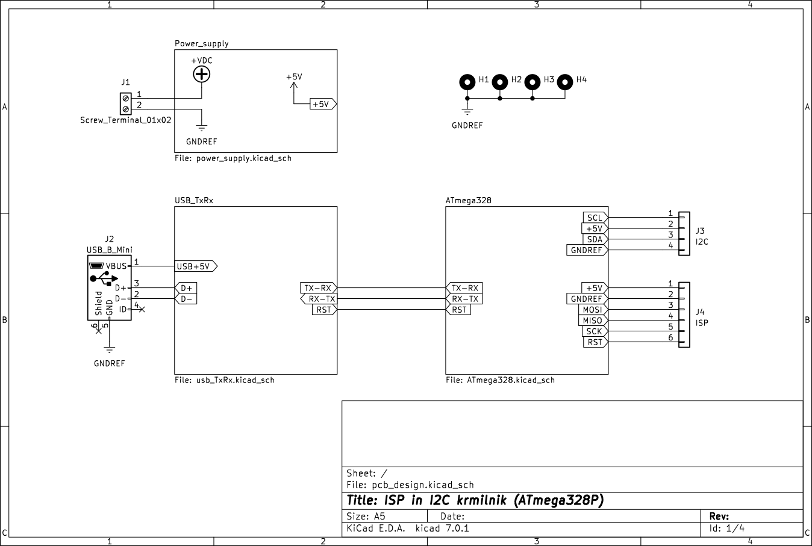
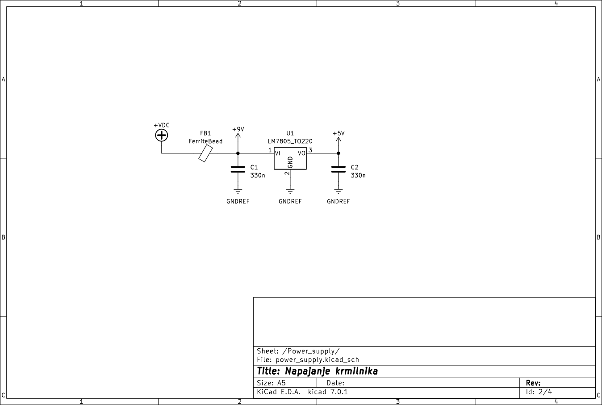
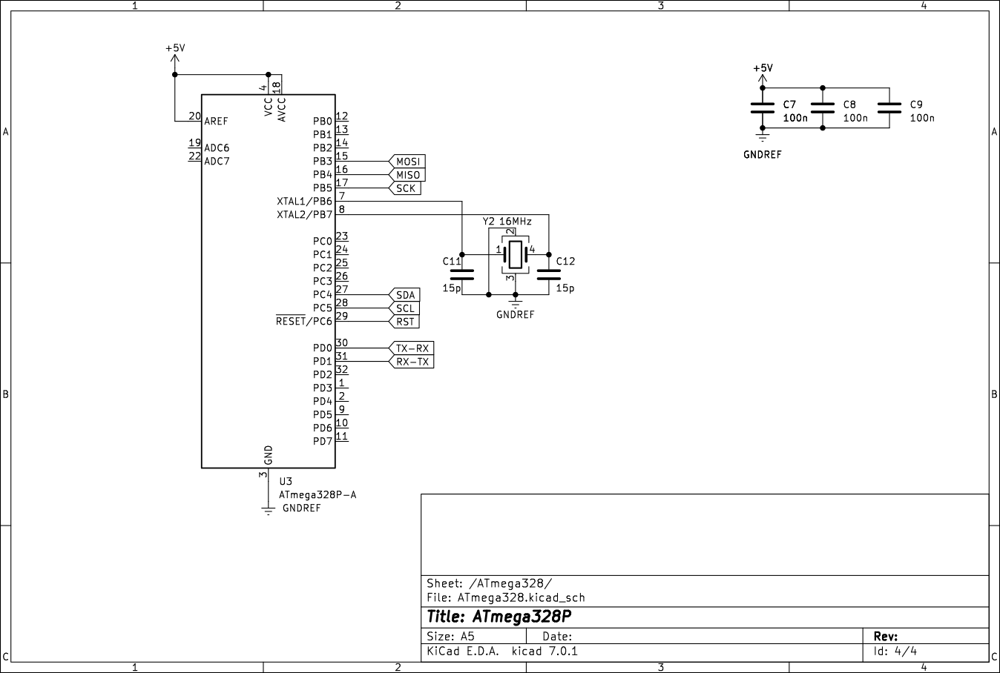
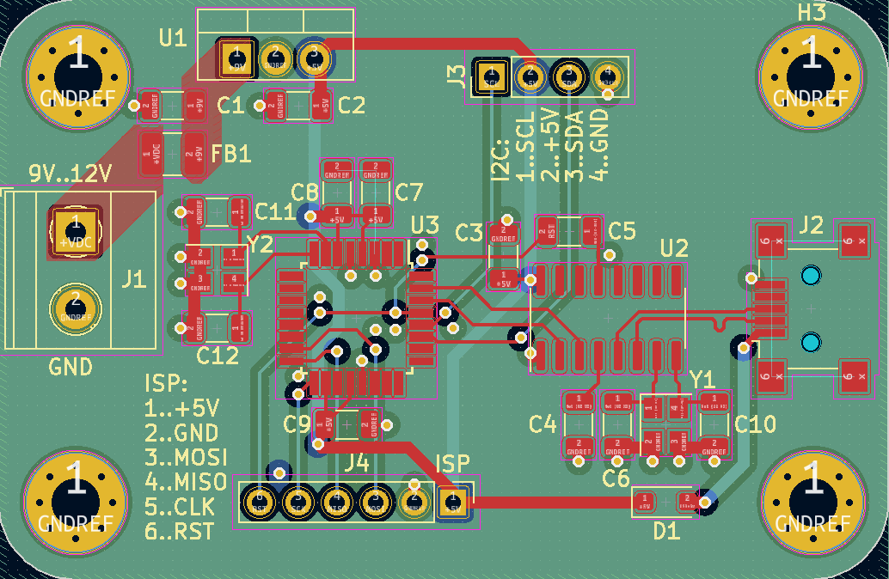

# NAČRTOVANJEM ELEKTRONSKIH VEZIJ

Tudi pri pedagoškem procesu je pomembno, da so vezja narisana nazorno (tako sheme,
kot tudi sestavljanje vezja na prototipni ploščici). V ta namen lahko uporabljate različna
orodja. Omenili bomo vsaj dva, ki sta prosto-dostopna in bi priporočali njihovo uporabo.

## Blokovna razdelitev sheme:

- Vezje razdelite na smiselna pod-vezja (bloke) in jih primerno poimenujte in označite.
- Shemo vezja skušajte orientirati tako, da so na levi strani elementi in pod-vezja, ki so namenjena vhodnim funkcijam,
- na desni strani pa pod-vezja, ki so namenjena izhodnim funkcijam.

Označevanje elementov:

- Uporabljajte IEEE standard simbolov za elemente.
- Elemente opremite s pripadajočimi znakovnimi simboli iz zaporednimi številkami (npr.: R1, R2, L1, C1, C2, C3, IC1...).
- Ob simbolu elementa naj bo vpisana tudi njegova predvidena vrednost (100 Ohmov ali 3k3, 2.7 uF ...).

Označevanje napetostnih potencialov:

- Nedvoumno označite različne napetostne potenciale (Vcc, GND) in njihove vrednosti (+5V, 9V).
- Povezave istih napetostnih potencialov naj bodo v isti višini sheme.
- Višji potenciali naj bodo višje na shemi, nižji pa nižje.

Risanje povezav:

- Povezave naj bodo enostavno sledljive, brez nepotrebnih križanj in sprememb smeri.
- Povezave naj se ne vračajo v smer od koder so si izvirale povezave vhodnih signalov.
- Nedvoumno naj bodo označena stičišča povezav (z debelejšo piko).
- Pomembnejše povezave poimenujte z njihovimi funkcijami.

V nadaljenvaju lahko najdete primer take dokumentacije.
\newpage

{#fig:pcb_design height=9cm}

{#fig:pcb_design-Power_supply height=9cm}

{#fig:pcb_design-USB_TxRx height=9cm}

{#fig:pcb_design-ATmega328 height=9cm}

## Stikalne sheme
EasyEDA je spletno orodje, ki je namenjeno risanju elektronskih vezij, načrtovanju TIV in
izdelavi potrebnih datotek za njihovo izdelavo in je prav gotovo ena od dobrih izbir. Drugo prosto-dostopno programsko orodje pa je KiCad. Ta program je odprtokoden in si ga lahko brezplačno namestimo na računalnik. Primer stikalne sheme, narisane s programskim orodjem KiCAD lahko vidite na [@fig:pcb_design] .. [@fig:pcb_design-ATmega328].

> ### NALOGA: Stikalne sheme
> V programskem orodju KiCAD narišite shemo astabilnegamultivibratorja, izvozite sliko sheme in jo vključite v poročilo.
>
> Shemo tudi blokovno razdelite na: napajalni del in del z NE555 elementom. Na izhodu uporabite svetlečo diodo.

## Tiskana vezja

Pri načrtovanju tiskanega vezja (TIV) je pomembno upoštevati, da je električna energija shranjena v električnem in magnetnem polju ter da se električna energija prenaša le preko teh dveh polj. Tokovi so le posledica sprememb energije v teh poljih in z obliko povezav in površin lahko vplivamo na velikost teh polj. Pri tem je pomembno omejiti velikost polj na čim manjše območje, da se preprečijo elektromagnetne motnje in škodljiv vpliv elektromagnetnih polj na druge dele sistema.

{height=5.5cm} {#fig:pcb_design-PCB height=5.5cm}

Zato je treba pri načrtovanju TIV skrbno premisliti o obliki povezav in površin ter jih prilagoditi specifičnim zahtevam projekta in strogo upoštevati priročnike in smernice za načrtovanje TIV-ja:

- Izbira materiala za TIV: Proizvajalci ponujajo različne možnosti izdelave, ki lahko bistveno vplivajo na lastnosti delovanja  elektronskega vezja. Danes je izdelava TIV s 4-mi bakrenimi plastmi že zelo cenovno ugodna in primerljiva s ceno 2-stranskih TIV. Zato je smiselno izbrati 4-plastno TIV, saj nudi precej boljše možnosti za izogib EM motenj. Tipična razporeditev signalnih in napajalnih povezav je lahko naslednja:

> 2 plastna plošča:  
>  
> ---- SIG./PWR -----  
> (debelejša sredica)  
> (debelejša sredica)  
> (debelejša sredica)  
> ---- GROUND -------  
>  
>  
> 4 plastna plošča:  
>  
> ---- SIG./PWR -----  
> ---- GROUND -------  
> (debelejša sredica)  
> (debelejša sredica)  
> (debelejša sredica)  
> ---- GROUND -------  
> ---- SIG./PWR -----  

- **Potek napajalnih linij**: Napajalne linije je treba skrbno načrtovati, da se zmanjša motnja in razlika v napetostnem potencialu na povezavi. Priporočljivo je uporabiti široke napajalne povezave in jih namestiti ločeno od signalnih linij (glej povezavo J1-FB1-C1-U1).

- **Uporaba razbremenilnih kondenzatorjev**: Razbremenilni kondenzatorji se uporabljajo za filtriranje šumov v napajalnih vodih in površinah. Priporočljivo je uporabiti kombinacijo majhnega keramičnega kondenzatorja in večjega elektrolitskega kondenzatorja, ki jih postavimo v neposredno bližino VSAKEGA napajalnega priključka (npr.: C3,C4, C7-C9). Več si lahko ogledate na [EEVblog](https://www.youtube.com/watch?v=BcJ6UdDx1vg).

- **GND površine**: GND površine zagotavljajo nizko upornost in nizko impedanco za tokove, ki potujejo po PCB-ju. Še bolj pomembne pa so zato, ker omejujejo širjenje električnega polja in tako zmanjšujejo EM motnje. Rešujejo problem najkrajše povezave v primeru DC signalov in omogočajo, da se inducirajo povratni tokovi neposredno pod povezavami. Zavedati se moramo, da električna motnja (el. energija) vrne k svojemu izvoru in pri tem izbere pot z najmanjšo IMPEDANCO! GND površine uporabljamo tudi med povezavami in s tem zmanjšujemo vpliv med sosednjimi signalnimi povezavami. Pazimo, da teh površin ne prekinjamo z režami, saj bi se na tem mestu ustvarilo električno polje (npr.: zeleno polje na TIV).

- **Načrtovanje povezav**: Povezave naj bodo čim krajše, kar zmanjšuje upornost in induktivnost povezave. Povezave naj bodo kar najbolj razmaknjene ena od druge. Pri spremembi smeri povezave ne uporabljamo pravih kotov, saj povečujejo kapacitivnost med povezavami. Smer med povezavami na eni in sosednji plasti TIV naj bo zamaknjena za $90^\circ$, da zmanjšamo medsebojni vpliv (npr.: rdeče povezave so v vodoravni smeri, modre v navpični).

- **Uporaba diferencialnih signalov**: Diferencialni signali se lahko uporabijo za večjo odpornost na zunanje EM motenje. Pri teh povezavah se isti signal prenaša po dveh ločenih žicah z negirano vrednostjo (protifazno). Na sprejemni strani jih nato diferenčno odčitamo in se tako odštejejo tudi motnje, ki so se inducirale v obeh povezavah. Pri načrtovanju teh linij je najbolj pomembno, da so precej ločene od ostalih agresivnejših linij, saj se v nasprotnem primeru inducirajo večji tokovi v bližji povezavi (npr.: povezavi med J2 in U2).

- **Plašč** (angl. shield, priključka ali vodnika) naj bo podaljšek faradejeve kletke in naj NE bo povezan z GND povezavo.

- **Uporaba PI filtrov**: PI filtri se lahko uporabijo za filtriranje neželenega hrupa in valov na napajalnih virih ali signalih. Paziti je treba, da jih skrbno načrtujemo in preizkušamo, da se prepreči morebitne neželene učinke.

- **Ločevanje digitalnih in analognih vezij**: Digitalna in analogni vezja je potrebno fizično ločiti, kolikor je to mogoče, da se zmanjša motnja in vpliv med njimi (npr.: U1 je ločen od  U2 in U3).

- Nameščanje komponent: Komponente je treba namestiti skrbno, da se zmanjša motnja in vpliv. Priporočljivo je, da se komponente postavijo čim bližje ustreznim priključkom integriranega vezja, da se izognemo dolgim signalnim povezavam.

- Preizkušanje in odpravljanje napak: PCB je potrebno temeljito preizkusiti, da se zagotovi pravilno delovanje in odpravijo morebitne napake. To lahko vključuje uporabo osciloskopa in multimetra ter preverjanje signala in napetosti na različnih točkah TIV-ja.

<!--
risanje v KiCAD-u
https://www.youtube.com/watch?v=aVUqaB0IMh4
-->

> ### NALOGA: Risanje TIV
> Za to vezje izrišite TIV in izpišite seznam elektronskih komponent. Izgled TIV izvozite in vstavite v poročilo. Prav tako vstavite seznam komponent.

## Virtualna vezja

Sestavljanje vezij pa na prototipni plošči pa je drugačen proces in za začetnike precej zahteven,
zato je priporočljivo, da uporabljate orodja kot so TinkerCAD-Circuits.

> ### NALOGA: Sestavljanje virtualnih vezij
> V programskem orodju TinkerCAD-Circuits sestavite vezje na prototipni ploščici in sliko vstavite v poročilo.
>

