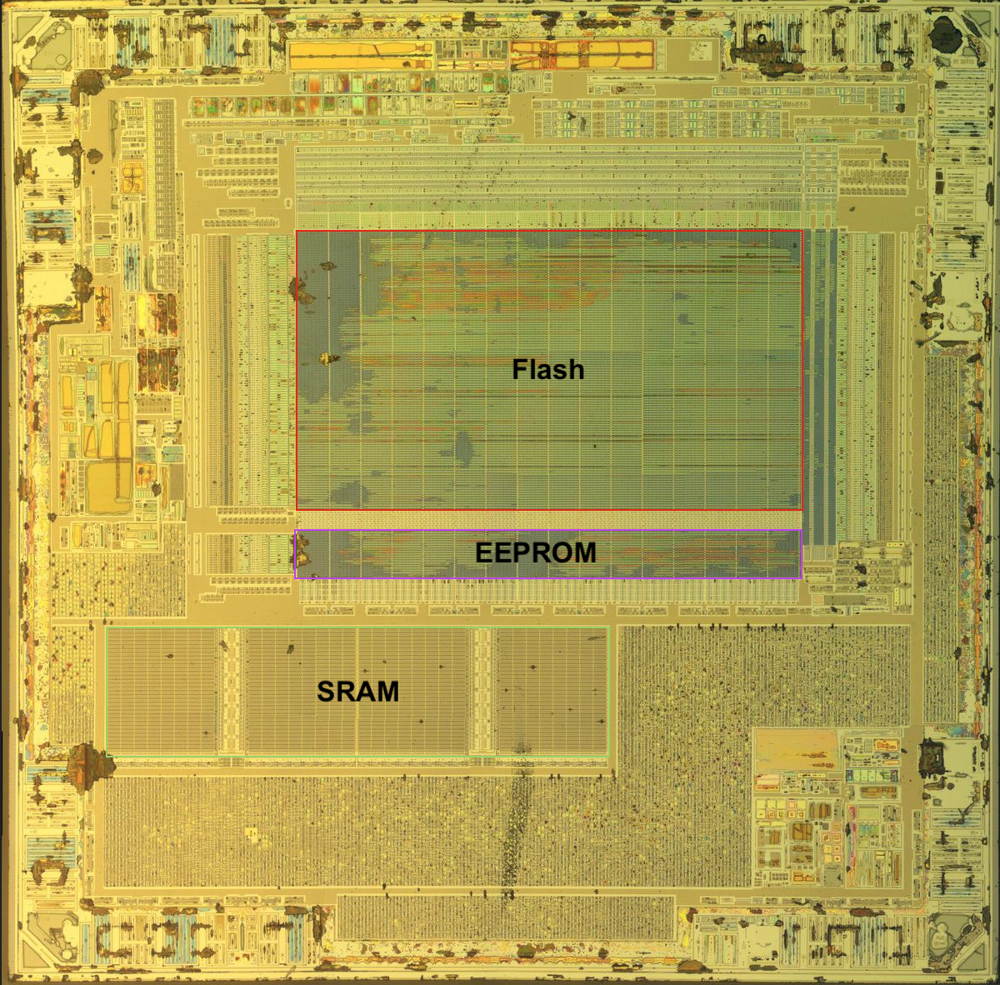
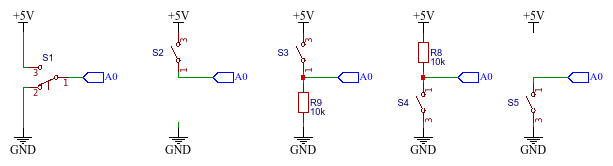

# UPORABA MIKROKRMILNIKOV

Za projekte, ki vključujejo programabilno elektroniko, pogosto uporabljamo že izdelane
krmilnike iz družine Arduino. Na teh vezjih lahko najdemo mikrokrmilnike proizvajalca Atmel.
Najbolj pogosto uporabljena krmilnika (Arduino Uno in Arduino NANO) temeljita na mikrikrmilniku Atmega328p. Blokovna shema tega mikrokrmilnika je prikazana na [@fig:ATmega238_block_diagram].

## Shema mikrokrmilnika ATmega238

Mikrokrmilniki so integrirana vezja, z zelo kompleksno notranjo strukturo. 
Sestavlja jih na milijone tranzistorjev, ki s povezavami in ostalimi osnovnimi
elementi sestavljajo smiselne logične sklope. Povečana slika dejanskega 
integriranega vezja mikrokrmilnika ATmega238 je na [@fig:Atmega328_silicon].

{#fig:Atmega328_silicon height=11cm}

Iz [@fig:Atmega328_silicon] je nemogoče razbrati posamezne dele integriranega 
vezja. Opazimo lahko le večje enake sklope, ki so namenjene spominskim funkcijam.
Še bolj podrobno sliko pa si lahko ogledate na povezavi [ATmega238-SiO2](https://siliconpr0n.org/map/atmel/atmega328/s1_20x/).

Pri tako kompleksnih vezjih je bolj smiselno, da posamezne logične sklope 
predstavimo z blokovno shemo. Tako shemo lahko najdemo v navodilih za uporabo
mikrokrmilnika ATmega238 in je prikazana na [@fig:ATmega238_block_diagram].

{#fig:ATmega238_block_diagram}

> ### NALOGA: Glavni deli krmilnika
> 
> 1. Na blokovni shemi označi pomembne dele krmilnika in zapiši njihov glavni namen (funkcijo). Glavni sestavni deli so: generator delovnega takta (ura), centralno procesna enota, začasni (delovni) spomin, trajni spomin, vhodno-izhodne enote, komunikacijske enote ... 

Mikrokrmilniki na krmilnikih Arduino so že opremljeni s programom (angl.
»boot loader«), ki poskrbi za ustrezno prepisovanje programske vsebine, ki jo računalnik
pošlje preko USB vodila. Tako lahko enostavno programiramo mikrokrmilnike, ki so na
ploščah krmilnikov Arduino.

> ### NALOGA: Osnovne nastavitve in testni program
> 
> 1. Iz programskega okolja Arduino IDE prepišite nastavitve programatorja ter izpolni [@tbl:prog_setuings]:
>
> |        Nastavitveni parameter | Vrednost nastavitvenega parametra |
> |------------------------------:|:---------------------------------:|
> |                Board (Plošča) |                                   |
> | ~~Processor~~ (Mikrokrmilnik) |                                   |
> |                  Port (vrata) |                                   |
> |      Programmer (programator) |                                   |
> Table: Nastavitveni parametri programatorja. {#tbl:prog_setuings}
> 
> 2. Iz primerov, ki so vključeni v programskem okolju Arduino IDE izberite
> Blink.ino in ga preskusite.

## Programiranje krmilnikov Arduino

Za  programiranje  mikrokrmilnika  skrbi  odprtokodna  programska  koda  -  [avrdude](http://savannah.nongnu.org/projects/avrdude), ki se izvaja v ozadju programskega okolja
Arduino IDE. Proces programiranja lahko bolj natančno spremljamo tako, da vključimo

    File -> Preferences:

    Shov verbose output during: [x] compilation [x] upload

> ### NALOGA: AVRDUDE - program za prenos strojne kode
>
> 1. Prepišite  ukazno  vrstico  programa  avrdude  za  premos  strojne  kode  in
> 2. opišite pomen parametrov.
> 
> Več o parametrih lahko najdete na spletni strani [avrdude](http://www.nongnu.org/avrdude/user-manual/avrdude_4.html#Option-Descriptions)
>

## Uporaba vhodno-izhodnih priključkov na kmilniku Arduino

> ### NALOGA: Shema krmilnika Arduino NANO
> 
> 1. Oglejte si [shemo krmilnika Arduino NANO](https://www.arduino.cc/en/uploads/Main/Arduino_Nano-Rev3.2-SCH.pdf) in
> 2. skušaj ugotoviti na kateri priključek IO enote je priključena LED, ki je na krmilniku.
> 3. Izpolni [@tbl:pin_location]
>
> | Funkcija krmilnika | Arduino NANO[^1] | ATmega238[^2] |
> |-------------------:|:----------------:|:-------------:|
> |      LED na plošči |                  |               |
> |                TxD |                  |               |
> |                RxD |                  |               |
> Table: Razporeditev priklučkov na krmilniku in mikrikrmilniku. {#tbl:pin_location}
> 
[^1]: Oznaka priključka na krmilniku Arduino NANO.
[^2]: Oznaka priključka na mikrokrmilniku ATmega238.

## Vhodno-izhodne enote mikrokrmilnika

Vhodno-izhodne enote mikrokrmilnika so dvo-smerne z možnostjo nastavitve upora proti napajanju. Stikalna shema enega priključka na neki vhodno-izhodni enoti je prikazana na [@fig:Atmega328_IOpin_ctrl].

{#fig:Atmega328_IOpin_ctrl}

Čeprav je shema na [@fig:Atmega328_IOpin_ctrl] nekoliko bolj kompleksna, lahko ugotovimo, da za nastavitev delovanja vhodno-izhodne enote potrebujemo le dva signala:

- WDx - (DDRx) - za določanje vhodne oz. izhodne funkcije priključka
- WPx - (PORTx) - za določanje vrednosti logičnega stanja na priključku x.

> ### NALOGA: Krmilni registri mikrokrmilnika
> 
> 1. Preoblikuj program Blink.ino tako, da boš krmilil vklop in izklop LED z nastavitvijo krmilnikh registrov.
> 2. Predstavite programsko kodo.

## Branje napetostnega potenciala

Branje napetostnega potenciala je najbolj pogosto uporabljeno pri vzorčenju pritiska tipke. Poglejmo si tak primer.

{#fig:PBSw_All}

> ### NALOGA: Branje napetostnega potenciala
>
> 1. Sestavite prve tri različice priključitve tipke na digitalni vhod krmilnika A0 in preskusite spodnji program.
> 2. Razložite (ne-)delovanje.

```cpp
void setup(){
    pinMode(13, OUTPUT);
    pinMode(A0, INPUT);
}

void loop(){
    int stikalo_je_sklenjeno = digitalRead(A0);
    if ( stikalo_je_sklenjeno == HIGH)
        digitalWrite(13, HIGH);
    else
        digitalWrite(13, LOW);
}
```

> ### NALOGA: Uporaba upora proti napajanju
>
> 1. Spremenite delilnih napetosti tipka - upor tako, da bo upor vezan proti napajanju in nato spremenite program tako, da bo delovanje ostalo enako prejšnji nalogi. Priložite stikalno shemo vezja in preoblikovan program.
> 2. Odstranite upor in preverite delovanje vezja. Kaj opazite, razložite delovanje.
> 3. Vključite notranji upor proti napajanju, ki se nahaja v mikrokrmilniku ob vsakem vhodno-izhodnem priključku (glej [@fig:Atmega328_IOpin_ctrl]). Priložite programsko spremembo.

## Prehodni stiki stikal

Fizični preklopni elementi (kot je tipka) imajo tudi fizikalne lastnosti kot so trdota, trdnost, prožnost,
elastičnost... Zaradi vseh teh lastnosti je preklop tipke iz enega položaja v drugega lahko tudi nekoliko nepredvidljiv.

> ### NALOGA: Večkratni preklopi
>
> 1. Preskusite spodnji program in opišite njegovo delovanje.
> 2. Opišite zaznane težave.
> 3. Z osciloskopom ujemite enega od prehodov (0->1 ali 1->0) in
> 4. problem rešite:
>       - programsko ter
>       - elektronsko.
> Obe rešitvi dokumentirajte.

```cpp
void setup()
{
    const int LED = 13;
    pinMode(LED, OUTPUT);
    pinMode(A0, INPUT_PULLUP);
}

int i=0;

void loop()
{
    int tipka_je_pritisnjena = !digitalRead(A0);
    if (tipka_je_pritisnjena)
    {
      i++;
      while (tipka_je_pritisnjena)
        tipka_je_pritisnjena = !digitalRead(A0);
      int i_je_liho = i % 2;
      if (i_je_liho)
        digitalWrite(13, HIGH);
      else
        digitalWrite(13, LOW);
    }
}
```

