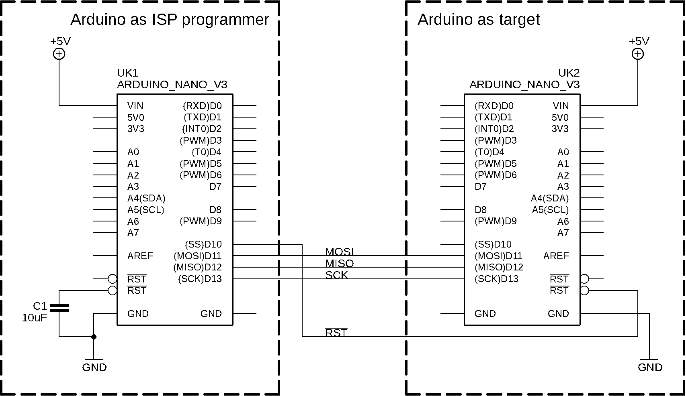

## PROGRAMIRANJE MIKRMILNIKOV

<!--
to-do

kako narediti programator s krmilnikom Arduino NANO
naredi vajo ki jo opisuje tale stran
glej: https://www.arduino.cc/en/Tutorial/BuiltInExamples/ArduinoISP

./avrdude -C/home/david/.arduino15/packages/arduino/tools/avrdude/6.3.0-arduino17/etc/avrdude.conf -v -p atmega328p -c arduino -P/dev/ttyUSB0 -b 19200 -t
-->

{#fig:Arduino_as_ISP_s1}

