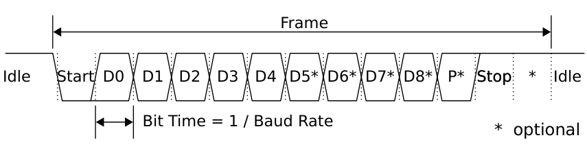
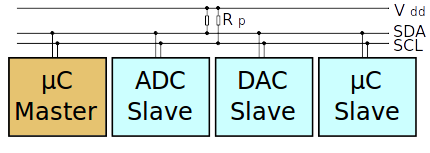
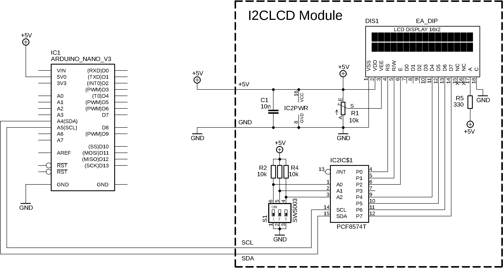

# KOMUNIKACIJSKI VMESNIKI

## Serijska komunikacija UART

Nekaj več o UART komunikaciji si lahko preberete vsepovsod na 
[svetovnem spletu](https://www.codrey.com/embedded-systems/uart-serial-communication-rs232/). Ker jo uporabljamo
že več kot pol stoletja, lahko rečemo, da sodi med osnovne komunikacijske protokole.



> ### NALOGA: Osnovni parametri UART protokola
>
> 1. Preučite UART protokol in prerišite časovni potek signala (teoretično).
> 2. Na  teoretičnem  primeru  komentirajte:
>   - pomen  napetostnega  signala,
>   - kako si sledijo podatkovne informacije,
>   - označite start in stop bit, 
>   - izračunajte dolžino trajanja enega bita pri $baud = 9600 b/s$.

Komunikacija  UART je  tako  razširjena,  da  jo  vključujejo  v  skoraj  vse  programabilne
elektronske komponente in Arduino NANO ni nobena izjema. Mikrokrmilnik ATmega328p
vsebuje enoto za komunikacijo UART in je dostopna na priključkih 0 (Rx) in 1 (Tx). Preko
te enote lahko pošiljamo/sprejemamo podatke drugih zunanjih naprav.

> ### NALOGA: Uporaba serijske UART komunikacije
>
> 1. Preučite shemo za krmilnik [Arduino NANO](https://www.arduino.cc/en/uploads/Main/Arduino_Nano-Rev3.2-SCH.pdf) in poiščite priključka za UART komunikacijo.
> 2. Preskusite naslednji program mikrokrmilnika za pošiljanje nekega besedila
> računalniku  in  odziv  spremjajte  v  serijskemu  oknu  programa  ArduinoIDE:
```cpp
void setup() {
      Serial.begin(9600);
}
void loop() {
  Serial.println("Pozdravljen svet.");
  delay(1000);
}
```
> ### NALOGA: Časovni potek napetosti UART komunikacije
>
> 1. Z osciloskopom posnemite napetostni signal pošiljanja enega samega znaka in
> 2. parametre primerjajte s teoretičnimi vrednostmi komunikacije.
> 3. Na grafu U(t) označite logične vrednosti posameznih bitov in  označite njihovo funkcijo (start bit, stop bit in položaj bita D0..D7).
> 4. Iz grafa U(t) odčitajte poslano podatkovno vrednost in jo primerjajte z [ASCII tabelo](https://www.asciitable.com/).

```cpp
  Serial.print("M");
```
<!--
napetostni signal za črko M
0.000ms 5V
1.000ms 5V
1.001ms 0V
1.104ms 0V
1.105ms 5V
1.208ms 5V
1.209ms 0V
1.312ms 0V
1.313ms 5V
1.416ms 5V
1.417ms 5V
1.520ms 5V
1.521ms 0V
1.625ms 0V
1.626ms 0V
1.729ms 0V
1.730ms 5V
1.833ms 5V
1.834ms 0V
1.937ms 0V
1.938ms 5V

-->
## I2C komunikacija

Komunikacija lahko poteka tudi na drugačne načine, na primer med več napravami. Ena
takih komunikacij je t.i. I2C komunikacija. Več o tej komunikaciji si lahko preberemo na
wikipediji o [I2C podatkovnem vodilu](https://en.wikipedia.org/wiki/I%C2%B2C)

{#fig:i2c_info}

V primeru, ki ga prikazuje [@fig:i2c_info] je glavna naprava označena kot »master«, ki bo v
našem primeru Arduino NANO. Ostale naprave pa so »podložniki«. Vsak od njih mora
imeti svoj naslov in mora zanj glavna naprava vedeti, saj le tako lahko vzpostavi
komunikacijo z njim (podobno kot IP številke v TCP/IP omrežju).

Naslove podložnikov včasih lahko nastavimo ročno na podložniku ali
pa so zapisani že v sami napravi podložnika.
Slednjo situacijo si lahko ogledamo na primeru LCD z I2C vodilom.

{#fig:I2C_connect}

> ### NALOGA: Priključitev I2C LCD-ja
>
> 1. Priključite LCD z I2C vodilom na Arduino NANO tako, kot prikazuje [@fig:I2C_connect] in 
> s programom, ki ga najdete na [Arduino strani](https://playground.arduino.cc/Main/I2cScanner/),
> ugotovite njegov naslov, ter ga  
> zapišite : __________________

Ker je sam protokol komunikacije bolj zapleten, bomo v ta namen uporabljali
knjižnico LiquidCrystal_I2C.h. Knjižnico lahko namestimo v Arduino IDE tako:

    Sketch -> Include Library -> Manage Libraries

    Filter your Serch... : LiquidCrystal I2C (by Frank de Brabander)

Ta knjižnica vsebuje podobna imena funkcij, kot jih uporabljamo pri objektu
Serial za serijsko komunikacijo (npr: Serial.print).

> ### NALOGA: Izpis na LCD
>
> 1. Preskusite naslednji program in
> 2. nastavite primeren kontrast LCDja.
> 3. Vezju dodajte še potenciometer, s katerim bomo lahko poljubno nastavljali napetostni potencial in
> ga merili na priključku A0.
> 4. Spremenite program tako, da boste izpisovali na LCD izpisovali napetost in ne ADC vrednost.

```cpp
#include <Wire.h>
#include <LiquidCrystal_I2C.h>
LiquidCrystal_I2C Lcd(0x27, 16, 2);
int adcValue = 0;
const int POT_PIN = A0;
void setup() {
  pinMode(POT_PIN,INPUT);
  Lcd.init();
  Lcd.init();
  Lcd.backlight();
}
void loop() {
  adcValue = analogRead(POT_PIN);
  Lcd.clear();
  Lcd.print("potenciometer:");
  Lcd.setCursor(0,1);
  Lcd.print(adcValue);
  delay(200);
}
```
