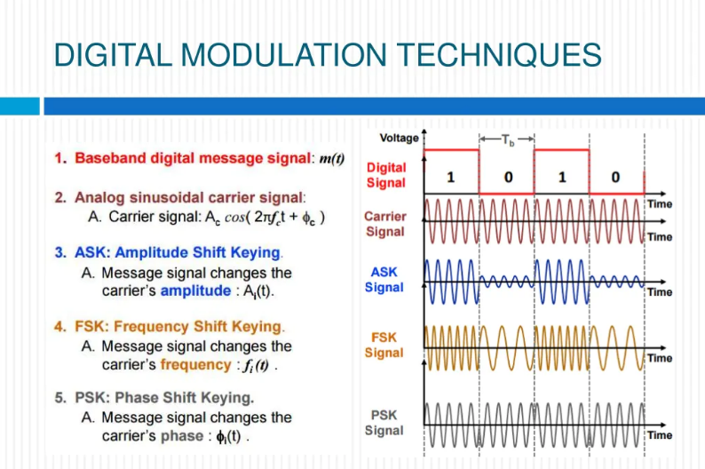

# MODULACIJA

Pri prenosu podatkov z električnimi veličinami ( U(t) ) od ene naprave do druge se pogosto soočamo s kakovostjo prenesene informacije. Pri tem nas zanima kolikšen del električne količine (npr. napetosti) dejansko pripada poslani informaciji in kolikšen del drugim EM motnjam v vezju (angl.: Signal to noise ratio). Pri reševanju tega problema si pomagamo z modulacijo podatkovnih signalov.

Modulacija je proces pri katerem nekoliko spremenimo nekatere lastnosti dobro definiranega periodičnega signala (nosilni signal). Spremenjene lastnosti nosilnega signala pa so neposredno odvisne od same informacije.

Sprejemanje moduliranih signalov je tako lahko bistveno bolj selektivno. Že s preprostimi R-C elektronskimi siti lahko dosežemo bistveno boljšo kvaliteto signala.

Primeri moduliranih signalov so vidni na [@fig:Digital_modulation].

{#fig:Digital_modulation}

## Amplitudna modulacija

Amplitudno modulacijo uporabljamo na primer pri prenosu informacije o pritisnjeni tipki na daljinskem upravljalniku za televizijo, radio, tv-box... Ko pritisnemo neko tipko, elektronika v daljinskem upravljalniku to zazna in pridobi kodo tipke. Kodo tipke nato amplitudno moduliramo z nosilnim signalom in jo preko svetlobne komunikacije pošljemo do televizije. Zelo pogosto je za frekvenco nosilnega signala izbrana frekvenca 38 kHz, saj le-te ne najdemo v okolici. Za sprejemanje in demodulacijo teh signalov pa največkrat uporabimo elektronsko integrirano vezje kot je na primer TSOP32230[^TSOPdata].

[^TSOPdata]:https://www.vishay.com/docs/82489/tsop322.pdf

> ### NALOGA: Pošiljanje IR signala
>
> 1. Splošni opis naloge: Po IR komunikaciji pošljite vaše ime in priimek. S krmilnikom Arduino NANO generirajte UART signal, ki bo vseboval vaše podatke o vašem imenu in priimku. Načrtujte tudi elektroniko za generirajte periodičnega nosilnega signala. Nato podatke amplitudno modulirajte in z IR diodo pošljite do sprejemnika. V poročilo dodajte shemo vezja in izpis programske kode.
>
> Dekompozicija problema:
>
> 1. Preučite dokumentacijo o integriranem vezju TSOP32230 in zapišite bistvene lastnosti vezja v [@tbl:TSOP32230_data]:
>
> |                           Lastnost integr. vezja | vrednost | Enota |
> |-------------------------------------------------:|----------|-------|
> |                              razporeditev nožic: |          |       |
> |                     frekvenca nosilnega signala: |          |       |
> |     minimalni čas trajanja logične enice (tmin): |          |       |
> | valovno dolžino svetlobne pri max občutljivosti: |          |       |
> Table: Pomembnejše latsnoti IV TSOP32230. {#tbl:TSOP32230_data}
>
> 2. Narišite časovno odvisnost izhodnega signala (U(t)) od prejete svetlobne informacije za integrirano vezje TSOP32230.
> 3. Iz $t_{min}$ izračunajte hitrost UART komunikacije ($baud$):
> 4. Za oddajno diodo boste imeli na voljo diodo z oznako LD271-L. Iz dokumeta s podatki prepišite pomembnejše lastnosti in jih vpišite v [@tbl:LD271_data]:
>
> |                     Lastnosti LED LD271 | Vrednost | Enota |
> |----------------------------------------:|----------|-------|
> | valovno dolžino svetlobe, ki jo oddaja: |          |       |
> |                 kolensko napetost (Uk): |          |       |
> |                       nazivni tok (I0): |          |       |
> |     kratkotrajen maksimalen tok (Imax): |          |       |
> Table: Lastnosti diode LD271. {#tbl:LD271_data}
>
> 5. Z astabilnim-multi-vibratorjem generirajte nosilni signal.
> 6. Skonstruirajte vezje za amplitudno modulacijo, ki jo lahko realizirate z eno od digitalnih operacij (IN, ALI, NE-ALI, EKSKL.-ALI).
>

## Frekvenčna modulacija

Čeprav modulacijo signalov uporabljamo predvsem v digitalni obdelavi podatkov za potrebe različnih komunikaciji, pa je modulacija razširjena tudi na druga področja. Pogosto na ta način moduliramo tudi odzive različnih senzorjev.

> ### NALOGA: Frekvenčna modulacija fizikalnih količin
> 1. Sestavite astabilni-multivibrator s časovno konstanti, ki je odvisna od RC člena.
> 2. Na mesto upora R vstavite element, katerega upornost je odvisna od neke fizikalne količine (temperature, osvetljenosti ...). Z osciloskopom posnemite časovno odvisnost napetosti (U(t)) pri različnih fizikalnih pogojih.
> 3. Astailni-multivibrator lahko sestavite s krmilnikom Arduino NANO in RC členom, ki nudi nekaj več dodatnih možnosti uporabe.

```cpp
//   +--[R2k2]--+---||---+
//   |          | 100uF  |
// [A5]       [A7]     [GND]
#define PIN_C A7
#define CAPACITANCE_uF 100      // Kapaciteta kond. v uF
#define PIN_R A5
#define LED 13
#define SPR 12
#define LO_TRSH 400
#define HI_TRSH 700
unsigned long startTime;
void charge_cycle(){
  startTime=millis();
  digitalWrite(LED, 1);
  digitalWrite(SPR, 0);
  digitalWrite(PIN_R, 1);
  int C_ADC = analogRead(PIN_C);
  while (C_ADC < HI_TRSH) C_ADC = analogRead(PIN_C);
}
void discharge_cycle(){
  digitalWrite(LED, 0);
  digitalWrite(SPR, 1);
  digitalWrite(PIN_R,0);
  int C_ADC = analogRead(PIN_C);
  while (C_ADC > LO_TRSH ) C_ADC = analogRead(PIN_C);
}
void printTime(){        // Čas je prikazan v ms -> milisekundah
  unsigned long timePeriod = millis() - startTime;
  Serial.println(timePeriod);
}
void setup() {
  pinMode(PIN_C, INPUT);
  pinMode(PIN_R, OUTPUT);
  pinMode(LED, OUTPUT);
  pinMode(SPR, OUTPUT);
  Serial.begin(115200);
}
void loop() {
  charge_cycle();
  discharge_cycle();
}
```

## Pulzno-širinska modulacija

V uvodu v PWM modulacijo smo omenili krmiljenje servo motrjev. Ker se ti motorji zelo pogosto uporabljajo v modelarstvu je prav, da jih pobližje spoznamo. Oglejte si primer uporabe funkcije krmilnika Arduino NANO - [servo.write()](https://www.arduino.cc/en/Tutorial/Knob).

{#fig:PWM_servo_pot height=300px}

> ### NALOGA: Krmiljenje servo-motorja
> 1. Na krmilnik priključite potenciometer s katerim boste lahko nastavljali poljubno napetost med 0 V in 5 V.
> 2. Nato priklučite še servo-motor in ga krmilite s primernim programom tako, da bo motor spreminjal svojo orientacijo gredi glede na položaj potenciometra.
> 3. Z osciloskopom posnemite PWM signal za krmiljenje servo-motorja pri različnih položajih potenciometra.


