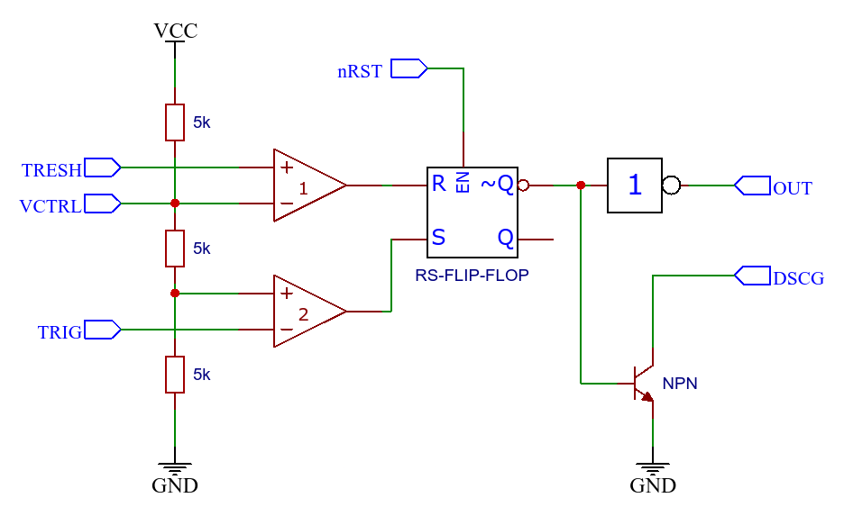

# INTEGRIRANO VEZJE 555

Tako imenovani “časovnik 555” je integrirano vezje (angl. Integrated circuit - IC), ki ga uporabljamo v različnih aplikacijah, kjer želimo generirati časovno odvisne napetostne pulze. To nam pride prav za izgradnjo časovnih zakasnitev, oscilatorjev itd.

Čeprav so ga na trg dali že leta 1972 (pred 45 leti), je zaradi nizke cene in enostavne uporabe še danes pogosto uporabljeno IC. Pravzaprav je IC 555 najbolj priljubljeno vezje nasploh. Pravjo, da še niso napisali knjige za elektroniko, v kateri nebi bilo projekta s tem vezjem, zato naj tudi ta skripta ne bo izjema.

## Zgradba integriranega vezje 555

{#fig:NE555_block_scheme}

> ### NALOGA: Blokovna zgradba integriranega vezja
> Na spletnih straneh poiščite kako je zgrajeno vezje 555[^ne555datasheet], prerišite shemo
> vezja in poskušajte razumeti njegovo delovanje. Odgovorite po čem je to
> vezje dobilo svoje ime.

[^ne555datasheet]:https://www.ti.com/lit/ds/symlink/ne555.pdf

## Uporaba integriranega vezja 555

> ### NALOGA: 555 kot RS-flip-flop
> Integrirano vezje 555 uporabite kot R-S flip-flop. Na izhod integriganega vezja priključite svetlečo diodo, ki bo nakazovala stanje spominske celice. Narišite stikalno shemo vezja.

> ### NALOGA: 555 kot Schmitov sprožilnik
> Integrirano vezje 555 uporabite kot schmittov sprožilnik. Na vhod priklučite potenciometer, s katerim lahko poljubno izbirate potencial in hkrati opazujte izhodno stanje sprožilnika. Na izhod integriganega vezja priključite svetlečo diodo, ki bo nakazovala stanje schmittovega sprožilnika.
>
> Odvisnost izhodnga potenciala napetosti od vhodnega - U2(U1) prikažite tudi na osciloskopu tako, da prikažete obe krivulji.
>
> Narišite stikalno shemo vezja.

> ### NALOGA: 555 kot Astabilni-multivibrator
> Integrirano vezje 555 uporabite kot astabilni-multivibrator tako, da
> boste lahko nanj priključili svetlečo diodo, ki jo boste videli
> utripati.  Narišite shemo vezja in preverite izhodni napetostni signal z osciloskopom.

> ### NALOGA: 555 kot Monostabilni-multivibrator
> Integrirano vezje 555 zvežite v način monostabilnega-multivibratorja tako, da ko boste s pritiskom na tipko sprožili en sam pulz, ki bo trajal približno 3 s.
>
> Narišite stikalno shemo vezja.

> ### NALOGA: 555 kot generator trikotniškega signala
> Integrirano vezje 555 uporabite v vlogi generatorja periodičnega signala
> s trikotniško obliko. Generator lahko naredite tako, da najprej sestavite:
> - tokovni vir s PNP tranzistorjem, 
> - ki naj polni kondenzator C1.
> - Naboj na kondenzatorju naj se izprazni, preko 7. priključka integriganega vezja 555,
> - ko napetost doseže 2/3 napajalne napetosti.
>
> Narišite stikalno shemo in izhodni signal preverite z osciloskopom.

