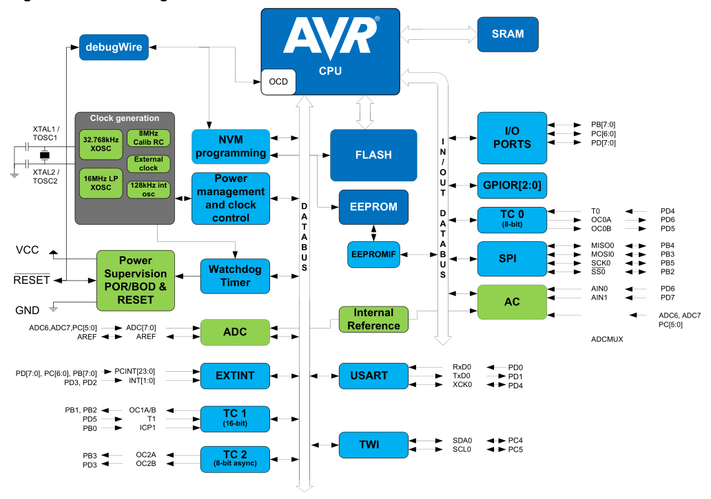
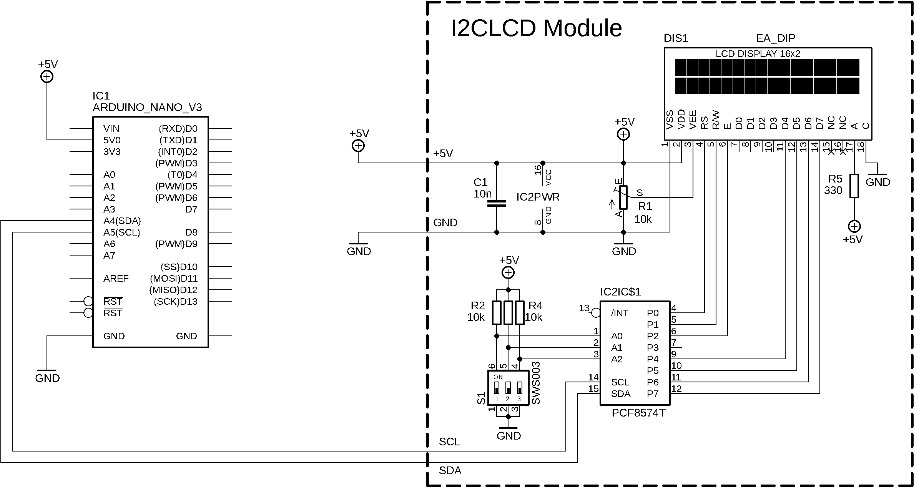

# NAČRTOVANJEM ELEKTRONSKIH VEZIJ

Tudi pri pedagoškem procesu je pomembno, da so vezja narisana nazorno (tako sheme,
kot tudi sestavljanje vezja na prototipni ploščici). V ta namen lahko uporabljate različna
orodja. Omenili bomo vsaj dva, ki sta prosto-dostopna in bi priporočali njihovo uporabo.

## Blokovna razdelitev sheme:

- Vezje razdelite na smiselna pod-vezja (bloke) in jih primerno poimenujte in označite.
- Shemo vezja skušajte orientirati tako, da so na levi strani elementi in pod-vezja, ki so namenjena vhodnim funkcijam,
- na desni strani pa pod-vezja, ki so namenjena izhodnim funkcijam.

Označevanje elementov:

- Uporabljajte IEEE standard simbolov za elemente.
- Elemente opremite s pripadajočimi znakovnimi simboli iz zaporednimi številkami (npr.: R1, R2, L1, C1, C2, C3, IC1...).
- Ob simbolu elementa naj bo vpisana tudi njegova predvidena vrednost (100 Ohmov ali 3k3, 2.7 uF ...).

Označevanje napetostnih potencialov:

- Nedvoumno označite različne napetostne potenciale (Vcc, GND) in njihove vrednosti (+5V, 9V).
- Povezave istih napetostnih potencialov naj bodo v isti višini sheme.
- Višji potenciali naj bodo višje na shemi, nižji pa nižje.

Risanje povezav:

- Povezave naj bodo enostavno sledljive, brez nepotrebnih križanj in sprememb smeri.
- Povezave naj se ne vračajo v smer od koder so si izvirale povezave vhodnih signalov.
- Nedvoumno naj bodo označena stičišča povezav (z debelejšo piko).
- Pomembnejše povezave poimenujte z njihovimi funkcijami.

V nadaljenvaju lahko najdete primer take dokumentacije.
\newpage

{#fig:pcb_design height=9cm}


{#fig:pcb_design-Power_supply height=9cm}


{#fig:pcb_design-USB_TxRx height=9cm}


{#fig:pcb_design-ATmega328 height=9cm}

## Stikalne sheme
EasyEDA je spletno orodje, ki je namenjeno risanju elektronskih vezij, načrtovanju TIV in
izdelavi potrebnih datotek za njihovo izdelavo in je prav gotovo ena od dobrih izbir. Drugo prosto-dostopno programsko orodje pa je KiCad. Ta program je odprtokoden in si ga lahko brezplačno namestimo na računalnik. Primer stikalne sheme, narisane s programskim orodjem KiCAD lahko vidite na [@fig:pcb_design] .. [@fig:pcb_design-ATmega328].

> ### NALOGA: Stikalne sheme
> V programskem orodju KiCAD narišite shemo astabilnegamultivibratorja, izvozite sliko sheme in jo vključite v poročilo.
>
> Shemo tudi blokovno razdelite na: napajalni del in del z NE555 elementom. Na izhodu uporabite svetlečo diodo.

## Tiskana vezja

Pri načrtovanju tiskanega vezja (TIV) je pomembno upoštevati, da je električna energija shranjena v električnem in magnetnem polju ter da se električna energija prenaša le preko teh dveh polj. Tokovi so le posledica sprememb energije v teh poljih in z obliko povezav in površin lahko vplivamo na velikost teh polj. Pri tem je pomembno omejiti velikost polj na čim manjše območje, da se preprečijo elektromagnetne motnje in škodljiv vpliv elektromagnetnih polj na druge dele sistema.

{height=5.5cm} {#fig:pcb_design-PCB height=5.5cm}

Zato je treba pri načrtovanju TIV skrbno premisliti o obliki povezav in površin ter jih prilagoditi specifičnim zahtevam projekta in strogo upoštevati priročnike in smernice za načrtovanje TIV-ja:

- Izbira materiala za TIV: Proizvajalci ponujajo različne možnosti izdelave, ki lahko bistveno vplivajo na lastnosti delovanja  elektronskega vezja. Danes je izdelava TIV s 4-mi bakrenimi plastmi že zelo cenovno ugodna in primerljiva s ceno 2-stranskih TIV. Zato je smiselno izbrati 4-plastno TIV, saj nudi precej boljše možnosti za izogib EM motenj. Tipična razporeditev signalnih in napajalnih povezav je lahko naslednja:

> 2 plastna plošča:  
>  
> ---- SIG./PWR -----  
> (debelejša sredica)  
> (debelejša sredica)  
> (debelejša sredica)  
> ---- GROUND -------  
>  
>  
> 4 plastna plošča:  
>  
> ---- SIG./PWR -----  
> ---- GROUND -------  
> (debelejša sredica)  
> (debelejša sredica)  
> (debelejša sredica)  
> ---- GROUND -------  
> ---- SIG./PWR -----  

- **Potek napajalnih linij**: Napajalne linije je treba skrbno načrtovati, da se zmanjša motnja in razlika v napetostnem potencialu na povezavi. Priporočljivo je uporabiti široke napajalne povezave in jih namestiti ločeno od signalnih linij (glej povezavo J1-FB1-C1-U1).

- **Uporaba razbremenilnih kondenzatorjev**: Razbremenilni kondenzatorji se uporabljajo za filtriranje šumov v napajalnih vodih in površinah. Priporočljivo je uporabiti kombinacijo majhnega keramičnega kondenzatorja in večjega elektrolitskega kondenzatorja, ki jih postavimo v neposredno bližino VSAKEGA napajalnega priključka (npr.: C3,C4, C7-C9). Več si lahko ogledate na [EEVblog](https://www.youtube.com/watch?v=BcJ6UdDx1vg).

- **GND površine**: GND površine zagotavljajo nizko upornost in nizko impedanco za tokove, ki potujejo po PCB-ju. Še bolj pomembne pa so zato, ker omejujejo širjenje električnega polja in tako zmanjšujejo EM motnje. Rešujejo problem najkrajše povezave v primeru DC signalov in omogočajo, da se inducirajo povratni tokovi neposredno pod povezavami. Zavedati se moramo, da električna motnja (el. energija) vrne k svojemu izvoru in pri tem izbere pot z najmanjšo IMPEDANCO! GND površine uporabljamo tudi med povezavami in s tem zmanjšujemo vpliv med sosednjimi signalnimi povezavami. Pazimo, da teh površin ne prekinjamo z režami, saj bi se na tem mestu ustvarilo električno polje (npr.: zeleno polje na TIV).

- **Načrtovanje povezav**: Povezave naj bodo čim krajše, kar zmanjšuje upornost in induktivnost povezave. Povezave naj bodo kar najbolj razmaknjene ena od druge. Pri spremembi smeri povezave ne uporabljamo pravih kotov, saj povečujejo kapacitivnost med povezavami. Smer med povezavami na eni in sosednji plasti TIV naj bo zamaknjena za $90^\circ$, da zmanjšamo medsebojni vpliv (npr.: rdeče povezave so v vodoravni smeri, modre v navpični).

- **Uporaba diferencialnih signalov**: Diferencialni signali se lahko uporabijo za večjo odpornost na zunanje EM motenje. Pri teh povezavah se isti signal prenaša po dveh ločenih žicah z negirano vrednostjo (protifazno). Na sprejemni strani jih nato diferenčno odčitamo in se tako odštejejo tudi motnje, ki so se inducirale v obeh povezavah. Pri načrtovanju teh linij je najbolj pomembno, da so precej ločene od ostalih agresivnejših linij, saj se v nasprotnem primeru inducirajo večji tokovi v bližji povezavi (npr.: povezavi med J2 in U2).

- **Plašč** (angl. shield, priključka ali vodnika) naj bo podaljšek faradejeve kletke in naj NE bo povezan z GND povezavo.

- **Uporaba PI filtrov**: PI filtri se lahko uporabijo za filtriranje neželenega hrupa in valov na napajalnih virih ali signalih. Paziti je treba, da jih skrbno načrtujemo in preizkušamo, da se prepreči morebitne neželene učinke.

- **Ločevanje digitalnih in analognih vezij**: Digitalna in analogni vezja je potrebno fizično ločiti, kolikor je to mogoče, da se zmanjša motnja in vpliv med njimi (npr.: U1 je ločen od  U2 in U3).

- Nameščanje komponent: Komponente je treba namestiti skrbno, da se zmanjša motnja in vpliv. Priporočljivo je, da se komponente postavijo čim bližje ustreznim priključkom integriranega vezja, da se izognemo dolgim signalnim povezavam.

- Preizkušanje in odpravljanje napak: PCB je potrebno temeljito preizkusiti, da se zagotovi pravilno delovanje in odpravijo morebitne napake. To lahko vključuje uporabo osciloskopa in multimetra ter preverjanje signala in napetosti na različnih točkah TIV-ja.

<!--
risanje v KiCAD-u
https://www.youtube.com/watch?v=aVUqaB0IMh4
-->

> ### NALOGA: Risanje TIV
> Za to vezje izrišite TIV in izpišite seznam elektronskih komponent. Izgled TIV izvozite in vstavite v poročilo. Prav tako vstavite seznam komponent.

## Virtualna vezja

Sestavljanje vezij pa na prototipni plošči pa je drugačen proces in za začetnike precej zahteven,
zato je priporočljivo, da uporabljate orodja kot so TinkerCAD-Circuits.

> ### NALOGA: Sestavljanje virtualnih vezij
> V programskem orodju TinkerCAD-Circuits sestavite vezje na prototipni ploščici in sliko vstavite v poročilo.
>

# SVETLOBNI SPOJNIKI

Pred davnimi časi, ko svet še ni slišal za digitalno tehnologijo, se je gospod Samuel Morse
domislil, da bi črke kodiral v kratke in dolge pulze. Te pa bi lahko kar najlažje pošiljal od
ene točke do druge na najrazličnejše načine ... in telekomunikacije so prijokale na svet.

## Vklop porabnika s tranzistorjem

Pogosto moramo porabnike skozi katere tečejo večji tokovi ($I\ >\ 500\ mA$) vključiti
s tranzistorjem.

> ### NALOGA: Vklop žarnice s tranzistorjem
>
> 1. Za pošiljanje Morsejevih znakov uporabite žarnico. Ali nek drug vir z večjo
> svetilnostjo.
>
> 2. Dolge in kratke pulze bomo pošiljali s svetlobnim oddajnikom. Načrtujete
> ustrezno rešitev (narišite shemo vezja) tako, da bomo s pritiski na tipko
> vklapljali in izklapljali svetilo (uporabite žarnico [12V in 0,6 A]).
> 3. Bodite pozorni, na električne omejitve tipke, ki jih najdete v
> [navodilih za uporabo](https://www.ic-elect.si/fileuploader/download/download/?d=0&file=custom%2Fupload%2FFile-0-48295100-1594733936.pdf) tipke. Načrtujte ustrezno rešitev.

## Komparator napetosti

V kolikor želimo ločiti med dvema napetostnima nivojema, lahko uporabimo komparator napetosti s
primerno izbrano (ali celo nastavljivo) referenčno vrednostjo.

> ### NALOGA: Komparator napetosti
>
> 1. Načrtujte (shema vezja) in izdelajte svetlobni sprejemnik, v katerega boste za zaznavanje
> osvetljenosti uporabili elektronski element s hitrim odzivom.
>
> 2. Analogni signal senzorja modificirajte tako, da boste lahko nedvoumno
> podajali informacijo (npr. LED svetilo), ki jo je poslal svetlobni
> oddajnik.
>
> 3. Z osciloskopom zajemite časovni potek napetostnega potenciala na 
> vhodnem in na izhodnem priključku komparatorja.

## Schmittov sprožilnik

Iz prejšnje naloge lahko ugotovimo, da je izhodni signal svetlobnega senzorja
opremljen z neželeno motnjo. Če v tem primeru želimo ločiti dve različni stanji senzorja,
komparator napetosti ni dobra rešitev. Ob prehodu senzorja iz enega stanja v drugega tako dobimo
na izhodu komparatorja več prehodov, čeprav se je osvetljenost senzorja spremenila le enkrat. Tako
lahko ugotovimo potrebo po histerezi s katero bomo bomo mejno vrednost razmejili na dve
mejni vrednosti. Tako ločevanje nam omogoča schmittov sprožilnik.

> ### NALOGA: Komparator napetosti s šmitovim sprožilnikom
>
> 1. Iz grafa prejšnje naloge, ki predstavlja časovno odvisnost napetostnega potenciala vhodnega in izhodnega signala, odčitajte nove mejne vrednosti ( $U_{h1}\ in\ U_{h2}$).
>
> 2. Komparator napetosti iz prejšnje naloge zamenjajte s komparatorjem napetosti s šmitovim sprožilnikom (narišite stikalno shemo).
>
> 3. Z osciloskopom zajemite časovni potek napetostnega potenciala na 
> vhodnem in na izhodnem priključku komparatorja napetosti s šmitovim sprožilnikom.


# UPORABA MIKROKRMILNIKOV

Za projekte, ki vključujejo programabilno elektroniko, pogosto uporabljamo že izdelane
krmilnike iz družine Arduino. Na teh vezjih lahko najdemo mikrokrmilnike proizvajalca Atmel.
Najbolj pogosto uporabljena krmilnika (Arduino Uno in Arduino NANO) temeljita na mikrikrmilniku Atmega328p. Blokovna shema tega mikrokrmilnika je prikazana na [@fig:ATmega238_block_diagram].

## Shema mikrokrmilnika ATmega238

Mikrokrmilniki so integrirana vezja, z zelo kompleksno notranjo strukturo. 
Sestavlja jih na milijone tranzistorjev, ki s povezavami in ostalimi osnovnimi
elementi sestavljajo smiselne logične sklope. Povečana slika dejanskega 
integriranega vezja mikrokrmilnika ATmega238 je na [@fig:Atmega328_silicon].

{#fig:Atmega328_silicon height=11cm}

Iz [@fig:Atmega328_silicon] je nemogoče razbrati posamezne dele integriranega 
vezja. Opazimo lahko le večje enake sklope, ki so namenjene spominskim funkcijam.
Še bolj podrobno sliko pa si lahko ogledate na povezavi [ATmega238-SiO2](https://siliconpr0n.org/map/atmel/atmega328/s1_20x/).

Pri tako kompleksnih vezjih je bolj smiselno, da posamezne logične sklope 
predstavimo z blokovno shemo. Tako shemo lahko najdemo v navodilih za uporabo
mikrokrmilnika ATmega238 in je prikazana na [@fig:ATmega238_block_diagram].

{#fig:ATmega238_block_diagram}

> ### NALOGA: Glavni deli krmilnika
> 
> 1. Na blokovni shemi označi pomembne dele krmilnika in zapiši njihov glavni namen (funkcijo). Glavni sestavni deli so: generator delovnega takta (ura), centralno procesna enota, začasni (delovni) spomin, trajni spomin, vhodno-izhodne enote, komunikacijske enote ... 

Mikrokrmilniki na krmilnikih Arduino so že opremljeni s programom (angl.
»boot loader«), ki poskrbi za ustrezno prepisovanje programske vsebine, ki jo računalnik
pošlje preko USB vodila. Tako lahko enostavno programiramo mikrokrmilnike, ki so na
ploščah krmilnikov Arduino.

> ### NALOGA: Osnovne nastavitve in testni program
> 
> 1. Iz programskega okolja Arduino IDE prepišite nastavitve programatorja ter izpolni [@tbl:prog_setuings]:
>
> |        Nastavitveni parameter | Vrednost nastavitvenega parametra |
> |------------------------------:|:---------------------------------:|
> |                Board (Plošča) |                                   |
> | ~~Processor~~ (Mikrokrmilnik) |                                   |
> |                  Port (vrata) |                                   |
> |      Programmer (programator) |                                   |
> Table: Nastavitveni parametri programatorja. {#tbl:prog_setuings}
> 
> 2. Iz primerov, ki so vključeni v programskem okolju Arduino IDE izberite
> Blink.ino in ga preskusite.

## Programiranje krmilnikov Arduino

Za  programiranje  mikrokrmilnika  skrbi  odprtokodna  programska  koda  -  [avrdude](http://savannah.nongnu.org/projects/avrdude), ki se izvaja v ozadju programskega okolja
Arduino IDE. Proces programiranja lahko bolj natančno spremljamo tako, da vključimo

    File -> Preferences:

    Shov verbose output during: [x] compilation [x] upload

> ### NALOGA: AVRDUDE - program za prenos strojne kode
>
> 1. Prepišite  ukazno  vrstico  programa  avrdude  za  premos  strojne  kode  in
> 2. opišite pomen parametrov.
> 
> Več o parametrih lahko najdete na spletni strani [avrdude](http://www.nongnu.org/avrdude/user-manual/avrdude_4.html#Option-Descriptions)
>

## Uporaba vhodno-izhodnih priključkov na kmilniku Arduino

> ### NALOGA: Shema krmilnika Arduino NANO
> 
> 1. Oglejte si [shemo krmilnika Arduino NANO](https://www.arduino.cc/en/uploads/Main/Arduino_Nano-Rev3.2-SCH.pdf) in
> 2. skušaj ugotoviti na kateri priključek IO enote je priključena LED, ki je na krmilniku.
> 3. Izpolni [@tbl:pin_location]
>
> | Funkcija krmilnika | Arduino NANO[^1] | ATmega238[^2] |
> |-------------------:|:----------------:|:-------------:|
> |      LED na plošči |                  |               |
> |                TxD |                  |               |
> |                RxD |                  |               |
> Table: Razporeditev priklučkov na krmilniku in mikrikrmilniku. {#tbl:pin_location}
> 
[^1]: Oznaka priključka na krmilniku Arduino NANO.
[^2]: Oznaka priključka na mikrokrmilniku ATmega238.

## Vhodno-izhodne enote mikrokrmilnika

Vhodno-izhodne enote mikrokrmilnika so dvo-smerne z možnostjo nastavitve upora proti napajanju. Stikalna shema enega priključka na neki vhodno-izhodni enoti je prikazana na [@fig:Atmega328_IOpin_ctrl].

{#fig:Atmega328_IOpin_ctrl}

Čeprav je shema na [@fig:Atmega328_IOpin_ctrl] nekoliko bolj kompleksna, lahko ugotovimo, da za nastavitev delovanja vhodno-izhodne enote potrebujemo le dva signala:

- WDx - (DDRx) - za določanje vhodne oz. izhodne funkcije priključka
- WPx - (PORTx) - za določanje vrednosti logičnega stanja na priključku x.

> ### NALOGA: Krmilni registri mikrokrmilnika
> 
> 1. Preoblikuj program Blink.ino tako, da boš krmilil vklop in izklop LED z nastavitvijo krmilnikh registrov.
> 2. Predstavite programsko kodo.

## Branje napetostnega potenciala

Branje napetostnega potenciala je najbolj pogosto uporabljeno pri vzorčenju pritiska tipke. Poglejmo si tak primer.

{#fig:PBSw_All}

> ### NALOGA: Branje napetostnega potenciala
>
> 1. Sestavite prve tri različice priključitve tipke na digitalni vhod krmilnika A0 in preskusite spodnji program.
> 2. Razložite (ne-)delovanje.

```cpp
void setup(){
    pinMode(13, OUTPUT);
    pinMode(A0, INPUT);
}

void loop(){
    int stikalo_je_sklenjeno = digitalRead(A0);
    if ( stikalo_je_sklenjeno == HIGH)
        digitalWrite(13, HIGH);
    else
        digitalWrite(13, LOW);
}
```

> ### NALOGA: Uporaba upora proti napajanju
>
> 1. Spremenite delilnih napetosti tipka - upor tako, da bo upor vezan proti napajanju in nato spremenite program tako, da bo delovanje ostalo enako prejšnji nalogi. Priložite stikalno shemo vezja in preoblikovan program.
> 2. Odstranite upor in preverite delovanje vezja. Kaj opazite, razložite delovanje.
> 3. Vključite notranji upor proti napajanju, ki se nahaja v mikrokrmilniku ob vsakem vhodno-izhodnem priključku (glej [@fig:Atmega328_IOpin_ctrl]). Priložite programsko spremembo.

## Prehodni stiki stikal

Fizični preklopni elementi (kot je tipka) imajo tudi fizikalne lastnosti kot so trdota, trdnost, prožnost,
elastičnost... Zaradi vseh teh lastnosti je preklop tipke iz enega položaja v drugega lahko tudi nekoliko nepredvidljiv.

> ### NALOGA: Večkratni preklopi
>
> 1. Preskusite spodnji program in opišite njegovo delovanje.
> 2. Opišite zaznane težave.
> 3. Z osciloskopom ujemite enega od prehodov (0->1 ali 1->0) in
> 4. problem rešite:
>       - programsko ter
>       - elektronsko.
> Obe rešitvi dokumentirajte.

```cpp
void setup()
{
    const int LED = 13;
    pinMode(LED, OUTPUT);
    pinMode(A0, INPUT_PULLUP);
}

int i=0;

void loop()
{
    int tipka_je_pritisnjena = !digitalRead(A0);
    if (tipka_je_pritisnjena)
    {
      i++;
      while (tipka_je_pritisnjena)
        tipka_je_pritisnjena = !digitalRead(A0);
      int i_je_liho = i % 2;
      if (i_je_liho)
        digitalWrite(13, HIGH);
      else
        digitalWrite(13, LOW);
    }
}
```

## PROGRAMIRANJE MIKRMILNIKOV

<!--
to-do

kako narediti programator s krmilnikom Arduino NANO
naredi vajo ki jo opisuje tale stran
glej: https://www.arduino.cc/en/Tutorial/BuiltInExamples/ArduinoISP

./avrdude -C/home/david/.arduino15/packages/arduino/tools/avrdude/6.3.0-arduino17/etc/avrdude.conf -v -p atmega328p -c arduino -P/dev/ttyUSB0 -b 19200 -t
-->


{#fig:Arduino_as_ISP_s1}


# KOMUNIKACIJSKI VMESNIKI

## Serijska komunikacija UART

Nekaj več o UART komunikaciji si lahko preberete vsepovsod na 
[svetovnem spletu](https://www.codrey.com/embedded-systems/uart-serial-communication-rs232/). Ker jo uporabljamo
že več kot pol stoletja, lahko rečemo, da sodi med osnovne komunikacijske protokole.


> ### NALOGA: Osnovni parametri UART protokola
>
> 1. Preučite UART protokol in prerišite časovni potek signala (teoretično).
> 2. Na  teoretičnem  primeru  komentirajte:
>   - pomen  napetostnega  signala,
>   - kako si sledijo podatkovne informacije,
>   - označite start in stop bit, 
>   - izračunajte dolžino trajanja enega bita pri $baud = 9600 b/s$.

Komunikacija  UART je  tako  razširjena,  da  jo  vključujejo  v  skoraj  vse  programabilne
elektronske komponente in Arduino NANO ni nobena izjema. Mikrokrmilnik ATmega328p
vsebuje enoto za komunikacijo UART in je dostopna na priključkih 0 (Rx) in 1 (Tx). Preko
te enote lahko pošiljamo/sprejemamo podatke drugih zunanjih naprav.

> ### NALOGA: Uporaba serijske UART komunikacije
>
> 1. Preučite shemo za krmilnik [Arduino NANO](https://www.arduino.cc/en/uploads/Main/Arduino_Nano-Rev3.2-SCH.pdf) in poiščite priključka za UART komunikacijo.
> 2. Preskusite naslednji program mikrokrmilnika za pošiljanje nekega besedila
> računalniku  in  odziv  spremjajte  v  serijskemu  oknu  programa  ArduinoIDE:
```cpp
void setup() {
      Serial.begin(9600);
}
void loop() {
  Serial.println("Pozdravljen svet.");
  delay(1000);
}
```
> ### NALOGA: Časovni potek napetosti UART komunikacije
>
> 1. Z osciloskopom posnemite napetostni signal pošiljanja enega samega znaka in
> 2. parametre primerjajte s teoretičnimi vrednostmi komunikacije.
> 3. Na grafu U(t) označite logične vrednosti posameznih bitov in  označite njihovo funkcijo (start bit, stop bit in položaj bita D0..D7).
> 4. Iz grafa U(t) odčitajte poslano podatkovno vrednost in jo primerjajte z [ASCII tabelo](https://www.asciitable.com/).

```cpp
  Serial.print("M");
```
<!--
napetostni signal za črko M
0.000ms 5V
1.000ms 5V
1.001ms 0V
1.104ms 0V
1.105ms 5V
1.208ms 5V
1.209ms 0V
1.312ms 0V
1.313ms 5V
1.416ms 5V
1.417ms 5V
1.520ms 5V
1.521ms 0V
1.625ms 0V
1.626ms 0V
1.729ms 0V
1.730ms 5V
1.833ms 5V
1.834ms 0V
1.937ms 0V
1.938ms 5V

-->
## I2C komunikacija

Komunikacija lahko poteka tudi na drugačne načine, na primer med več napravami. Ena
takih komunikacij je t.i. I2C komunikacija. Več o tej komunikaciji si lahko preberemo na
wikipediji o [I2C podatkovnem vodilu](https://en.wikipedia.org/wiki/I%C2%B2C)

{#fig:i2c_info}

V primeru, ki ga prikazuje [@fig:i2c_info] je glavna naprava označena kot »master«, ki bo v
našem primeru Arduino NANO. Ostale naprave pa so »podložniki«. Vsak od njih mora
imeti svoj naslov in mora zanj glavna naprava vedeti, saj le tako lahko vzpostavi
komunikacijo z njim (podobno kot IP številke v TCP/IP omrežju).

Naslove podložnikov včasih lahko nastavimo ročno na podložniku ali
pa so zapisani že v sami napravi podložnika.
Slednjo situacijo si lahko ogledamo na primeru LCD z I2C vodilom.

{#fig:I2C_connect}

> ### NALOGA: Priključitev I2C LCD-ja
>
> 1. Priključite LCD z I2C vodilom na Arduino NANO tako, kot prikazuje [@fig:I2C_connect] in 
> s programom, ki ga najdete na [Arduino strani](https://playground.arduino.cc/Main/I2cScanner/),
> ugotovite njegov naslov, ter ga  
> zapišite : __________________

Ker je sam protokol komunikacije bolj zapleten, bomo v ta namen uporabljali
knjižnico LiquidCrystal_I2C.h. Knjižnico lahko namestimo v Arduino IDE tako:

    Sketch -> Include Library -> Manage Libraries

    Filter your Serch... : LiquidCrystal I2C (by Frank de Brabander)

Ta knjižnica vsebuje podobna imena funkcij, kot jih uporabljamo pri objektu
Serial za serijsko komunikacijo (npr: Serial.print).

> ### NALOGA: Izpis na LCD
>
> 1. Preskusite naslednji program in
> 2. nastavite primeren kontrast LCDja.
> 3. Vezju dodajte še potenciometer, s katerim bomo lahko poljubno nastavljali napetostni potencial in
> ga merili na priključku A0.
> 4. Spremenite program tako, da boste izpisovali na LCD izpisovali napetost in ne ADC vrednost.

```cpp
#include <Wire.h>
#include <LiquidCrystal_I2C.h>
LiquidCrystal_I2C Lcd(0x27, 16, 2);
int adcValue = 0;
const int POT_PIN = A0;
void setup() {
  pinMode(POT_PIN,INPUT);
  Lcd.init();
  Lcd.init();
  Lcd.backlight();
}
void loop() {
  adcValue = analogRead(POT_PIN);
  Lcd.clear();
  Lcd.print("potenciometer:");
  Lcd.setCursor(0,1);
  Lcd.print(adcValue);
  delay(200);
}
```
# MODULACIJA

Pri prenosu podatkov z električnimi veličinami ( U(t) ) od ene naprave do druge se pogosto soočamo s kakovostjo prenesene informacije. Pri tem nas zanima kolikšen del električne količine (npr. napetosti) dejansko pripada poslani informaciji in kolikšen del drugim EM motnjam v vezju (angl.: Signal to noise ratio). Pri reševanju tega problema si pomagamo z modulacijo podatkovnih signalov.

Modulacija je proces pri katerem nekoliko spremenimo nekatere lastnosti dobro definiranega periodičnega signala (nosilni signal). Spremenjene lastnosti nosilnega signala pa so neposredno odvisne od same informacije.

Sprejemanje moduliranih signalov je tako lahko bistveno bolj selektivno. Že s preprostimi R-C elektronskimi siti lahko dosežemo bistveno boljšo kvaliteto signala.

Primeri moduliranih signalov so vidni na [@fig:Digital_modulation].

{#fig:Digital_modulation}

## Amplitudna modulacija

Amplitudno modulacijo uporabljamo na primer pri prenosu informacije o pritisnjeni tipki na daljinskem upravljalniku za televizijo, radio, tv-box... Ko pritisnemo neko tipko, elektronika v daljinskem upravljalniku to zazna in pridobi kodo tipke. Kodo tipke nato amplitudno moduliramo z nosilnim signalom in jo preko svetlobne komunikacije pošljemo do televizije. Zelo pogosto je za frekvenco nosilnega signala izbrana frekvenca 38 kHz, saj le-te ne najdemo v okolici. Za sprejemanje in demodulacijo teh signalov pa največkrat uporabimo elektronsko integrirano vezje kot je na primer TSOP32230[^TSOPdata].

[^TSOPdata]:https://www.vishay.com/docs/82489/tsop322.pdf

> ### NALOGA: Pošiljanje IR signala
>
> 1. Splošni opis naloge: Po IR komunikaciji pošljite vaše ime in priimek. S krmilnikom Arduino NANO generirajte UART signal, ki bo vseboval vaše podatke o vašem imenu in priimku. Načrtujte tudi elektroniko za generirajte periodičnega nosilnega signala. Nato podatke amplitudno modulirajte in z IR diodo pošljite do sprejemnika. V poročilo dodajte shemo vezja in izpis programske kode.
>
> Dekompozicija problema:
>
> 1. Preučite dokumentacijo o integriranem vezju TSOP32230 in zapišite bistvene lastnosti vezja v [@tbl:TSOP32230_data]:
>
> |                           Lastnost integr. vezja | vrednost | Enota |
> |-------------------------------------------------:|----------|-------|
> |                              razporeditev nožic: |          |       |
> |                     frekvenca nosilnega signala: |          |       |
> |     minimalni čas trajanja logične enice (tmin): |          |       |
> | valovno dolžino svetlobne pri max občutljivosti: |          |       |
> Table: Pomembnejše latsnoti IV TSOP32230. {#tbl:TSOP32230_data}
>
> 2. Narišite časovno odvisnost izhodnega signala (U(t)) od prejete svetlobne informacije za integrirano vezje TSOP32230.
> 3. Iz $t_{min}$ izračunajte hitrost UART komunikacije ($baud$):
> 4. Za oddajno diodo boste imeli na voljo diodo z oznako LD271-L. Iz dokumeta s podatki prepišite pomembnejše lastnosti in jih vpišite v [@tbl:LD271_data]:
>
> |                     Lastnosti LED LD271 | Vrednost | Enota |
> |----------------------------------------:|----------|-------|
> | valovno dolžino svetlobe, ki jo oddaja: |          |       |
> |                 kolensko napetost (Uk): |          |       |
> |                       nazivni tok (I0): |          |       |
> |     kratkotrajen maksimalen tok (Imax): |          |       |
> Table: Lastnosti diode LD271. {#tbl:LD271_data}
>
> 5. Z astabilnim-multi-vibratorjem generirajte nosilni signal.
> 6. Skonstruirajte vezje za amplitudno modulacijo, ki jo lahko realizirate z eno od digitalnih operacij (IN, ALI, NE-ALI, EKSKL.-ALI).
>

## Frekvenčna modulacija

Čeprav modulacijo signalov uporabljamo predvsem v digitalni obdelavi podatkov za potrebe različnih komunikaciji, pa je modulacija razširjena tudi na druga področja. Pogosto na ta način moduliramo tudi odzive različnih senzorjev.

> ### NALOGA: Frekvenčna modulacija fizikalnih količin
> 1. Sestavite astabilni-multivibrator s časovno konstanti, ki je odvisna od RC člena.
> 2. Na mesto upora R vstavite element, katerega upornost je odvisna od neke fizikalne količine (temperature, osvetljenosti ...). Z osciloskopom posnemite časovno odvisnost napetosti (U(t)) pri različnih fizikalnih pogojih.
> 3. Astailni-multivibrator lahko sestavite s krmilnikom Arduino NANO in RC členom, ki nudi nekaj več dodatnih možnosti uporabe.

```cpp
//   +--[R2k2]--+---||---+
//   |          | 100uF  |
// [A5]       [A7]     [GND]
#define PIN_C A7
#define CAPACITANCE_uF 100      // Kapaciteta kond. v uF
#define PIN_R A5
#define LED 13
#define SPR 12
#define LO_TRSH 400
#define HI_TRSH 700
unsigned long startTime;
void charge_cycle(){
  startTime=millis();
  digitalWrite(LED, 1);
  digitalWrite(SPR, 0);
  digitalWrite(PIN_R, 1);
  int C_ADC = analogRead(PIN_C);
  while (C_ADC < HI_TRSH) C_ADC = analogRead(PIN_C);
}
void discharge_cycle(){
  digitalWrite(LED, 0);
  digitalWrite(SPR, 1);
  digitalWrite(PIN_R,0);
  int C_ADC = analogRead(PIN_C);
  while (C_ADC > LO_TRSH ) C_ADC = analogRead(PIN_C);
}
void printTime(){        // Čas je prikazan v ms -> milisekundah
  unsigned long timePeriod = millis() - startTime;
  Serial.println(timePeriod);
}
void setup() {
  pinMode(PIN_C, INPUT);
  pinMode(PIN_R, OUTPUT);
  pinMode(LED, OUTPUT);
  pinMode(SPR, OUTPUT);
  Serial.begin(115200);
}
void loop() {
  charge_cycle();
  discharge_cycle();
}
```

## Pulzno-širinska modulacija

V uvodu v PWM modulacijo smo omenili krmiljenje servo motrjev. Ker se ti motorji zelo pogosto uporabljajo v modelarstvu je prav, da jih pobližje spoznamo. Oglejte si primer uporabe funkcije krmilnika Arduino NANO - [servo.write()](https://www.arduino.cc/en/Tutorial/Knob).

{#fig:PWM_servo_pot height=300px}

> ### NALOGA: Krmiljenje servo-motorja
> 1. Na krmilnik priključite potenciometer s katerim boste lahko nastavljali poljubno napetost med 0 V in 5 V.
> 2. Nato priklučite še servo-motor in ga krmilite s primernim programom tako, da bo motor spreminjal svojo orientacijo gredi glede na položaj potenciometra.
> 3. Z osciloskopom posnemite PWM signal za krmiljenje servo-motorja pri različnih položajih potenciometra.


# INTEGRIRANO VEZJE 555

Tako imenovani “časovnik 555” je integrirano vezje (angl. Integrated circuit - IC), ki ga uporabljamo v različnih aplikacijah, kjer želimo generirati časovno odvisne napetostne pulze. To nam pride prav za izgradnjo časovnih zakasnitev, oscilatorjev itd.

Čeprav so ga na trg dali že leta 1972 (pred 45 leti), je zaradi nizke cene in enostavne uporabe še danes pogosto uporabljeno IC. Pravzaprav je IC 555 najbolj priljubljeno vezje nasploh. Pravjo, da še niso napisali knjige za elektroniko, v kateri nebi bilo projekta s tem vezjem, zato naj tudi ta skripta ne bo izjema.

## Zgradba integriranega vezje 555

{#fig:NE555_block_scheme}

> ### NALOGA: Blokovna zgradba integriranega vezja
> Na spletnih straneh poiščite kako je zgrajeno vezje 555[^ne555datasheet], prerišite shemo
> vezja in poskušajte razumeti njegovo delovanje. Odgovorite po čem je to
> vezje dobilo svoje ime.

[^ne555datasheet]:https://www.ti.com/lit/ds/symlink/ne555.pdf

## Uporaba integriranega vezja 555

> ### NALOGA: 555 kot RS-flip-flop
> Integrirano vezje 555 uporabite kot R-S flip-flop. Na izhod integriganega vezja priključite svetlečo diodo, ki bo nakazovala stanje spominske celice. Narišite stikalno shemo vezja.

> ### NALOGA: 555 kot Schmitov sprožilnik
> Integrirano vezje 555 uporabite kot schmittov sprožilnik. Na vhod priklučite potenciometer, s katerim lahko poljubno izbirate potencial in hkrati opazujte izhodno stanje sprožilnika. Na izhod integriganega vezja priključite svetlečo diodo, ki bo nakazovala stanje schmittovega sprožilnika.
>
> Odvisnost izhodnga potenciala napetosti od vhodnega - U2(U1) prikažite tudi na osciloskopu tako, da prikažete obe krivulji.
>
> Narišite stikalno shemo vezja.

> ### NALOGA: 555 kot Astabilni-multivibrator
> Integrirano vezje 555 uporabite kot astabilni-multivibrator tako, da
> boste lahko nanj priključili svetlečo diodo, ki jo boste videli
> utripati.  Narišite shemo vezja in preverite izhodni napetostni signal z osciloskopom.

> ### NALOGA: 555 kot Monostabilni-multivibrator
> Integrirano vezje 555 zvežite v način monostabilnega-multivibratorja tako, da ko boste s pritiskom na tipko sprožili en sam pulz, ki bo trajal približno 3 s.
>
> Narišite stikalno shemo vezja.

> ### NALOGA: 555 kot generator trikotniškega signala
> Integrirano vezje 555 uporabite v vlogi generatorja periodičnega signala
> s trikotniško obliko. Generator lahko naredite tako, da najprej sestavite:
> - tokovni vir s PNP tranzistorjem, 
> - ki naj polni kondenzator C1.
> - Naboj na kondenzatorju naj se izprazni, preko 7. priključka integriganega vezja 555,
> - ko napetost doseže 2/3 napajalne napetosti.
>
> Narišite stikalno shemo in izhodni signal preverite z osciloskopom.

# SEKVENČNA VEZJA

## D-flip-flop

D-flip-flop (D-ff) je pogosto uporabljen predvsem v dveh elektronskih funkcijah:

- kot nastavitneni/pomnilni register in
- kot pomikalni register.

D-ff je v obeh funkcijah uporabljen v periferni enoti USART mikrokrmilnika ATmega328. Enota
USART skrbi za serijsko komunikacijo UART, ki poteka po protokolu RS232. Blokovni prikaz oddajnega
dela USART enote prikazuje [@fig:UART_block_diagram].

{#fig:UART_block_diagram height=500px}

Oddajni del (Transmitter) USART enote je v splošnem sestavljen iz pomnilnega registra `UDRn` v katerega shranimo podatek, ki ga želimo poslati. Ta podatek se nato premakne v pomični register `Transmit Shift Register` (`TSR`). Nazadnje se prične faza pomikanja podatka proti serijskemu izhodu pomičnega registra. Med to fazo lahko z novim podatkom nastavimo pomični register `UDRn`. A ponovno nastavljanje registra `TSR` med samim pomikanjem `TSR` registra ni mogoče.

> ### NALOGA: Pomikalni register
> V simulacijskem programu (SimulIDE) načrtujte:
>
> - pomnilni register `UDRn` in
> - pomični register `TSR`.
>
> Oba registra naj boste zgrajena iz D-ff in naj vsebujeta 8 pomnilnih celic (8-bitni register).
> Krmiljenje napetosti prožitvenih signalov kot so `Enable` in `Clock` lahko zagotovite z napetostnimi viri (5V - on/off).

## T-flip-flop

T-flip-flop (T-ff) je pogosto uporabljen v sekvenčnih vezjih kot:

- dvojiški števnik in
- kot delitelj osnovnega urinega takta.

Kot slednja funkcija (deljitelj osnovnega takta) je tudi različica sekvenčnega vezja uporabljena v periferni enoti USART (glej [@fig:UART_block_diagram height=500px] - `Clock Generator`). Glede na to, da lahko z zaporedno vezavo T-ff delimo osnovni takt le s koeficienti: 2, 4, 8, 16 ... tudi razloži, zakaj so pri oddajanju podatkov po UART vodilu na voljo frekvence: 19200, 9600, 4800, 2400 ...

> ### NALOGA: Dvojiški števnik
> V simulacijskem programu (SimulIDE) sestavite:
>
> - 4-bitni dvojiški števnik (kaskadno vezani T-ff),
> - izhodne signale (D3, D2, D1 in D0) priključite na vhod 
> - integrirano vezje 74HC4511 (BCD -> 7 seg. LED) in izhode le teh
> - povežite na 7-segmentni LED prikazovljnik.

# KRMILJENJE IN REGULACIJA

> ### NALOGA: Krmiljenje moči DC motorja
> Načrtujete in sestavite vezje za krmiljenje moči enosmernega 
> motorja. Vezje izvedite z uporabo krmilnaka Arduino nano,
> ki ga opremite s potenciometrom za nastavljanje želene vrednosti.
> S funkcijo `analogWrite(pin, val)` krmilite izhod za krmiljenje motorja.
> Narišite stikalno shemo vezja in
> podajte celotno programsko kodo krmilnika.


> ### NALOGA: Regulacija osvetljenosti
> Načrtujete in sestavite vezje za regulacijo osvetljenosti.
> Podajte stikalno shemo vezja in
> vezje tudi sestavite. Če boste nalogo rešili z uporabi krmilne elektronike,
> predložite tudi program.
# OPERACIJSKI OJAČEVALNIKI

## LM358

- single supply
- low power consumtion
- low input offset 3-7mV
- common mode ground?
- dva op. amp. v enem ohišju
    - LM324 (enake karakteristike, le 4x op.amps)

## TL071

- designed for dual supply voltages
- low total harmonic distortion 0.003% (audio aplications)
- very low input baise curent (1pA)

## LMV358

- rail-to-rail
- low inout offset 1mA
- low input baise current (10pA)
- supply-voltage 2.5V - 5.5V
- dva op.amp v enem ohišju
    - LMV324 (anke karakteristike, le da so 4x )

## LM741
- ? zakaj, ko pa je...

## RC4558

- low noise

## NE5532

- low noise
- in audio applications

## OP071

- low noise
- low offset votage (60 uV)
- načrtovan za bi-polatno napajanje
- nekoliko večji vhodni tok (1nA)

